**引言**

## **编写目的**

    康复运动系统主要是以解决医生通过康复运动提供患者治疗方案+疗程时长+周期几天+运动组次数生成报告；患者可扫描评估报告二维码获取最新康复诊断信息，以患者为中心，从患者就诊前至机构治疗及居家训练，建立系统的追踪方案；用户可以对医生进行评价，并可以在评价页面查看其他用户评价；通过康复系统整合线上线下服务数据，建立规范流程，使患者的治疗过程得到更优得解决方案，患者数据通过康复师之间信息化共享，建立全病程管理数据。主功能模块包括：

- 评估：选择关节连接MS设备，根据部位自动分配传感器；活动角度测试评估，生成康复结果报告；

- 训练：根据康复对象选择康复模型；

- 动作组合：根据医生提供不同患者形成个性化运动康复组合训练方案；

- 报告：通过PDF或扫码展示患者对象康复训练报告。

# **软件概述**

## 软件功能

1. 首页：可以查看康复对象准确的活动时间

2. 记录：将康复对象的康复方案活动记录，并对动作进行数据采集绘制成可播放的康复动作视频；该功能分为四个步骤：

    (1).设置康复计划：包括康复方案、时长、动作要求组数、康复部位以及康复关节。

    (2). 检查设备完好及电量充足。

    (3).姿势校准。根据图示正确穿戴设备（注意节点朝向及区分左右），便于后续姿势校准、数据采集。穿戴好设备后进行姿势校准(T姿势和I姿势)，校准完毕后点击"下一步"继续康复记录。

    (4).康复训练。康复训练根据制定的康复计划实行，按照不同的组别进行康复动作。康复过程中可以通过采集康复动作数据查看康复动作的速率以及关节活动角度；康复过程中如遇到姿势不准确可在界面中再次进行姿势校准；

3. 评估：为康复对象选择所需要评估的关节部位进行关节活动度的评估，评估结束后会生成对应的评估报告，报告中展示的内容包括：弯曲、过伸、旋前以及旋后。

4. 报告：此功能分为康复训练报告中心、康复评估报告中心及运动记录中心。

## **软件运行**

系统运行在PC及其兼容机上 ，使用 Windows 10及以上 操作系统 ，在软件安装后，直接点击相应图标显示软件的主菜单操作。

## 系统要求

在Windows10及以上系统 ，256M以上内存，用户可以在谷歌浏览器中输入指定地址进入到系统登录界面;

## 系统功能思维导图

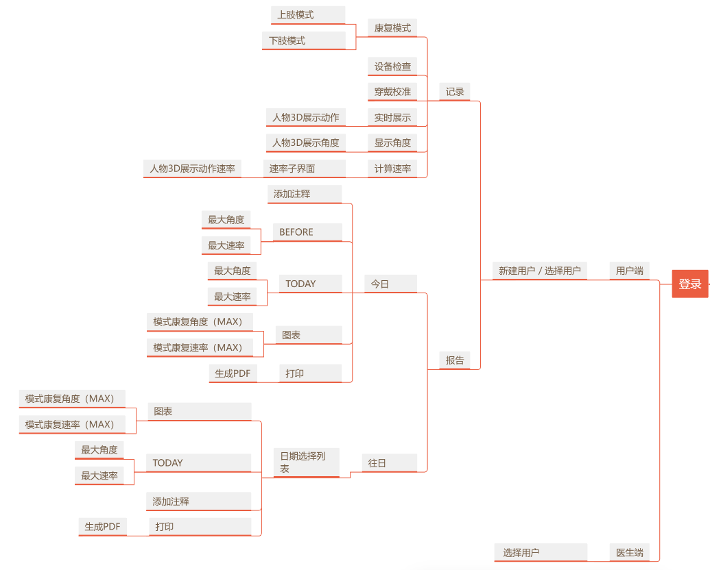

# 系统使用

## 系统登录

### **功能描述**

选择登录方式（手机号和验证码登录或者账号密码登录），在页面中阅读隐私条款和使用协议并勾选"我同意" ，并输入正确的账号，密码点击登录即可登录。

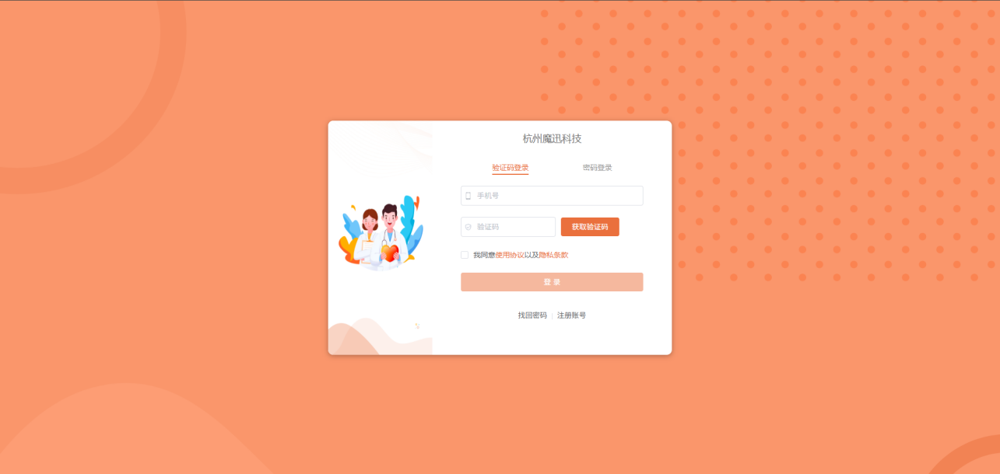

## 找回密码

### 功能描述

点击找回密码跳转至相应界面，输入手机号及验证码，点击下一步按钮，输入新密码和确认密码即可找回密码。

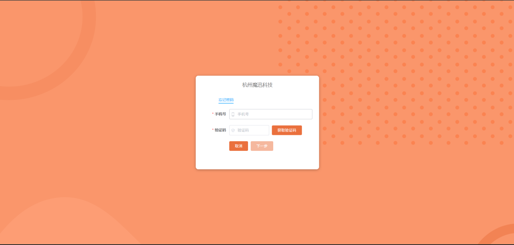

## 注册账号（康复师、康复对象待办）

### 功能描述

填写账号注册表单基本信息，选择相应的角色，并阅读使用协议及隐私条款，勾选我同意按钮，点击注册。如已有账号，则点击登录按钮可以跳转到登录页面进行登录操作。

## 康复对象列表

### 功能描述

步骤1：功能有查询、分页、重置和新建康复对象。

查询：搜索表单区域选择想要筛选的项并输入想要查询的关键字，列表中就会展示查询的结果。

重置：根据表单关键字查询后点击重置按钮可以清空筛选关键字并重新获取康复对象列表。

分页：将列表按页数及每页条数进行分页。

新建康复对象：点击+号按照提示创建新的康复对象。

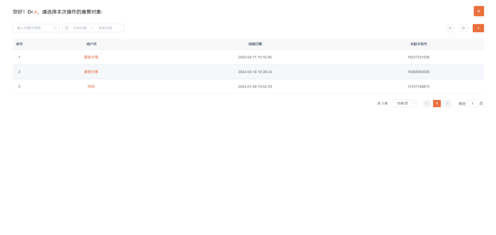

步骤2：上图为使用搜索功能前，数据列表的展示

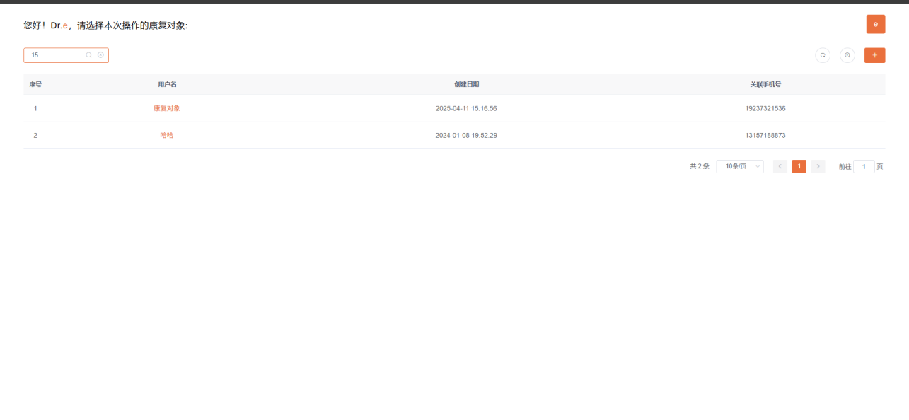

上图为使用搜索功能后，数据列表的展示

## 首页

### 功能描述

该页面根据时间倒序展示康复患者记录数据，内容包括康复评估名称及评估时间。

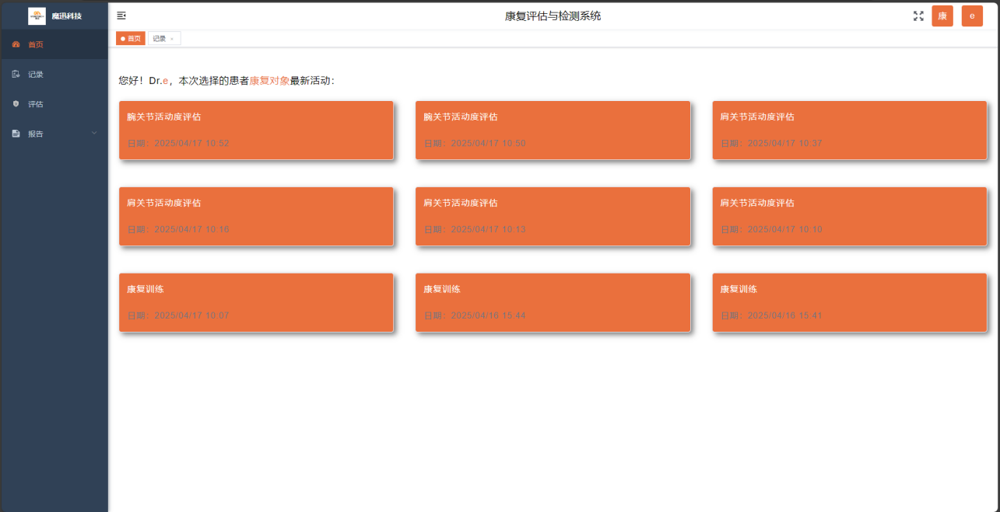

## 记录

### 功能描述

步骤1：设置康复计划

康复计划设置：填写表单项，包括康复方案名称、需要康复的周期时长、康复动作要求、康复部位以及康复关节，表单填写完毕后点击确定按钮进入下一步骤。

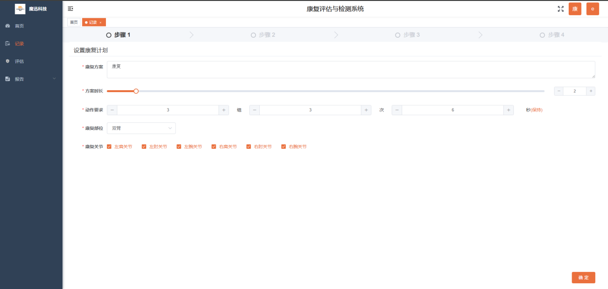

步骤2：检查设备

检查设备：设备链接后，该页面会显示设备的电量及节点部位名称，不同的设备电量用不同的颜色及来区分。点击上一步可以跳转到康复计划设置表单页面，点击确定可以跳转到下一步骤。

步骤3：穿戴示意图

穿戴示意：页面左侧是模型任务穿戴设备的示意图，由穿戴正面、背面及侧面三个视觉效果组成；右侧为设备校准区域，点击校准会显示校准开始，并且根据校准的动作提示做出相对应的校准动作，每个动作都会进行三秒倒计时，校准完毕后可进入下一步骤。

步骤4：姿势校准T姿势

T姿势：双手平举与地面略平行，保持静止三秒钟，待下方进度条100%时候可换成下一校准动作进行校准。

步骤5：姿势校准I姿势

I姿势：自然放松站立，双手贴与大腿大腿外侧，倒数321完成校准。

步骤6：动作记录

动作记录：通过上述T姿势和I姿势校准后可进行动作的录制，点击屏幕下方中间区域录制按钮开始录制，再次点击可结束录制。

计算速率：需点击结束按钮计算各个节点的速率并通过头部弹窗的形式展示计算结果。

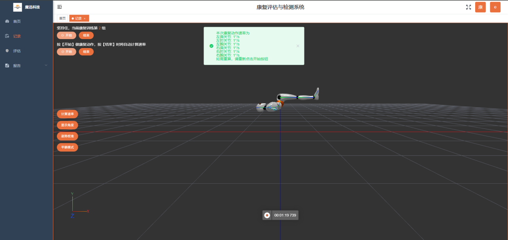

显示角度：点击显示角度按钮，右侧会弹窗展示环形角度示意图形，点击部位选择下拉组件可选择特定的关节部位查看详情。

显示角度（选择关节下拉）

姿势校准T姿势：双手平举与地面平行

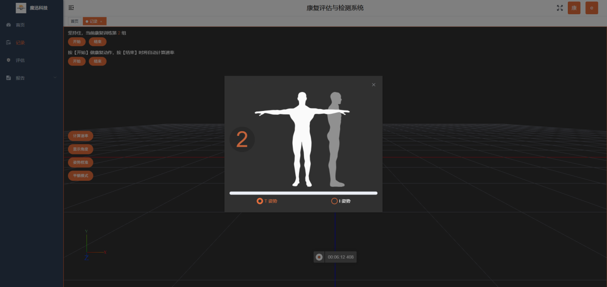

姿势校准I姿势：双手自然下垂贴于大腿外侧

平躺模式：点击平躺模式，场景中的人物模型会变成相对应的姿势，具体操作流程与普通模式类同。

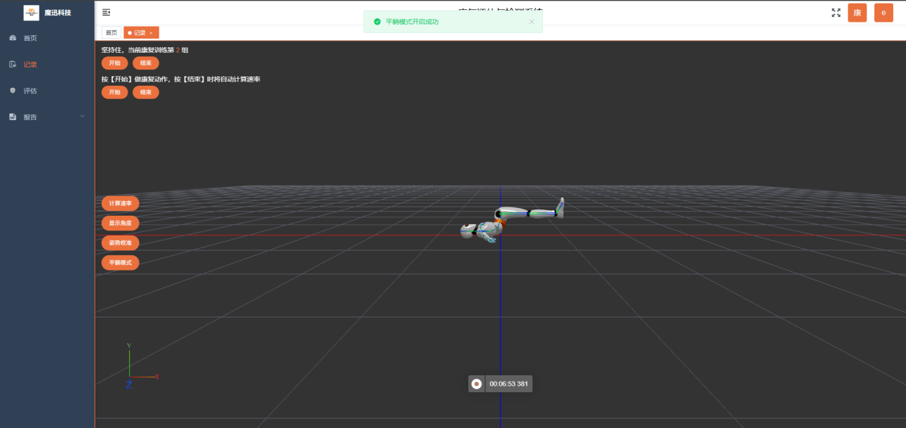

点击按钮停止运动录制

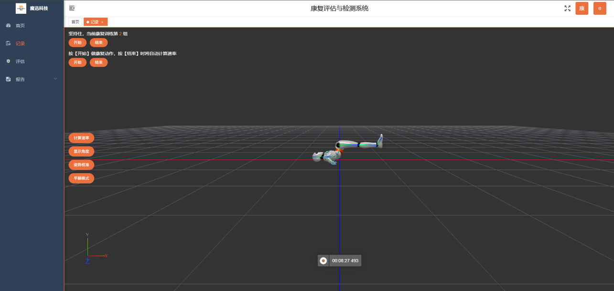

## 评估功能

### 功能描述

关节部位选择：点击下拉选择想要查看的关节部位

关节下拉选项：展示关节种类

部位下拉选项：对关节的左右部位进行选择

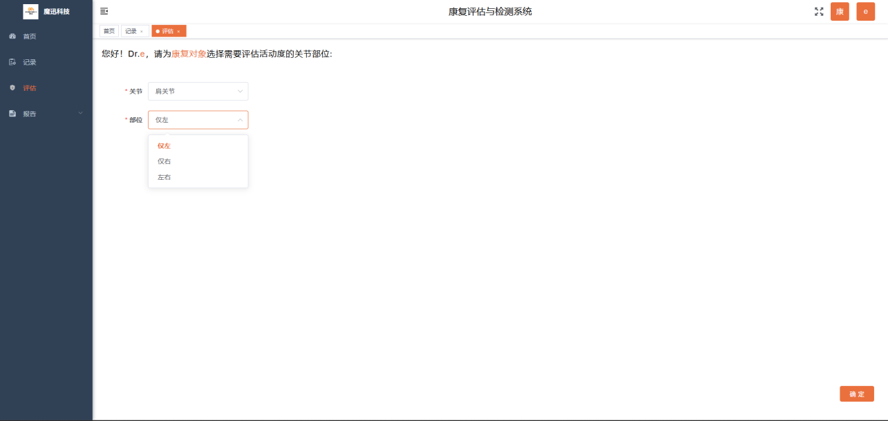

设备检查：查看设备电量是否充足

肩关节评估数据采集并生成图表：左侧区域展示康复动作，右侧为该动作下所生成的关节角度数据。

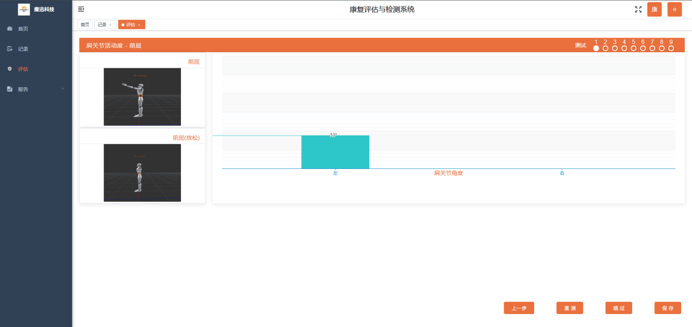

上一步：点击上一步跳转上一步对应的页面

重测：对当前数据进行重新测量以保证数据的准确性

跳过：跳转到下一步骤

保存：保存当前动作数据

生成评估报告（评估时间、医生、关节、质量），点击保存按钮保存当前报告并跳转到首页

## 康复训练报告列表

### 功能描述

查看患者康复训练列表，记录列表数据，按照时间进行排序。

查看康复训练报告：点击眼睛图标后弹窗显示康复训练报告，内容包括：用户名、康复方案、时长、康复部位、医生以及康复数据等。康复报告最后有二维码，用微信扫描二维码可在手机查看康复报告。

下载和打印：点击下载按钮，康复报告会以pdf的形式下载。

康复评估报告列表：

列表表头展示文件名、生成时间、关联医生，点击查看图标可查看报告文件。

查看康复评估报告：报告展示康复基本信息及详细康复部位数据，并提供打印及下载。

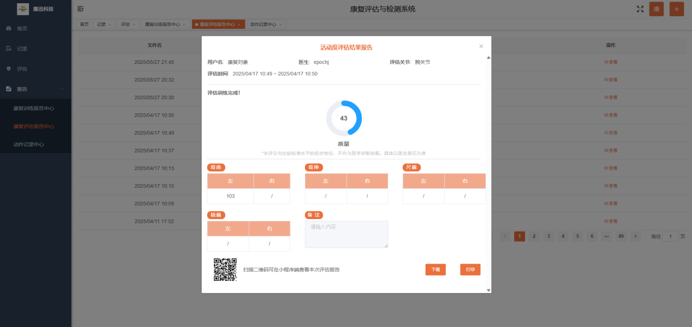

运动记录中心：康复动作录制后的文件在停止录制后可在此页面查看。

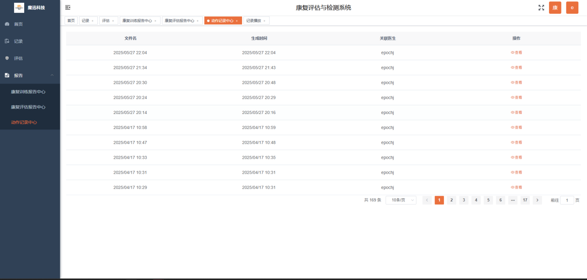

查看运动记录：点击查看图标跳转到播放页面，可播放对应的录制文件动作内容。

播放和暂停

场景中按住鼠标左键拖动切换不同视角查看运动动作

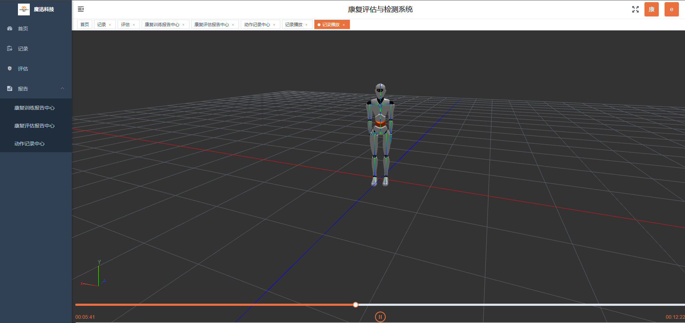

