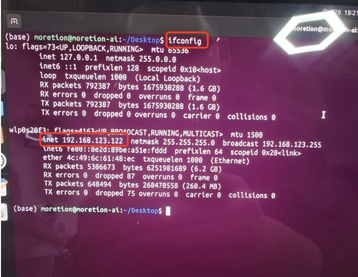
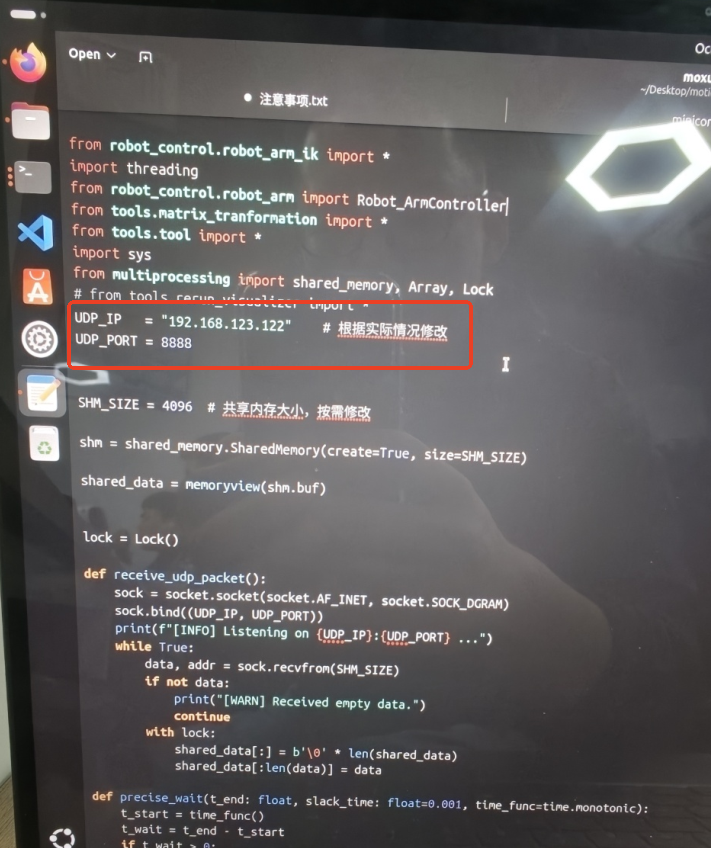
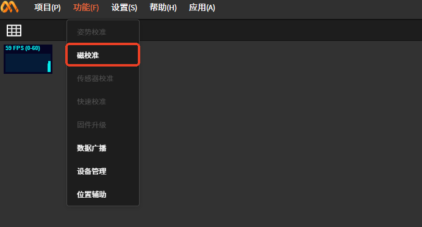
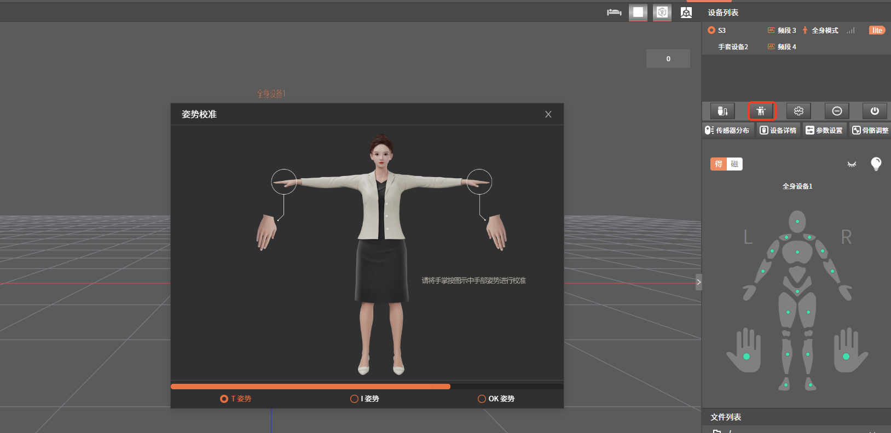
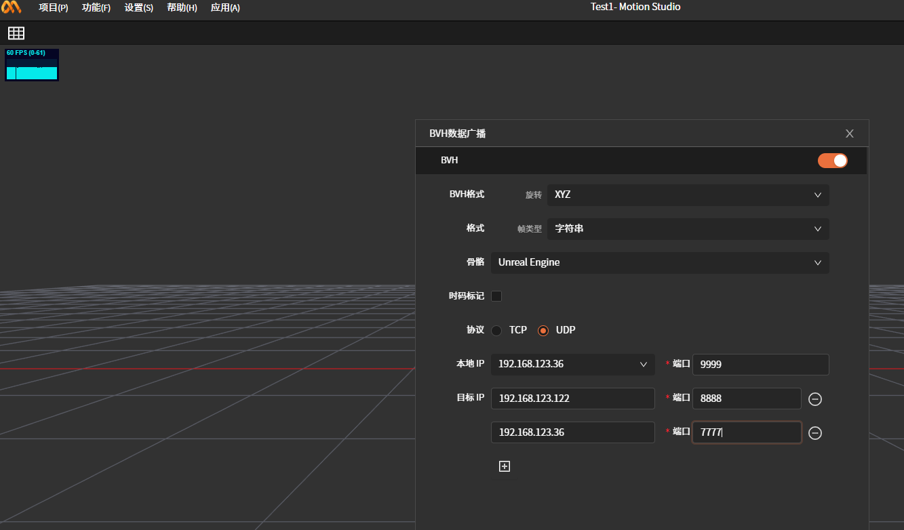
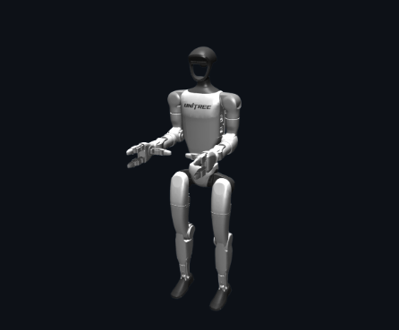

# **魔迅设备遥操宇树机器人&傲意灵巧手**

## **网络连接**

使用已将网段固定在192.168.123.xxx下的路由器，因为宇树机器人遥操作需要再此网段下才能驱动。

## **注意事项：**

- 运行MS软件的电脑和路由器使用无线连接

- 宇树机器人和路由器使用有线连接

- 运行宇树机器人驱动脚本的笔记本(Linux)和路由器无线连接

## 笔记本(Linux)信息

### **查看电脑的ip**

在电脑桌面右键Open in Terminal，输入指令ifconfig查看ip。可以看到此电脑的ip是192.168.123.122

### **设置机器人驱动脚本ip和port**

在/home/moretion/Desktop/motionCapture_teleoperte路径下双击打开moxun_robot.py脚本设置ip和port。ip为上方查看到的ip，port可以自定义例如：8888

### **MS软件设置**

#### **磁校准**

#### **连接设备**

#### **组合设备**

全身+手套不组合使用可能会影响机器人的驱动

#### **姿势校准**

#### **数据广播**

协议类型选择UDP

ip port说明：

192.168.123.122:8888是华为笔记本(Linux)脚本moxun_robot.py中设置的ip和port

192.168.123.36:7777是跑傲意灵巧手软件中界面设置的ip和port

傲意灵巧手软件设置

要求魔迅手套能正常驱动傲意灵巧手，详细使用说明见《魔迅手套+傲意灵巧手使用文档》文档。

### **运行机器人驱动脚本**

前提：上述流程已经走完，宇树机器人已调为测试模式

### **打开控制台**

在华为笔记本(Linux)/home/moretion/Desktop/motionCapture_teleoperte文件夹下右键点击Open
in Terminal(打开控制台)。

### **创建conda环境**

输入指令conda activate tv按下"enter"键，切换环境

### **运行脚本**

输入指令python moxun_robot.py按下"enter"键

如果上述流程都正确操作的话机器人会切换到准备状态，此时穿戴动捕设备的真人做下图准备姿势

输入指令r按下"enter"键

正常情况真人就可以遥操作机器人了

### **退出程序**

在控制台中按下ctrl+c键退出程序

在控制台不关闭的前提下，下次直接从\"**#运行脚本\"**那里往下走就可以了

### **注意事项**

在遥操作机器人的过程中，魔迅软件不能做姿势校准

如果遥操宇树机器人&傲意灵巧手，魔迅全身+手套需要改为组合模式

设备清单：路由器、网线、运行ms软件的电脑(windows)、运行遥操作的电脑(Linux)、全身惯捕设备(1)、手套惯捕设备(1)
