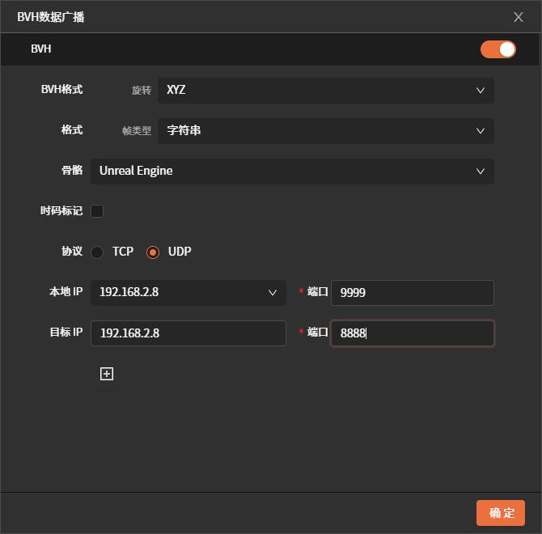
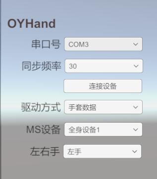
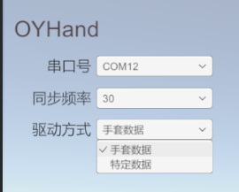

**魔迅手套+傲意灵巧手使用文档**  

---

**概述**  
该软件可通过网络传输接收 MotionStudio 中的手套动捕数据，并驱动傲意灵巧手执行相应动作。

---

**傲意灵巧手资料**  

| 资源类型    | 链接                                                                        |
|:-------:|:-------------------------------------------------------------------------:|
| 产品文档    | [《OHandSetting使用手册-V1.4.pdf》](./assets/OHandSetting使用手册-V1.4.pdf)         |
| 协议文档    | [《OHandSerialProtocol_CN.md》](./assets/OHandSerialProtocol_CN.md)         |
| CH340驱动 | [CH34x_Install_Windows_v3_4.zip](./assets/CH34x_Install_Windows_v3_4.zip) |
| 图形化软件   | [Windows.rar](./assets/Windows.rar)                                       |

---

**软件下载及使用**  

**软件下载**  

| 版本                                                                | 日期         | 更新说明                                                                                             |
| ----------------------------------------------------------------- | ---------- | ------------------------------------------------------------------------------------------------ |
| [OYDexterousHand_V2.0.0.rar](./assets/OYDexterousHand_V2.0.0.rar) | 2025-10-28 | 1. 适配右手灵巧手 2. 支持多MS设备 3. 支持多魔迅设备驱动多个灵巧手 4. 支持一个魔迅设备驱动多个灵巧手 5. 支持UDP通信 6. 优化rock手势 |
| [OYDexterousHand_V1.1.0.rar](./assets/OYDexterousHand_V1.1.0.rar) | 2025-09-22 | 1. 支持驱动特定动作（如石头、剪刀、布等） 2. 支持演示模式                                                              |
| [OYDexterousHand_V1.0.0.rar](./assets/OYDexterousHand_V1.0.0.rar) | 2025-09-17 | 支持魔迅手套驱动傲意灵巧手（左手）                                                                                |

---

**软件使用**  

**1. 连接 MotionStudio**  

1. 在 MotionStudio 中开启数据广播并进行相关配置。  
2. 在该软件中输入 MotionStudio 中配置的 IP 和端口，点击连接（仅支持 UDP 协议）。  

> **注意**：MotionStudio 与该软件需在同一局域网内，IP 和端口配置需准确。  

  
  

---

**2. 连接傲意灵巧手**  
选择灵巧手对应的串口号并连接设备。若不确定串口号，可尝试拔插设备，观察串口号的变化。  

> **注意**：  
> 
> - **同步频率越高，灵巧手越容易过热**。  
> - 使用手套前请务必进行磁校准，否则可能影响拇指动作效果。  

  

---

**3. 驱动模式切换**  
目前支持两种驱动模式：  

- **方式一**：使用手套驱动（实时数据）。  
- **方式二**：使用特定数据驱动（离线数据）。  
  切换到特定数据模式后，可执行石头、剪刀、布等预设动作。  

  
  

---

**效果演示**  

| 演示内容        | 链接                                |
|:-----------:|:---------------------------------:|
| 魔迅手套数据驱动灵巧手 | [演示效果1.mp4](./assets/video01.mp4) |
| 特定动作数据驱动灵巧手 | [演示效果2.mp4](./assets/video02.mp4) |
