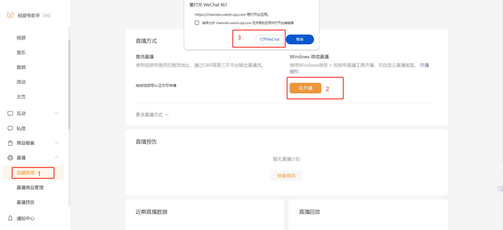
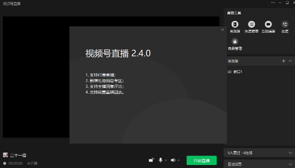
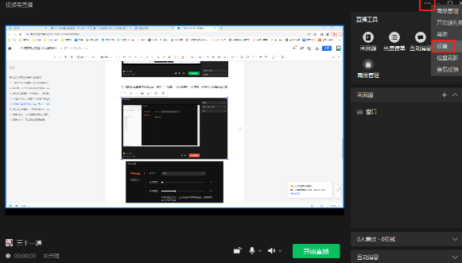
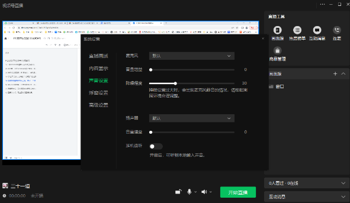

**微信视频号直播(草稿)**

**微信视频号直播有两种方式**

**方式一（**推流直播**）**

使用视频号提供的推流地址，通过虚拟直播程序输出直播流（推荐这种方式）。可控制想直播出去的画面

{width="6.15625in" height="3.4375in"}

**方式二 (**使用视频号直播工具**)**

1.  **微信视频号助手网站进行设置、发起**

网站地址：<https://channels.weixin.qq.com/platform/live/home>

{width="6.15625in" height="2.8125in"}

**2.将Windows微信客户端升级至最新版，点击左下角按钮-视频号直播(Mac端暂不支持)**

{width="6.15625in" height="4.84375in"}

**3.如为第一次在Windows微信上直播，将会弹出插件下载提示，下载安装后，即可看到直播准备画面**

{width="6.15625in"
height="3.5208333333333335in"}

**4.选择添加画面源，有"摄像头"、"手机画面"、"窗口"、"多媒体"、"游戏进程"、"桌面"六个选项，按照页面提示操作即可；点击【摄像头】，可选外接摄像头**

虚拟直播软件中开启虚拟摄像头，视频号直播工具中选择摄像头名字为\"VirtualCamera\"的摄像头，然后确定。

{width="6.145833333333333in"
height="3.1458333333333335in"}

{width="6.145833333333333in"
height="3.1770833333333335in"}

**5.在视频号直播界面右上角，点击"\..."-"设置"，可对麦克风、扬声器、画布大小及是否显示鼠标进行设置**

{width="6.052083333333333in"
height="3.4479166666666665in"}

{width="6.15625in"
height="3.5729166666666665in"}

**6点击发起直播后，可修改直播分类、添加直播描述及修改封面，确认无误后，点击"开始直播**

{width="6.21875in"
height="3.5520833333333335in"}

**7.直播开始后，可在画面右侧看到当前在线人数及用户评论，也可一键关闭评论**

{width="6.145833333333333in"
height="3.53125in"}

**8.直播结束后，可查看本场直播数据。也可点击【数据详情】，前往视频号助手管理端查看详细数据分析**

{width="6.239583333333333in"
height="3.5625in"}
