# **虚拟直播软件使用教程**

## 一、磁校准操作（将采集器放置在充电盒中-不充电）

1.1接收器连接电脑

**1.2打开磁校准工具**

**1.3设备连接**

连接成功后，设备详情中各个节点指示灯将会亮起

**1.4观看磁校准教程视频**

磁校准过程中请分别绕空间坐标系X、Y、Z 三轴转动360，大概2-4s转360度

[请至钉钉文档查看附件《video_20240126_143958.mp4》](https://alidocs.dingtalk.com/i/nodes/DnRL6jAJMN4DwEzrCP0ky90N8yMoPYe1?iframeQuery=anchorId%3DX02ls1g7cq4sznfov1vimi)

1.5磁校准操作

根据教程视频进行磁校准操作

点击下一步前，需确保传感器静止放置，以保证传感器能够校准成功

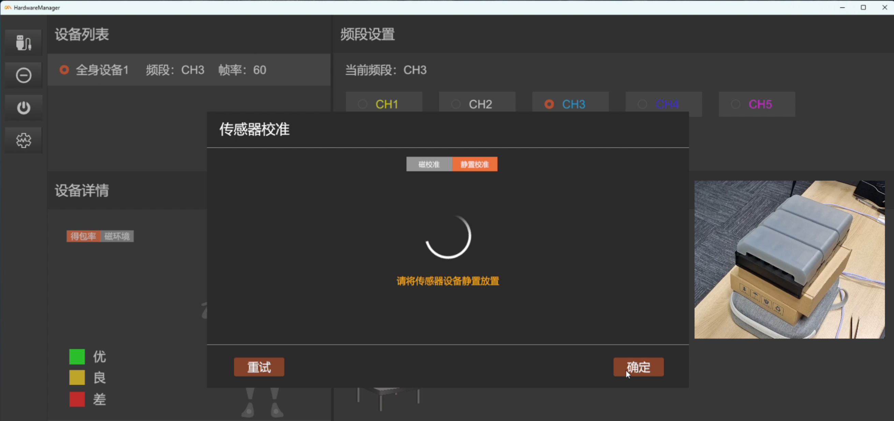

校准成功

成功后，即可关闭磁校准工具

## **二、使用**Motion Studio软件及设备穿戴

**2.1打开Motion Studio软件**

**2.2连接设备**

当设备列表有设备显示时，点击连接按钮进行设备连接

2.3穿戴设备

1.穿戴绑带

根据每条绑带的佩戴部位提示将绑带依次佩戴在如下图所示的对应位置。因为恒卓传感器测量的是骨骼的运动，所以需要尽可能的排除肌肉运动带来的物理干扰。穿戴位置需要选择肌肉量最少的位置，这样捕捉的数据效果较好。后面进行的姿态校准会重新计算穿戴位置，所以即使您佩戴的位置和图片上有少许误差，也是可以的。

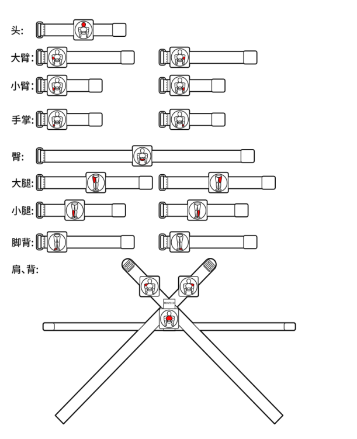

2.佩戴传感器

将传感器按照图示方法粘贴到绑带中

3.传感器佩戴位置说明

**上半身：**

1、头部传感器安装**头部正后方**。

2、肩部传感器安装在**肩部正上方**，尽量往**外侧**的位置。

3、臀部传感器安装在**腰部下方**，尽量往下**接近尾椎**部分，同时该节点传感器佩戴时**充电口应朝上**佩戴。

4、大臂传感器安装**大臂中间靠外侧**。

5、小臂传感器安装在**小臂中间靠外侧**处。

6、手掌传感器安装在**手背**位置。

**下半身：**

1、大腿传感器安装在**大腿中间靠外侧**，膝盖上方2-3cm处。

2、小腿传感器安装在**小腿中间靠外侧**2-3cm处。

3、脚部传感器安装在**脚背**处，绑带尽量环绕于脚窝处，这样在走路时不会造成绑定意外脱落。

**注意事项：**

•在安装绑带时应安装牢固贴紧身体，确保在大幅度运动时，传感器节点不会剧烈晃动。

•动捕演员在工作时，请务必检查身上没有手机、手表等电子设备及钥匙硬币等强磁体，这些电子设备和强磁体产生的磁干扰会严重影响传感器的工作。

•恒卓传感器中含有磁力计，磁力计传感器会受到强磁场环境的影响。用户必须在磁场干扰最小的环境中使用传感器。

2.4姿势校准

设备连接成功后，点击姿势校准，根据提示进行T-Pose、A-Pose姿势校准

**T-Pose**

•站直，展开双臂，与身体向上的位置垂直，掌心朝下。

•伸直手指，四指并拢。

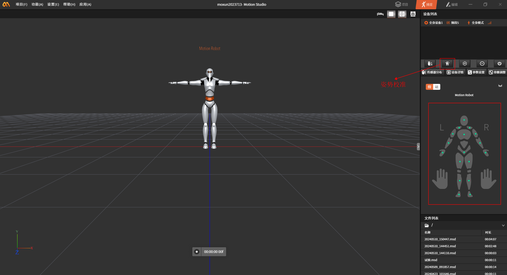

**I-Pose**

• 站直，双脚平行，与肩同宽

• 手臂自然下垂，手掌向内，手指伸直，拇指指向腿部外侧。

• 头部直视前方，下巴平行于地面。

• 肩膀放松，不要耸起。

**OK-Pose**

• 双手置于胸前约30cm左右

• 比"OK"手势

**2.5点击数据广播进入BVH数据广播操作**

数据广播功能可以将Motion Studio中的数据实时的广播到Motion
Studio软件所在的网络中，网络对应的任何其他软件都可以通过Api接口开接收和解析实时的数据。

当实时连接上动作捕捉设备时，打开"BVH"按钮
（按钮由灰色变成橙色即表示开启）并自定义输入端口号就可以进行实时数据广播。该功能可应用于虚拟直播

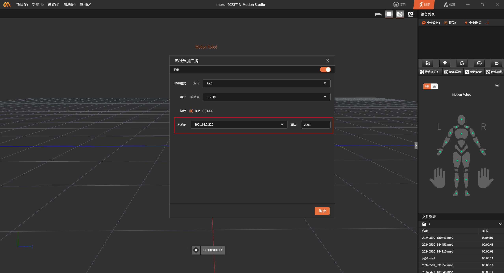

## 三、虚拟直播软件VirtualLive的使用

**3.1 打开VirtualLive文件包**

**3.2 进入虚拟直播界面，输入与Motion
Studio数据广播中相同的端口号，与Motion Studio进行连接**

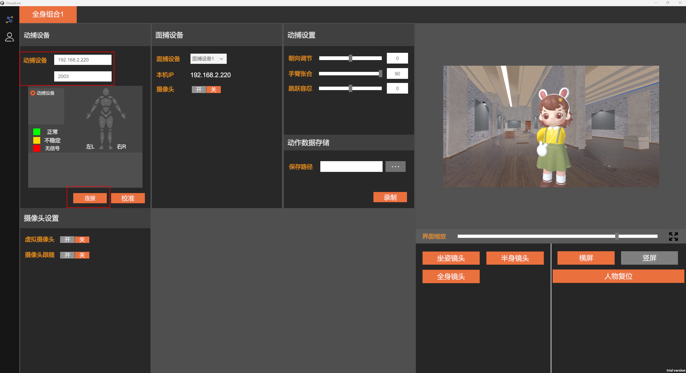

连接成功后，虚拟直播人物界面和Motion Studio中人物动作将会同步

**3.3.界面右下方可随意切换人物镜头和横竖屏，同时也支持将人物一键复位**

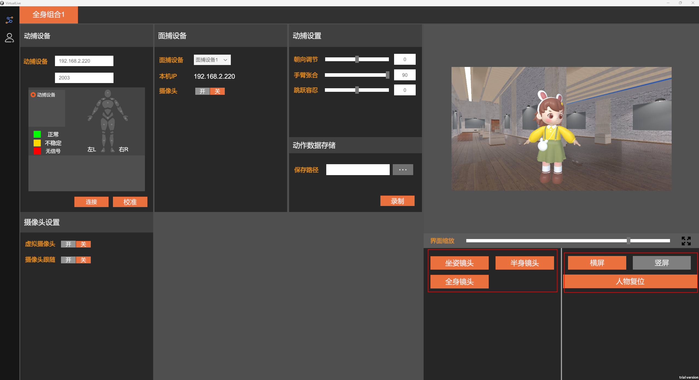软件中支持动捕设置，包括手臂张合、朝向调节、跳跃容忍

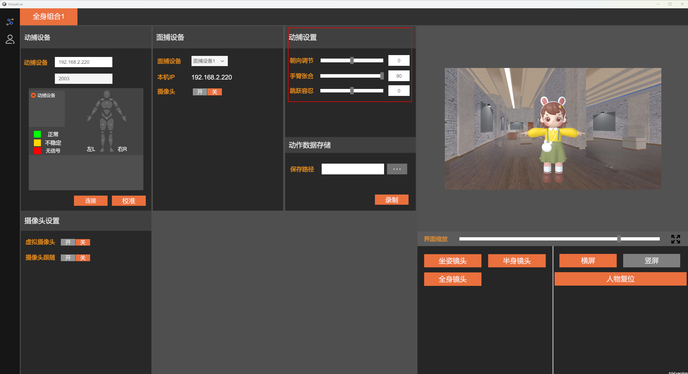

软件中用户还可以随意切换人物角色和场景模型，共包含4种不同风格人物模型和2个场景

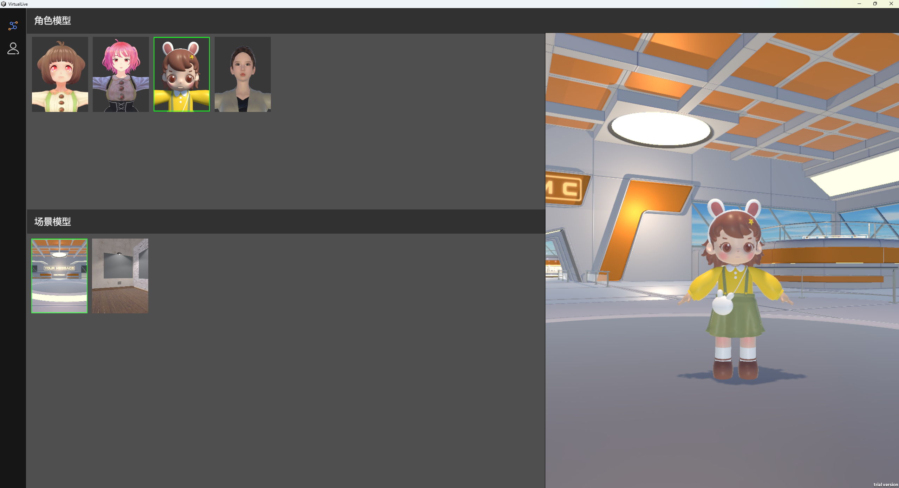

**3.4连接面捕设备**

打开摄像头开关，启用面捕功能

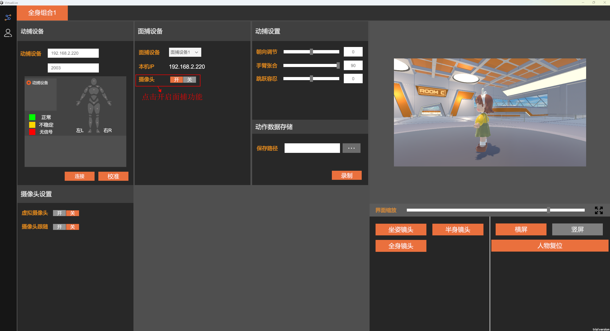

在苹果手机应用商店中下载Face
Capture软件，同时要确保手机和电脑需用同一WiFi或者流量

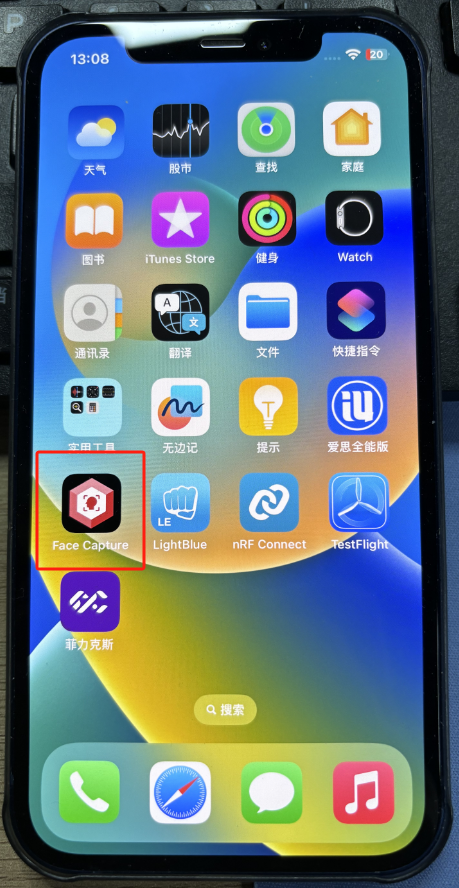

打开Face Capture软件，当搜索到设备时，点击Connect进行连接

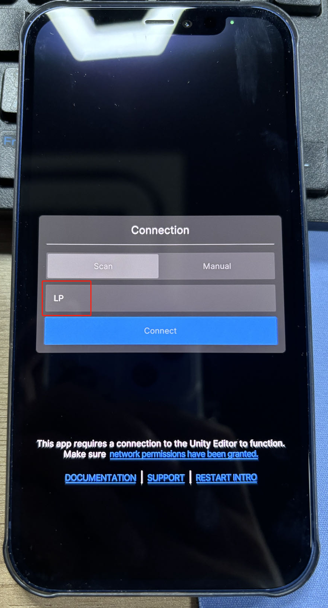

连接完成后，将手机固定在头盔上，佩戴头盔，即可开始进行虚拟直播

**3.5数据录制**

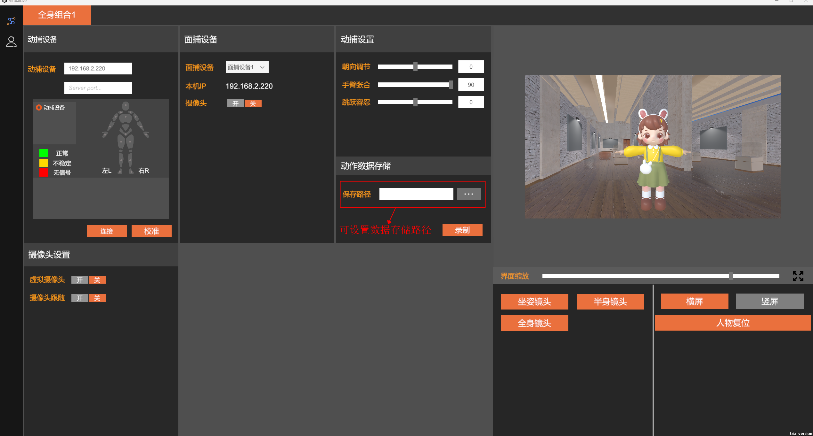

支持将动作数据录制，并保存到自定义设置的文件路径下

**3.6如何在主流平台设置虚拟摄像头？**

pc端无论是哪个直播平台直播助手(视频号直播助手等)或第三方工具(obs等)设置都一样。

**下面以视频号直播助手举例**

虚拟直播软件中开启虚拟摄像头

**视频号直播助手中选择添加画面源，选择"摄像头"，摄像头选择**名字为\"VirtualCamera\"的摄像头，分辨率为1920\*1080，然后确定。

