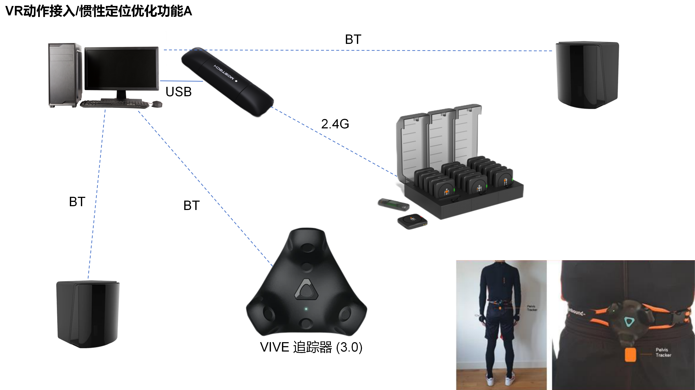
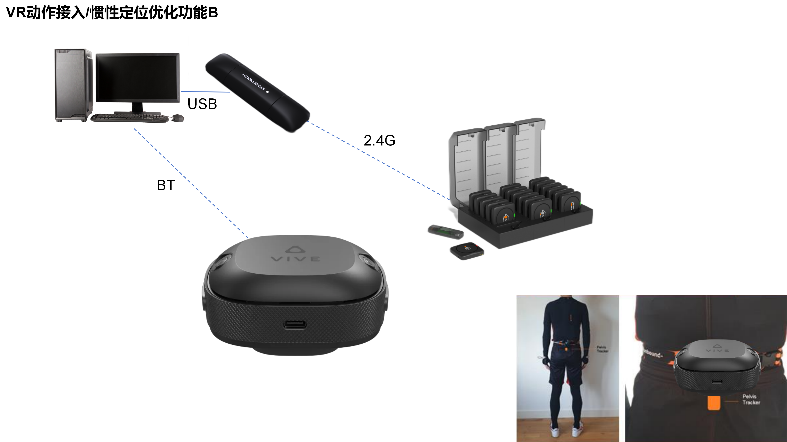

# VR设备支持说明

## 1.G1+PICO+体感追踪器

需使用体感追踪器为数据手套提供位置数据。提供安卓SDK，VR头显可通过接收器直接获取数据手套数据。

## 2.G1+FOCUS+腕带

推荐使用HTC腕带式追踪器为数据手套提供位置数据。提供安卓SDK，VR头显可通过接收器直接获取数据手套数据。

## 3.G1+VIVE Pro2+Tracker 3.0

追踪器需佩戴在手腕处，购买可某宝搜索“追踪器绑带”。

## 4.Z1/Z1 Pro+Tracker3.0

可以作为位置辅助功能，也可以结合VIVE Pro2在VR中捕捉查看人体动作。配套的结构件可自行3D打印或联系销售配套，可从[3D打印件]([产品配件 - 3D打印件](https://moretion.github.io/others_3d_printing/3d_printing/index.html))中Z1系列的臀部节点下载。腕部节点结构可用于后续开放的手臂姿态动态修正功能，需额外在手腕处佩戴两个Tracker。

## 5.Z1+自定位追踪器

可以作为位置辅助功能，也可以结合FOCUS或XR套装等支持自定位追踪器的HTC一体机在VR中捕捉查看人体动作。
