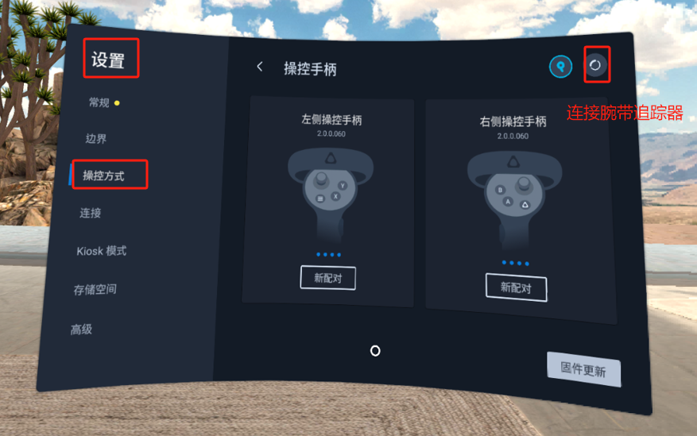
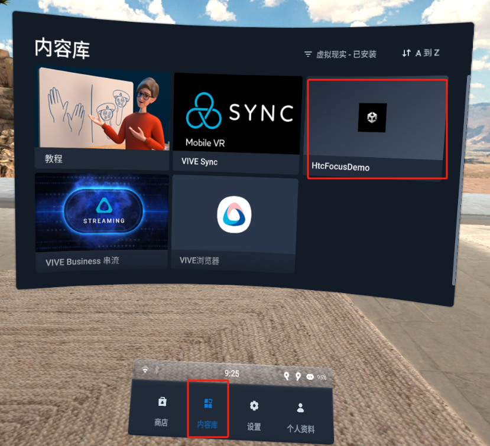
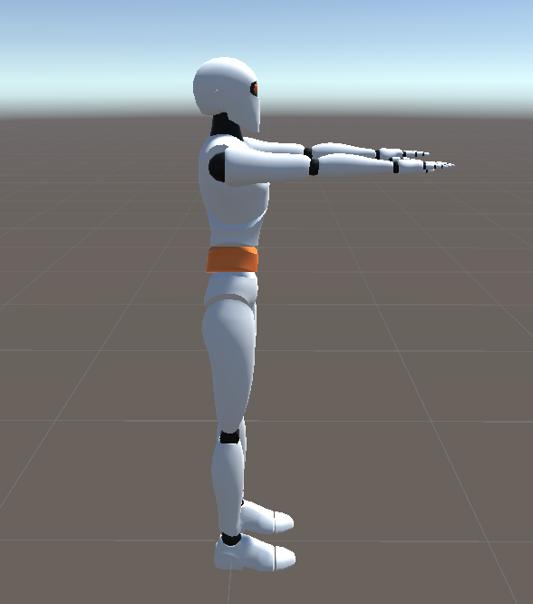

# **G1手套配合Htc Focus3使用**

## 1. 开发包

下载地址：[GloveInteraction.unitypackage](https://docs.mostech.asia/ap_vr/GloveInteraction.unitypackage)

演示场景：

## **2.下载手套软件安装包**

文件下载至电脑

[请至钉钉文档查看附件《MotionCapture_Glove_Focus_1.1.0.apk》](https://alidocs.dingtalk.com/i/nodes/np9zOoBVByPenbv3CyqKY1D0W1DK0g6l?iframeQuery=anchorId%3DX02m54p6859ykc5wg145te)

### **2.1下载工具**Vysor

[请至钉钉文档查看附件《Vysor-win-5.0.7.exe》](https://alidocs.dingtalk.com/i/nodes/np9zOoBVByPenbv3CyqKY1D0W1DK0g6l?iframeQuery=anchorId%3DX02m1022ipiliyrzp4rys)

### **2.2安装应用**

使用软件Vysor可以方便focus和电脑建立连接，在focus中选择文件传输。然后将MotionCapture_Glove_Focus.apk拖入下方画面中，focus中会自动安装apk软件

## **3.使用手套软件**

### **3.1连接腕带式tracker**

使用软件前确认连接了两个腕带追踪器，如果连接了手柄需要先断开手柄的连接

设置\>控制方式\>选择腕带追踪器，然后根据提示连接

### **3.2打开软件**

在内容库中打开GloveHtcFocusDemo软件。

### **3.3软件中使用流程**

前置条件，pico中插入了手套接收器，并且两只手套设备已开机。

采集数据

先点击采集数据按钮，看得包率是不是0，如果是0检查手套是否已开机。

如果得包率很低，请至pc软件MotionStudio中切换频段。

姿势校准(需要手朝向靶子方向)

没有上述问题后，点击姿势校准按钮，姿势参考下图。

手臂姿势

手部姿势

## **4.画面串流至PC**

[https://www.vive.com/cn/support/focus3/category_howto/casting-to-pc.html:
https://www.vive.com/cn/support/focus3/category_howto/casting-to-pc.html](https://www.vive.com/cn/support/focus3/category_howto/casting-to-pc.html)

[请至钉钉文档查看附件《VIVE_FOCUS3_UG_CHS.pdf》](https://alidocs.dingtalk.com/i/nodes/np9zOoBVByPenbv3CyqKY1D0W1DK0g6l?iframeQuery=anchorId%3DX02m9j7l94vwy20xwwrvih)

