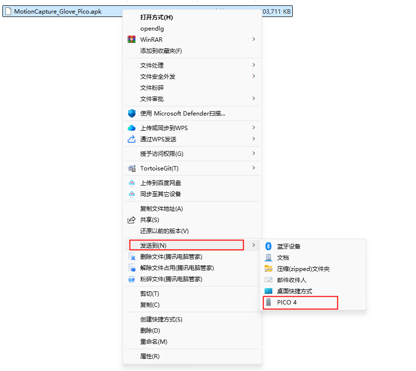
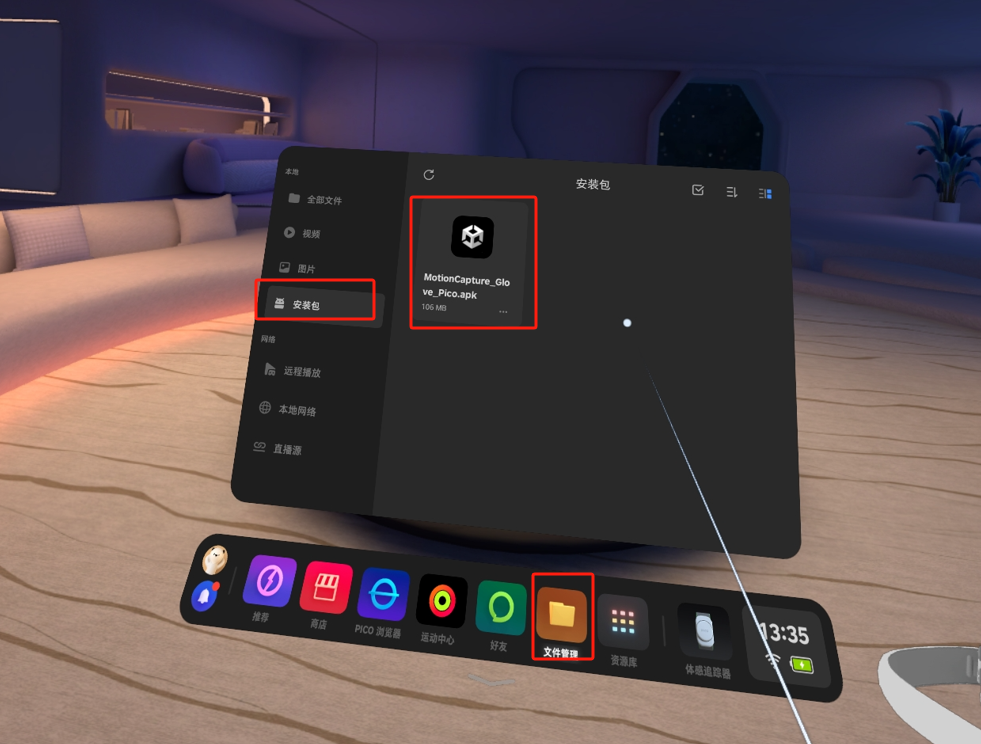
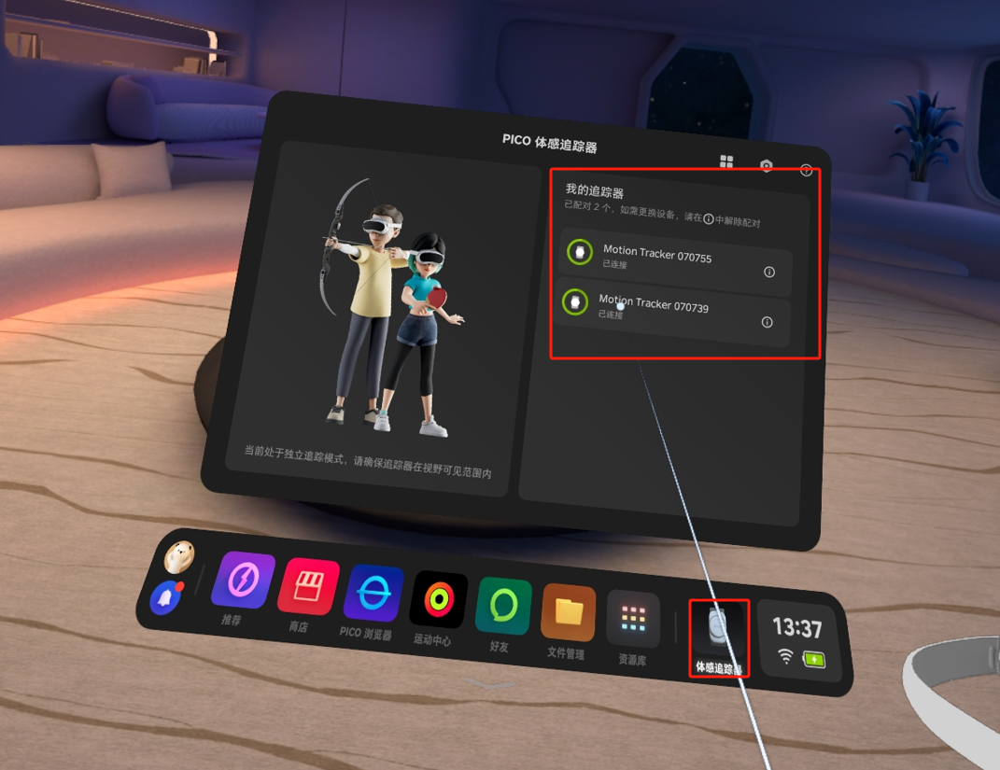
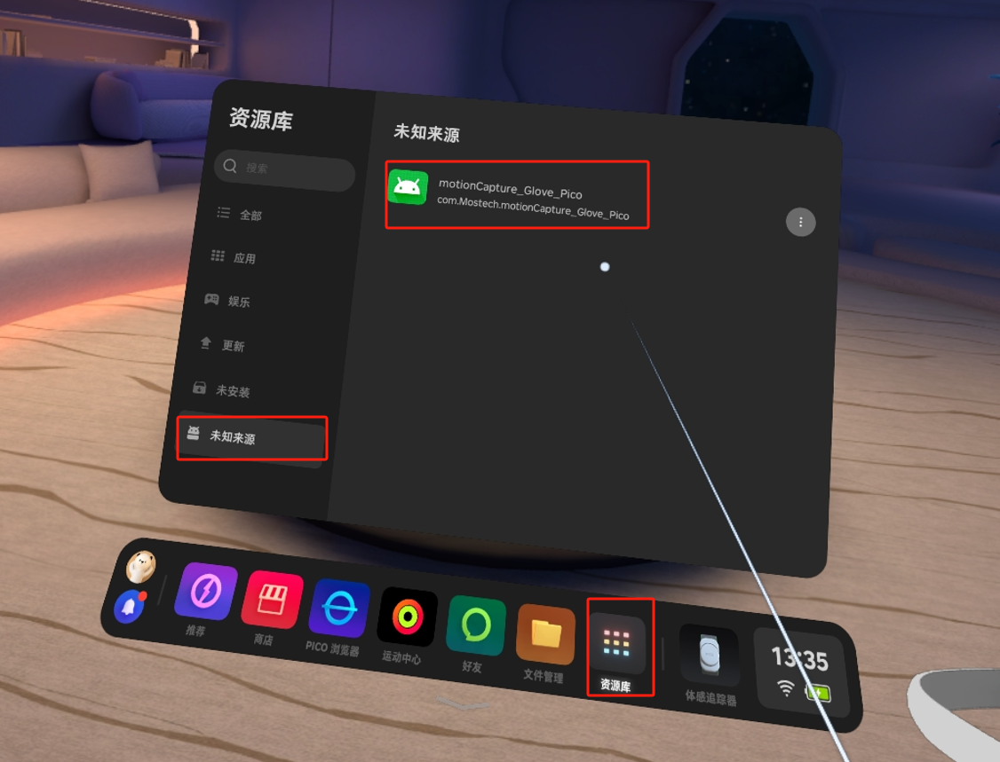
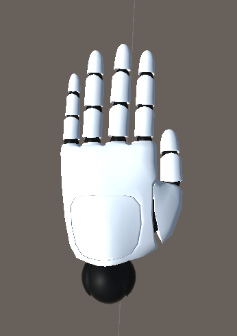

# **G1手套配合Pico一体机使用**

---

## 1. 开发包

下载地址：[GloveInteraction.unitypackage](https://docs.mostech.asia/ap_vr/GloveInteraction.unitypackage)

演示场景：

## 2. **功能测试安装包**

文件下载至电脑。

[MotionCapture_Glove_Pico_InSituModel_1.0.0.apk](http://docs.mostech.asia/ap_vr/MotionCapture_Glove_Pico_InSituModel_1.0.0.apk)  V1.0.0  2025-02-27

## 3. **功能测试**步骤

### **3.1 安装包发送至Pico**

使用数据线连接Pico与电脑，选中 `MotionCapture_Glove_Pico.apk` 文件，右键点击“发送到 PICO4”。

> 如果找不到Pico设备，请在Pico中开启“开发者模式”并启用文件传输功能。  
> 

### **3.2 安装应用**

在Pico中进入 **文件管理 → 安装包**，点击 `MotionCapture_Glove_Pico.apk` 进行安装。

## 4. **使用手套软件**

### **4.1 连接Tracker**

使用软件前，请确保已连接两个追踪器。  
打开体感追踪器软件，连接两个追踪器。

  

### **4.2 打开软件**

进入 **资源库 → 未知来源**，打开 `MotionCapture_Glove_Pico` 软件。

> **可能遇到的问题**：
> 
> 1. 提示Pico版本过低 → 请先升级Pico系统。
> 2. 提示需要连接网络 → 请先连接Wi-Fi。

### **4.3 软件使用流程**

**前置条件**：Pico中已插入手套接收器，且两只手套设备已开机。

- **采集数据**  
  点击“采集数据”按钮，查看得包率是否为0。若为0，请检查手套是否开机。  
  若得包率很低，请至PC端软件 `MotionStudio` 中切换频段。

- **姿势校准（手需朝向靶子方向）**  
  若无上述问题，点击“姿势校准”按钮，姿势参考下图：  
  
  **手臂姿势**：  
  
  **手部姿势**：  
  
  
