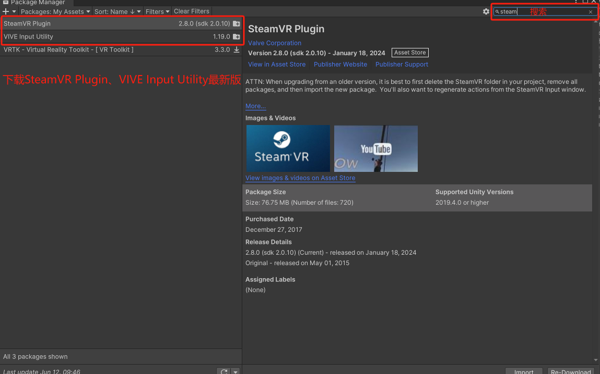
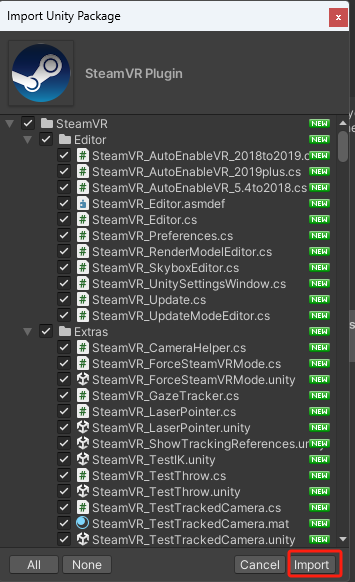
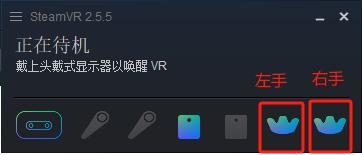

# **手套结合StreamVR使用文档**

开发包下载：[GloveVRInteraction_V1.6.2.unitypackage](https://docs.mostech.asia/ap_vr/GloveVRInteraction_V1.6.2.unitypackage)

1.  ## **Steam环境配置**

### **1.1下载Steam和SteamVR**

Steam：<https://store.steampowered.com/about/>

在Steam中下载SteamVR

### **1.2使用steamVR连接硬件设备**

- 定位器\*2

- 追踪器\*2

- 头显\*1

2.  ## **Unity VR环境配置**

### **2.1下载Steam相关插件**

在window-\>Package Manager中下载SteamVR Plugin、Vive Input
Utility最新插件。

将插件导入，并根据提示进行默认配置。

### **2.2导入手套交互插件**

插件说明:此插件基于动捕插件开发,如何驱动手模型、模型要求都以下方文档为准。

[《Unity3D插件使用文档》](https://alidocs.dingtalk.com/i/nodes/3xRN9bGQyw4JbxqgjqE5WzXPADKnorv6?utm_scene=team_space)

通过Assets-\>Import Package-\>Custom Package导入插件

可以在Assets-\>Motion-\>Scenes-\>GloveVR找到Demo场景

3.  ## **脚本说明**

### 3.1Assets-\>Scripts-\>Glove-\>ButtonBaseInteraction.cs

按钮交互脚本，需要在按钮上添加碰撞体。用手指点击按钮时会触发按钮的OnClick事件，可手动绑定

自己的实现。

### 3.2Assets-\>Scripts-\>Glove-\>GrabInteraction.cs

使用此脚本可实现抓取物体(至少一个拇指关节和其他手指一个关节)，物体需要添加碰撞体和刚体。

碰撞体勾选IsTrigger属性，刚体取消勾选UseGravity属性。

### 3.3Assets-\>Scripts-\>Glove-\>ThrowInteraction.cs

使用此脚本可实现抓取物体(至少一个拇指关节和其他手指一个关节)，并且可以将物体扔出。物体需要添加碰撞和

刚体，且碰撞体不要勾选IsTrigger属性，刚体勾选UseGravity属性。

### 3.4Assets-\>Scripts-\>Glove-\>Gesture.cs

使用此脚本可实现食指和中指并指检测，会根据食指指尖和中指指尖的距离(可通过阈值配置)判断是否并指，

并指会触发syndactyliaEvent事件。可以订阅脚本中的syndactyliaEvent事件来实现自己的业务需求。

3.5Assets-\>Scripts-\>Glove-\>ServerInteraction.cs

使用此脚本可向MotionStudio发送指令。例如:控制左右手震动马达

4.  ## **特殊配置说明**

### **4.1手模型配置**

左手配置为leftHand层，右手配置为rightHand层。每个手指都有三个关节组成，指尖、指中、指底。

为每个关节添加碰撞体和刚体(不使用重力)。大拇指各个关节添加thumb标签，其它手指添加otherFinger标签，

手掌添加palm标签。

### **4.2追踪器佩戴**

追踪器灯朝向手背方向

### **4.3追踪器区分左右手**

如果只有一个追踪器只会定位左手

如果有两个追踪器根据streamVR显示tracker图标区分左右手。图标一对应左手图标二对应右手

