# **一、软件使用说明**

## 1.1 功能总览

Motion Studio控制运动捕捉系统的软件平台，在 Motion Studio中用户可以标定相机系统，同时处理、捕获 3D数据，捕获的数据可以通过实时数据流的方式传输到其他软件平台。MotionStudio通过计算多个 是用于2D 图像中标记点数据，重建出 3D 坐标。

## 1.2 软件安装

### 1.2.1 PC配置

I7-11700/32G/256G固态+2T

注：暂不支持Linux、苹果电脑。

### 1.2.2 软件下载

从官网下载软件最新安装包。

### 1.2.3 软件安装

1\) 运行安装包；

2\) 安装时，会提示安装驱动。驱动安装完成之后，继续按照提示安装软件。

### 1.2.4 注册登录

1）打开安装好的软件，进入登录页面；

2）在登录页面，选择密码登录，输入您已注册的手机号（注册步骤将由技术支持进行）；

3）输入工作人员提供的初始密码；

4）点击【登录】按钮，即可进入系统。

### 1.2.5 新建项目

点击新建项目，选择项目存放点并为项目命名，建好后进入UI界面。

## 1.3 软件界面

软件界面包括工具栏、显示区域、校准界面、设备列表及其它功能面板，如下图：

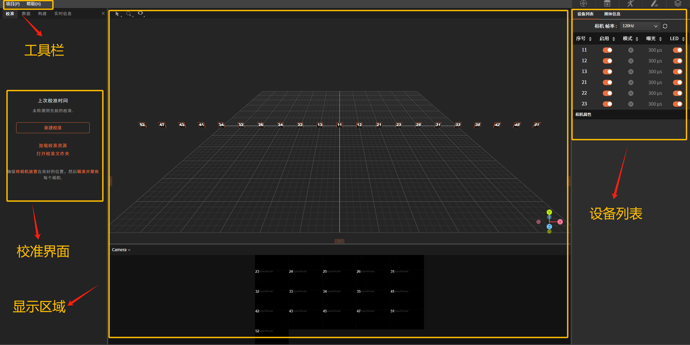

### 1.3.1 显示区域

显示区域包含3D视图和相机视图。

**1）3D视图**

在这个窗口内可以查看创建的三维空间，其中包含相机位置、Marker点位置、创建的刚体和骨骼等三维信息。

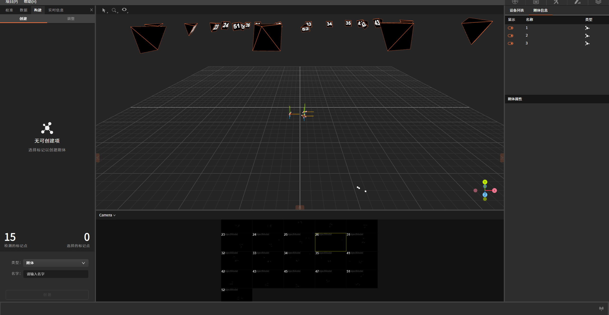

框选刚体后，长按鼠标右键可以旋转刚体各角度，其中：

红轴：为X轴；

绿轴：为Y轴；

蓝轴：为Z轴；

**2）相机视图**

在该窗口可以看到链接到系统中的每个相机对应的2D画面，包含当前所有相机的相机序号、视图及实时动态。

视图功能：

- 鼠标上下拉伸窗口，可对整体视图进行缩小和放大；

- 双击单相机完成单相机聚焦，多相机聚焦需使用按住"Ctrl"再点击多个相机，再双击选中的任一相机即可完成多相机聚焦；

- 该窗口可显示相机四种模式：测试模式、跟踪模式、灰度模式和jpeg模式，每种模式对应的图像不同。

### 1.3.2 校准界面

"校准"界面显包含相机Sample点采集框及校准状态栏。

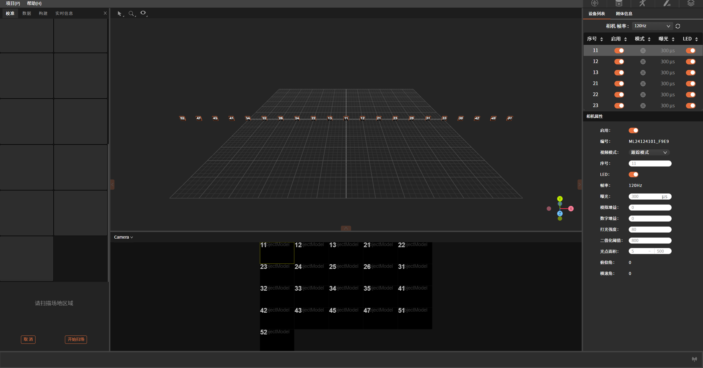

### 1.3.3 设备列表

在该窗口中可以看到链接到系统中的每个相机的属性，并对每个相机的指定参数进行调节。

鼠标点击设备列表空白区域，即可出现对应相机的相机属性弹窗。

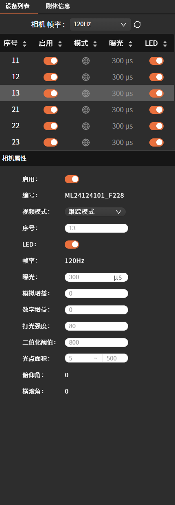

### 1.3.4 工具栏

**1）项目**

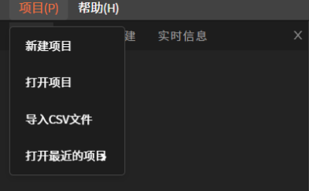

包含：新建项目、打开项目、导入CSV文件和打开最近的项目。

**新建项目**：为项目选择合适的存储路径，点击此按钮，在弹出的窗口中为项目命名，并选择所需存储的路径，选择好后点击"确定"，即可完成创建；

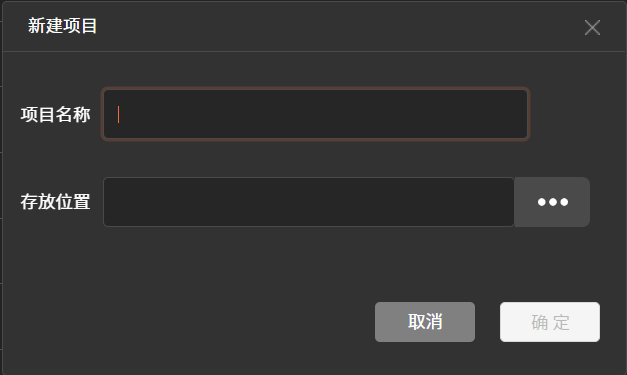

**打开项目**：点击此按钮，在弹出的窗口中选择所需项目，双击打开即可；击"确定"按钮即可。
**导入CSV文件**：点击此按钮，会弹出窗口去选择所需导入文件的路径，选择好目标文件后点。

**打开最近的项目**：此功能会将最近一次打开的项目自动读取并导入。

**2）帮助**

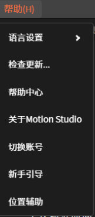

包含：语言设置、检查更新、帮助中心、关于Motion Studio、切换账号、新手引导及位置辅助。

**语言设置**：可切换简体中文/英文两种语言模式；

**检查更新**：用于查看软件当前版本信息；

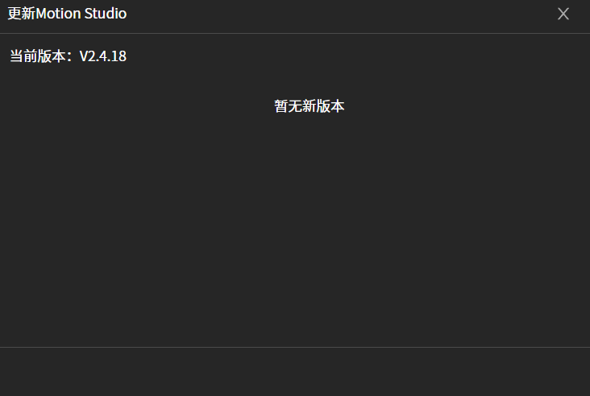

**帮助中心**：跳转至官网查看更多与产品相关信息；

**关于MotionStudio**：可查看当前版本号、用户协议及隐私政策。

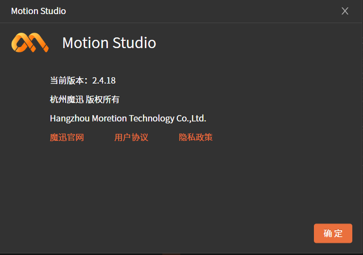

**切换账号**：点击可按指示进行账号切换；

**新手引导**：跳转至官网查看更多与产品相关信息；

**位置辅助**：用于进行光惯融合的辅助定位。

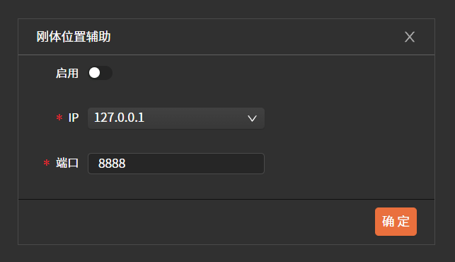

## 1.4 软件功能

具体使用流程包含以下内容：相机设置、校准、资产创建、数据采集和数据传输等内容。

### 1.4.1 相机设置

- **LED**：是指相机自身的表示状态的LED灯，可进行启用和关闭；

- **帧率**：是指相机每秒采集图像的帧数，帧率的最大值/最小值取决于相机型号。高帧率有助于每秒获取更多数据；低帧率可设置更高的曝光时间。

- **曝光**：设置相机每帧的曝光时间，最大值/最小值取决于相机型号和帧率，曝光时间越高图像越亮，但可能导致画面模糊；较短的曝光时间适用于高速运动。

- **模拟增益**：通过放大传感器模拟信号提升图像整体亮度，增益值越高，图像越亮，但会引入更多干扰点，建议在低光照条件下谨慎使用。

- **数字增益**：对图像数字信号进行放大以增强亮度。此处理回同步放大干扰，可能导致图像细节损失。通常作为模拟增益的补充，优先使用模拟增益和曝光调整亮度。

- **二值化阈值**：定义相机要识别的像素的最小亮度，增加阈值可以帮助过滤非标记物，但同时可能导致标记点识别丢失，过低则易引入干扰点。

- **光点面积**：识别到的标记点在图像中的像素面积。用于过滤干扰点或较大反光干扰。可设置最小/最大面积范围亦确保仅有效标记点被追踪。

### 1.4.2 相机图像模式

视频模式：右键单击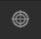或点击视频模式下拉框，可对每个相机的视图模式进行切换。

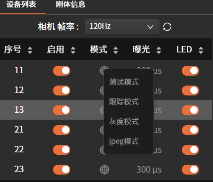

**测试模式：**

**跟踪模式**：此模式下，相机会自动识别图像中的标记点，计算其质心、位置、大小和圆度等特征，并拟合成圆形标记点二维坐标进行显示，方便同步监控并快速排查干扰点。此模式以最低的CPU占用和数据处理延迟，实现高精度的三维运动数据重建，适用于实时捕捉任务。

**灰度模式**：此模式下对应相机页面将展示十字图标，可用于查看相机是否对焦，便于对相机**进行调节；**

**jpeg模式**：此模式可用于调节相机角度。

### 1.4.3 校准

相机校准是光捕系统进行精确3D重建前的必要步骤，该过程通过计算每台相机的具体位置和朝向，并确定镜头的畸变，从而建立从二维图像坐标到三维空间坐标的精确映射关系。

相机的校准过程包括"屏蔽可见对象""扫描场地区域"和"设置地平面"三个操作步骤。

在进行相机校准前应当进行以下步骤的优化，首先，确保相机放置在合适的位置以完全覆盖捕获空间。其次，相机要在校准过程中保持静止。最后，校准过程中相机的参数设置应保持不变。如果相机设置有重大修改影响后续采集，需要重新校准，应重新调整系统。

注：随着外界环境变化，相机即使未发生明显变化，校准精度也会下降，建议每天重新校准一次。

**1）屏蔽可见对象**

在进行此步骤前，首先需要将反光物体移至场外进行清场并点击左侧"新建校准"；

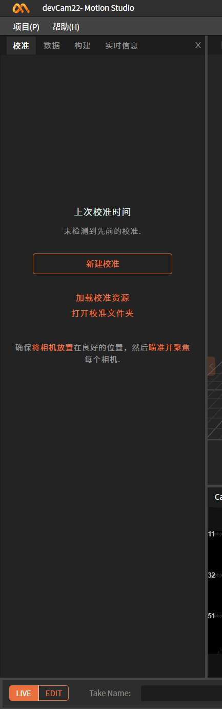

如出现左下图情况，说明场内存在干扰点，请将反光物体进行移除或遮蔽，当警示标志消失后再点击"继续"进入下一步。

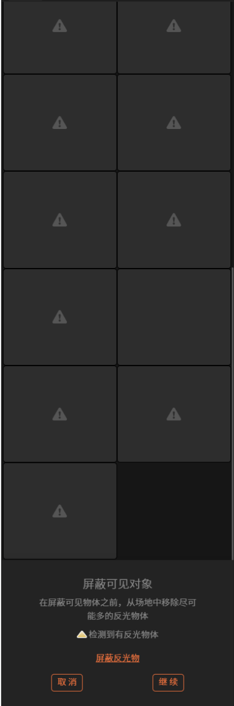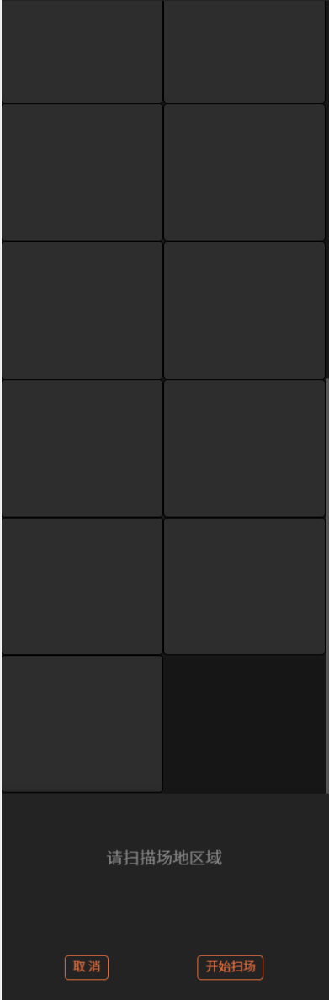

**2）扫描场地区域**

点击"开始扫场"，挥动"T型校准杆"在场内不同方向画"∞"，确保挥动范围覆盖整个捕捉空间，此时相机视图和校准界面的各个相机的状态会发生变化。

当校准界面每个相机的Sample点采集框显示为下图左侧的深绿色，表示扫场未成功（可双击该色块在相机视图查看对应相机序号），在此相机覆盖范围内继续挥动校准杆直至颜色变为下图右侧的浅绿；当校准界面所有色块颜色均变为浅绿，则代表扫场成功。

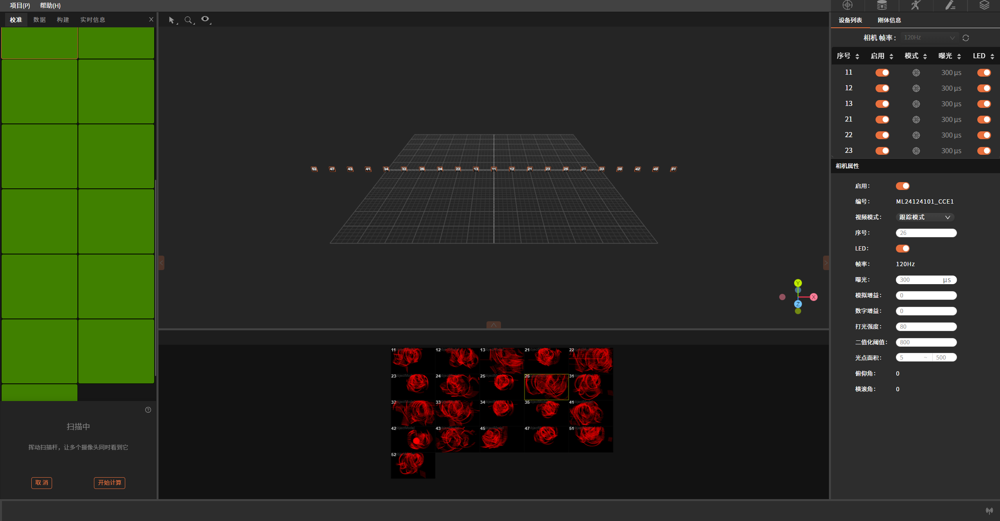

点击"开始计算"，进入下一步。

**3）校准计算**

校准计算所需时间取决于相机数量、Sample数量、计算机性能，在计算过程中可以通过下图所示图像中查看计算状态。

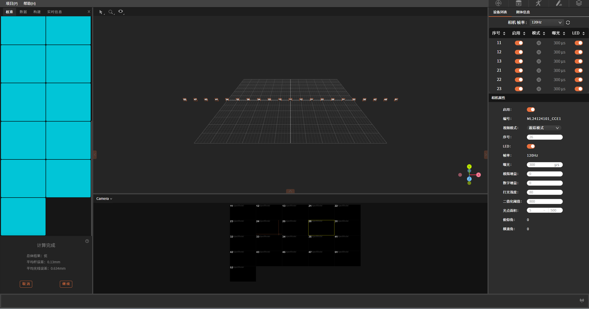

计算完成之后校准结果会弹出，显示详细的校准结果。校准结果直接关系到误差，校准结果分类
（顺序为从最差到最好）︰ 差、良、优。

如果结果是可以接受的，请点击"继续"使用结果。

**4）设置地平面**

此步是进行地平面标定，确定相机与地平面的位置关系。此步骤需要使用L型标定杆，将标定杆放置在使用空间中，设置软件中空间的坐标原点以及轴向，在3D视图中选择地面标定杆的三个标记点，然后点击"设置地平面"。

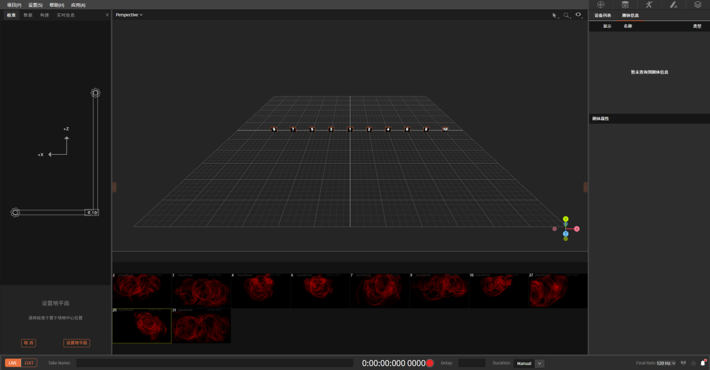

### 1.4.4 创建刚体

**1）创建刚体**

地平面设置完成后，将所要创建模型的刚体贴好标记点，放置在标定好的场地内，在3D视图中框选住代表刚体模型的标记点。然后点击鼠标框选标记点。通过这种方式可以对选中标记点完成刚体创建。创建刚体之后，标记点会被标签化（颜色发生变化）并互相连线，可在左侧窗口为刚体命名，刚体信息会在右侧同步显示。

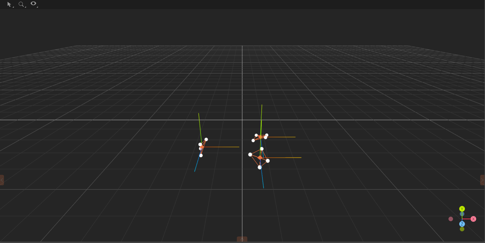

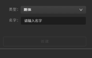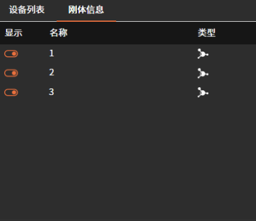

**2）刚体跟踪**

对于创建的刚体，由其轴点代表该刚体的位置和姿态。当创建刚体时，其枢轴点将默认放置在其几何中心，方向轴将与全局坐标轴对齐。

### 1.4.5 创建骨骼模型

选择在"类型"一栏的下拉菜单中的"人体骨骼"模板，将标记点按照图示粘贴在对应的位置。

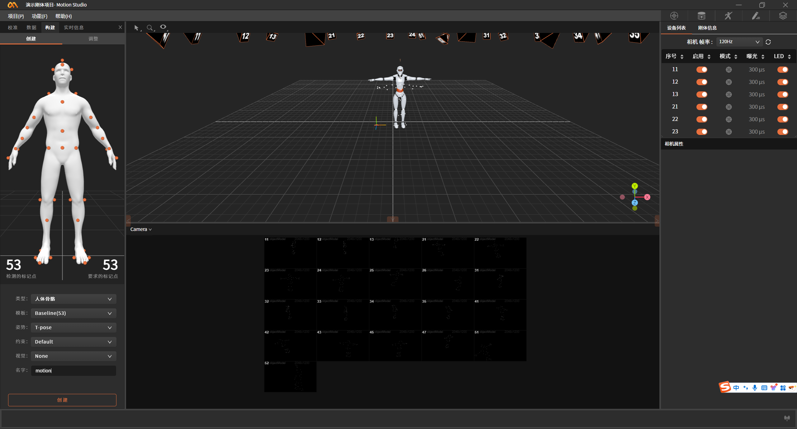

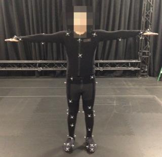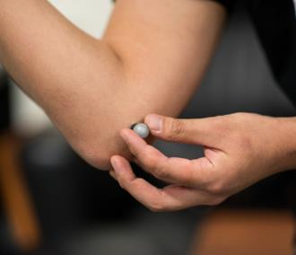

**注**：人体骨骼模版中共涉及53个标记点，每个标记点用于在骨骼建模时表示关节点位置，所有标记点必须放置在合适位置，任何标记点错误放置，都可能会造成人体资产创建失败，所以放置在预定义的位置非常重要，可以减少后处理时间。

**操作步骤**

模特身上贴完标记点之后，让模特站在相机的最佳捕获区域，做对应的初始姿势；

- 仔细检查标记点位置；

- 在3D视窗中选择对应的标记点，并点击创建；

- 创建完成后，演员按照指示做初始动作（T-pose/A-pose)进行姿势校正；

- 完成上述步骤后，即可进入数据采集。

### 1.4.6 数据串流

软件中的数据串流功能，用于将软件捕捉到的刚体和人体数据串流到串流到其他软件或应用中，数据内容包括刚体的位置和姿态、人体的位置和姿态。

点击软件右下角，弹出串流窗口，点击启用开启数据串流。数据格式为json格式，目前版本需要合作伙伴解析数据，后续官方会陆续发布Motion Builder, Maya, Blender, Unreal Engine, Unity等应用对应插件。
