# **Z1 Pro产品用户手册**

# **一、硬件配置**

## **1.设备概览**

### **1.1主要硬件列表**

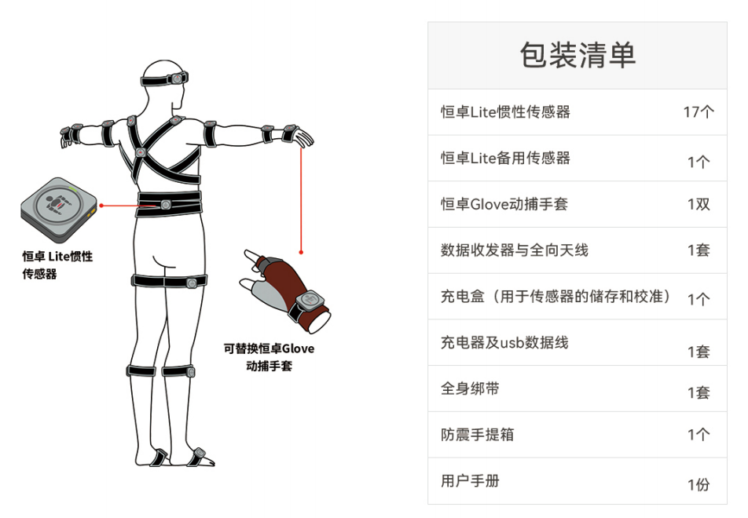

### **1.2 电脑配置**

### **1.3 系统拓扑图**

将数据收发器通过USB与电脑进行连接，同时我们额外提供了Type-C转接线,方便用户使用

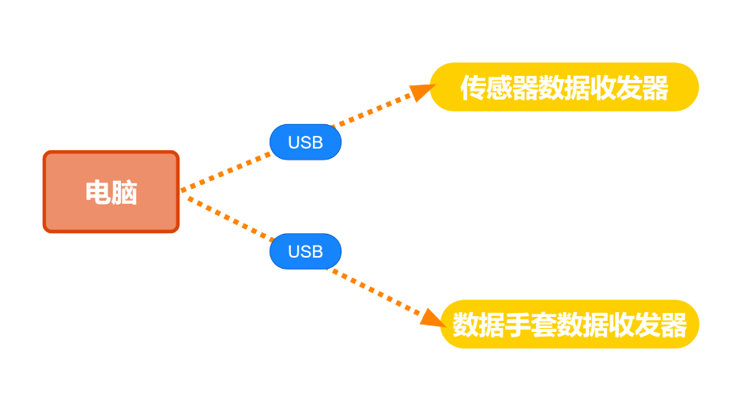

## **2.设备详情**

### **2.1恒卓无线传感器**

高精度无线传感器，内部集成了陀螺仪，加速度计和磁力计。

**指示灯说明**

  ------------------- ------------------------------------------

  LED灯状态           传感器代表含义

  绿色慢闪            待机，未连接

  绿色快闪            工作状态，已连接

  红色持续闪烁        低电量

  绿色闪烁            充电中

  绿色常亮            充电完成

  蓝色闪烁            频段切换

  红色闪烁            传感器查找

  ------------------- ------------------------------------------

开启传感器

使用Type-C数据线插拔充电盒后，充电盒中的传感器指示灯闪烁时代表激活成功。

2.2 数据收发器

用来接收和发送传感器数据信号

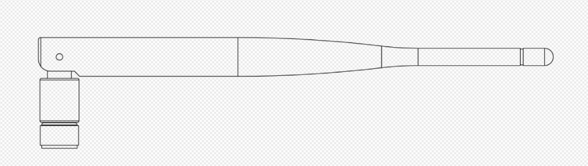

2.3 恒卓Glove动捕手套

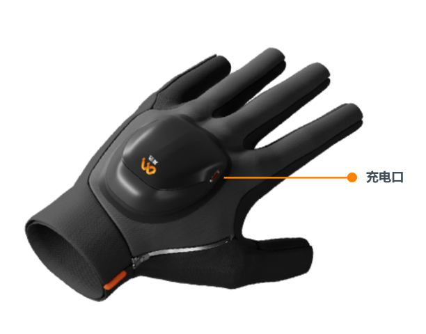

2.4 充电盒

用于给恒卓无线传感器充电和存放传感器，同时也用于给传感器校准使用

2.5 抗震手提箱

可更好地保护恒卓传感器

## **3.动捕环境的准备**

恒卓传感器中含有磁力计，磁力计传感器会受到强磁场环境的影响。用户必须在磁场干扰最小的环境中使用传感器。

## **4.穿戴说明**

### **4.1 动捕服说明**

\*传感器在绑带上的放置方式：魔术贴粘连

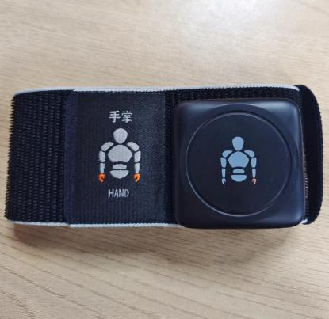

### **绑带款动捕服：**

每条绑带根据肢体的粗细设计了不同的长度，请根据绑带上的标记提示，将绑带绑到对应肢体位置上。

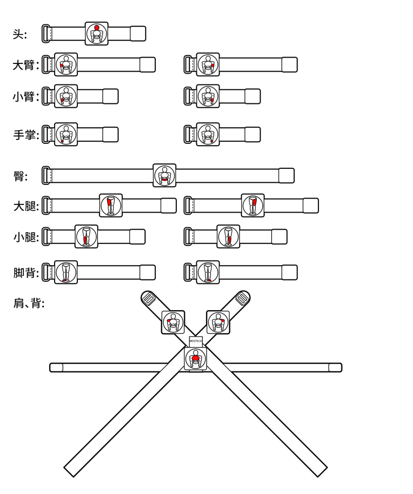

### **4.2 传感器佩戴位置**

#### **上半身：**

1、头部传感器安装**头部**。

2、肩部传感器安装在**肩部正上方**，尽量往**外侧**的位置。

3、胯部传感器安装在**腰部下方**，尽量往下**接近尾椎**部分。

4、上臂传感器安装在**肘部向上2-3cm处**。

5、前臂传感器安装在**手腕**处。

6、手掌传感器安装在**手背**位置。

#### **下半身：**

1、大腿传感器安装在**大腿**，膝盖上方2-3cm处。

2、小腿传感器安装在**膝盖下方**2-3cm处。

3、脚部传感器安装在**脚背**处，绑带尽量环绕于脚窝处，这样在走路时不会造成绑定意外脱落。

#### **注意事项：**

- 在安装绑带时应安装牢固贴紧身体，确保在大幅度运动时，传感器节点不会剧烈晃动。

- 动捕演员在工作时，请务必检查身上没有手机、手表等电子设备及钥匙硬币等强磁体，这些电子设备和强磁体产生的磁干扰会严重影响传感器的工作。

- 恒卓传感器中含有磁力计，磁力计传感器会受到强磁场环境的影响。用户必须在磁场干扰最小的环境中使用传感器。

# 二、操作说明

首次使用准备：传感器（电量充足）、接收器、Motion Studio软件、磁校准软件

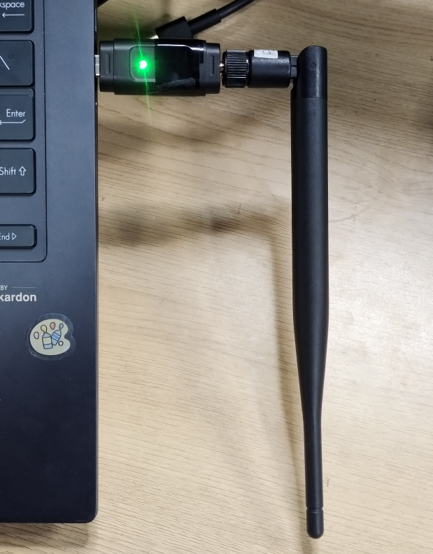

**2、传感器开机激活**：

使用Type-C数据线插拔充电盒后，充电盒中的传感器紫色灯闪烁时代表激活成功。

**3、传感器校准：**

打开磁校准软件，点击连接按钮进行设备连接，连接完成后观看磁校准演示视频进行后续磁校准操作

### 4、设备连接：

校准完成后关闭磁校准软件，打开Motion
studio软件，首次使用需新建项目，新建成功后，点击软件右上方-设备列表连接按钮（小贴士：如Motion
Studio已打开，接收器连接至电脑，传感器LED灯仍然是绿色慢闪状态，请进行\"频段切换\"）

连接成功后，传感器分布中各个节点指示灯将会亮起

### 5、**穿戴设备（共17个传感器）**

• 传感器上含有魔术贴，粘贴至绑带上。

• 所有传感器穿戴时，按照传感器提示，粘贴至指定位置。

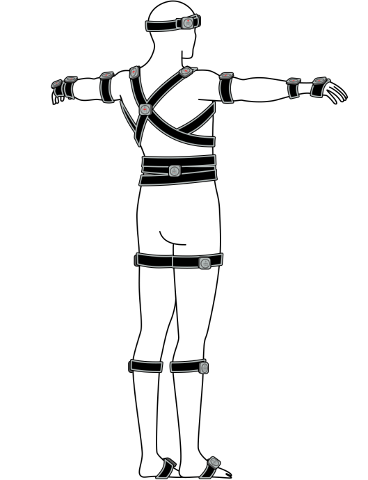

### **6、姿势校准：**

穿戴完成后，点击姿势校准，按照图示操作进行姿势校准；校准完成后，即可开始使用

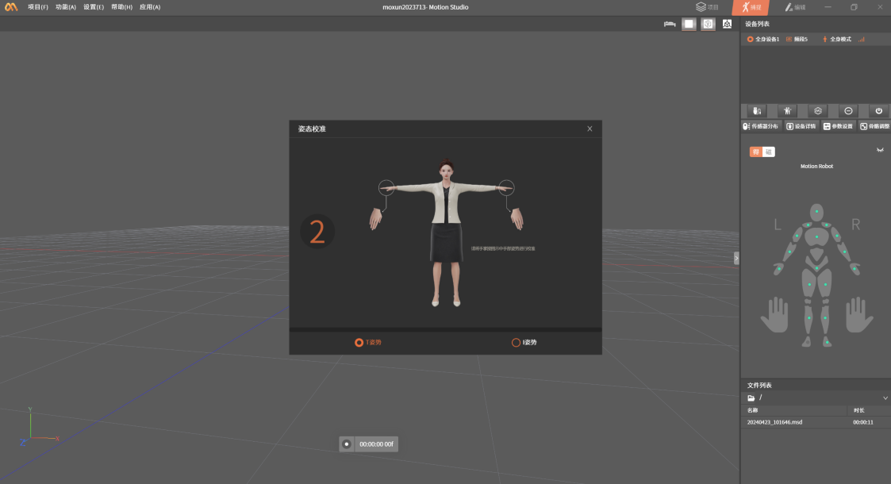

# 三、参数介绍

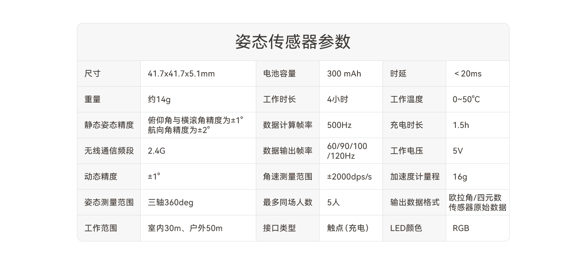

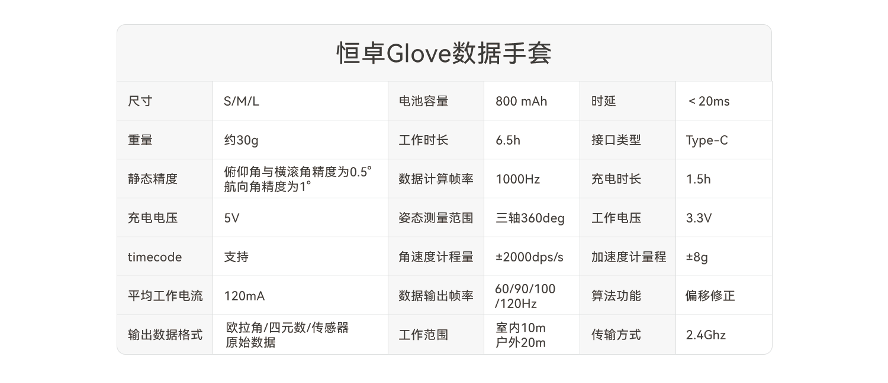

# 四、常见问题

**Q：传感器怎么开关机？**

A：长按开关按钮1秒。或插拔充电盒电源线可全部打开充电盒中的传感器。

**Q：传感器是否可以一键开机或一键关机？**

A：一键开机：17个传感器在充电盒内并且关机状态时，您可以通过插拔电源线进行开机；
一键关机：在Motion Studio中选择要关机的套装设备，在菜单上的选择"关机"选项，已连接的传感器即可一键关机。

**Q：为什么有的传感器可以连接上软件，有的无法连接上？**

A：先确认未连接的采集器是否有电，有电时，查看传感器的频段是否和接收器在同一频段，若在不同一频段，需切换采集器频段。

**Q：采集器频段怎么切换？**

A：1.双击传感器按钮，切换频段。2.传感器或接收器，关机后或断电后再连接也可自动切换到频段一。

**Q：传感器充电不上？**

A：传感器的充电铜点触点在长时间的使用后，可能会有所氧化，可使用酒精清理后再进行充电。

**Q： 传感器上的LED灯有不同的颜色，这些颜色分别代表什么？**

A：传感器上的LED灯有三种常用的颜色（蓝、绿、红）。蓝色代表传感器在切换频段；如使用过程中，LED灯转为红色，代表传感器当前电量不足；充电的过程中。LED灯转为绿色闪烁，代表传感器在充电，传感器充电完成，LED灯绿色常亮；工作中，LED灯转为绿色快速闪烁。

**Q： 充电时，充电盒中的传感器的LED灯没有亮，是怎么回事？**

A：充电时，传感器的LED灯没有亮起：1、首先您先检查充电盒是否已连接电源，充电盒是否已正常通电；2、传感器的金属触点是否未和充电盒中的充电触点充分接触，在使用的过程中，充电盒/传感器的金属触点可能因为氧化造成接触不良，您可以尝试使用橡皮擦清洁金属触点；3、如果已排除接触不良造成的影响和充电盒不存在损害问题的情况下，传感器仍然不能正常充电，请您联系客服人员，我们会尽快协助您解决问题。

**Q： 电源适配器丢失了，怎么办？**

A：若您的电源适配器不慎遗失，请勿自行更换适配器，以免对设备造成损害。请您及时联系客服人员，我们会尽快协助您解决问题。

**Q：穿戴位置是否固定，如何安装？**

A：穿戴好各部位绑带之后，需要您注意下每个传感器节点背面标明的身体位置，将传感器安装在相应的位置上；安装时请查看说明书或连接引导。

**Q：哪些物品会造成磁干扰？**

A：手机、手表等电子设备，钥匙、硬币等金属，大功率变电站、无线基站、空调机柜、或大功率电机等。

**Q：传感器坏了，怎么办？**

A：在保修期内，因产品质量而导致损害，用户可邮寄产品至我司享受免费维修；非保修期外，请查看《售后服务手册》了解具体服务。

**Q：为什么会需要经常校准？**

A：由于传感器的精度会随着时间、环境的变化而变化，时间久了，传感器会出现"漂移"的现象，这时就需要对传感器进行校准，将传感器在使用过程中累积下来的误差进行"清零"的操作。

**Q：在软件安装的地址上删除软件的文件夹后，打开安装包，重新安装软件，为什么还是会提示"卸载软件"？**

A：手动删除软件文件夹，可能未能卸载干净，请在"控制面板-卸载程序"检查，并卸载Motion Studio。

# **五、注意事项**

1\. 勿在热源(如火或加热器)附近使用或贮存传感器;

2. 请使用原厂充电线、充电盒充电;

3\. 勿将传感器投入水中或将其弄湿;

4\. 勿给传感器加热;

4\. 禁止撞击、投掷或者使传感器受到机械震动;

5\. 禁止锤击或脚踏传感器;

6\. 禁止以任何方式拆解传感器;

7\. 禁止在火源或极热条件下给传感器充电;

8. 请使用原装适配器给充电盒供电，劣质适配器可能会导致 传感器电池、充电盒损坏。

