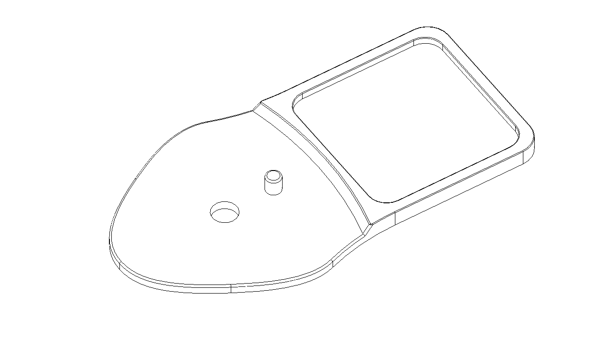

# 3D打印件下载

## 1. Z1系列

光惯融合底座，与HTC VIVE Tracker配合使用。臀部用于修正总体行走位移，腕部则用于修正手臂姿态。

臀部节点：

[z1_tracker_hips.3mf](./assets/z1_tracker_hips.3mf)

[z1_tracker_hips.STEP](./assets/z1_tracker_hips.STEP)

腕部节点：

[z1_tracker_hand](./assets/z1_tracker_hand.STEP)

## 2.MotionLens

光学动捕相机ML020W与惯性动捕Z1/Z1 Pro结合使用。

臀部刚体：

[ml_rigid_hips1.STEP](./assets/ml_rigid_hips1.STEP)

腕部刚体：

[ml_rigid_hand1.STEP](./assets/ml_rigid_hand1.STEP)

TODO：制作步骤。
