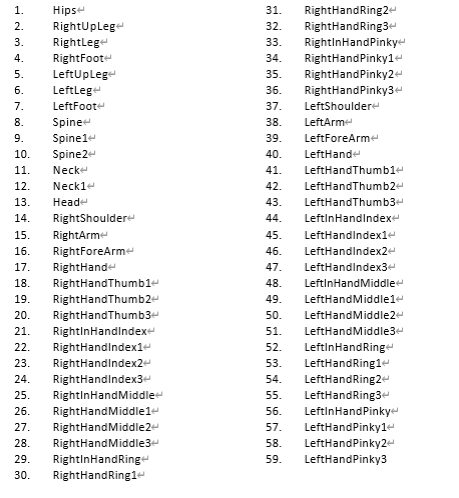
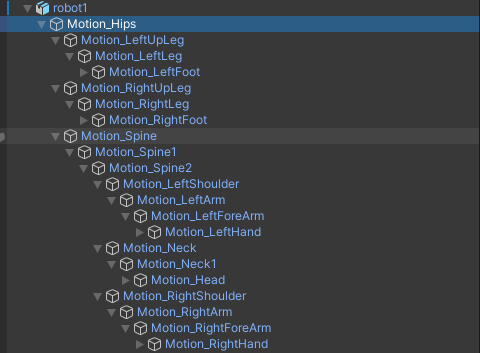
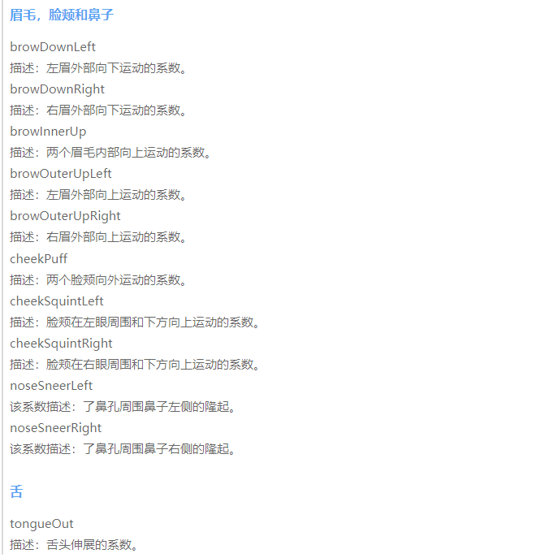
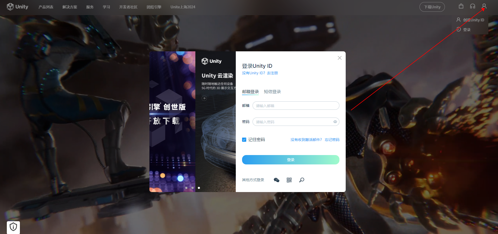
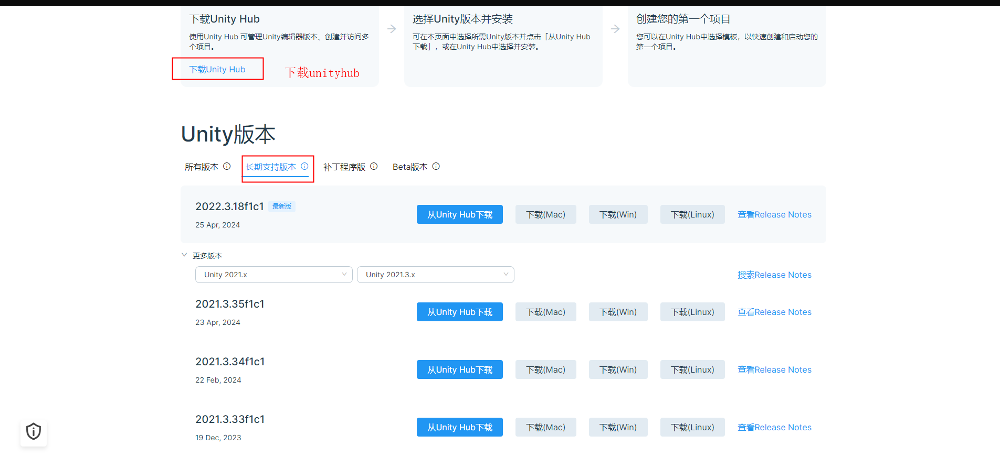
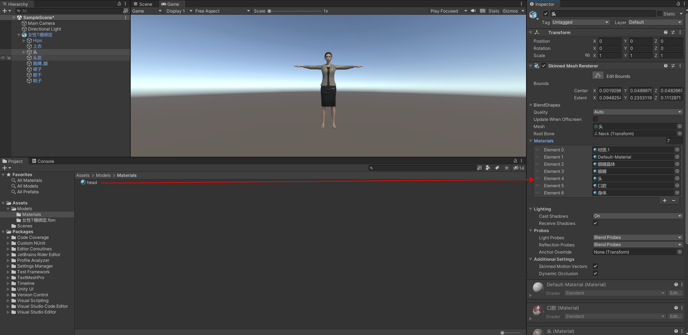
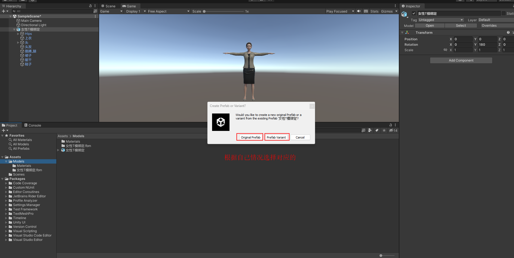
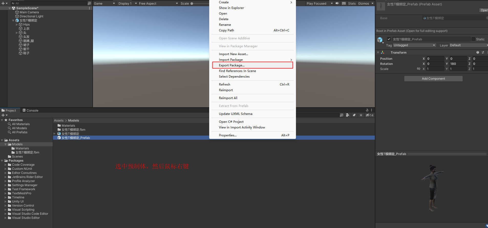
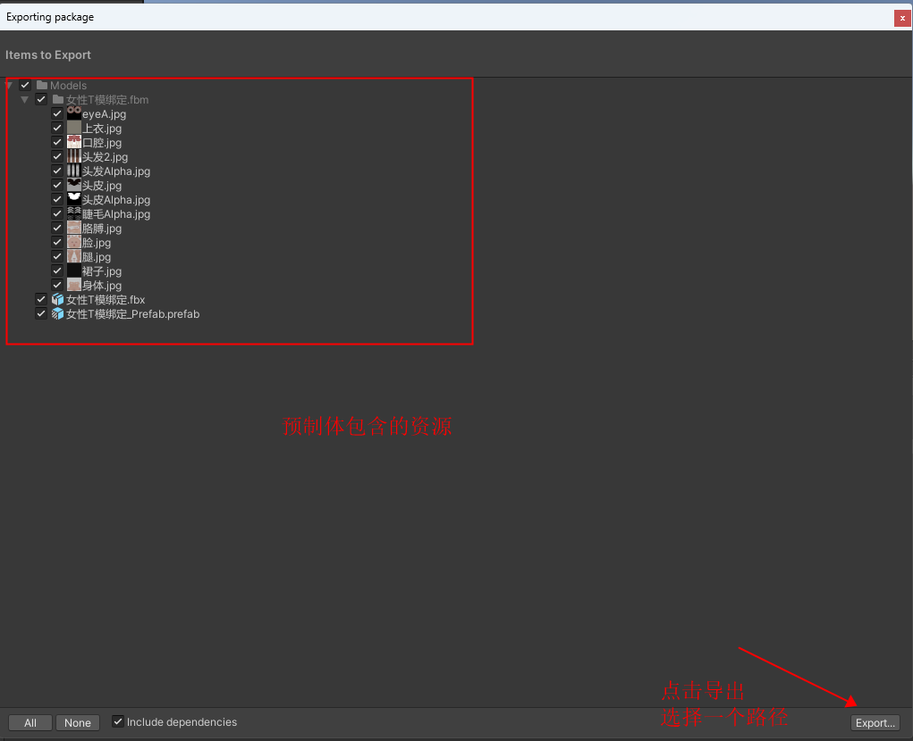
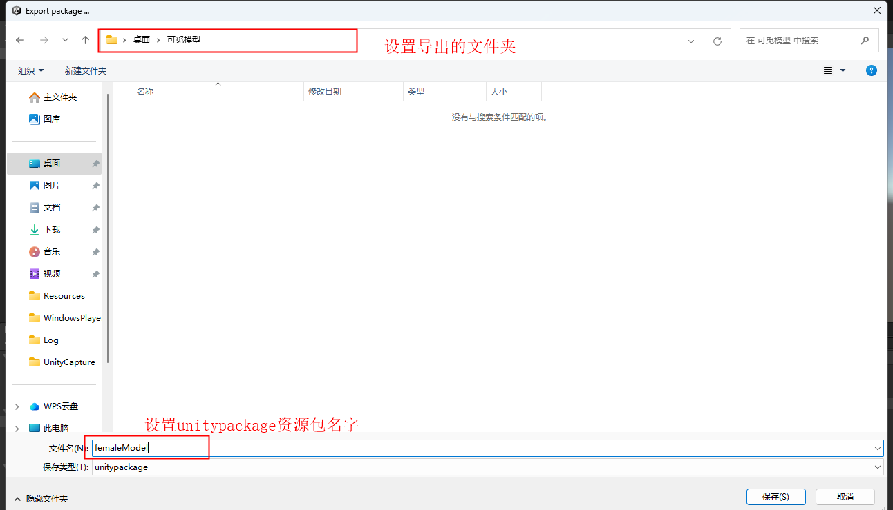

# **模型需求**

模型全身需求点

- 模型人形骨骼

- 模型根节点旋转值必须为 0 值

- 模型初始姿态为 T pose

- T pose 的状态下所有骨骼的旋转值为 0

- 所有骨骼的自身坐标系一致，X轴向右，Y向上，Z向前，是左手坐标系(unity3D)

- 至少有19个骨骼分别是：头、左眼、右眼、左肩、左大臂、左小臂、左手，右肩、右大臂、右小臂、右手、脊柱、臀、左大腿、左小腿、左脚、右大腿、右小腿、右脚。骨骼命名规则参考图一

- 骨骼层级结构参考图二

- 头、左眼、右眼、牙齿需要单独的网格

图一:

图二:

模型面部需求点

- 52个苹果ARkit标准的表情体(Blendshape)，Blendshape绑定必须要严格按照命名规范。见图四五六七

- 52BlendShape制作规范。Apple官方规范

- 左右眼需要单独的骨骼

<https://developer.apple.com/documentation/arkit/arfaceanchor/blendshapelocation>

例如：eyeBlinkLeft

图四

图五

图六

图七

提供模型的.unitypackage资源包

1. **安装unity并创建工程**

**1.1注册账号**

注册unity账号 <https://unity.cn/>

**1.2下载unityhub和unity**

先安装unityhub再安装unity

unityhub版本：任何版本都可以(只是管理unity各个版本的工具)

unity版本：2021.3.26f1c1长期支持版（最好和这个版本一致）

下载链接:<https://unity.cn/releases/lts/2021>

在unityhub中申请unity许可

**1.3创建unity工程**

打开unityhub点击新项目按钮，并进行简单配置

**2.导入和设置模型资源**

**2.1导入模型资源**

在unity
Assets面板新建Models文件夹(可以随意命名，为了方便查找、管理资源)，然后将自己的模型资源拖拽至

此文件夹。同时可初步对模型进行一些设置。

将Assets面板中的模型资源拖拽至Hierarchy面板，就可在场景中显示模型。

**2.2配置模型资源**

给模型各个网格设置材质，或者在导入模型时就进行统一设置(这种较方便，可看上述2.1中操作)。

创建材质，给材质设置贴图、设置透明度、金属度、平滑度等。主要看你在建模引擎中是怎么设置的。

然后将材质赋值给对应的网格，场景中模型会实时显示你的设置

**3.导出.unitypackage模型资源包**

模型所有资源都设置好之后，制作该模型的预制体(prefab)。

在Hierarchy选中该模型，将模型拖拽至Assets面板，预制体制作成功。

导出制作好的预制体

**参考模型**

2个模型见附件

52blendshape模型

[SampleHead.fbx](./assets/SampleHead.fbx)

全身骨骼模型

[robot.fbx](./assets/robot.fbx)

