**Cinema4D插件使用指南**

1.  **Cinema4D软件下载**

可去Cinema4D官网下载，下载连接：<https://www.maxon.net/en/downloads/cinema-4d-2024-downloads>

2.  **安装Cinema4D插件（需要先安装软件）**

**1.下载地址：**

[请至钉钉文档查看附件《MSC4DSetup24-25_v0.8.28.msi》](https://alidocs.dingtalk.com/i/nodes/1zknDm0WRzMk4ElBhZj2yNgrWBQEx5rG?iframeQuery=anchorId%3DX02mev1vo2oqefkl28951)

**2.按照步骤说明：**

1.  双击打开安装包

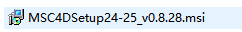

2.  点击下一步

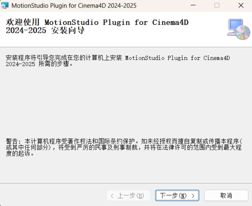

3.  选择要安装插件的Cinema4D版本，目前支持Cinema4D
    2024、2025。然后点击下一步。只需勾选已安装的Cinema4D版本即可，如安装了2024版Cinema4D，则只需勾选C4D
    2024。

4.  选择插件安装位置，安装在默认目录下。默认会选择用户的AppData\\Roaming目录下的Maxon文件夹（即C:\\Users\\\<用户名\>\\AppData\\Roaming\\Maxon）。然后点击下一步。

5.  点击下一步开始安装，在弹出的确认框中选择继续。

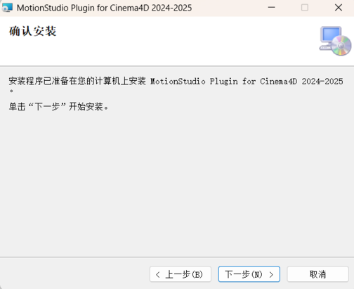

6.  如下图所示，插件安装完成。

7.  打开Cinema4D，按下Ctrl+E打开设置窗口，在右侧点击插件，检查搜索路径中是否已经包含插件所安装的目录，即AppData\\Roaming\\Maxon\\MotionStudioPlugin。

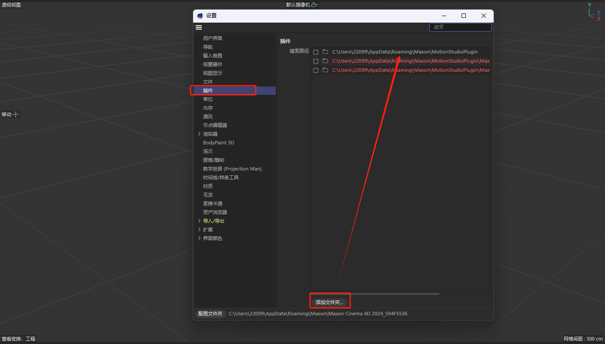

3.  **Clinama4D插件使用说明**

**1、Clinama4D软件中打开MS插件**

**1）打开Clinama4D软件（2024---2025版本均可，此文档演示的版本为2024）**

**2）打开MS插件**

在C4D菜单栏上选择扩展\>Motion Studio Mocap，即可打开MS插件

点击后，会弹出插件的连接设置界面

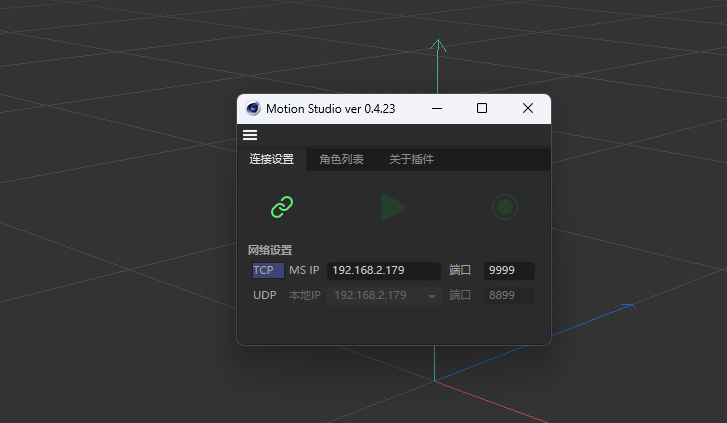

**3）连接界面说明及功能介绍**

如下图，插件界面分为4页，分别为连接设置，角色列表和关于插件。

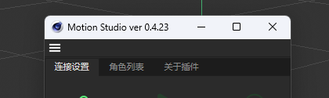

1.连接设置：此页为主要控制页面。

> 下方从左到右依次是：连接，同步以及录制按钮。

连接：用来连接到MS服务器,需要先在MS中开启数据广播。

同步：在角色列表中点击显示骨骼/模型后，可以开启同步动作，关闭后不再驱动角色的骨骼的移动和旋转。

录制：录制接收到的动作。

> 网络设置区：可以切换网络连接TCP/UDP方式，并且设置连接地址和端口。

2.角色列表区：

角色名称/ID：点击角色名称/角色ID按钮，可切换角色列表中角色显示的内容（角色名称或角色ID）

角色显示/隐藏：点击角色右侧的显示/隐藏按钮，可以切换角色的显示状态（标题栏的显示隐藏按钮可以设置全部角色的显示隐藏状态，每个角色也可以单独设置）

角色同步/TPose姿态：点击最右侧角色姿态按钮，可以切换全部或某个角色的姿态为TPose，或者同步当前MS的姿态

保留角色：选择是否在断开连接后保留场景中的角色

3.关于插件，此处可以访问官网，查看插件的版本，打开本插件指南，以及检查插件更新。

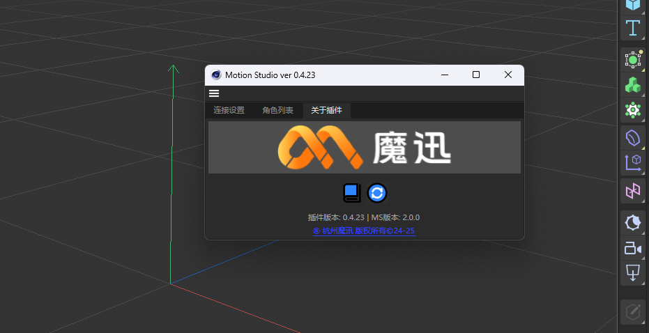

**2、连接Motion Studio并驱动Clinama4D中的角色模型**

**1）连接Motion studio(TCP和UDP二选一)**

根据MotionStudio中对应的数据广播设置的ip地址及端口号，选择TCP或者UDP连接。

**1.1 TCP连接**

使用 TCP 连接时，需要点击最左侧的 TCP 按钮(高亮为选中)。然后在 Clinama4D
地址中填入 MotionStudio 中的设置的 IP及对应端口号(默认为 9999)

**1.2 UDP连接**

在 MotionStudio 中的数据广播设置为 UDP 连接，设置端口号。在目标 IP
处输入插件中的安装电脑对应的IP 地址，并设置端口号。

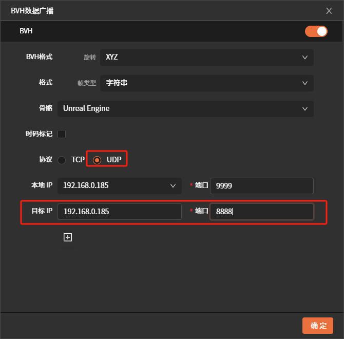

Clinama4D中使用 UDP 连接时，除以上操作外，还需要填写和Motion
Studio中目标ip的端口号

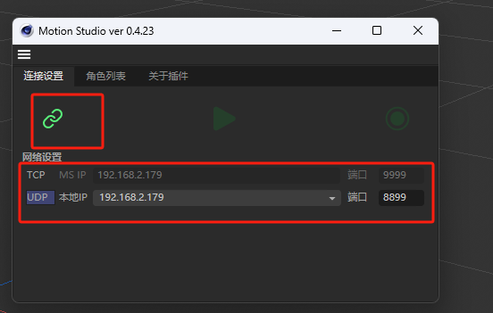

**2）**Clinama4D**插件中开启连接**

在第一步确认ip设置正确后，点击插件左上角**连接**按钮，即可连接MotionStudio数据广播。

**3 ）切换角色显示状态**

点击角色显示图标，可以切换角色的显示状态

**4）切换数据源或切换连接协议**

当需要在MS中切换数据源时（实时→录制，不同录制数据，TCP→UDP等），需要首先关闭当前插件的同步状态，再点击连接设置区中的断开按钮。当Motion
Studio中切换好新数据源时，再次点击连接按钮，可驱动角色模型。

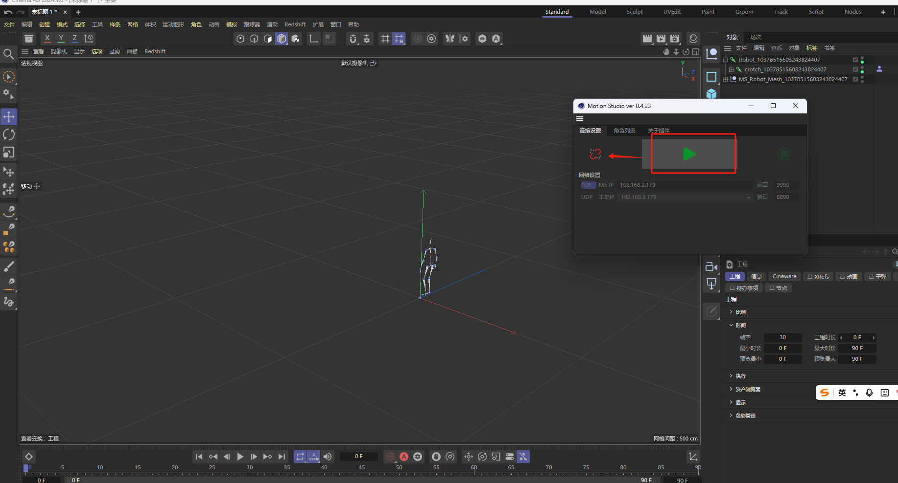

注意：如果勾选插件设置中的断开连接时保留角色，则角色会留在场景中。

**3、录制动作与保存**

**1）录制动画**

在完成连接MotionStudio的步骤并同步驱动角色后，可以点击连接设置区域的录制按钮

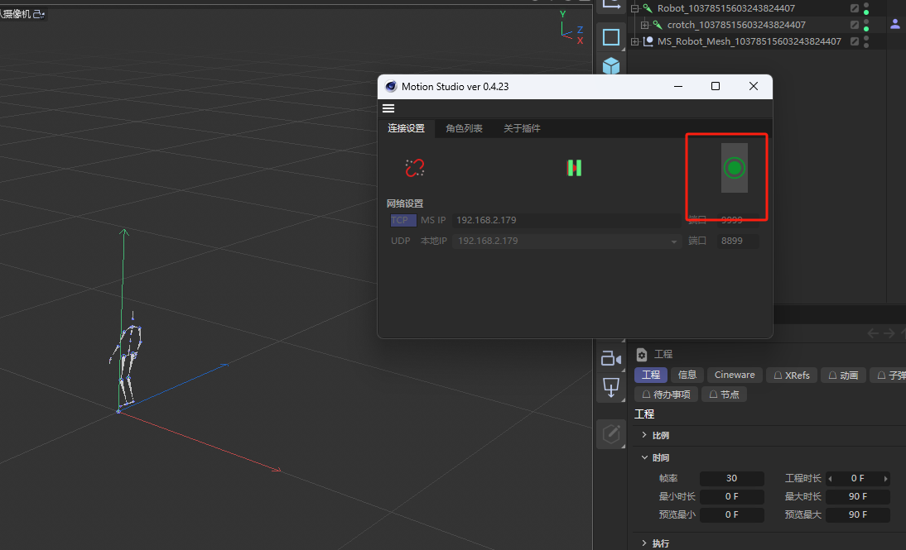

再次点击可以停止录像，此时会暂停动作同步。点击C4D下方动画轨道中的播放
按钮，可以回看刚才录制的动作。

注：录制完一个后需要将当前的文件导出，如未导出，录制第二个，会将第一个录制内容覆盖掉。

**2）导出录制的动画**

导出录制的动画时，可以选择保存场景和动画为C4D文件，也可以导出为其他文件格式（如FBX等）。

若选择保存为C4D，可以通过文件\>保存项目/另存项目为\...
或者Ctrl+S/Ctrl+Shift+S，如果需要导出为FBX文件，可以通过文件\>导出\>FBX,然后在弹出的对话框选择要保存的位置

**3）回放录制的动作**

当导出完成后，可以在对象窗口下的
文件\>合并对象\...选择刚才导出的FBX或者C4D文件。

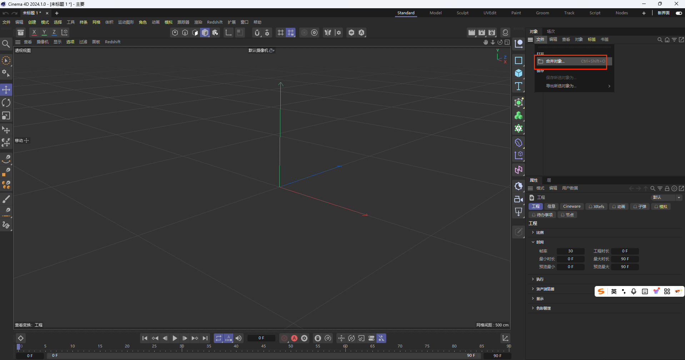

**4、实时重定向驱动或录制导出重定向**

**1）添加模型实时重定向驱动**

**①. C4D插件与Motion Studio连接**

MotionStudio-数据广播中设置对应的ip地址及端口号

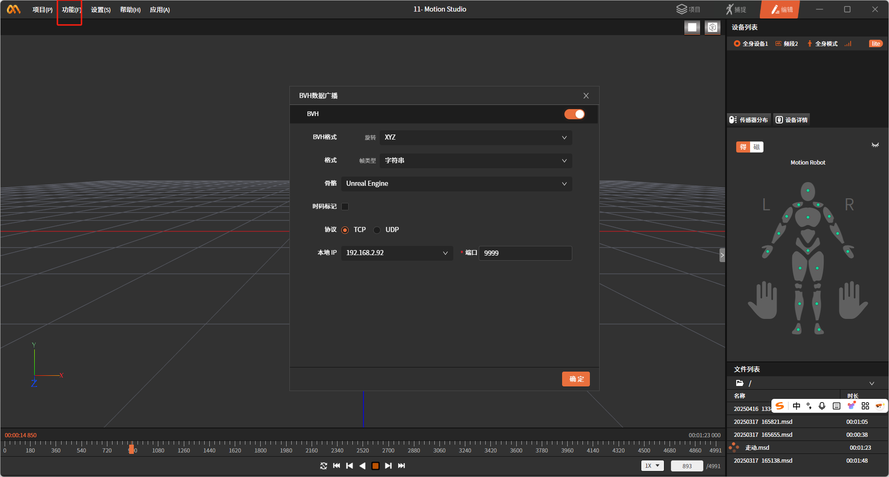

在C4D中设置与MS对应的ip和端口后，点击连接按钮和显示模型按钮可开启动作同步（做重定向操作时，需先暂停数据同步）

**②. 导入重定向模型（以FBX文件为例）**

在对象窗口下的 文件\>合并对象\...,选择对应的FBX文件导入

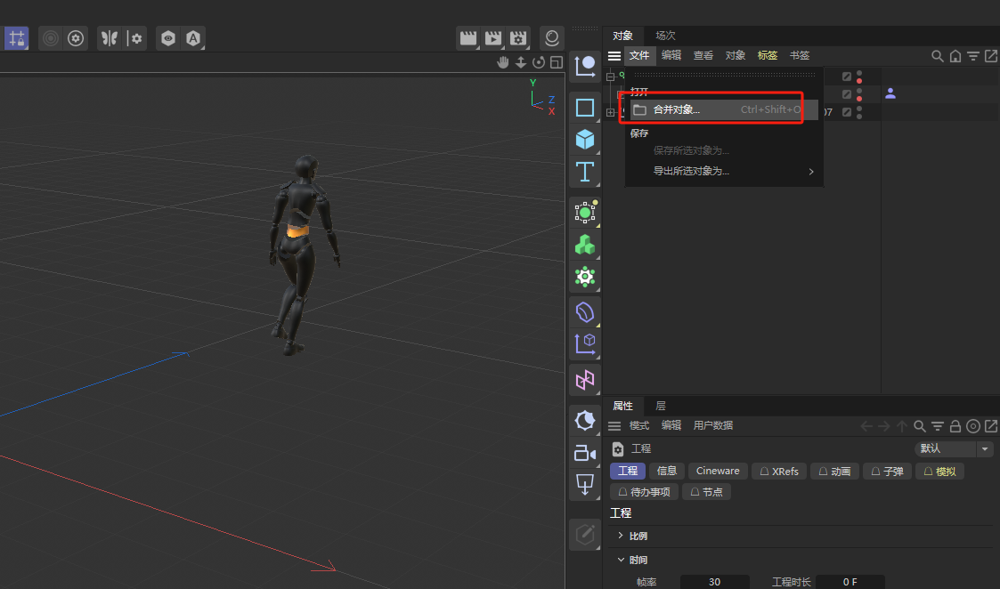

**③. 添加角色定义**

在对象窗口中，选中导入的角色的Hips骨骼，右键选择装配标签\>角色定义，在hips骨骼上创建角色定义。

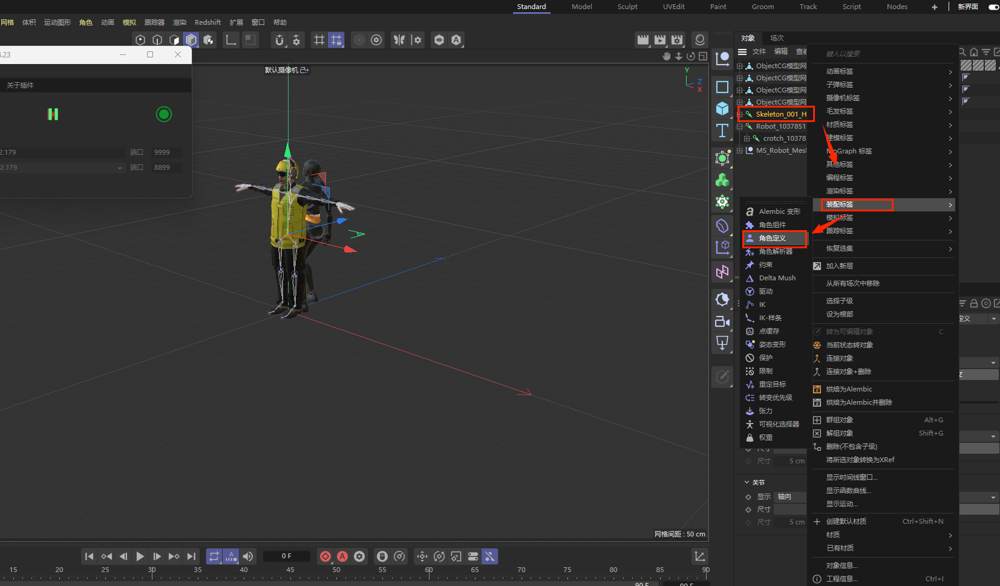

如下，Hips骨骼右侧多了角色定义图标。

**④.骨骼映射**

点击角色定义图标，在下方属性窗口可以看到角色定义的基本属性，然后
点击打开管理器。

在角色定义窗口中，点击提取骨架，可以自动将角色的骨骼映射到通用骨架上。

注意：由于模型的骨架命名不一定符合标准，需要逐个检查骨架中是否有遗漏或映射错误的骨骼关节。（如下，在左腿的大腿关节中没有正确获取到角色中的骨骼，因为角色骨骼中的左大腿命名为LeftThigh而不是leftupleg。可以手动角色骨骼中的LeftThigh拖动到关节列表中，其他骨骼关节同理。）

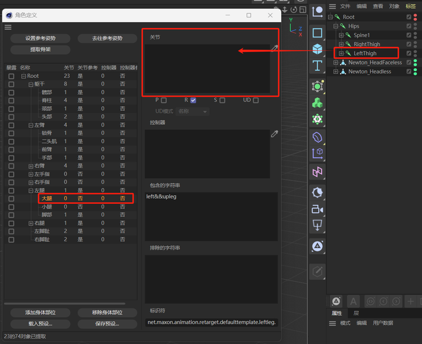

**⑤.设置重定向源**

完成所有骨骼关节的映射后，点击角色定义属性中的创建解析器按钮

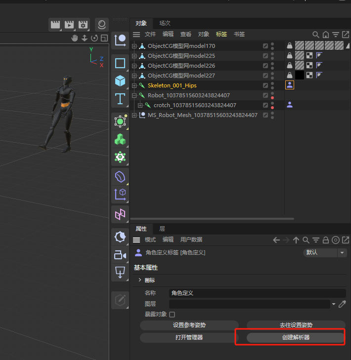

在Hips骨骼的右侧添加解析器图标

来源角色需要为同步驱动的源角色，在对象窗口下找到需要同步的MS角色，然后将该角色定义拖动到刚才的目标角色的解析器的来源角色中。（重定向时，不需要来源角色为TPose）

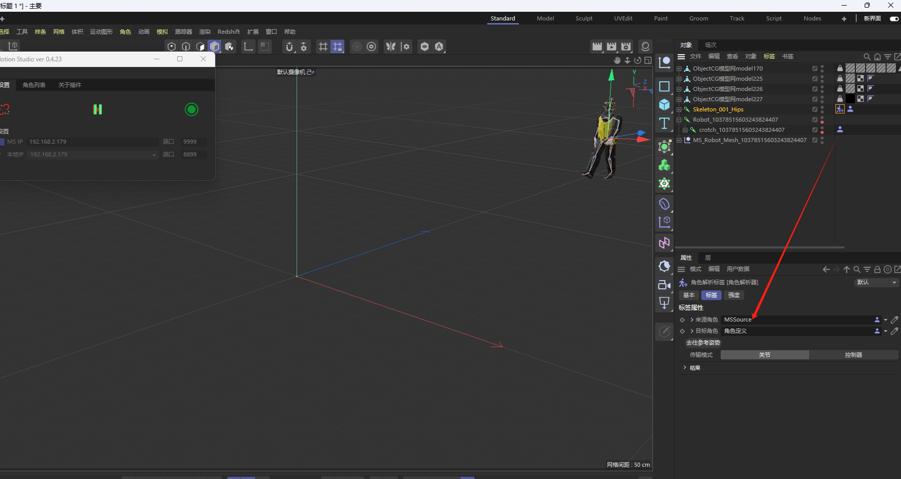

**2）录制动画重定向驱动**

**①. 录制动画**

模型骨骼绑定完成后，点击录制按钮。

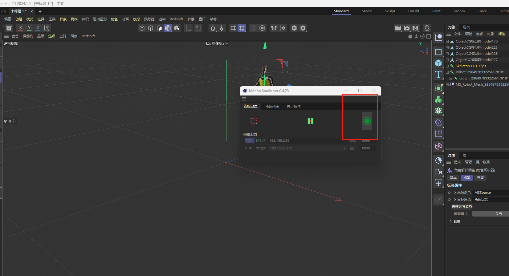

再次点击可以停止录像，此时会暂停动作同步。点击C4D下方动画轨道中的播放
按钮，可以回看刚才录制的动作。

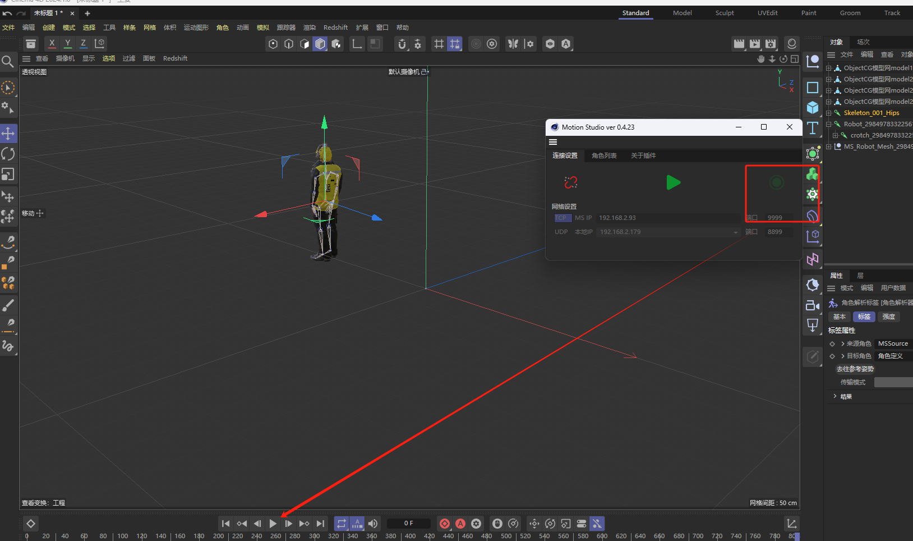

注：录制完一个后需要将当前的文件导出，如未导出，录制第二个，会将第一个录制内容覆盖掉。

**②. 导出录制的动画**

导出录制的动画时，可以选择保存场景和动画为C4D文件，也可以导出为其他文件格式（如FBX等）。

若选择保存为C4D，可以通过文件\>保存项目/另存项目为\...
或者Ctrl+S/Ctrl+Shift+S，如果需要导出为FBX文件，可以通过文件\>导出\>FBX,然后在弹出的对话框选择要保存的位置

**③. 回放录制的动作**

当导出完成后，可以在对象窗口下的
文件\>合并对象\...选择刚才导出的FBX或者C4D文件。

