**Maya插件使用教程**

**一.Maya软件下载**

[请至钉钉文档查看附件《Maya_2025_webinstall.exe》](https://alidocs.dingtalk.com/i/nodes/7dx2rn0Jba3NnjlwtxDAL19wVMGjLRb3?iframeQuery=anchorId%3DX02mcu6sz4hcj3gxxr6rf9)

**二.安装MAYA插件**

**1.下载地址：**

[请至钉钉文档查看附件《MotionStudio_Maya_22-25_Win64_v0.7.27_Setup.msi》](https://alidocs.dingtalk.com/i/nodes/7dx2rn0Jba3NnjlwtxDAL19wVMGjLRb3?iframeQuery=anchorId%3DX02m8s4dfr9ku47ayzj8t)

**2.安装步骤说明：**

1.  双击打开安装包。

{width="4.65625in"
height="0.3541666666666667in"}

2.点击下一步

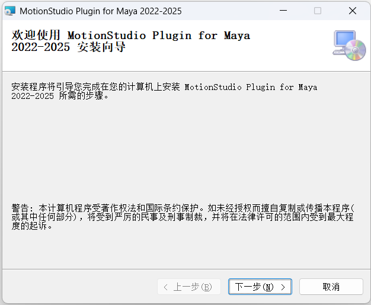{width="6.520833333333333in"
height="5.364583333333333in"}

3\. 选择要安装插件的Maya 版本，目前支持Maya
2022、2023、2024和2025。然后点击下一步。(只需勾选已安装的Maya
版本即可，如安装了2024版Maya，则只需勾选Maya 2024，如下图。)

{width="6.520833333333333in"
height="5.364583333333333in"}

4.选择插件安装位置，请选择Maya所在的目录。默认会选择用户的文档目录下的maya文件夹（即C:\\Users\\\<用户名\>\\Documents\\maya\\）,可以使用默认路径。然后点击下一步（插件和软件要安装在相同目录下）

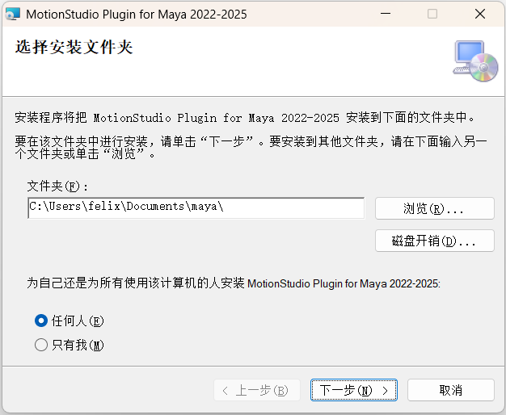{width="6.520833333333333in"
height="5.354166666666667in"}

5.点击下一步开始安装，在弹出的确认框中选择继续。

{width="3.75in"
height="3.0729166666666665in"}

6.插件安装完成，点击关闭

{width="3.75in"
height="3.0729166666666665in"}

**三.MAYA插件使用说明**

**1、MAYA软件中打开MS插件**

**1）打开MAYA软件（2022---2025版本均可，此文档演示的版本为2025）**

**2）打开MS插件**

在菜单栏\>窗口\>工作区中选择动画，将更改UI布局为动画布局。

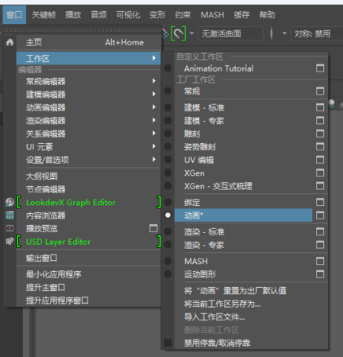{width="4.5in"
height="4.677083333333333in"}

在顶部的工具架中，点击最左侧上方的选项卡按钮，选择列表中的Motionstudio

{width="7.125in" height="1.09375in"}

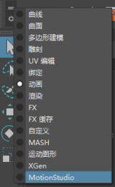{width="1.6875in"
height="2.7291666666666665in"}

MotionStudio的Maya插件的工具架中有3个快捷按钮，分别是连接设置，关节数据和关于插件。

{width="3.6145833333333335in"
height="1.8958333333333333in"}

点击最左侧连接设置，会弹出如下弹窗，可以勾选最下方
应用于此位置的所有插件选项 ，然后点击允许按钮。

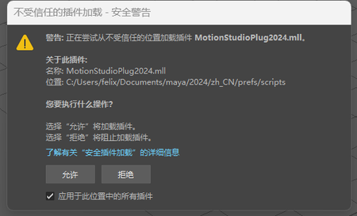{width="5.385416666666667in"
height="3.2708333333333335in"}

点击允许后，会弹出插件的连接设置界面，初始状态下UI会比较小，可以拖动窗口边缘调整大小。

{width="1.5in"
height="0.9583333333333334in"}

**3）连接界面说明及功能介绍**

{width="4.447916666666667in"
height="3.75in"}

**（1）界面说明**

> 如上图，插件界面分为5个区域，分别为
>
> 1.标签栏，可以切换插件主页，关于插件页
>
> 2.菜单栏
>
> 3.连接设置区
>
> 下方从左到右依次是：连接，同步以及录制按钮。

连接：用来连接到MS服务器,需要先在MS中开启数据广播。

同步：在角色列表中点击显示骨骼/模型后，可以开启同步动作，关闭后不再驱动角色的骨骼的移动和旋转。

录制：录制接收到的动作。

> 4.网络设置区
>
> 可以切换网络连接TCP/UDP方式，并且设置连接地址和端口。
>
> 5.角色列表设置区
>
> 角色名称/ID：点击角色名称/角色ID按钮，可切换角色列表中角色显示的内容（角色名称或角色ID）

角色显示/隐藏：点击角色右侧的显示/隐藏按钮，可以切换角色的显示状态（标题栏的显示隐藏按钮可以设置全部角色的显示隐藏状态，每个角色也可以单独设置）

角色同步/TPose姿态：点击最右侧角色姿态按钮，可以切换全部或某个角色的姿态为TPose，或者同步当前MS的姿态

**（2）关于插件页**

此处可以查看插件的版本，打开本插件指南，以及进行插件更新和进入官网(当前版本检查是否有新插件时会导致Maya
暂时卡住，需要大约 10 多秒来检测版本)。

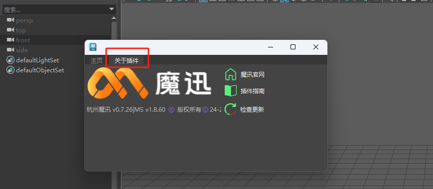{width="7.791666666666667in"
height="3.3982064741907263in"}

**2、连接Motion Studio并驱动**Maya**中的角色模型**

**1）连接Motion studio(TCP和UDP二选一)**

根据MotionStudio中对应的数据广播设置的ip地址及端口号，选择TCP或者UDP连接。

**1.1 TCP连接**

使用 TCP 连接时，需要点击最左侧的 TCP 按钮(高亮为选中)。然后在 Maya
地址中填入 MotionStudio 中的设置的 IP及对应端口号(默认为 9999)

{width="6.0625in"
height="4.229166666666667in"}

{width="5.864583333333333in"
height="5.77705271216098in"}

**1.2 UDP连接**

在 MotionStudio 中的数据广播设置为 UDP 连接，设置端口号。在目标 IP
处输入插件中的安装电脑对应的IP 地址，并设置端口号。

{width="5.729166666666667in"
height="5.645833333333333in"}

Maya中使用 UDP 连接时，除以上操作外，还需要填写和Motion
Studio中目标ip的端口号

{width="6.0625in"
height="4.229166666666667in"}

**2）Maya插件中开启连接**

在第一步确认ip设置正确后，点击插件左上角**连接**按钮，即可连接MotionStudio数据广播。连接按钮不可点击且存在数据则表示连接成功。

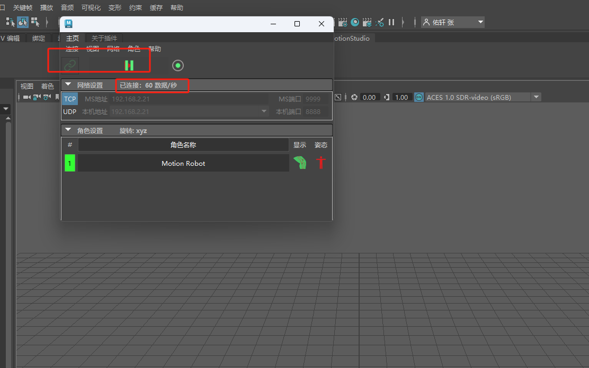{width="7.791666666666667in"
height="4.8838057742782155in"}

**3）加载角色模型**

点击角色显示图标，可显示角色模型

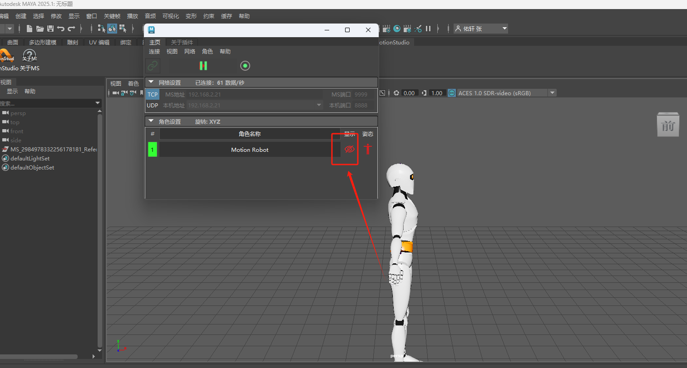{width="7.791666666666667in"
height="4.177083333333333in"}

**4） 切换数据源或切换连接协议**

当需要在MS中切换数据源时（实时→录制，不同录制数据，TCP→UDP等），需要首先关闭当前插件的同步状态，再点击连接设置区中的断开按钮。当Motion
Studio中切换好新数据源时，再次点击连接按钮，可驱动角色模型。

{width="7.791666666666667in"
height="4.04636811023622in"}

**3、录制动作与保存**

**1）录制动作**

在完成连接MotionStudio的步骤并同步驱动角色后，可以点击连接设置区域的录制按钮

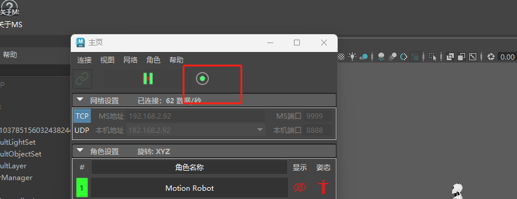{width="7.791666666666667in"
height="2.997479221347332in"}

当录制进行时，按钮会变为如下状态，此时再次点击可以停止录像

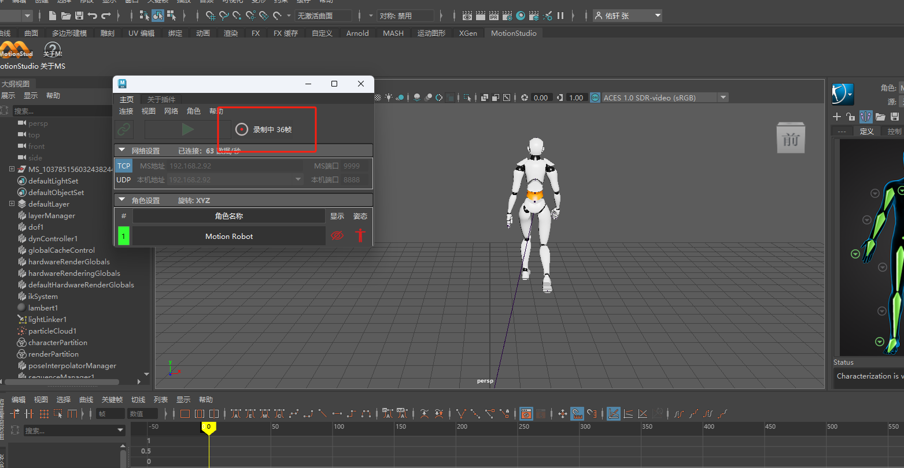{width="7.791666666666667in"
height="4.041926946631671in"}

注：录制完一个后需要将当前的文件导出，如未导出，录制第二个，会将第一个录制内容覆盖掉

**2）**导出录制的动作

导出录制的动画时，最好先关闭同步驱动（但不要断开连接），然后点击maya菜单栏→文件→导出全部，选择需要导出的文件格式、路径等。此处以FBX文件为例，点击FBX格式，填写文件名，点击导出全部

{width="7.791666666666667in"
height="4.65625in"}

**3）回放导出的动作**

当导出完成后，点击连接设置中的断开连接按钮并清除全部角色。

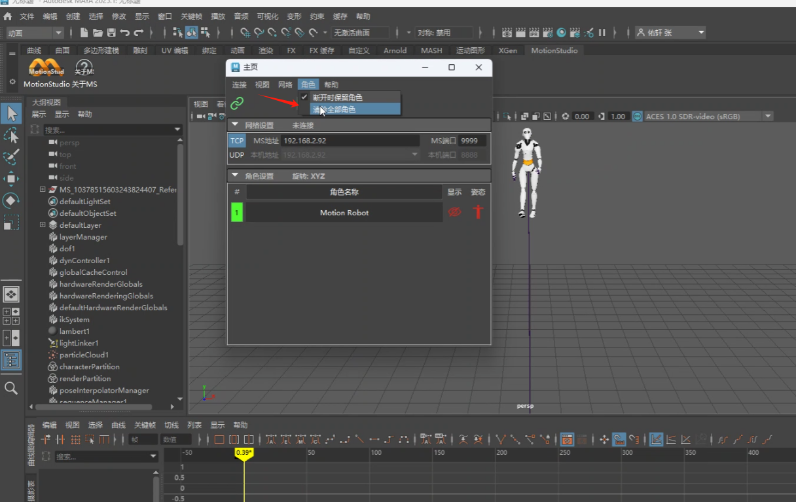{width="7.791666666666667in"
height="4.91464457567804in"}

在maya菜单栏中选择文件→导入，选择对应的文件夹和文件，即可导入成功。

{width="7.791666666666667in"
height="4.1257731846019245in"}

{width="7.791666666666667in"
height="4.235304024496938in"}

**4、实时重定向驱动或录制导出重定向**

**1）添加模型实时重定向驱动**

**①. maya插件与Motion Studio连接**

MotionStudio-数据广播中设置对应的ip地址及端口号

{width="7.791666666666667in"
height="4.188020559930009in"}

在maya中设置与MS对应的ip和端口后，点击连接按钮和显示模型按钮可开启动作同步

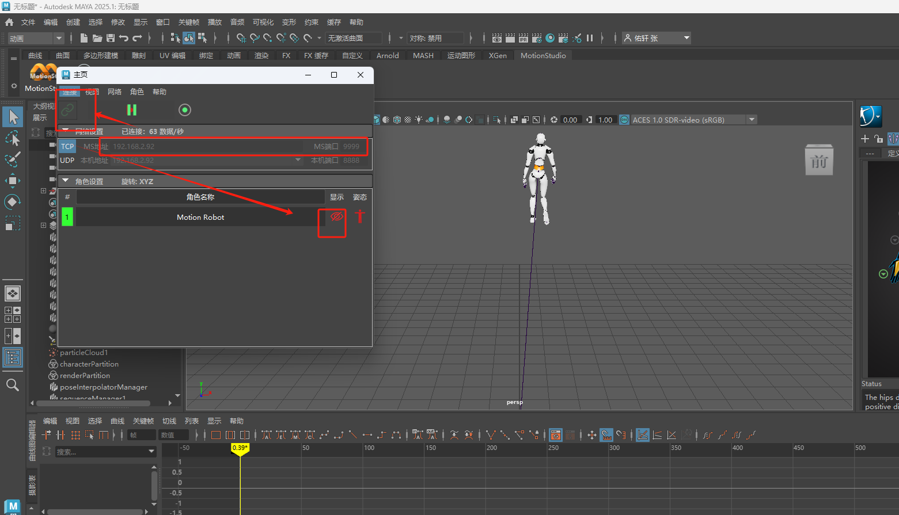{width="7.791666666666667in"
height="4.46735564304462in"}

在ms插件中暂停同步骨骼位置，并点击对应角色的姿态列的按钮切换骨骼为TPose姿态

{width="7.791666666666667in"
height="4.38184820647419in"}

**②. 导入重定向模型（以FBX文件为例）**

通过菜单栏文件→导入，选择对应的文件点击导入{width="7.791666666666667in"
height="4.318338801399825in"}

{width="7.791666666666667in"
height="4.42010498687664in"}

**③. 添加角色定义**

导入fbx文件后，角色下拉选择无，点击添加角色定义

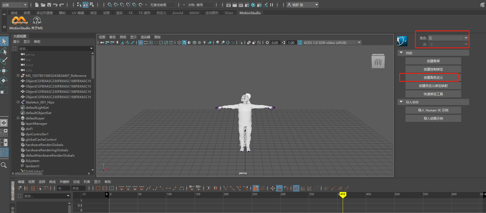{width="7.791666666666667in"
height="3.4329615048118987in"}

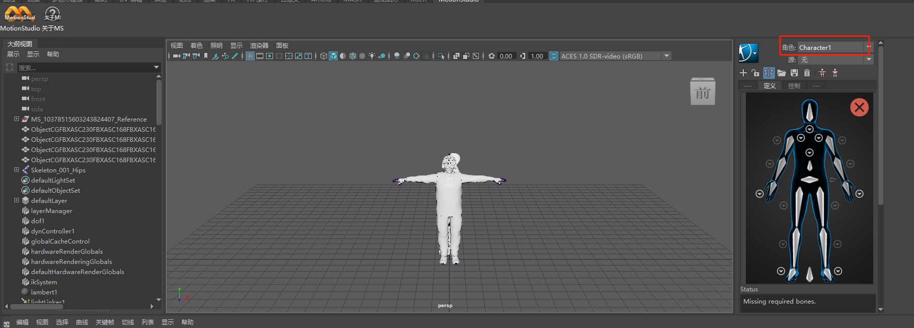{width="7.791666666666667in"
height="2.8013517060367454in"}

**④.骨骼映射**

选择对应的骨骼，进行骨骼映射

{width="7.791666666666667in"
height="3.0024934383202098in"}

[请至钉钉文档查看附件《QQ2025430-14569.mp4》](https://alidocs.dingtalk.com/i/nodes/7dx2rn0Jba3NnjlwtxDAL19wVMGjLRb3?iframeQuery=anchorId%3DX02ma3l35tari0u62hv0g)

**⑤.设置重定向源**

骨骼映射完成后，点击源下拉框，选择MS_Robot。

{width="7.791666666666667in"
height="3.099148075240595in"}

至此，我们将插件的骨骼与模型的骨骼完成了映射绑定后，取消T-pose展示，在MS里面播放录制数据或传输实时数据，model会实时显示传播数据。

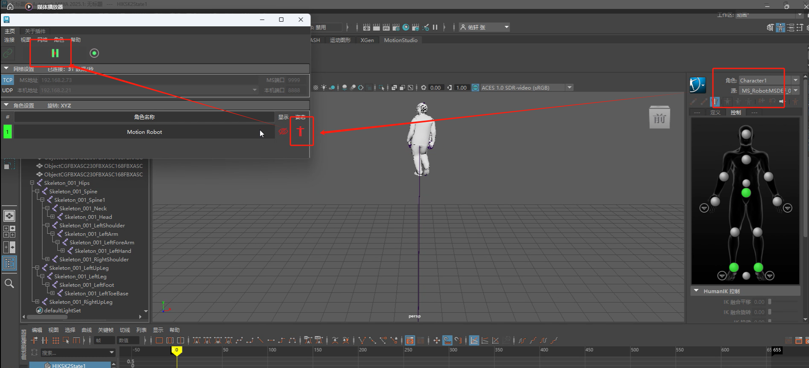{width="7.791666666666667in"
height="3.545761154855643in"}

**2）录制动画重定向驱动**

**①. 录制动画**

模型骨骼绑定完成后，点击录制按钮。

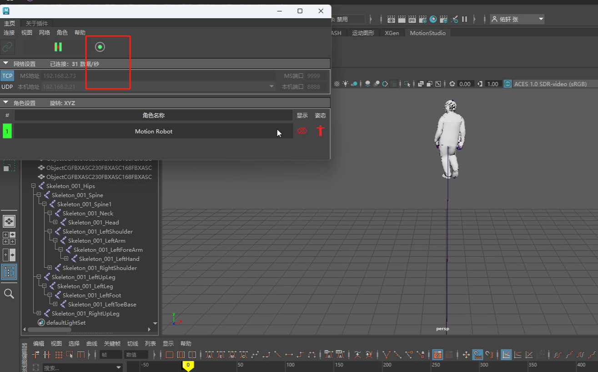{width="7.791666666666667in"
height="4.840906605424322in"}

当录制进行时，按钮会变为如下状态，此时再次点击可以停止录像

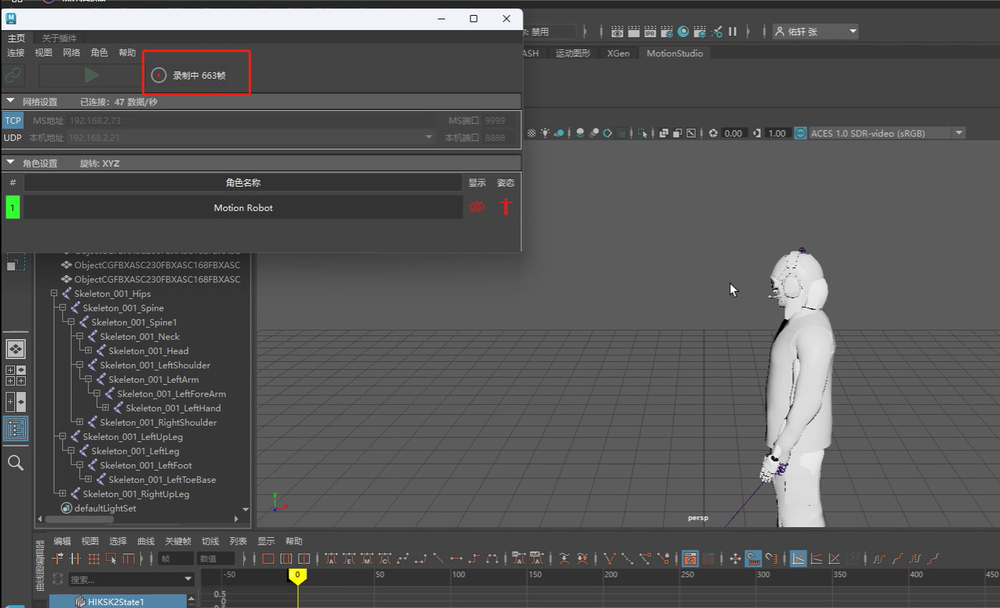{width="7.791666666666667in"
height="4.740813648293964in"}

**②.烘焙骨架**

录制完成后，等待录制数据第一遍加载完成，加载完成后断开MS插件连接

{width="7.791666666666667in"
height="3.957153324584427in"}

断开连接后，右击角色处头像，选择烘焙到骨架

{width="7.791666666666667in"
height="3.4228116797900263in"}

等待数据烘焙完成，可导出文件（这样模型绑定在动画上）

{width="7.791666666666667in"
height="3.9203357392825895in"}

**③.导出烘焙的文件**

点击maya菜单栏→文件→导出全部，选择需要导出的文件格式、路径等。此处以FBX文件为例，点击FBX格式，填写文件名，点击导出全部，即可导出成功。

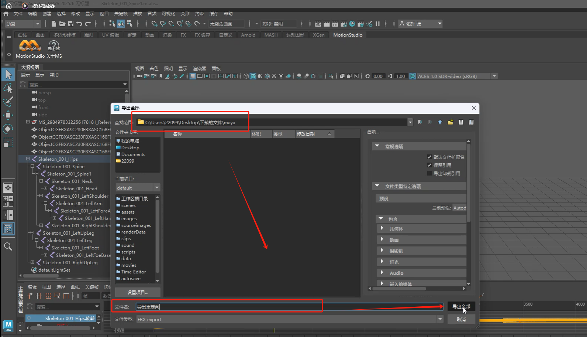{width="7.791666666666667in"
height="4.466373578302712in"}
