# **Motion Builder插件使用教程**

## **一.Motion Builder软件下载**

软件安装包：win64版本

[MotionBuilder_2025_en-US_setup_webinstall.exe](./assets/MotionBuilder_2025_en-US_setup_webinstall.exe)

## **二.安装Motion Builder插件**

### **1.下载地址：**

[MotionStudio_MoBu_22-25_Win64_v0.10.09_MSv1.8.59_Setup.msi](./assets/MotionStudio_MoBu_22-25_Win64_v0.10.09_MSv1.8.59_Setup.msi)

### **2.安装步骤说明：**

1.  解压后，双击打开MotionStudio_MoBu_22-25_Win64_v0.10.09_MSv1.8.59_Setup.msi
    安装包。

2.点击下一步

3\. 选择要安装插件的MotionBuilder 版本，目前支持MotionBuilder
2022、2023、2024和2025。然后点击下一步。

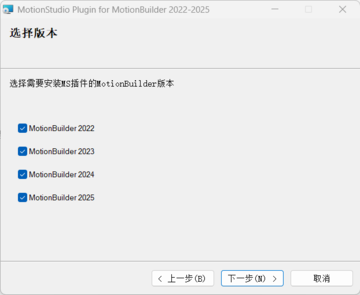

4.选择插件安装位置，请选择MotionBuilder所在的目录。默认会选择Autodesk的默认安装目录。然后点击下一步（插件和软件要安装在相同目录下）

5.点击下一步开始安装，在弹出的确认框中选择继续。

6.插件安装完成，点击关闭

## **三.Motion Buider插件使用说明**

### **1.用插件自带的模型驱动数据**

**1）.打开Motion
Buider软件（2022---2025版本均可，此文档演示的版本为2025）**

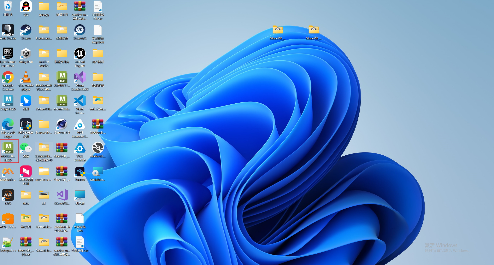

**2）.导入MS插件**

在页面右下角的Asset Browser
标签页中，选择左侧Templates→Devices，在右侧列表中找到Motion Studio
Plug插件。鼠标拖拽该插件到主场景中即可完成导入。

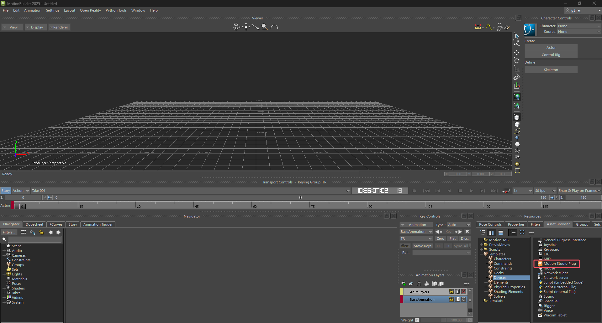

将Motion
Studio插件拖到主场景中即可完成导入，点击Navigator---Devices中看到插件的界面。

**注意**：如果在Devices中找不到Motion Studio
Plug插件，可能是因为安装时选择安装路径有问题。此时需要先找到实际安装的插件路径。

例如，插件安装路径为D:\\Program\\MotionBuilder 2025\\
那么可以在该目录下看到如下内容，那么此时在Asset
Brower左侧边栏空白处右键选择Add favourite
path，然后选择D:\\Program\\MotionBuilder 2025\\MotionBuilder
2025\\bin\\x64\\plugins目录即可（确保此目录下有MotionStudioPlug2025.dll,
版本号根据所需版本号来，如2022，2023，2024等）

**3）.连接Motion studio**

点击查看是否勾选上Use Network
Stream（若没勾选请手动勾选上）。根据MotionStudio中对应的数据广播设置，选择TCP或者UDP连接。

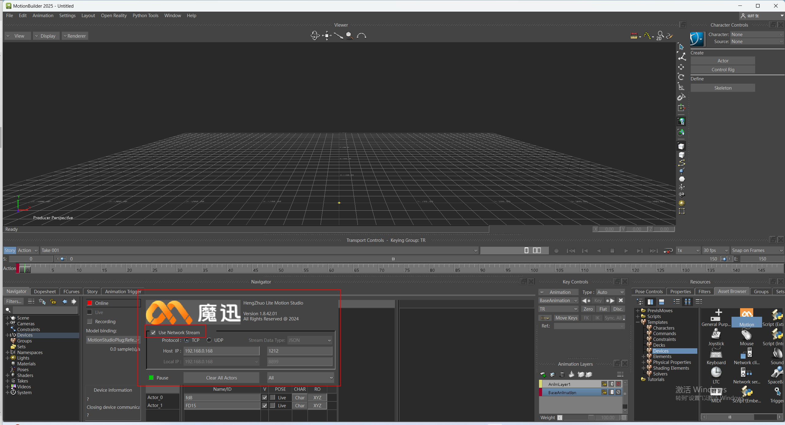

**TCP连接：**

使用TCP连接时，只需在Host
IP中填入MotionStudio中的本地IP（默认为本机IP，若MotionBuilder运行环境与MotionStudio运行环境不在同一台电脑，则此处需根据MotionStudio的本地IP对应修改）及对应端口号。

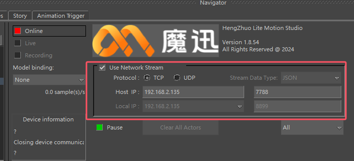

**UDP连接：**

使用UDP连接时，需选择UDP，除以上操作外,还需要填写指定插件对应电脑的IP地址和端口号

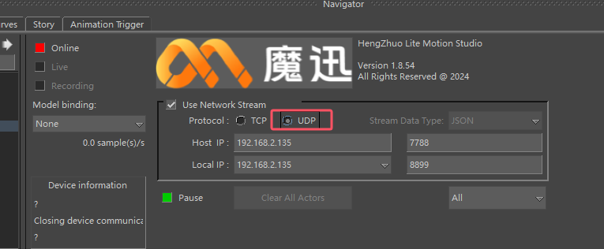

在Motion
Studio中的数据广播设置为UDP连接，并填写与插件相同的端口号（7788)。在目标IP处输入插件中的IP地址，并将端口设置为与插件中一致（默认为8899）

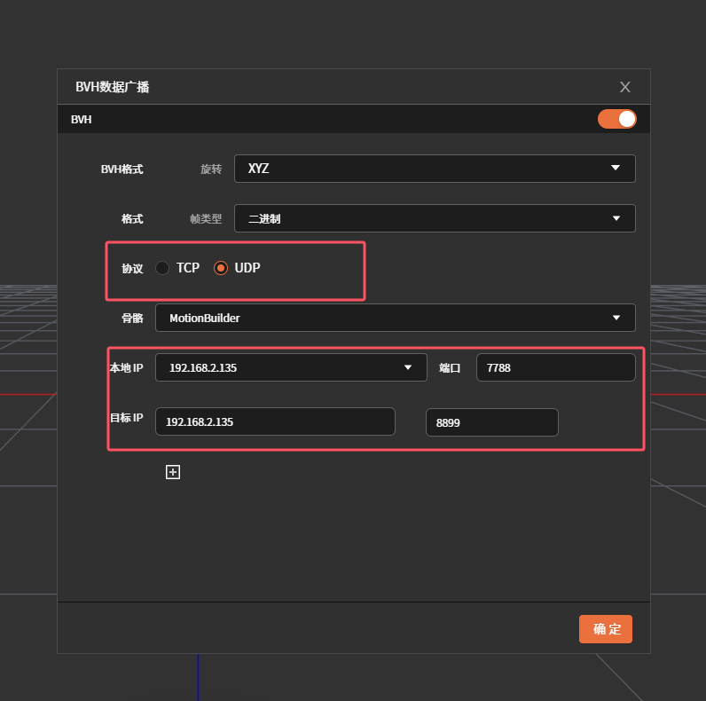

在MS**做完姿势校准**或**播放录制文件**后，并在插件中确认ip设置正确，点击插件左上角Online，即可连接Motion
Studio数据广播(如果遇到MotionBuilder崩溃，请重启MotionBuilder再尝试一下）。Online按钮为绿色则表示连接成功。

连接成功后，点击Live按钮，显示如下界面。

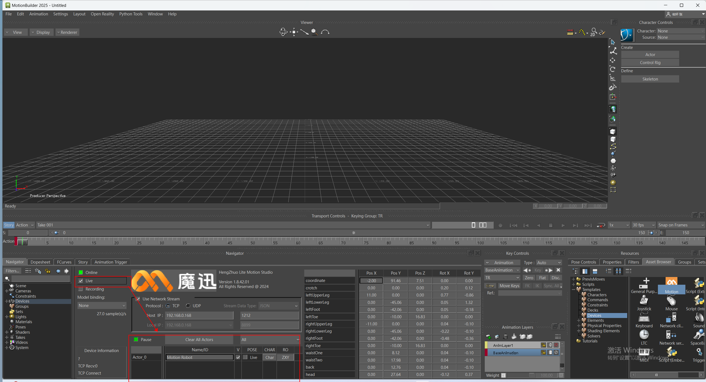

**4）.绑定模型骨骼并创建角色定义**

点击Model binding在下拉框中选择Create\...

选择框中自动显示Motion studio
Reference,并在场景中显示角色骨架（多设备：MS连接几套设备，就显示几个角色骨架）

**5）.绑定并直接驱动角色模型**

插件已经包含了1个示例模型，可以在AssetBrowser→Tutorials中找到MS_Robot这个模型。

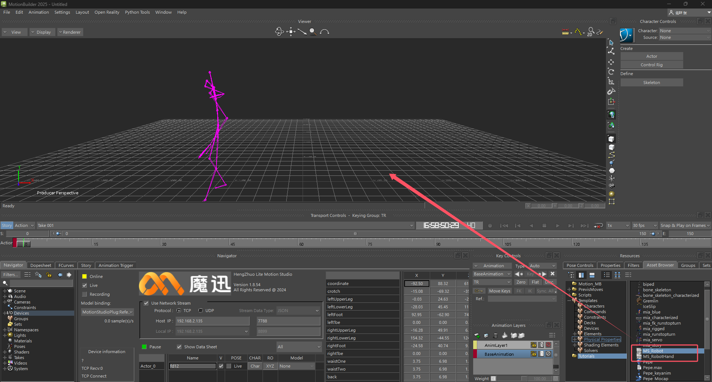

接下来将以这两个模型为示例，选中MS_Robot.fbx这个文件，将此模型拖入到场景中。在拖入的过程中会有FBX
Open或者FBX Merge的选项（选择FBX Open将创建全新场景，而FBX
Merge将会新拖入的模型合并到场景）。

因此，在导入MS_Robot.fbx后，需要选择FBX Merge→\<All
Takes\>选项（如果动捕场景中有多名角色，通常需要导入多个角色模型）。

此时开启插件的网络连接，并勾选Live，然后创建好Model
Binding后，可以在角色列表中的Model列看到场景中新导入的角色模型列表，选择对应的角色模型（注意不同角色要选择不同的模型），选中后模型和骨骼绑定在一起。

**6）.直接驱动手部模型**

MotionStudio实时串流手套数据或串流录制数据，MBip和端口填写正确后，点击online，重新勾选live，点击Model
binding在下拉框中选择Create\...，可显示手部骨骼。

**7）断开连接（切换数据源）**

1当需要在MotionStudio中切换不同的数据源时，点击Online按钮，断开与MotionStudio连接。

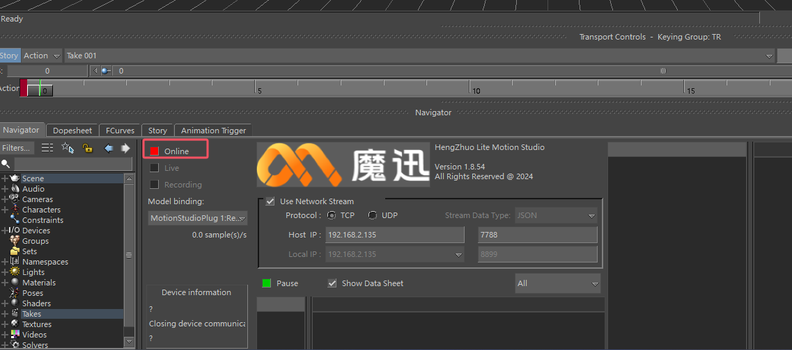

2）在MotionStudio中切换数据源（添加、删除设备或切换录制文件）。

3）回到MotionBuilder中，点击Online开启实时数据，勾选Live选项，在Model
binding下拉框中选择Create\...，即可在MotionBuilder中切换为新的数据源（需要重新绑定模型）。

**8）功能介绍**

界面中区域1为连接设置，包括连接/断开按钮（Online），实时数据按钮（Live），录制（Recording）按钮，以及模型绑定下拉框（Model
binding)。

区域2为插件信息，点击Logo图标可以打开官方网站。

区域3为网络设置，包括是否开启网络数据流（Use Network
Stream)，网络协议（TCP或UDP），数据流类型（暂时不支持设置），MotionStudio主机IP及端口（TCP及UDP协议均需设置），本机IP地址及端口（仅UDP协议需设置，用于接收MotionStudio的UDP数据）。

区域4为角色设置，包括暂停/播放（Pause/Resume）按钮，清除角色按钮（Clear
All Actors），显示部位下拉框(All/Body/Hand)，以及下方的角色列表。

区域5为数据区，包括每个关节的原始数据。

### **2.添加模型并重定向驱动**

**1）导入角色模型**

导入任意带有标准人体骨骼的模型。可以使用MB自带的角色模型，例如在AssetBrowser→PrevisMoves中找到任意动作（这里以Dance为例）。在导入时选择FBX
Merge→\<No Animation\>，选择不导入动画。

在MB预制的动作文件列表PrevisMoves中选择任意动作，以Dance为例。

**2）设置角色模型为T-Pose**

在场景中按下Ctrl+W,可以显示骨骼大纲视图，然后框选Hips根骨骼下的所有骨骼。然后在Hips上右键选择Zero→Rotation，即可重置模型到T-Pose姿态。（仅适用于初始骨骼姿态为T-Pose的模型）。

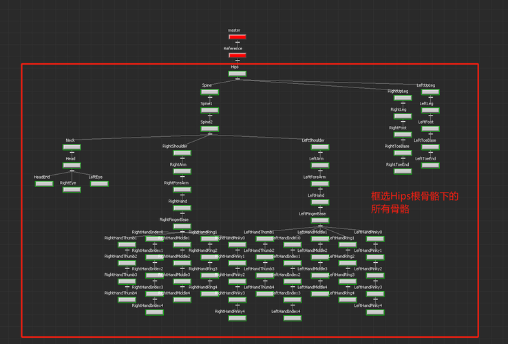

> 再次按下Ctrl+W键，返回场景视图，可以看到角色模型已经为Tpose姿态。

**3）为角色模型添加角色定义（Characterize）**

一般情况下，刚才导入的角色已经包含了对应的角色定义。可以检查Navigator左侧列表中的Characters中是否已有角色定义。若有已有，则说明创建成功。也可以在Character
Controls中检查是否创建了正确对应的角色定义。

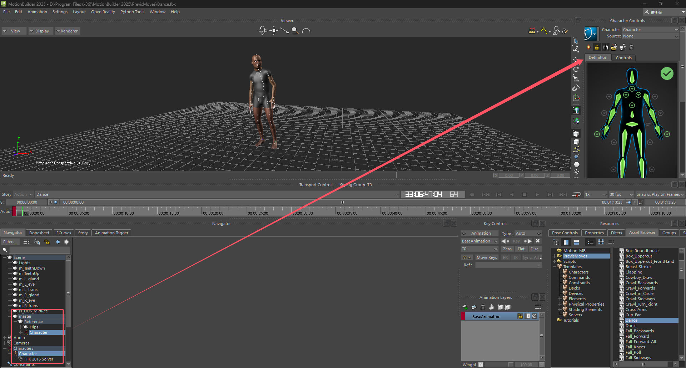

**创建外部导入进来的模型或者角色定义有误**

可以按照如下步骤创建新的角色定义，并映射到角色模型上。

1.导入任意带有标准人体骨骼的FBX模型。把外部文件拖进来，选择FBX Open→\<No
Animation\>，选择不导入动画

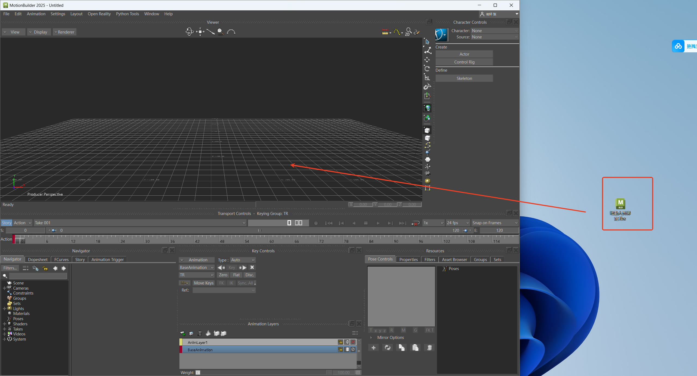

2.在Asset
Browser面板中，选择左侧Templates→Characters，在右侧选择Character

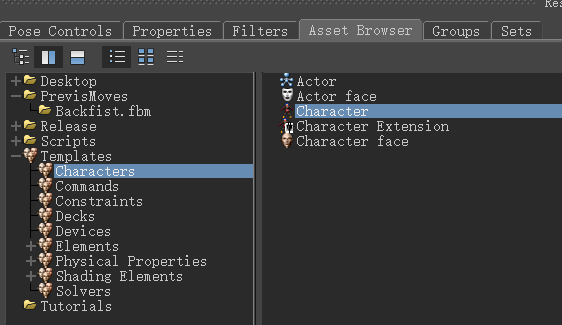

3.在场景中按下Ctrl+W切换为骨骼大纲视图，使用鼠标左键拖动上一步选择的Character到角色模型的根骨骼Hips上。

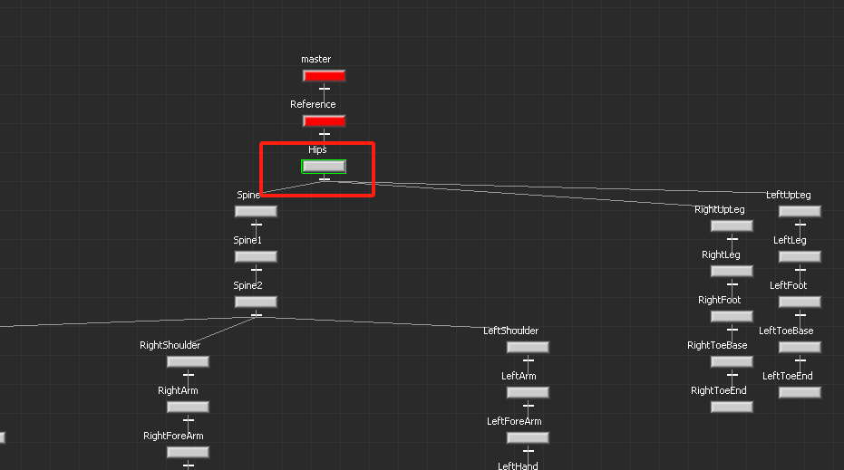

4.松开鼠标左键后，会弹出Characterize按钮，点击该按钮，然后在弹出的对话框中点击Biped按钮。

**4）导入插件并连接Motion studio**

在页面右下角的Asset Browser
标签页中，选择左侧Templates→Devices，在右侧列表中找到Motion Studio
Plug插件。鼠标拖拽该插件到主场景中即可完成导入。

将Motion
Studio插件拖到主场景中即可完成导入，点击Navigator---Devices中看到插件的界面。

点击查看是否勾选上Use Network
Stream（若没勾选请手动勾选上）。根据MotionStudio中对应的数据广播设置，选择TCP或者UDP连接。

**TCP连接：**

使用TCP连接时，只需在Host
IP中填入MotionStudio中的本地IP（默认为本机IP，若MotionBuilder运行环境与MotionStudio运行环境不在同一台电脑，则此处需根据MotionStudio的本地IP对应修改）及对应端口号。

**UDP连接：**

使用UDP连接时，需选择UDP，除以上操作外,还需要填写指定插件对应电脑的IP地址和端口号

在Motion
Studio中的数据广播设置为UDP连接，并填写与插件相同的端口号（7788)。在目标IP处输入插件中的IP地址，并将端口设置为与插件中一致（默认为8899）

在MS**做完姿势校准**或**播放录制文件**后，并在插件中确认ip设置正确，点击插件左上角Online，即可连接Motion
Studio数据广播(如果遇到MotionBuilder崩溃，请重启MotionBuilder再尝试一下）。Online按钮为绿色则表示连接成功

连接成功后，点击Live按钮。

**5）.绑定模型骨骼并创建角色定义**

点击Model binding在下拉框中选择Create\...

选择框中自动显示Motion studio Reference,并在场景中显示角色骨架

**6）设置角色骨骼的角色化定义**

1.  在区域4中点击左上角Pause按钮暂停更新骨骼位置，并点击对应角色的Pose列的按钮切换骨骼为TPose姿态。

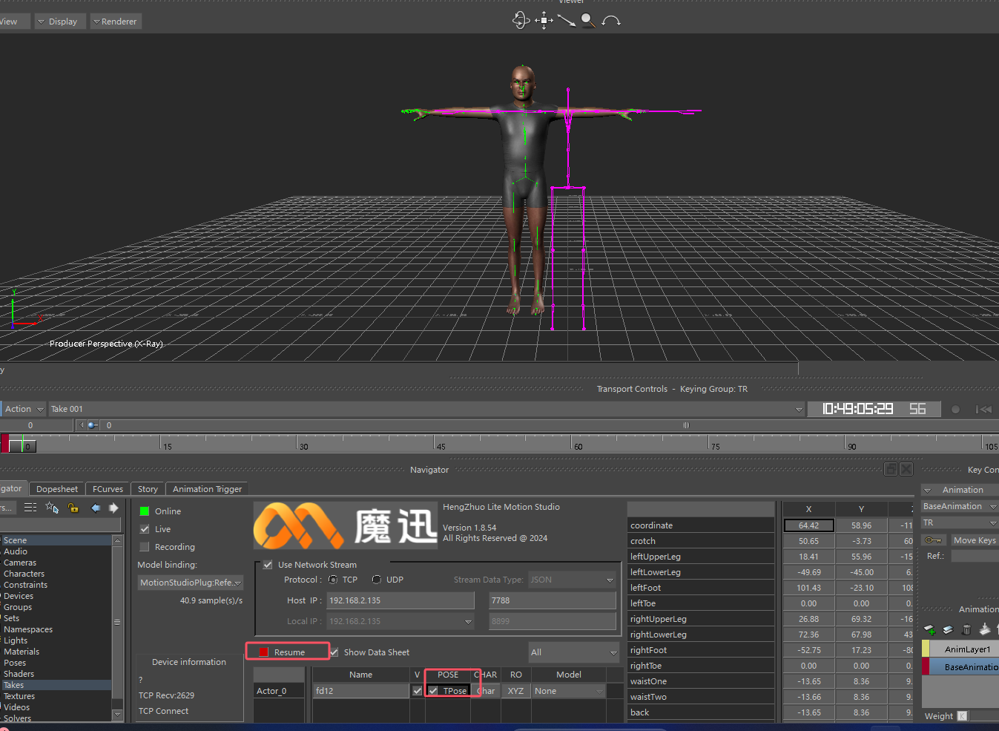

2.在区域4的角色列表中可以点击角色的CHAR按钮创建角色化定义实例(MSCharacter)。

3.重新设置角色化。在Character
Control面板中，依次选择新创建的角色定义MSCharacter，点击下方锁定按钮已解锁，然后再此点击该按钮，然后在弹出框中选择Biped。同理，也对导入的角色模型（Character）进行同样的操作。检查每个角色定义下的骨骼映射是否都显示为绿色。如不为绿色，则需要重新将骨骼旋转归零（Zero→Rotation）。

**7）设置重定向源**

此时可以在Character
Control面板中，点击character下拉框，选择Character角色定义，然后点击Source下拉框，选择MSCharacter。

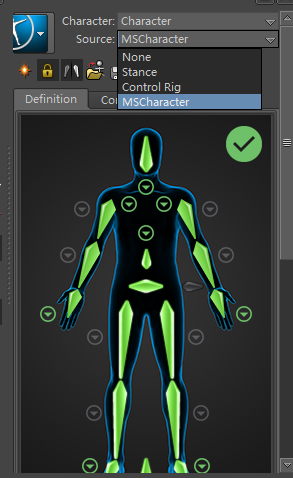

至此，我们将插件绑定的骨骼与模型的骨骼完成了映射绑定后，取消T-pose展示和点击Pause按钮，在MS里面播放录制数据或传输实时数据，model会实时显示传播数据。

### **3.录制动画并保存**

**1）录制动画**

在Online连接数据广播状态下，勾选Recording按钮可以准备开始录制动画。

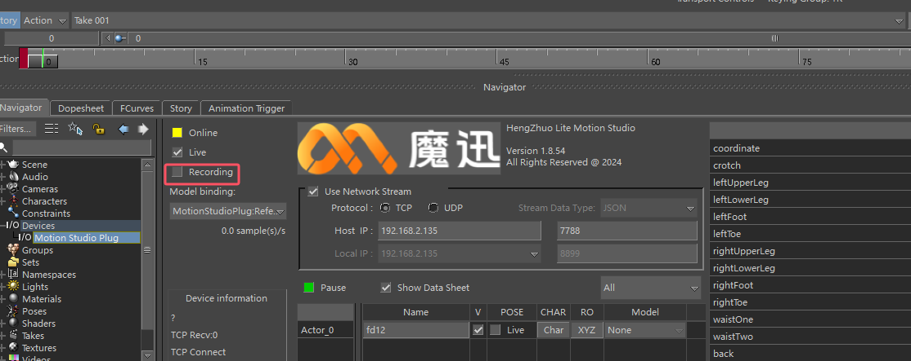

点击左侧录制按钮，根据需求可以覆盖当前动画序列或者创建新的动画序列。

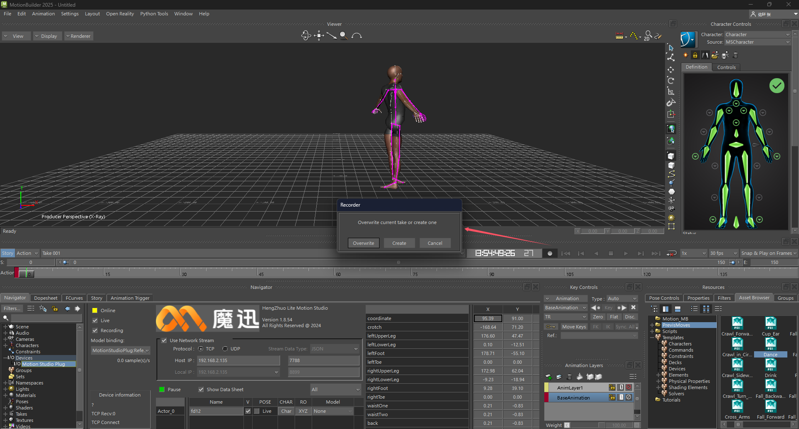

然后点击中间播放按钮，即可开始录制动画，再次点击播放按钮结束动画录制。

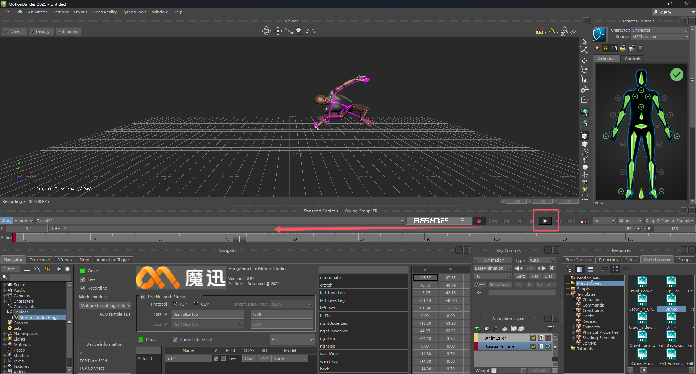

**2）播放录制动画**

断开online连接，点击播放按钮，能播放刚录制的数据。（断开连接后，模型将与骨骼断开连接，需再次重复上面的操作）

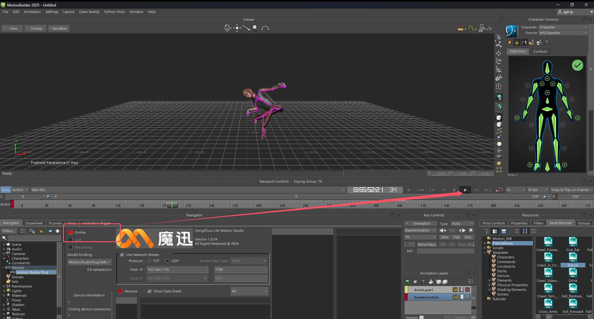

**3）保存动画**

在MotionBuilder菜单栏中选择File→Motion File
Export\...，然后选择要保存的目录以及文件名，点击保存按钮。

在弹出的导出选项中根据需要设置动画帧率（FrameRate），并勾选需要保存的动画Take，然后点击导出（Export）按钮即可保存录制好的动画到指定文件。保存完成后，可以将该文件再次导入到MotionBuilder中查看。

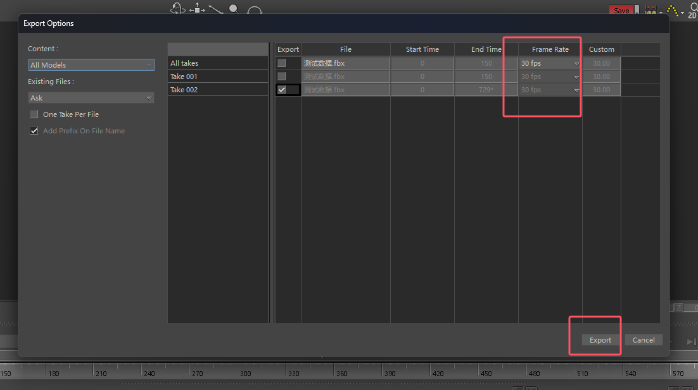
