**UE插件使用说明**

**一、Unreal引擎**

打开unreal引擎（若未下载可去官网下载<https://www.unrealengine.com/zh-CN/download>）

**二、插件**

插件基于UE5.3引擎编写，插件中以Example为示列场景（以Unreal版本为列，高版本操作基本相同）

**UE5.1版本：**

[MotionSuit V0.4.2512111527.7z](https://docs.mostech.asia/plugin_ue/MotionSuit%20V0.4.2512111527.7z)

**UE5.2版本：**

[MotionSuit V0.4.2601032108.7z](https://docs.mostech.asia/plugin_ue/MotionSuit%20V0.4.2601032108.7z)

**UE5.3版本：**

[MotionSuitV0.2.2407121121.7z](https://docs.mostech.asia/plugin_ue/MotionSuit%20V0.2.2407121121.7z)

**UE 5.4版本：**

[MotionSuitV0.2.2407301455.7z](https://docs.mostech.asia/plugin_ue/MotionSuit%20V0.2.2407301455.7z)

**三、插件安装说明**

1、先下载Epic
Games虚幻引擎，在Epic中找到UE引擎下载，安装引擎时需注意不要勾选引擎源代码选项

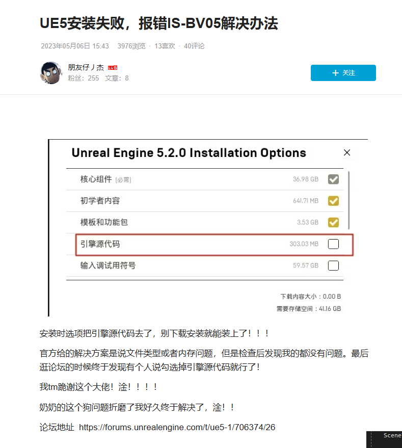

2、安装好引擎后先将MotionSuit V0.2.2407121121.7z压缩包解压

3.打开UE新建空白工程

4.创建项目后找到项目文件夹，在项目文件夹中新建Plugins文件夹，将解压好的motion文件

夹拖入Plugins文件夹中（新建文件夹名字必须为plugins）

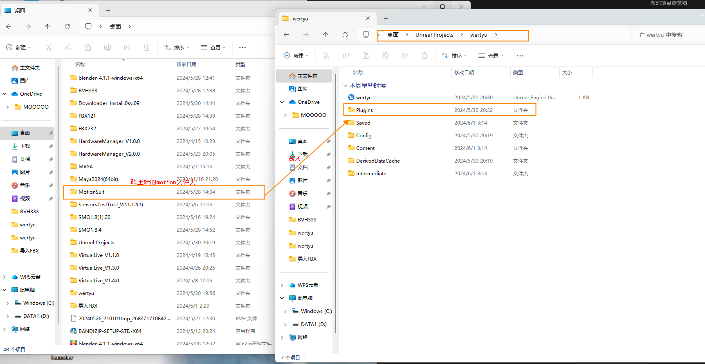

5.重新启动UE引擎，在编辑---插件中可以看到插件是否已经启用，若未启用请勾选启用

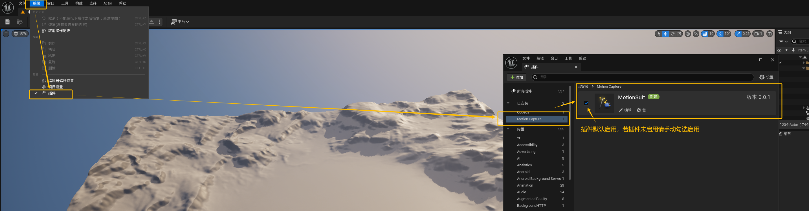

6、在引擎下方的内容测滑菜单可以看到插件内容（注意不要把右侧大纲页面关掉）

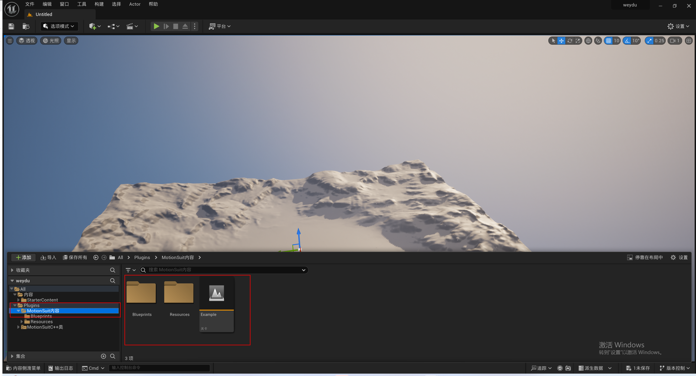

若内容测滑菜单没有显示插件内容，请在内容侧滑菜单中的设置中点击显示插件内容

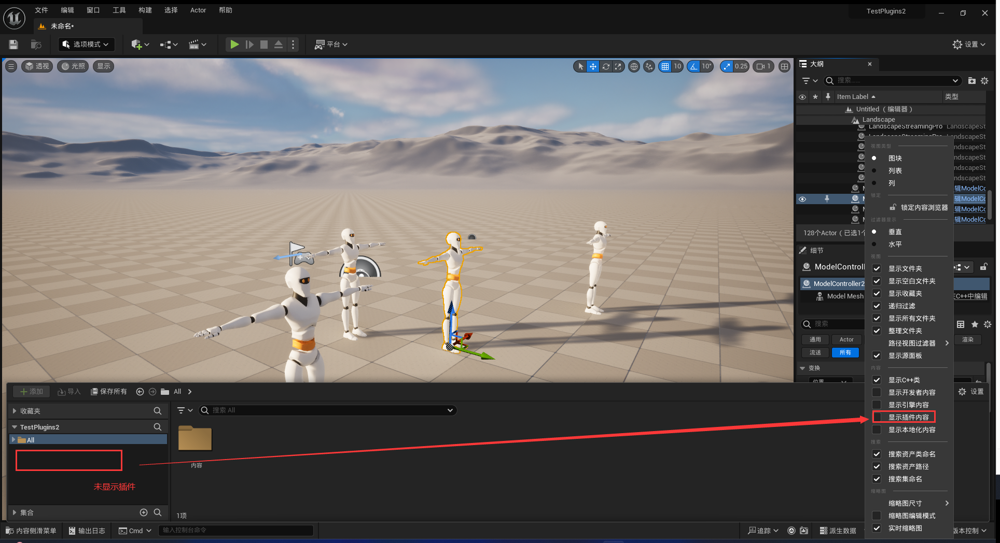

**四、Motion Studio软件数据广播配置**

**1.在同一电脑上进行串流（一定要记住IP和端口数字，会在UE插件中Connector
设置串流参数）**

开启MotionStudio软件的数据广播，设置并记录串流端口、传输协议、旋转数据类型

TCP:

UDP:

**2.跨电脑串流**

现将启用MotionStudio的电脑为**M**，启用UE5的电脑为**U**

**注：跨设备串流需要两台设备在同一局域网下，非同一局域网下请自行获取公网IP或使用内网穿透工具**

查看IP方式：**WIN + R**键唤出
运行窗，并输入**cmd**，再点击**确定,**在CMD窗口中输入**ipconfig**并按下**回车**，找到IPv4地址，该地址为电脑的的局域网地址

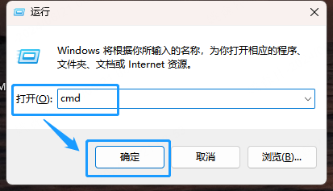

TCP：跟单电脑设备操作无异，在**U**中输入**M**的串流设置即可

UDP：记录**U**的**IP地址**，在**M**的**串流设置**中填入**U**的**IP地址**以及端口（端口自定义）

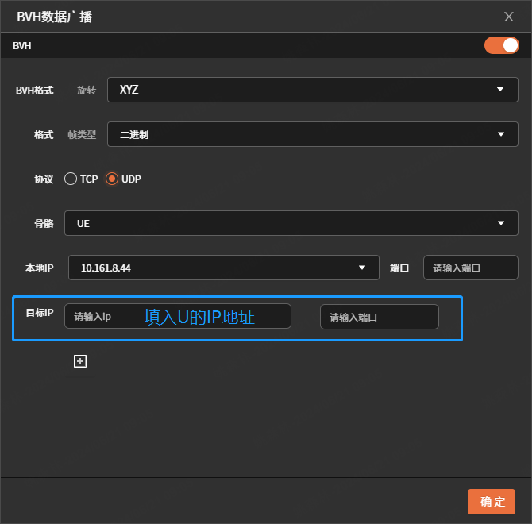

**五、将自己的模型导入引擎驱动数据**

**1.在 MotionSuit内容Blueprints 中的双击打开 Connector 设置串流参数**

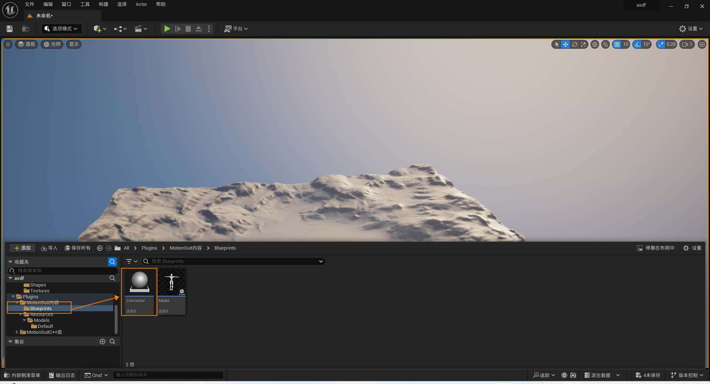

将Motion
Studio中设置的IP和Port填入蓝图节点中，并根据MS串流设置决定是否勾选Use
Udp（勾选时为使用UDP传输），设置完毕后点击编译、保存

Address：MS中设置的IP

Port：MS中设置的端口

Use Udp：是否使用UDP串流（勾选时为使用）

Log Message：是否在控制台打印接收到的数据（勾选时为打印）

**拖入前最好点先点一下运行和停止（不然后面会看不到模型），设置完毕后的
Connector 拖入场景中（确保场景中存在该Actor）**

**2.将自己的模型导入引擎**

点击**内容侧滑菜单**右上角的**导入**按钮，找到并选择自己的模型文件(.FBX)，并点击打开，最后点击**导入所有**

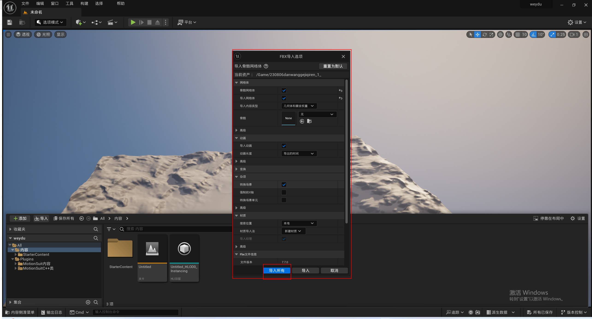

导入成功后，内容浏览器会显示导入的模型（最好导入内容文件夹中），然后点击**保存所有**

**3.选择骨骼模型点击鼠标右键，点击创建---动画蓝图**

创建后双击打开动画蓝图，点击Result引脚拖长，输入MotionPoseNod

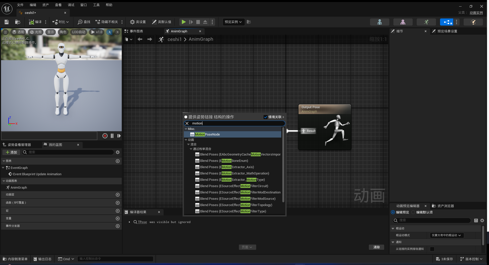

MotionPoseNod框和Result框相连接后，点击MotionPoseNod框，可配置右侧细节框中配置骨骼对应关系

对应的骨骼关系需找到Plugins-MotionSuit内容-Resources-Models-Default中的StandardModel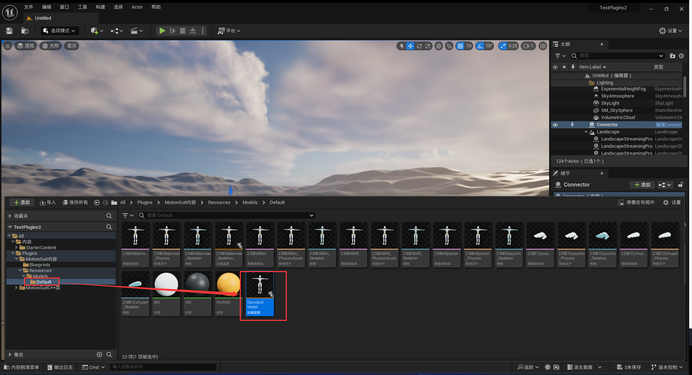

打开动作蓝图，选中MotionPoseNod框，需拷贝Motion Body Map、Left Fingers
MAP、Right Fingers MAP数据。

右侧细节框中配置骨骼对应关系配置完成后，最后点解左上角的编译和保存。

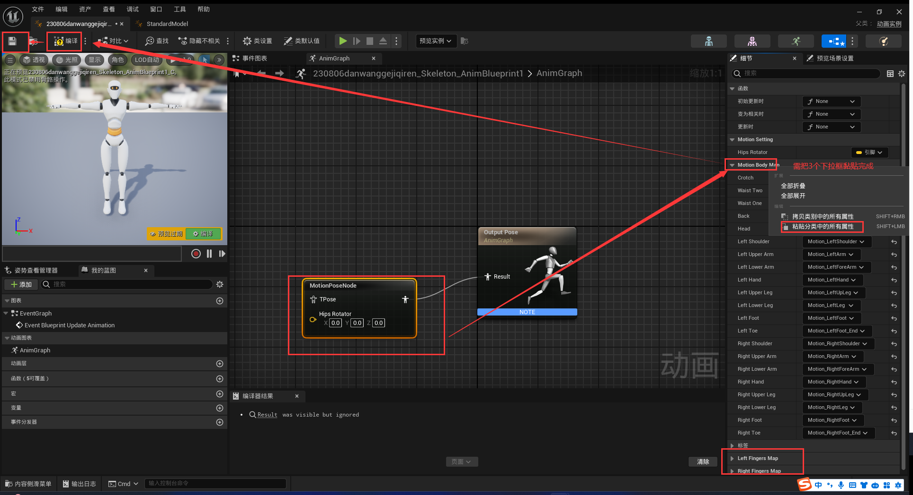

对应关节没有快捷配置方法只能自己手动配置上或直接复制样例动画蓝图的信息（注意复制完后要查看关节是否全部配置上了）

**4.初始姿态非T-Pose的模型需要新建T-Pose动画（如果是T-pose则无需进行此步骤，跳过）**

以Unreal引擎标准小白人为例，该模型的初始姿态为A-Pose

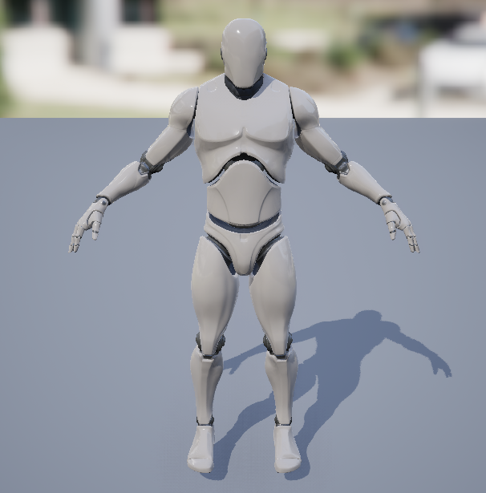

先为该模型创建动画合成

打开动画合成，在**骨架树**窗口点击选择骨骼（以左上臂为例），在中间视窗进行角度调整，直至将模型姿态调整为T-Pose

在上方工具栏中点击**创建资源**-\>**创建动画**-\>**当前姿势**，将TPose保存为动画

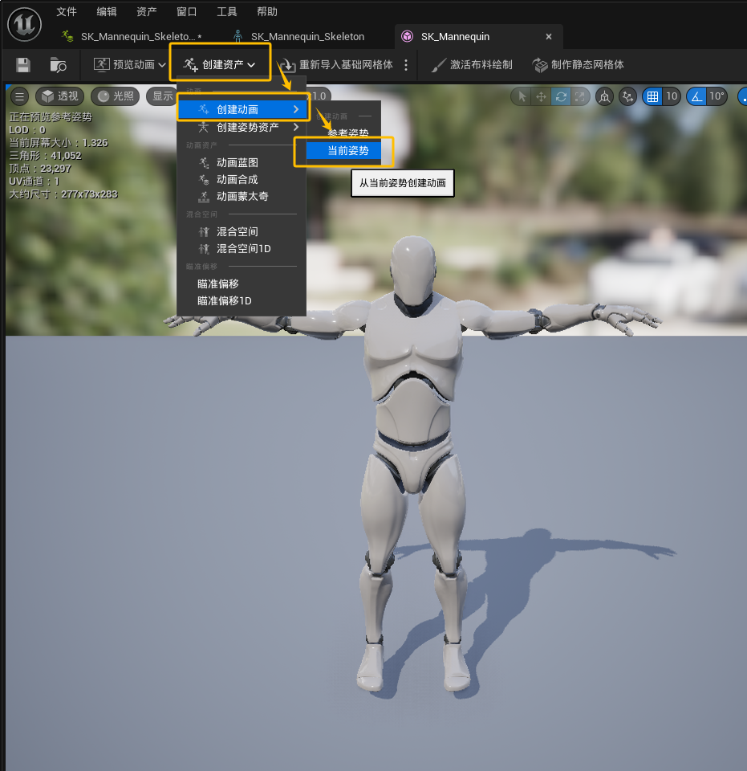

将新建的T-Pose动画拖入动画蓝图中，并将该动画的输出引脚与**MotionPoseNode**的**TPose**引脚相连并点击**编译**和**保存**

**5.新建ModelController蓝图，并在蓝图中的在SkeletalMesh中设置模型的蒙皮以及动画蓝图（第三布中创建的动画蓝图），将该ModelController拖入场景中**

右键点击内容浏览器空白处新建蓝图

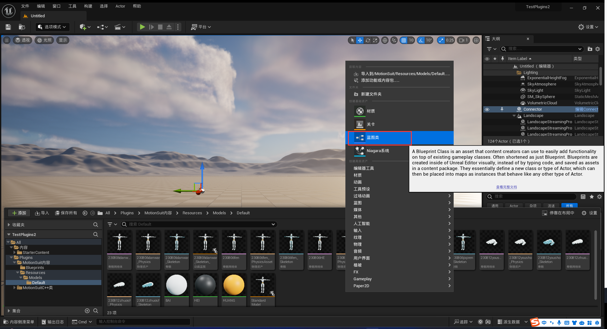

在所有类收藏夹搜索框输入**ModelController**并点击打开

新建成功后双击打开该蓝图，在网格体-骨骼网格体资产处设置**蒙皮**（自己导入的模型的蒙皮）以及动画-动画类处选择第三步中创建的**动画蓝图**，随后点击编译、保存

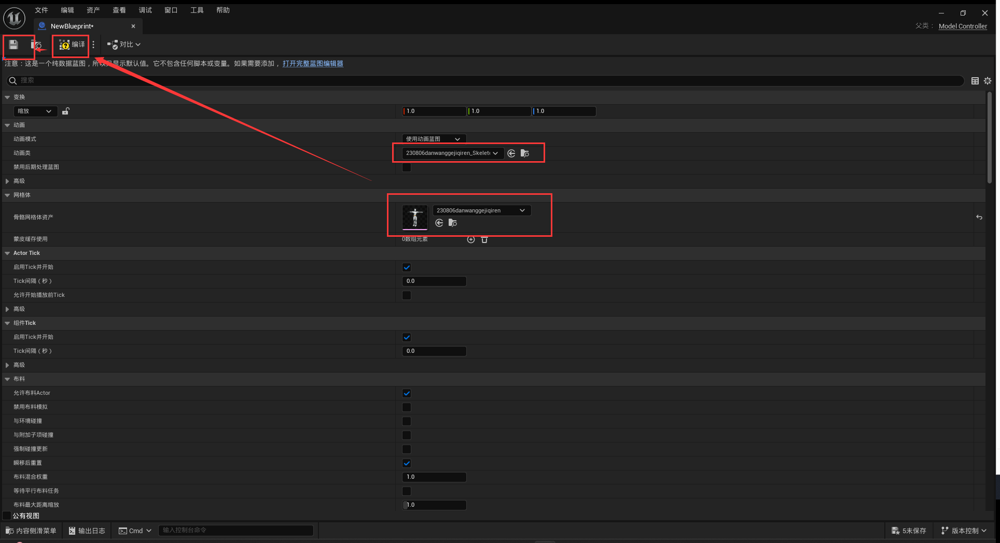

将该ModelController拖入场景中（若拖入进去显示为一个球则点击开始录制按钮再点击结束录再将modelcontroller拖入即可）

**6.多设备数据使用说明（只使用一个模型可跳过此步骤）**

当MS中有多个角色（多套动捕设备）时，请在场景中加入对应数量的**ModelController(需要几个模型就拖拽第5步创建的ModelController几次)**

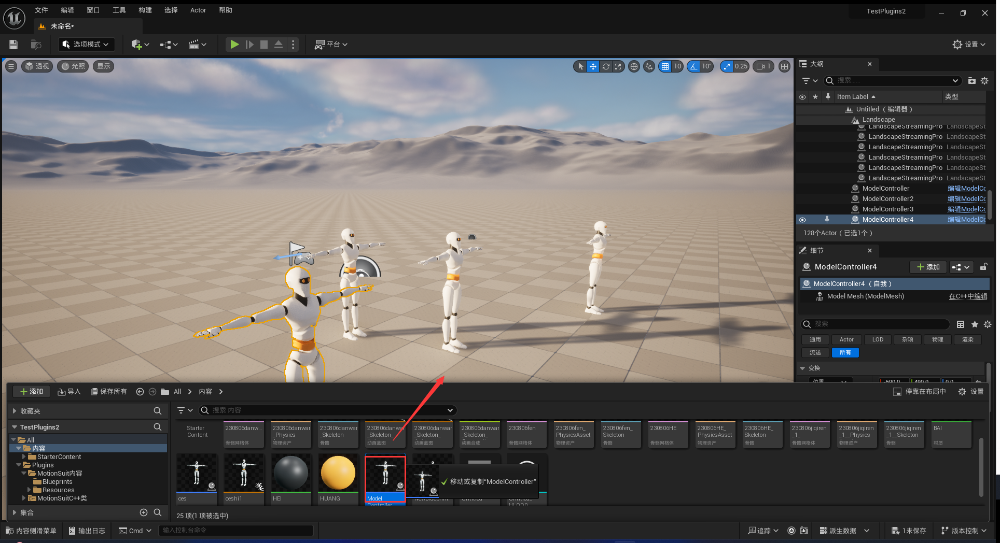

**7.设置角色名字，在细节窗口中搜索并修改ActorName属性，填入MS中角色头顶的角色名；运行时ModelController会根据ActorName获取对应设备的动作数据**

**注：ActorName可以为空**（为空代表着没有绑定motion中的设备，可以根据任意设备进行动作）

**8.数据广播开启后，未连接设备可传输离线数据**

查看文件列表，双击选择数据文件播放

点击运行按钮，可传输离线数据

**9.数据广播开启后，连接设备可传输实时数据**

连接设备后，并进行姿势校准

点击运行按钮，可传输实时数据

**六、用插件自带的模型驱动数据**

**1.点击内容测滑菜单，找到Plugins-MotionSuit内容，双击打开Example**

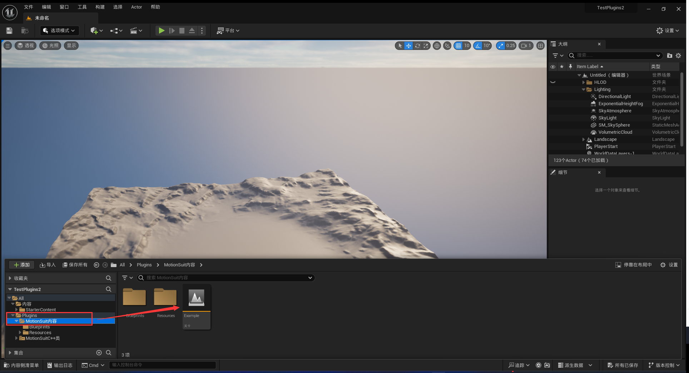

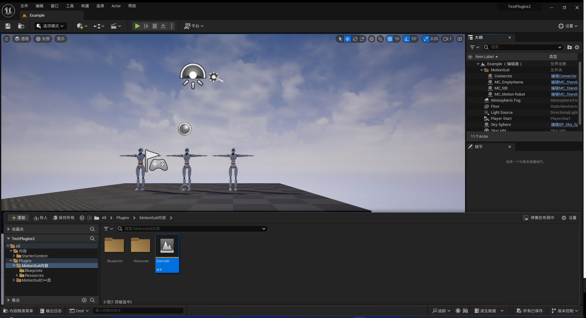

若之前修改过数据,**双击**Example时，会提示是否保存之前的数据，若需要保存，点击保存即可。

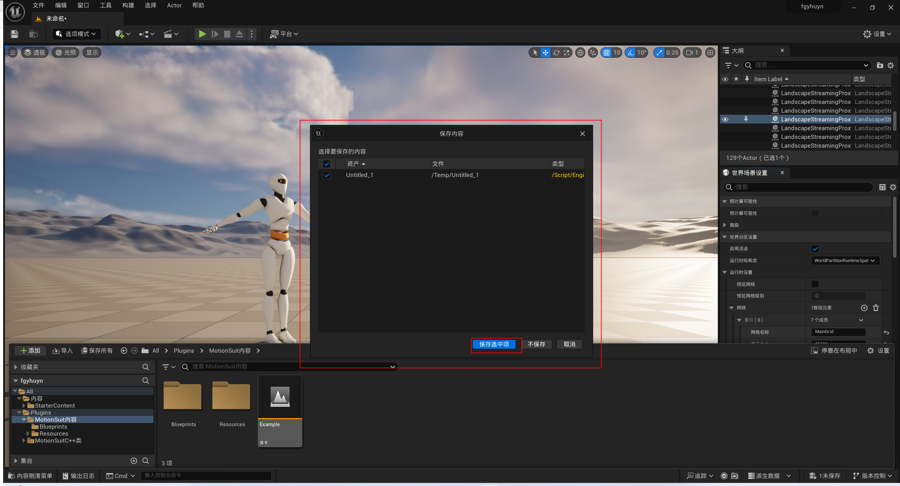

**2.点击界面右侧大纲处，点击编辑Connector**

将Motion
Studio中设置的IP和Port填入蓝图节点中，并根据MS串流设置决定是否勾选Use
Udp（勾选时为使用UDP传输），设置完毕后点击编译、保存

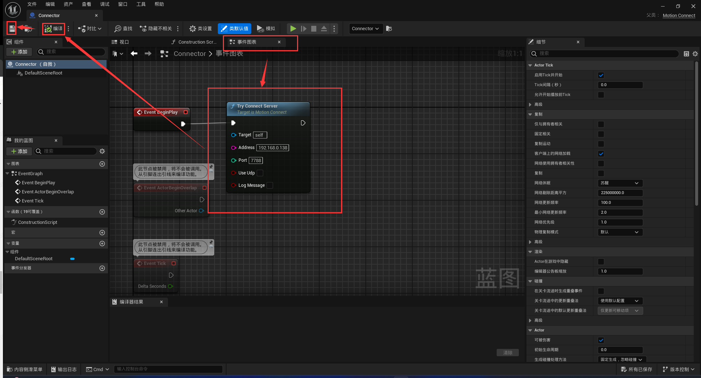

Address：MS中设置的IP

Port：MS中设置的端口

Use Udp：是否使用UDP串流（勾选时为使用）

Log Message：是否在控制台打印接收到的数据（勾选时为打印）

**3.设置角色名字，在细节窗口中搜索并修改ActorName属性，填入MS中角色头顶的角色名；运行时ModelController会根据ActorName获取对应设备的动作数据**

**注：ActorName可以留空**（留空代表着没有绑定motion中的设备，可以根据任意设备进行动作）

**4.数据广播开启后，未连接设备可传输离线数据**

查看文件列表，双击选择数据文件播放

点击运行按钮，可传输离线数据

**5.数据广播开启后，连接设备可传输实时数据**

连接设备后，并进行姿势校准

点击运行按钮，可传输实时数据

**七、其它问题**

**1、若右侧大纲、细节被关闭，点击窗口，找到大纲按钮，选择大纲视图1,细节窗口看下图**

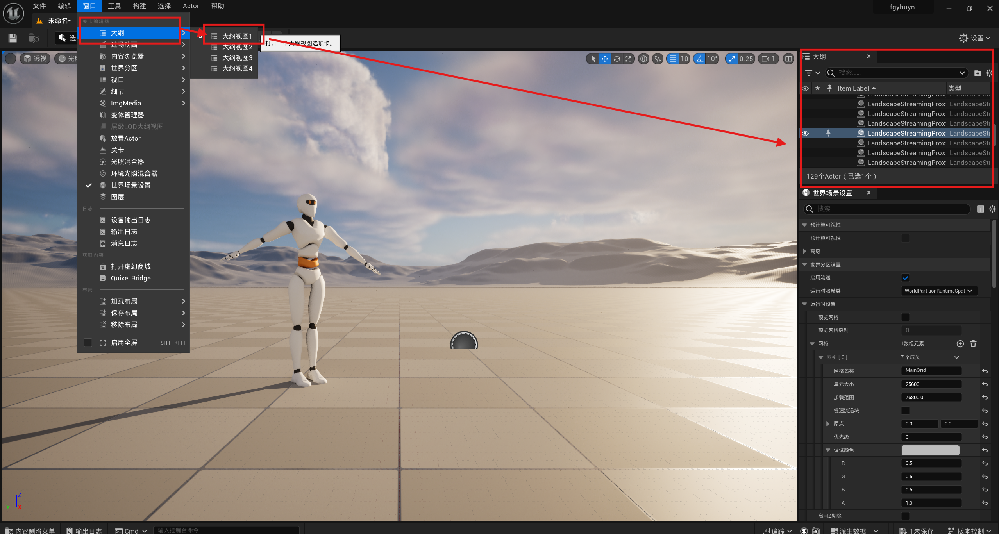

**2.若需要删除已创建的模型，可在大纲处选中需要删除的模型，按DELETE键，可删除成功**

