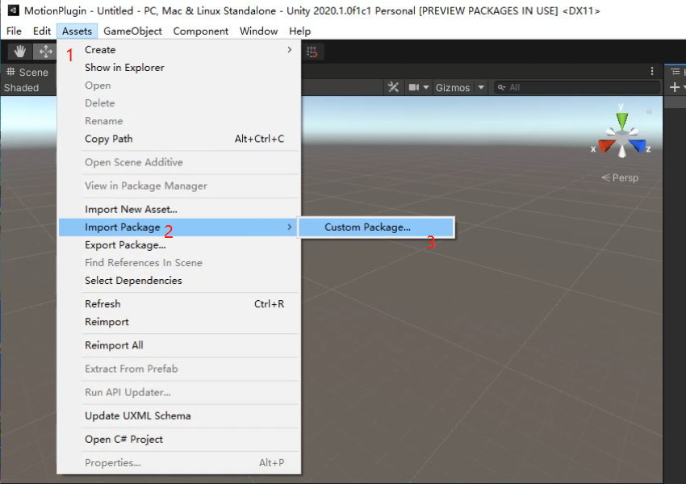
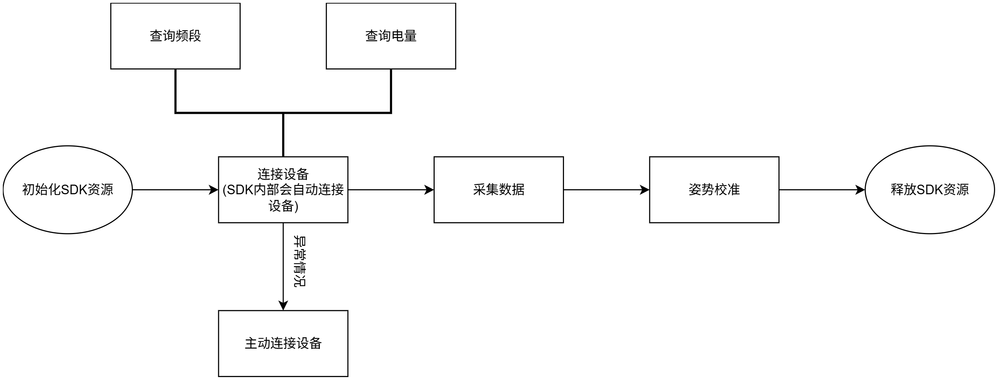
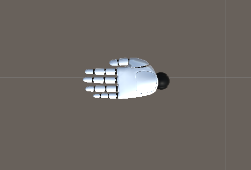

# unity动捕插件(手套+安卓)使用文档

# 简介

本文档将帮助你如何使用游戏引擎 Unity 3D 通过此sdk拿到数据手套数据，并正确驱动手模型。

# Unity动捕插件包导入项目

动捕手套插件包

| **插件文件** | **版本** | 日期 | **更新日志** |
| --- | --- | --- | --- |
| [mostechPlugin\_Android\_V1.1.0.unitypackage](./assets/mostechPlugin_Android_V1.1.0.unitypackage) | V1.1.0 | 2024-11-04 | 【新增】 1.支持手套自研设备 |
| [mostechPlugin\_Android\_V1.0.0.unitypackage](./assets/mostechPlugin_Android_V1.0.0.unitypackage) | V1.0.0 | 2024-10-17 | 【新增】 1.采集器手套实时数据 2.姿势校准 3.设备详情 |

 打开unity工程后点击Asset>Import Package>CustomPackage>mostechPlugin\_Android.unitypackage添加到unity工程即可

# 插件包介绍

**接口调用流程**

**注解：**

*   采集数据过程中，调用类似查询电量的接口拿到结果后，需要重新调用采集数据接口
    
*   需要打包进安卓设备才可运行调试
    

### 2.1场景介绍

在 Assets >Mostech > MotionCapture\_Android>Scenes 可以看到示例场景

1.  GloveMotionCaptureDemo ,获取手套数据驱动手模型
    

安装包

[GloveMotionCapture.apk](./assets/GloveMotionCapture.apk)

### 2.2脚本介绍

1.  在Assets>Mostech>MotionCapture\_Android>Scripts>Mostech\_AndroidSerialPort.cs
    
          所有和串口相关，例如:手套数据、电量等
    
2.  在Assets>Mostech>MotionCapture\_Android>Scripts>Mostech\_MotionDriver.cs
    
          驱动手模型相关
    
3.  在Assets>Mostech>MotionCapture\_Android>Scripts>Mostech\_UIManager.cs
    
         界面相关
    
4.  在Assets>Mostech>MotionCapture\_Android>Scripts> Loom.cs
    

      子线程向主线程中添加事件,避免子线程直接调用unity主线程中方法报错。每个场景中必须要

       添加Loom.cs脚本。

### 2.3脚本Mostech\_AndroidSerialPort.cs详细说明

通过此脚本和安卓串口通信sdk交互，安卓sdk中使用流程为：获取实例>初始化资源>销毁实例。

手套设备的连接由安卓sdk控制

### 2.4脚本Mostech\_MotionDriver.cs详细说明

通过此脚本驱动手模型，需要绑定左右手各16个骨骼。暂时只支持固定骨骼的手模型(后续版本中会支持任意骨骼)。

# 模型要求

1.  模型所有骨骼自身坐标系为左手坐标系，x轴向右，y向上，z向前
    
2.  左右手各个手指由三部分组成，手指近端、中端、末端组成
    
3.  手指各个骨骼初始姿态欧拉角为(0,0,0)
    

俯视图

侧视图

# 打包安卓时特殊配置

### 4.1设置minimun API Level

在Edit>Player>OtherSttings下minimun API Level设置为>=level 29的版本

### 4.2打包为ARM64

在Edit>Player>OtherSttings下先将Scripting Backend设置为IL2CPP，然后勾选ARM64

