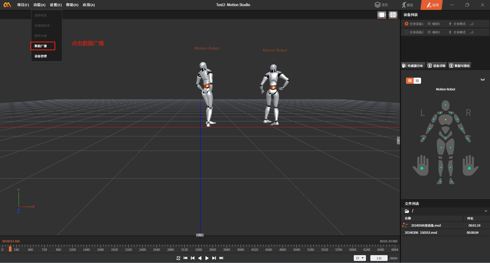
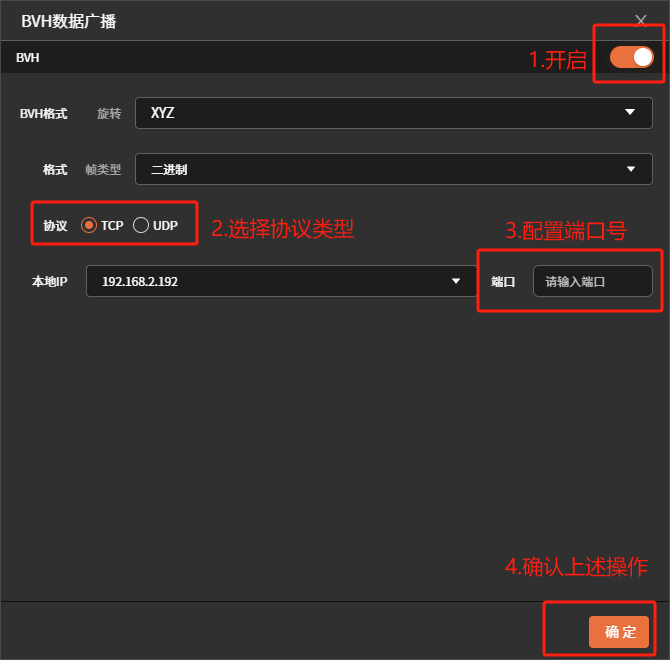

**MotionStudio中导入动捕文件并数据广播**

1.  **登录MotionStido**

从官网下载动捕软件，使用手机号登录（需联系销售注册账号）。

2.  **MotionStudio中新建项目**

创建项目，最好将项目放在一个自己好找的目录(后面会用到此路径)。

3.  **导入动捕数据相关文件及配置**

**3.1导入动捕数据描述文件**

动捕数据描述文件

[请至钉钉文档查看附件《20240506双设备.msd》](https://alidocs.dingtalk.com/i/nodes/gpG2NdyVXQ2ajLlesZL3P2kGJMwvDqPk?iframeQuery=anchorId%3DX02lvuq70k6p3aiqw47y5o)

将文件放在项目路径DataFile目录下。例如:C:\\xxx\\xxx\\Desktop\\temp\\MS\\Test2\\DataFile

**3.2导入动捕数据文件**

动捕数据文件

[请至钉钉文档查看附件《.vihchzpt03tjute65dln8x9apry72h4w_9000_1_msdf》](https://alidocs.dingtalk.com/i/nodes/gpG2NdyVXQ2ajLlesZL3P2kGJMwvDqPk?iframeQuery=anchorId%3DX02lvuqdbh4a8yzjrgalk)

将动捕数据文件放在DataFile\\\\.dfs文件夹下。例如:C:\\xxx\\xxx\\Desktop\\temp\\MS\\Test2\\DataFile\\.dfs

**3.3修改动捕数据描述文件**

使用文本编辑器或其他工具打开描述文件

ctrl+f搜索关键词\"DataFile\"将原始文件路径(C:\\\\Users\\\\16637\\\\Desktop\\\\temp\\\\MS\\\\Test2\\\\DataFile)改为自己项目路径，有三处需要修改。

**3.4播放动捕数据**

如果以上配置正确会在文件列表中看到\"20240506双设备.msd\"文件。双击文件就可播放录制的动捕数据。

4.  **开启数据广播**

