# **软件操作说明**

### 软件安装
Motion Studio 正式版本下载地址为：https://www.moretion.net/

Motion Studio 软件的安装环境为Windows , 暂时不支持macOS系统

运行安装包，根据提示进行安装。若C盘空间足够，推荐在默认路径下安装。

### 打开工程

运行Motion Studio软件后，首先需建立一个工程或打开一个已有工程。

### **连接数据收发器**

将手套或传感器数据收发器插入电脑后，设备列表中将会显示设备名称

### 传感器连接

使用Type-C数据线插拔充电盒后，充电盒中的传感器灯闪烁时代表激活成功。点击连接按钮连接传感器，连接过程中请确保传感器静置，不要移动传感器

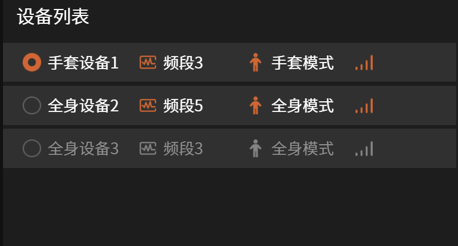

观察"传感器分布"图，即下图中每个节点指示灯亮起时，表明确认所有传感器连接成功（当全身和手套设备都已连接时，人物模型中手部节点指示灯将会熄灭，手套节点指示灯亮起）

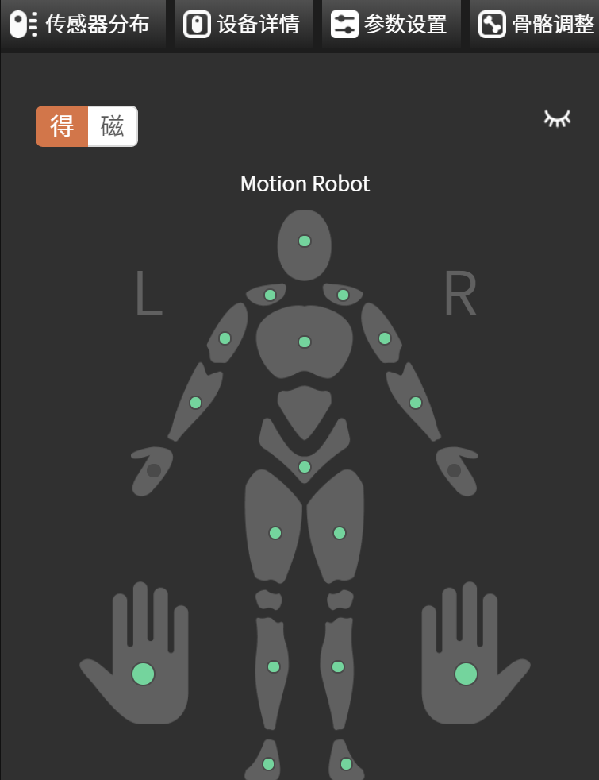

## 姿势校准

将传感器穿戴上身后，点击"姿势校准"按钮根据软件的提示进行姿态校准。各姿态的具体要求如下：

### **T-Pose**

•站直，展开双臂，与身体向上的位置垂直，掌心朝下。

•伸直手指，四指并拢。

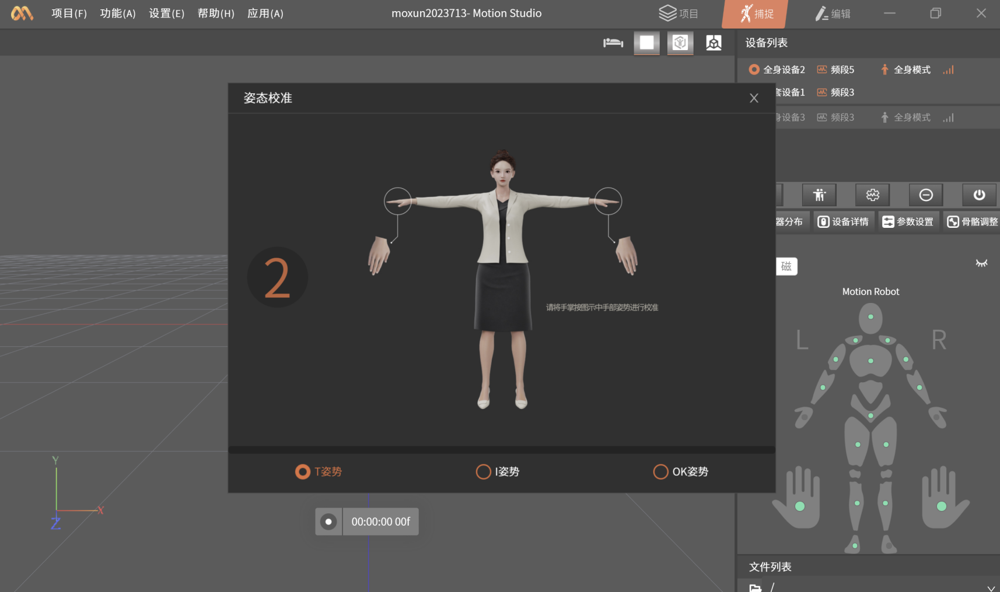

### **I-Pose**

• 站直双脚平行，与肩同宽

• 手臂自然下垂，手掌向内，手指伸直，拇指指向腿部外侧。

• 头部直视前方，下巴平行于地面。

• 肩膀放松，不要耸起。

### **OK-Pose**

• 双手置于胸前约30cm左右

• 比"OK"手势

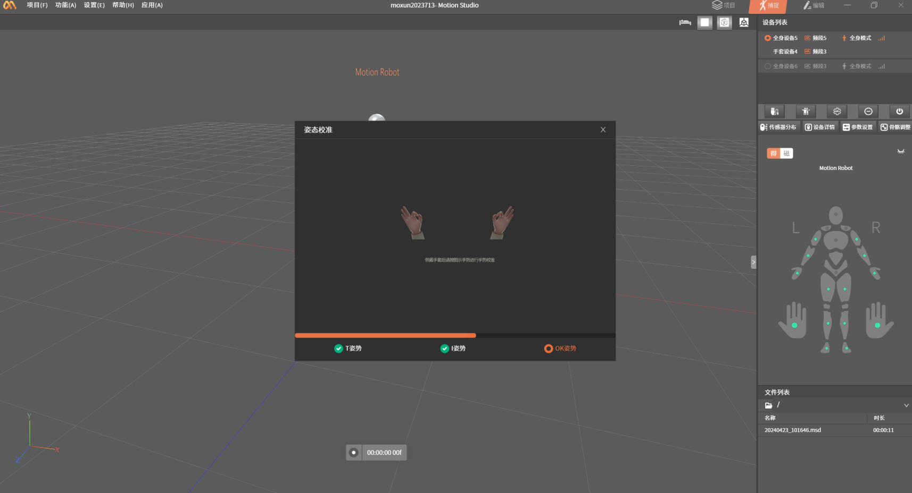

### 校准动作

基于惯性传感器的动作捕捉系统通过校准动作来计算传感器与人体之间的穿戴关系，标准的校准动作是得到良好动捕数据的基础。请仔细阅读各个校准动作的文字和图片描述，并尽可能标准的做出每一个校准动作。校准动作的标准程度会直接影响动作捕捉的表现。

比较典型的校准动作错误导致的姿态问题为：

- 正常站立时双脚内扣，A-Pose时双脚外八导致

- 正常站立时双腿外张或内缩太大，A-Pose时双脚距离过近，双腿并拢太紧，没有做到两腿平行站立

<!-- -->

- 手臂下垂时伸不直，A-Pose时手臂太过放松，放松时大臂和小臂之间会有一定的夹角，没有做到笔直朝下

- 手臂靠前或者靠后，A-Pose时手臂太过放松，没有做到笔直朝下；或者T-Pose时双臂过于向后张开

### **设备组合**

当有多套手套设备和全身设备连接时，用户可在功能中点击"设备管理"将手套设备与全身设备进行自由组合

组合后设备管理界面将会如下显示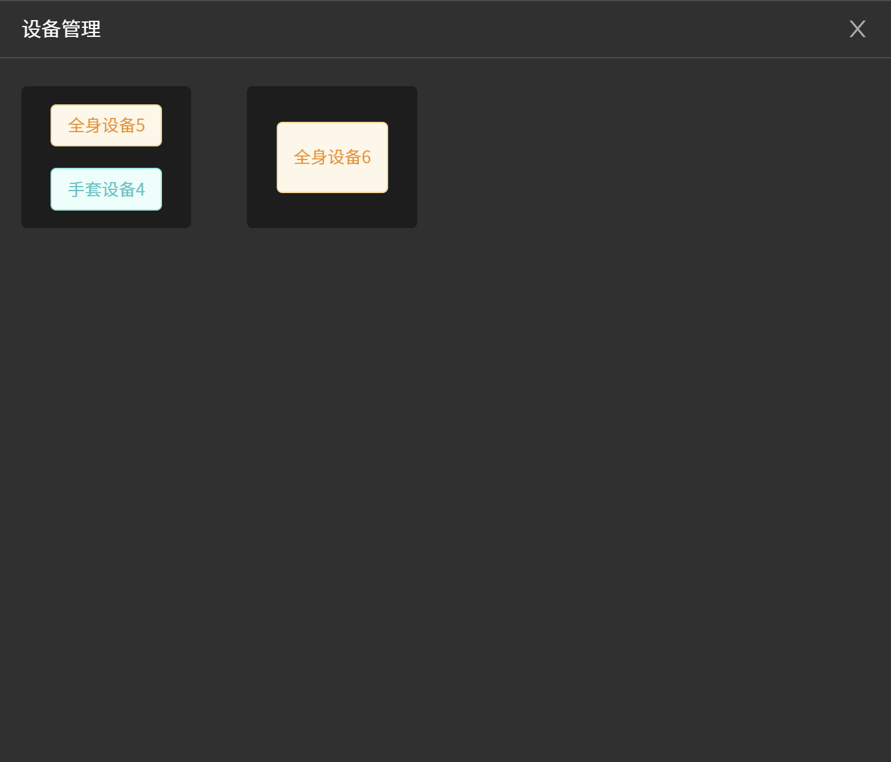

## 各按钮功能解析

### **设备列表**

设备列表中将会展示当前已连接的设备、所属频段、信号强度

### 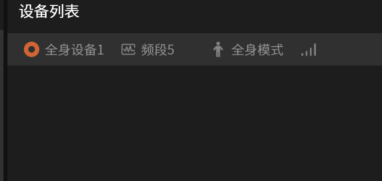

### **传感器分布**

可展示各个节点传感器得包率和磁环境情况

• 指示灯为绿色时，代表传感器得包率正常

• 指示灯为橙色时，代表传感器得包率良好

• 指示灯为红色时，代表传感器得包率较差

• 指示灯为灰色时，代表传感器未连接成功，请检查传感器与充电盒连接情况

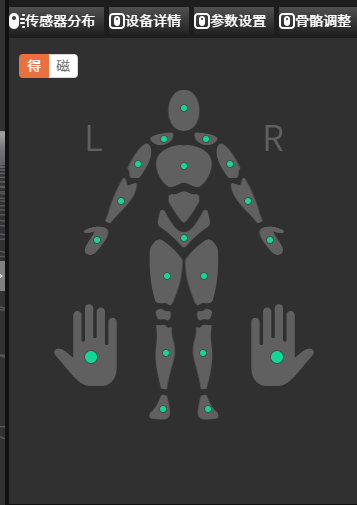

### 设备详情

显示各个传感器的详细信息，包括传感器得包率、磁环境和电量。

### **参数设置**

用户可选择不同应用场景

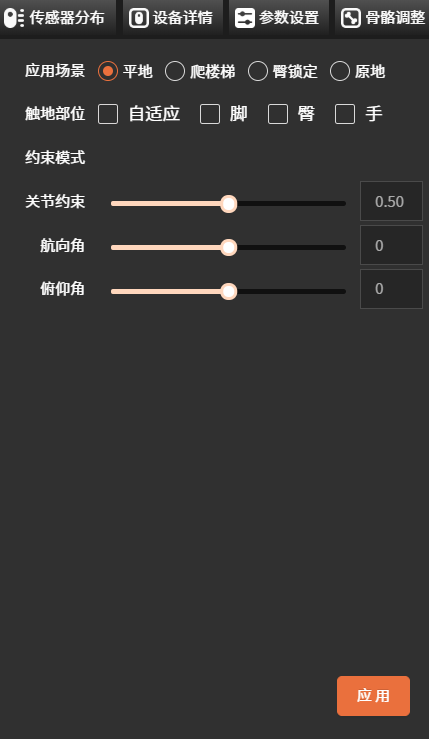

**应用场景**

- 平地：如果您的动捕场景是在平地上进行捕捉数据，请使用平地模式。

- 爬楼梯：如果您要上下楼或没有固定地面的情况下运动，请使用爬楼梯模式。

- 臀锁定：臀锁定意味着将你的虚拟人物模型的腰部锁定在某个位置。

- 原地(Beta)：在小范围内做直播或数据录制时可使用此模式，通过算法来消除惯性动捕固有的位置漂移问题。

**触地部位**

- 当您准备进行动作捕捉时候，基于您想捕捉的动作，您可以提前选择手或者脚或臀将会与地板或固定的表面接触。

- 在大多数情况下，我们会默认选择脚部接触。

**航向角**

- 调整虚拟人体模型的偏航方向。

- 可以直接在第三方软件中使用它来控制虚拟人物的方向。

**俯仰角**

- 调整虚拟人体模型的俯仰角度。

- 如果您发现虚拟人体模型过于前倾，则需将俯仰角的值调高一点。

- 或者如果您发现虚拟人体模型过于后仰，则需降低俯仰角的值。

### **骨骼调整**

此处可以自定义设置骨骼尺寸模板。

## 数据录制和播放

### **动作捕捉**

点击录制按钮，可捕捉动捕数据。录制完成后文件将会显示在文件列表中

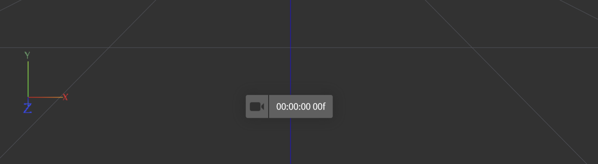

### **文件列表**

文件列表展示工程目录下所录制的所有文件信息，捕捉界面双击文件或右键菜单栏"播放"，跳转播放界面。

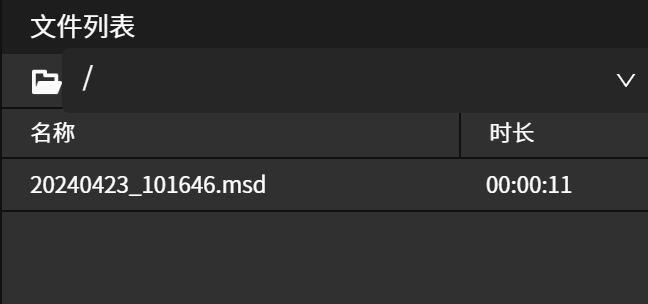

### **文件播放**

剪辑页，选中文件后，同步展示录制时获取的传感器分布/设备详情动态信息，也可使用播放栏处理文件数据，播放栏按钮功能如下：

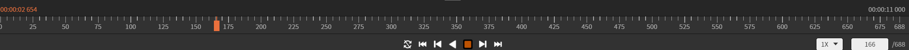

### **文件数据导出选项**

数据文件导出按钮在编辑界面文件列表处，右击文件展示导出按钮

数据文件导出主要是文件类型的选项需要选择

### 文件类型

文件类型主要分为.fbx文件，.bvh文件，以及.csv文件

#### .fbx 文件

.fbx 文件是3D动画中最广泛使用的格式之一，无需过多介绍。Axis Studio
支持导出标准的
fbx文件，且可以选择帧范围，二进制/字符串类型，以及fbx的格式版本

#### .bvh 文件

.bvh文件是由Biovision公司定义的一种精简的描述链状运动关系的数据格式，现在已经广泛应用在动作捕捉领域的各项软件中

#### .CSV文件

.csv文件名称为"Calculation
Data"。它是一个数据化输出传感器与人体关节的角度，角速度，加速度，位移等基础数据的表格文件。这些数据可以备导出为文件，也可以实时广播出去。

## BVH数据广播

除了导出文件数据以外，还有另一种方法将Motion
Studio中的数据传送到第三方软件中，即数据广播功能。

数据广播功能可以将Motion Studio中的数据实时的广播到Motion
Studio软件所在的网络中，网络对应的任何其他软件都可以通过Api接口开接收和解析实时的数据。

当实时连接上动作捕捉设备时，打开"BVH" 按钮
（按钮由灰色变成橙色即表示开启），就可以进行实时数据广播。

## **离线数据广播**

在未连接设备时，用户可通过离线数据广播，将Motion
Studio软件中录制的视频通过相同的本地IP和端口号连接到虚拟直播软件中进行视频播放，同时用户可根据喜好自定义选择人物风格与场景

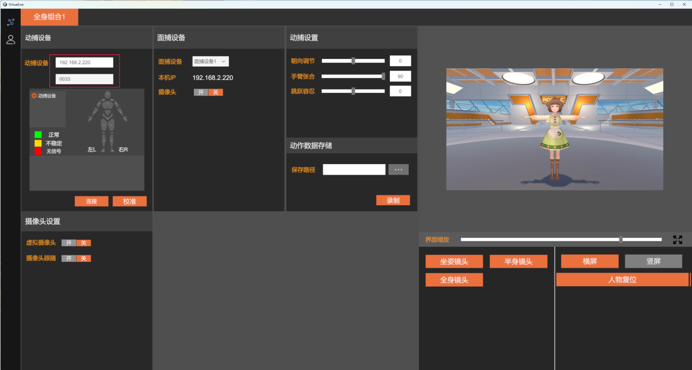

## **频段设置**

当前传感器得包率较低时，可能是当前频段信号较差，可通过频段设置切换频段。

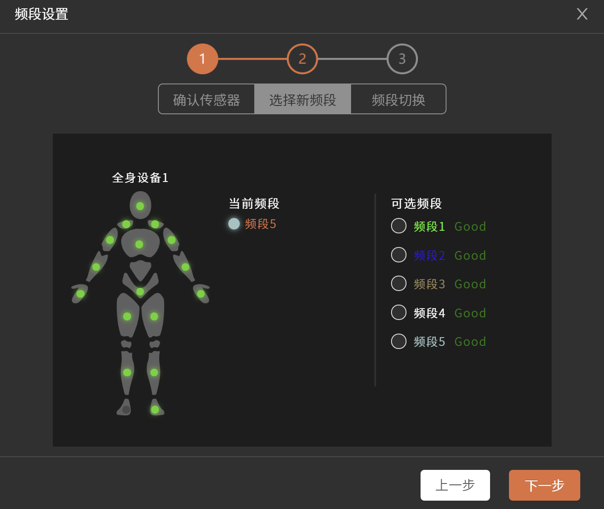

## **工作模式**

若用户只需要部分节点数据时，可进入工作模式设置，选择所需的捕捉模式，从而获得想要的捕捉效果。

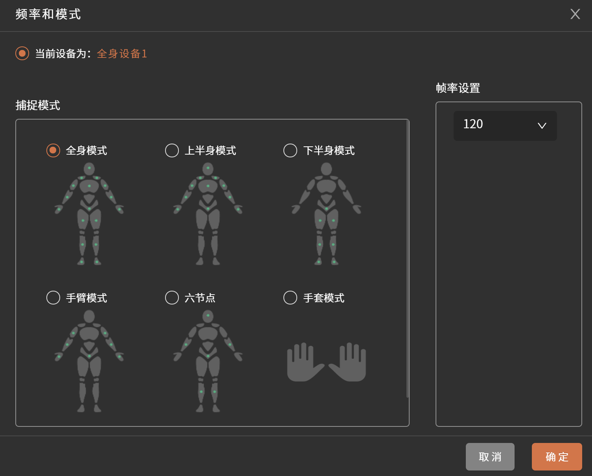

**Tips:**

1、在使用过程中当采集器硬件出现红色呼吸灯时，表示剩余电量不多。

2、请注意安装绑带时应安装牢固贴紧身体，不牢固会导致动作捕捉不准确。

3、不使用绑带（收纳绑带）时，建议绑带的毛面与勾面魔术贴粘贴起来，避免勾面魔术贴损害其他布料物件。
