**Introduction**

## **Purpose**

The rehabilitation exercise system is primarily designed to enable doctors to generate reports through rehabilitation exercises by providing a patient treatment plan, course duration, number of days per cycle, and number of exercise sets and repetitions. Patients can scan the assessment report QR code to obtain the latest rehabilitation diagnostic information. Centered on the patient, it establishes a systematic tracking plan from pre-visit, to in-clinic treatment, to home-based training. Users can review doctors and view other users' reviews on the review page. By integrating online and offline service data, the rehabilitation system establishes a standardized process to provide patients with a better treatment solution. Patient data is shared electronically among rehabilitation therapists to build full-course management data. The main functional modules include:

- Assessment: Select joints and connect to the MS device; sensors are automatically assigned based on the body part. Range-of-motion testing and assessment are performed, and a rehabilitation result report is generated.

- Training: Select a rehabilitation model based on the rehabilitation subject.

- Exercise Combination: Form personalized motion rehabilitation combined training plans tailored to different patients provided by the doctor.

- Report: Display the patient's rehabilitation training report via PDF or QR code scanning.

# **Software Overview**

## Software Features

1. Home: View the exact activity time of the rehabilitation subject.

2. Record: Record the rehabilitation plan activities of the rehabilitation subject, and collect data on the movements to render a playable rehabilitation motion video. This function consists of four steps:

    (1). Set the rehabilitation plan: includes the rehabilitation plan, duration, required number of movement sets, rehabilitation body part, and rehabilitation joint.

    (2). Check that the device is intact and the battery is sufficiently charged.

    (3). Pose calibration. Correctly wear the device according to the illustration (pay attention to node orientation and the distinction between left and right) to facilitate subsequent pose calibration and data collection. After putting on the device, perform pose calibration (T-pose and I-pose). Once calibration is complete, click "Next" to continue the rehabilitation recording.

    (4). Rehabilitation training. Rehabilitation training is carried out according to the established rehabilitation plan, performing rehabilitation movements by different sets. During rehabilitation, the rate of rehabilitation movements and the joint range of motion can be viewed through the collected rehabilitation motion data. If the pose is inaccurate during rehabilitation, pose calibration can be performed again in the interface.

3. Assessment: Select the joint to be assessed for the rehabilitation subject to evaluate the joint's range of motion. After the assessment is completed, a corresponding assessment report is generated. The content displayed in the report includes: flexion, hyperextension, pronation, and supination.

4. Report: This function is divided into the rehabilitation training report center, the rehabilitation assessment report center, and the motion record center.

## **Software Operation**

The system runs on PCs and compatible machines, using the Windows 10 or above operating system. After the software is installed, click the corresponding icon to display the software's main menu for operation.

## System Requirements

On Windows 10 or above systems, with more than 256M of memory, users can enter the specified address in the Google Chrome browser to access the system login interface.

## System Function Mind Map

# System Usage

## System Login

### **Function Description**

Select a login method (mobile phone number and verification code login, or account and password login). Read the privacy terms and user agreement on the page and check "I Agree", then enter the correct account and password and click Login to log in.

## Forgot Password

### Function Description

Click "Forgot Password" to jump to the corresponding interface. Enter the mobile phone number and verification code, click the Next button, then enter the new password and confirm password to recover the password.

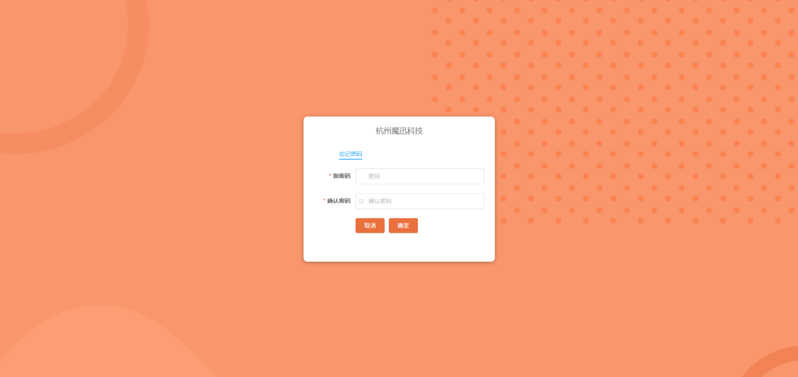

## Register Account (Rehabilitation Therapist, Rehabilitation Subject To-do)

### Function Description

Fill in the basic information of the account registration form, select the corresponding role, read the user agreement and privacy terms, check the "I Agree" button, and click Register. If you already have an account, click the Login button to jump to the login page to perform the login operation.

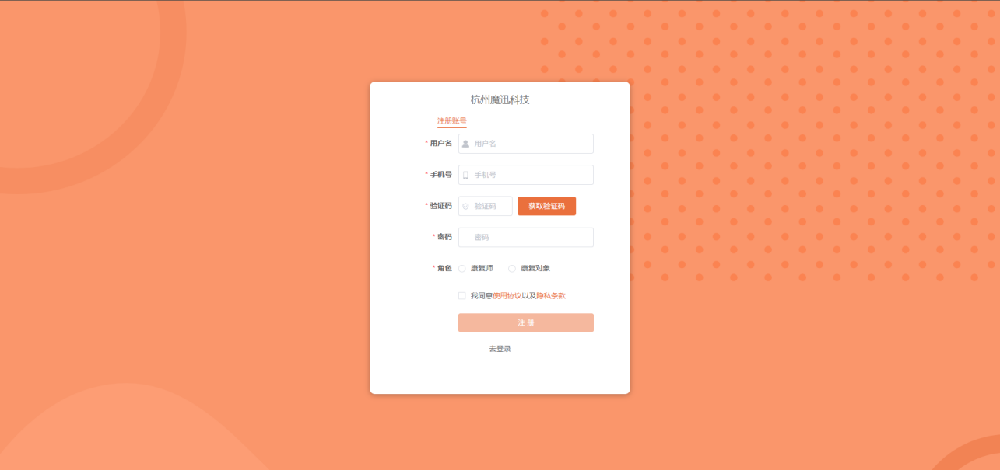

## Rehabilitation Subject List

### Function Description

Step 1: The functions include search, pagination, reset, and new rehabilitation subject.

Search: Select the items to filter in the search form area and enter the keywords to query. The list will display the query results.

Reset: After querying with form keywords, click the Reset button to clear the filter keywords and retrieve the rehabilitation subject list again.

Pagination: Paginate the list by page number and the number of items per page.

New Rehabilitation Subject: Click the + button to create a new rehabilitation subject according to the prompts.

Step 2: The above image shows the data list display before using the search function.

The above image shows the data list display after using the search function.

## Home

### Function Description

This page displays the rehabilitation patient record data in reverse chronological order, including the rehabilitation assessment name and assessment time.

## Record

### Function Description

Step 1: Set the rehabilitation plan

Rehabilitation plan setting: Fill in the form items, including the rehabilitation plan name, the required rehabilitation cycle duration, rehabilitation movement requirements, rehabilitation body part, and rehabilitation joint. After filling out the form, click the OK button to proceed to the next step.

Step 2: Check the device

Check the device: After the device is connected, this page will display the device's battery level and node part names. Different device battery levels are distinguished by different colors. Click "Previous" to jump back to the rehabilitation plan setting form page, and click "OK" to jump to the next step.

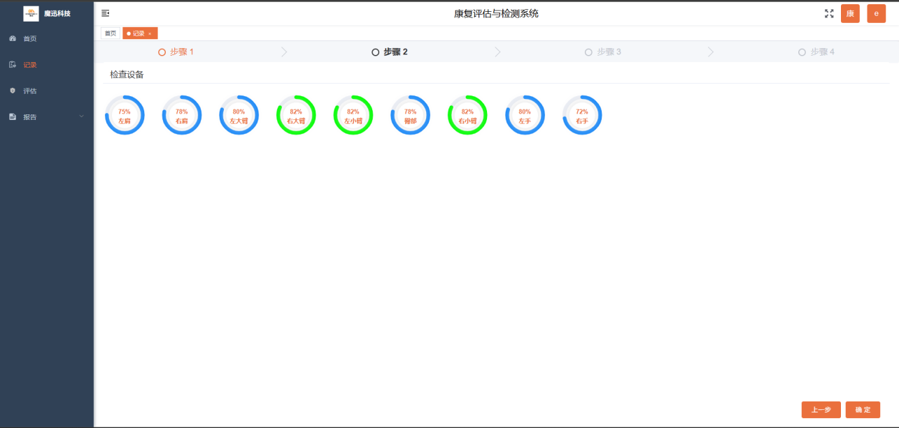

Step 3: Wearing Illustration

Wearing Illustration: The left side of the page shows an illustration of the model character wearing the device, consisting of three visual effects: front, back, and side views. The right side is the device calibration area. Clicking Calibrate will display "Calibration Started", and you should perform the corresponding calibration movements according to the calibration movement prompts. Each movement has a three-second countdown. After calibration is complete, you can proceed to the next step.

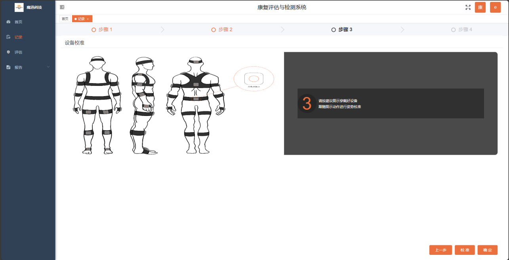

Step 4: Pose Calibration T-pose

T-pose: Raise both hands horizontally, roughly parallel to the ground, and hold still for three seconds. When the progress bar below reaches 100%, you can switch to the next calibration movement for calibration.

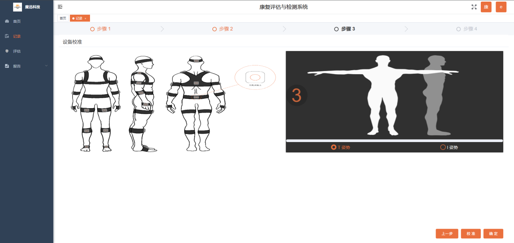

Step 5: Pose Calibration I-pose

I-pose: Stand naturally and relaxed, with both hands resting against the outer sides of your thighs. Complete the calibration after the 3-2-1 countdown.

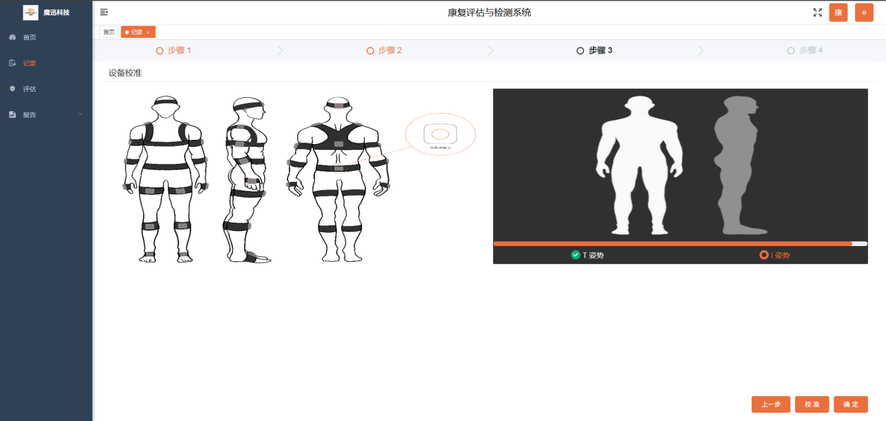

Step 6: Motion Recording

Motion Recording: After calibration with the T-pose and I-pose above, you can start recording movements. Click the record button in the middle area at the bottom of the screen to start recording, and click again to end recording.

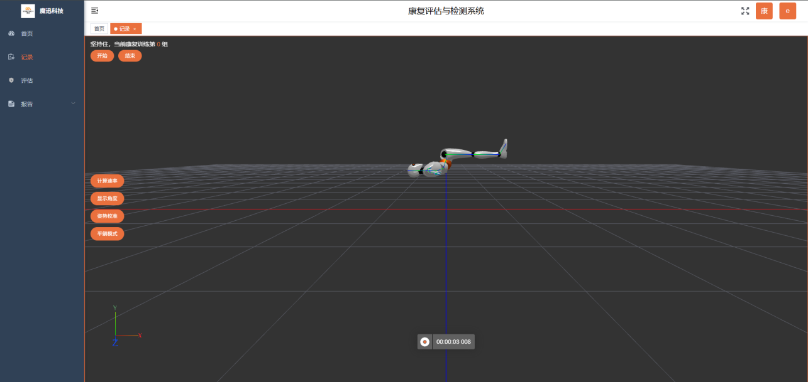

Calculate Rate: Click the End button to calculate the rate of each node and display the calculation result via a header pop-up.

Display Angle: Click the Display Angle button, and a pop-up will appear on the right showing a circular angle illustration. Click the part selection drop-down component to select a specific joint part for details.

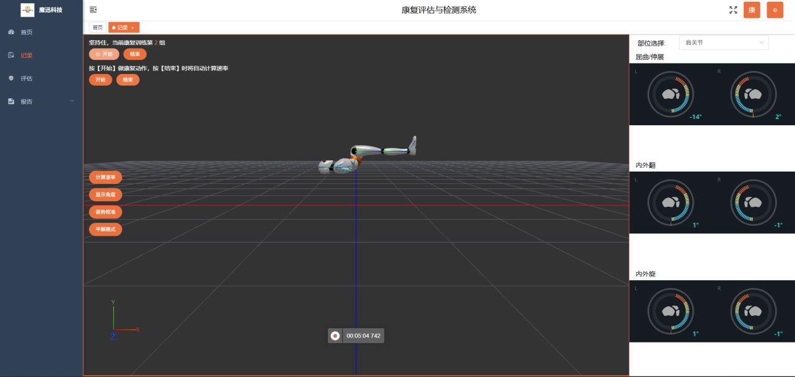

Display Angle (joint drop-down selection)

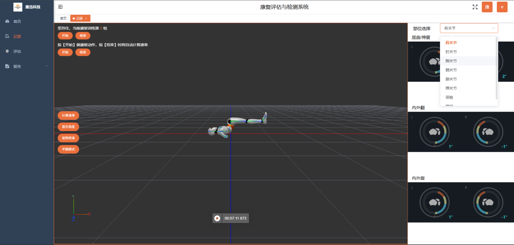

Pose Calibration T-pose: Both hands raised horizontally, parallel to the ground

Pose Calibration I-pose: Both hands hanging naturally against the outer sides of the thighs

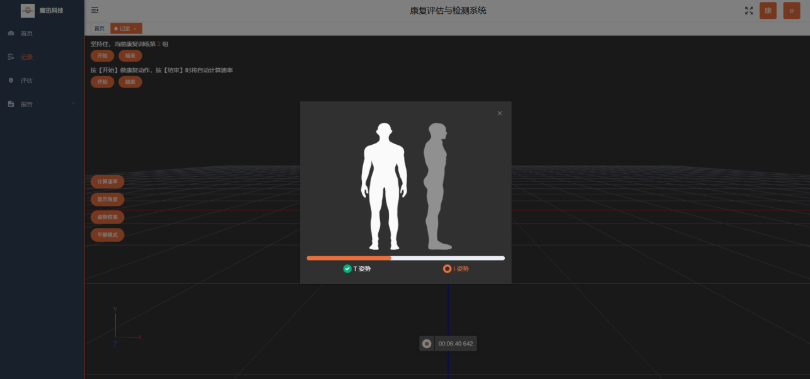

Supine Mode: Click Supine Mode, and the character model in the scene will change to the corresponding pose. The specific operation flow is similar to that of the normal mode.

Click the button to stop motion recording

## Assessment Function

### Function Description

Joint part selection: Click the drop-down to select the joint part you want to view

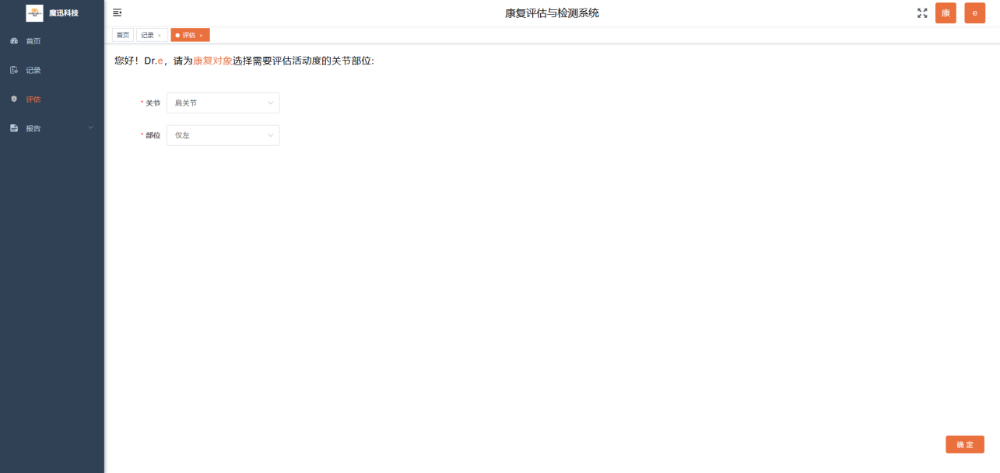

Joint drop-down options: Display joint types

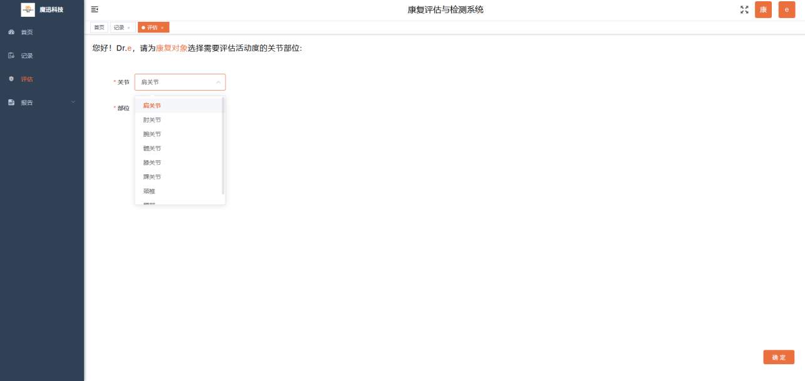

Part drop-down options: Select the left or right side of the joint

Device check: Check whether the device battery is sufficient

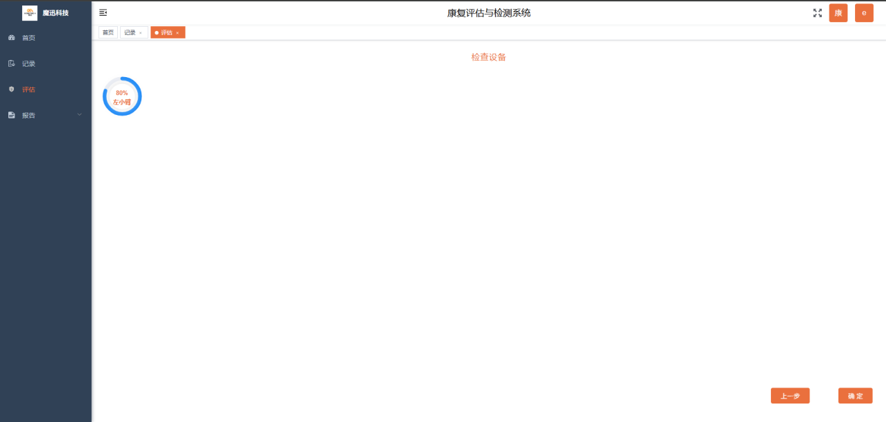

Shoulder joint assessment data collection and chart generation: The left area displays the rehabilitation movement, and the right side shows the joint angle data generated for that movement.

Previous: Click Previous to jump to the page corresponding to the previous step

Retest: Re-measure the current data to ensure data accuracy

Skip: Jump to the next step

Save: Save the current movement data

Generate assessment report (assessment time, doctor, joint, quality). Click the Save button to save the current report and jump to the home page

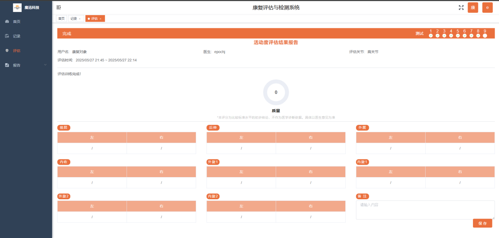

## Rehabilitation Training Report List

### Function Description

View the patient rehabilitation training list, record the list data, and sort it by time.

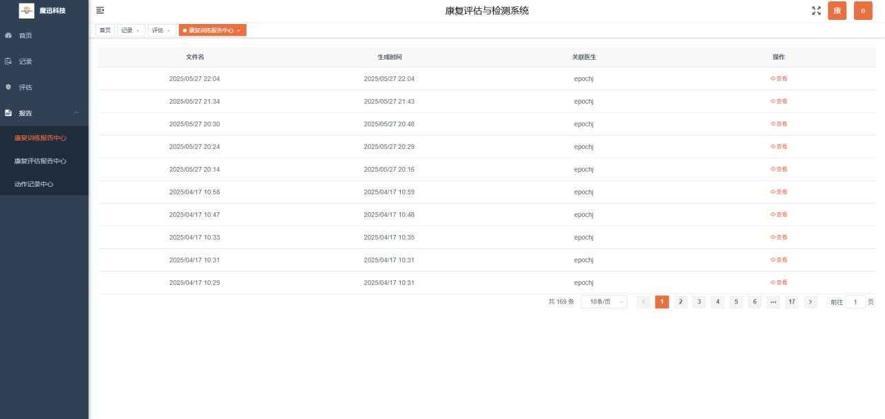

View rehabilitation training report: Click the eye icon to pop up and display the rehabilitation training report. The content includes: username, rehabilitation plan, duration, rehabilitation body part, doctor, and rehabilitation data, etc. There is a QR code at the end of the rehabilitation report. Scanning the QR code with WeChat allows you to view the rehabilitation report on your mobile phone.

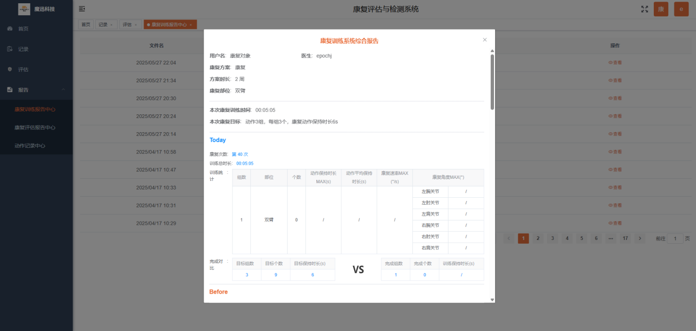

Download and print: Click the download button, and the rehabilitation report will be downloaded as a PDF.

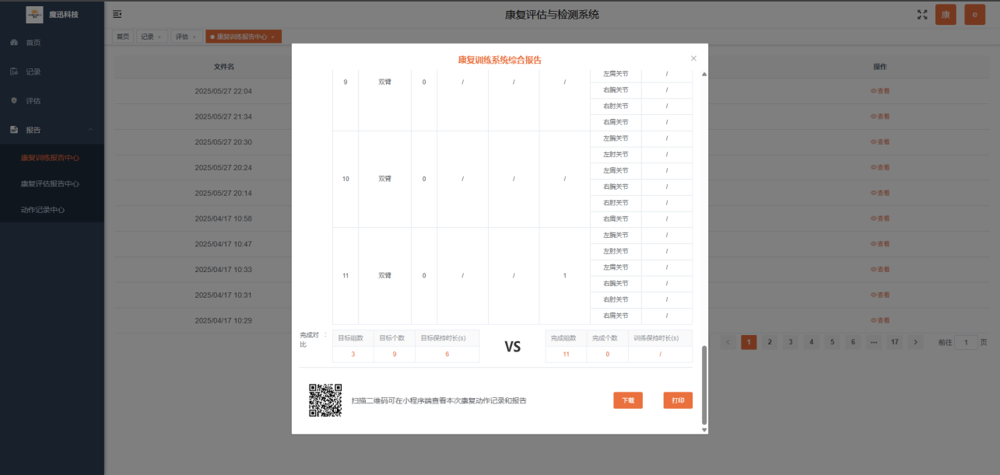

Rehabilitation assessment report list:

The list header displays the file name, generation time, and associated doctor. Click the view icon to view the report file.

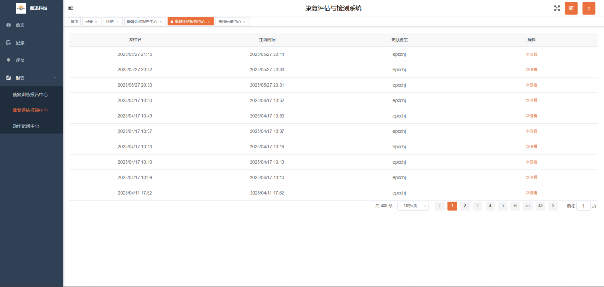

View rehabilitation assessment report: The report displays basic rehabilitation information and detailed rehabilitation body part data, and provides printing and downloading.

Motion record center: The file recorded after rehabilitation motion recording can be viewed on this page after recording is stopped.

View motion record: Click the view icon to jump to the playback page, where you can play back the corresponding recorded file's motion content.

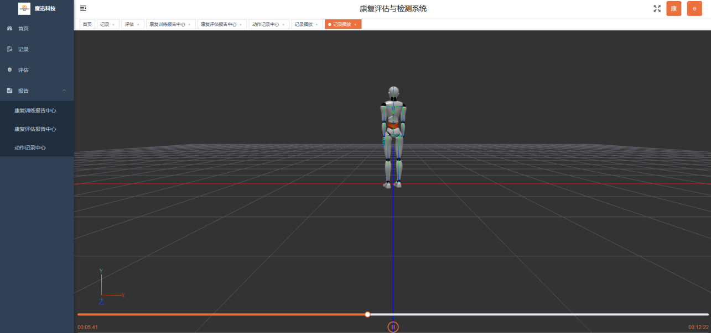

Play and pause

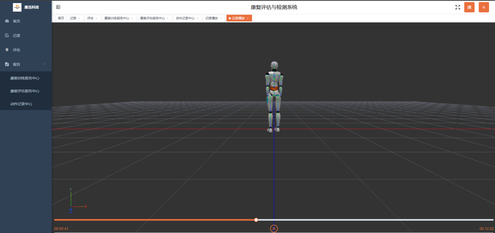

In the scene, press and hold the left mouse button and drag to switch different viewing angles to view the motion

