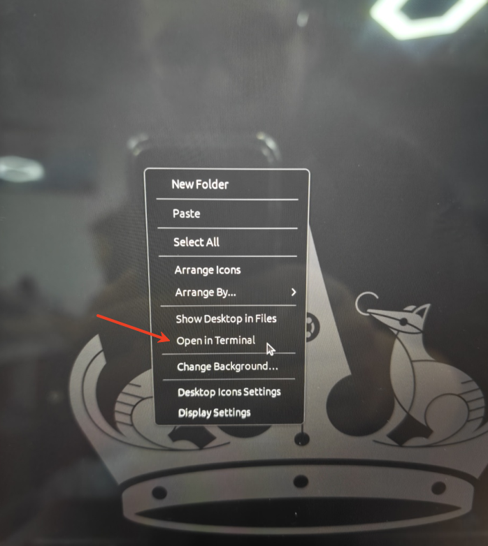
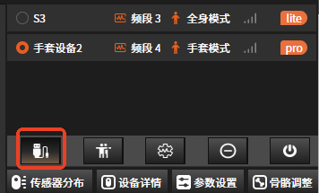
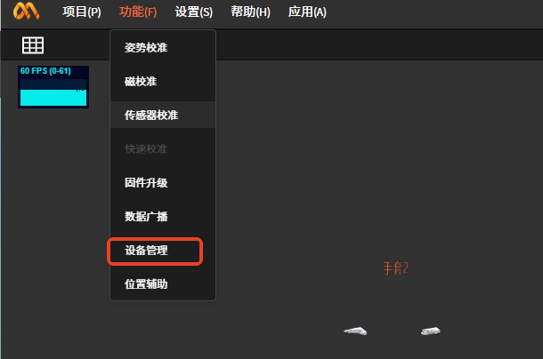
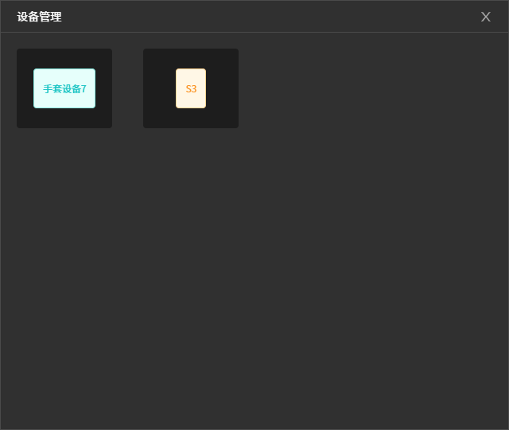
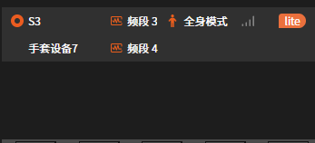
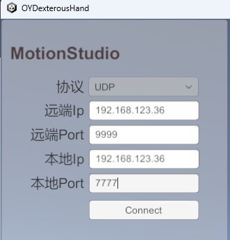
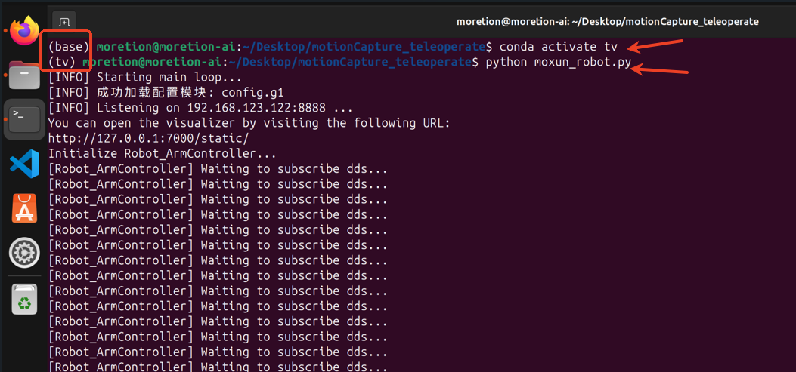

# **Moretion Device Teleoperation of Unitree Robot & AOYI Dexterous Hand**

## **Network Connection**

Use a router whose network segment is fixed at 192.168.123.xxx, because Unitree robot teleoperation can only be driven under this network segment.

## **Notes:**

- The computer running the MS software connects to the router wirelessly

- The Unitree robot connects to the router via a wired connection

- The laptop (Linux) running the Unitree robot driver script connects to the router wirelessly

## Laptop (Linux) Information

### **Check the Computer's IP**

Right-click on the desktop and select Open in Terminal, then enter the command ifconfig to check the IP. You can see that this computer's IP is 192.168.123.122

### **Set the Robot Driver Script IP and Port**

Double-click to open the moxun_robot.py script under the /home/moretion/Desktop/motionCapture_teleoperte path to set the IP and port. The IP is the one checked above, and the port can be customized, for example: 8888

### **MS Software Settings**

#### **Magnetic Calibration**

#### **Connect Devices**

#### **Combine Devices**

Using the full-body suit and the data glove without combining them may affect the robot's driving

#### **Pose Calibration**

#### **Data Broadcast**

Select UDP as the protocol type

IP and port explanation:

192.168.123.122:8888 is the IP and port set in the Huawei laptop (Linux) script moxun_robot.py

192.168.123.36:7777 is the IP and port set in the interface of the AOYI dexterous hand software

AOYI dexterous hand software settings

Requires that the Moretion data glove can properly drive the AOYI dexterous hand. For detailed instructions, see the document "Moretion Data Glove + AOYI Dexterous Hand Usage Document".

### **Run the Robot Driver Script**

Prerequisite: The above procedures have been completed, and the Unitree robot has been switched to test mode

### **Open the Console**

In the Huawei laptop (Linux), under the /home/moretion/Desktop/motionCapture_teleoperte folder, right-click and select Open
in Terminal (open the console).

### **Create a Conda Environment**

Enter the command conda activate tv and press the "enter" key to switch the environment

### **Run the Script**

Enter the command python moxun_robot.py and press the "enter" key

If all the above procedures have been performed correctly, the robot will switch to the ready state. At this point, the person wearing the motion capture equipment assumes the preparation pose shown in the figure below

Enter the command r and press the "enter" key

Under normal circumstances, the person can now teleoperate the robot

### **Exit the Program**

Press ctrl+c in the console to exit the program

Provided the console is not closed, next time you can proceed directly from "**# Run the Script**" onwards

### **Notes**

During robot teleoperation, the Moretion software cannot perform pose calibration

When teleoperating the Unitree robot & AOYI dexterous hand, the Moretion full-body suit + data glove must be switched to combined mode

Equipment list: router, Ethernet cable, computer running the MS software (Windows), computer running the teleoperation (Linux), full-body motion capture device (1), data glove motion capture device (1)
