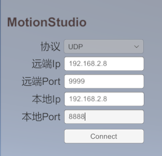
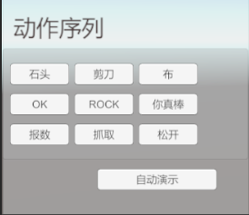

**Moretion Data Glove + AOYI Dexterous Hand User Guide**  

---

**Overview**  
This software receives glove motion capture data from MotionStudio over a network connection and drives the AOYI dexterous hand to perform the corresponding actions.

---

**AOYI Dexterous Hand Resources**  

| Resource Type    | Link                                                                        |
|:-------:|:-------------------------------------------------------------------------:|
| Product Documentation    | [OHandSetting使用手册-V1.4.pdf](./assets/OHandSetting使用手册-V1.4.pdf)         |
| Protocol Documentation    | [OHandSerialProtocol_CN.md](./assets/OHandSerialProtocol_CN.md)         |
| CH340 Driver | [CH34x_Install_Windows_v3_4.zip](./assets/CH34x_Install_Windows_v3_4.zip) |
| Graphical Software   | [Windows.rar](./assets/Windows.rar)                                       |

---

**Software Download and Usage**  

**Software Download**  

| Version                                                                | Date         | Release Notes                                                                                             |
| ----------------------------------------------------------------- | ---------- | ------------------------------------------------------------------------------------------------ |
| [OYDexterousHand_V2.0.0.rar](./assets/OYDexterousHand_V2.0.0.rar) | 2025-10-28 | 1. Supports the right-hand dexterous hand 2. Supports multiple MS devices 3. Supports multiple Moretion devices driving multiple dexterous hands 4. Supports a single Moretion device driving multiple dexterous hands 5. Supports UDP communication 6. Optimized the rock gesture |
| [OYDexterousHand_V1.1.0.rar](./assets/OYDexterousHand_V1.1.0.rar) | 2025-09-22 | 1. Supports driving specific gestures (such as rock, scissors, paper, etc.) 2. Supports demo mode                                                              |
| [OYDexterousHand_V1.0.0.rar](./assets/OYDexterousHand_V1.0.0.rar) | 2025-09-17 | Supports the Moretion data glove driving the AOYI dexterous hand (left hand)                                                                                |

---

**Software Usage**  

**1. Connect to MotionStudio**  

1. Enable data broadcasting in MotionStudio and configure the relevant settings.  
2. In this software, enter the IP address and port configured in MotionStudio, then click Connect (only the UDP protocol is supported).  

> **Note**: MotionStudio and this software must be on the same local area network, and the IP address and port must be configured correctly.  

  
  

---

**2. Connect to the AOYI Dexterous Hand**  
Select the serial port corresponding to the dexterous hand and connect to the device. If you are unsure of the serial port number, try unplugging and re-plugging the device and observe which serial port number changes.  

> **Note**:  
> 
> - **The higher the synchronization frequency, the more likely the dexterous hand is to overheat**.  
> - Before using the data glove, make sure to perform magnetic calibration; otherwise, the thumb motion performance may be affected.  

  

---

**3. Switch Drive Modes**  
Two drive modes are currently supported:  

- **Mode 1**: Drive using the data glove (real-time data).  
- **Mode 2**: Drive using specific data (offline data).  
  After switching to specific-data mode, you can execute preset gestures such as rock, scissors, and paper.  

  
  

---

**Demo**  

| Demo Content        | Link                                |
|:-----------:|:---------------------------------:|
| Moretion data glove driving the dexterous hand | [Demo 1.mp4](./assets/video01.mp4) |
| Specific gesture data driving the dexterous hand | [Demo 2.mp4](./assets/video02.mp4) |
