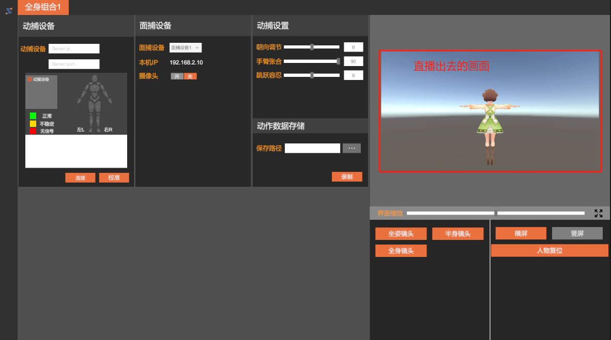
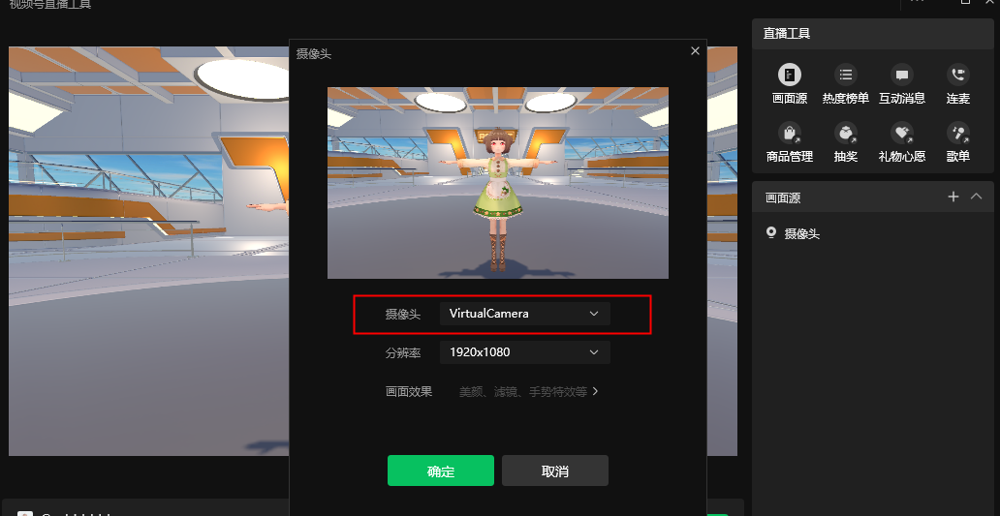
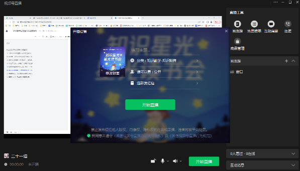
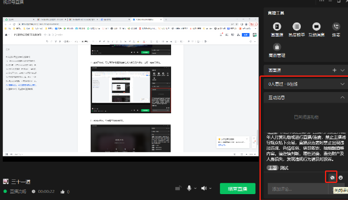
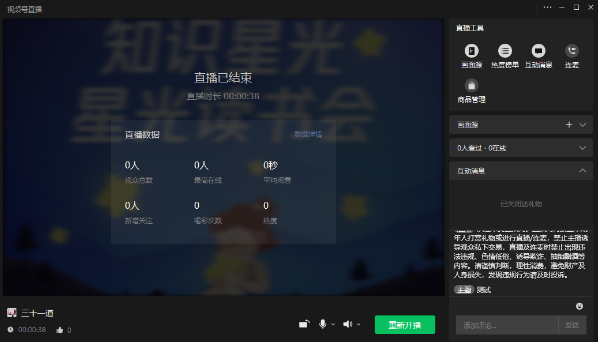

**WeChat Channels Live Streaming (Draft)**

**There are two methods for WeChat Channels live streaming**

**Method 1 (Push streaming)**

Use the push streaming address provided by Channels, and output the live stream through the virtual live streaming program (this method is recommended). You can control which scene is broadcast.

{width="6.15625in" height="3.4375in"}

**Method 2 (Using the Channels live streaming tool)**

1.  **Configure and launch on the WeChat Channels Assistant website**

Website URL: <https://channels.weixin.qq.com/platform/live/home>

{width="6.15625in" height="2.8125in"}

**2. Upgrade the Windows WeChat client to the latest version, then click the button in the lower-left corner - Channels Live (not yet supported on Mac)**

{width="6.15625in" height="4.84375in"}

**3. If this is your first time live streaming on Windows WeChat, a plugin download prompt will appear. After downloading and installing it, you will see the live streaming preparation screen**

{width="6.15625in"
height="3.5208333333333335in"}

**4. Select Add Scene Source. There are six options: "Camera", "Phone Screen", "Window", "Multimedia", "Game Process", and "Desktop". Follow the on-screen instructions. Click [Camera] to select an external camera**

Enable the virtual camera in the virtual live streaming software, then in the Channels live streaming tool select the camera named "VirtualCamera", and confirm.

{width="6.145833333333333in"
height="3.1458333333333335in"}

{width="6.145833333333333in"
height="3.1770833333333335in"}

**5. In the upper-right corner of the Channels live streaming interface, click "..." - "Settings" to configure the microphone, speaker, canvas size, and whether to show the mouse cursor**

{width="6.052083333333333in"
height="3.4479166666666665in"}

{width="6.15625in"
height="3.5729166666666665in"}

**6. After clicking Start Live Streaming, you can modify the live streaming category, add a live streaming description, and change the cover image. Once everything is confirmed, click "Start Live Streaming"**

{width="6.21875in"
height="3.5520833333333335in"}

**7. After the live stream starts, you can view the current number of online viewers and user comments on the right side of the screen, and you can also disable comments with one click**

{width="6.145833333333333in"
height="3.53125in"}

**8. After the live stream ends, you can review the data for this session. You can also click [Data Details] to go to the Channels Assistant management portal for detailed data analysis**

{width="6.239583333333333in"
height="3.5625in"}
