# **Virtual Live Streaming Software Tutorial**

## I. Magnetic Calibration (Place the collectors in the charging case — not charging)

1.1 Connect the receiver to the computer

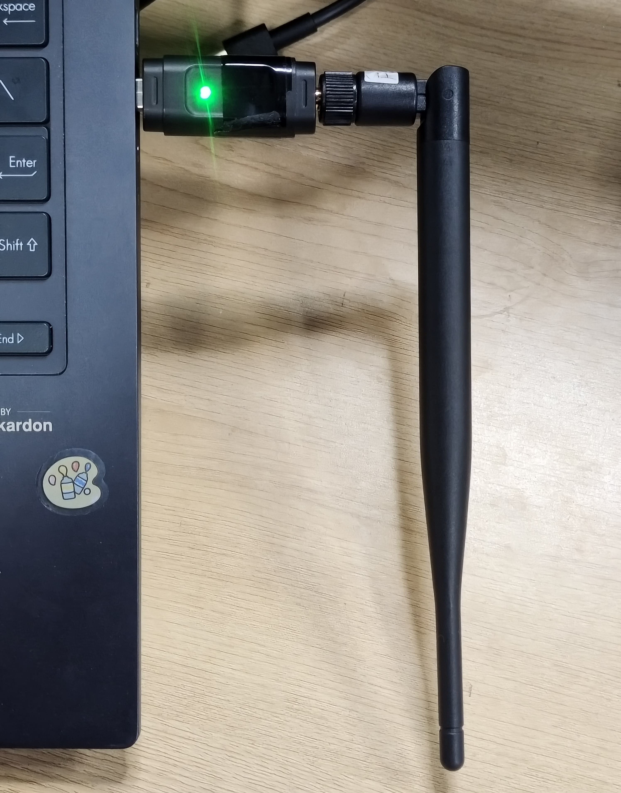

**1.2 Open the magnetic calibration tool**

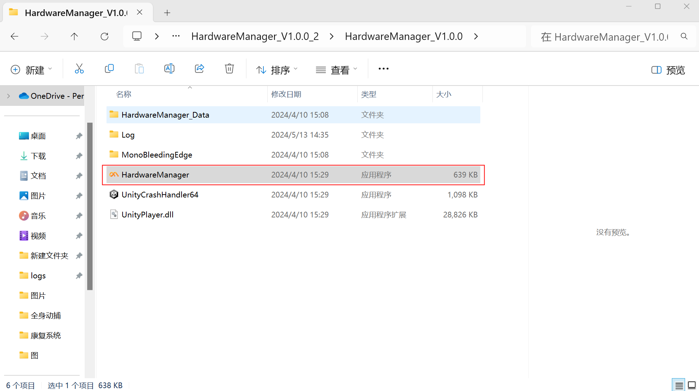

**1.3 Device connection**

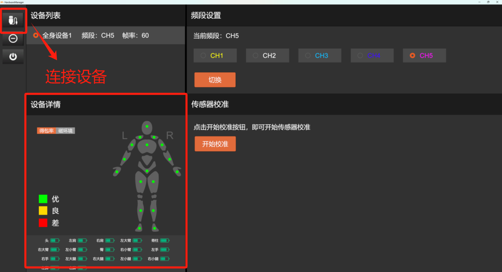

After a successful connection, the indicator lights for each node in the device details will turn on.

**1.4 Watch the magnetic calibration tutorial video**

During magnetic calibration, rotate 360 degrees around each of the X, Y, and Z axes of the spatial coordinate system, taking approximately 2–4 seconds to complete a full 360-degree rotation.

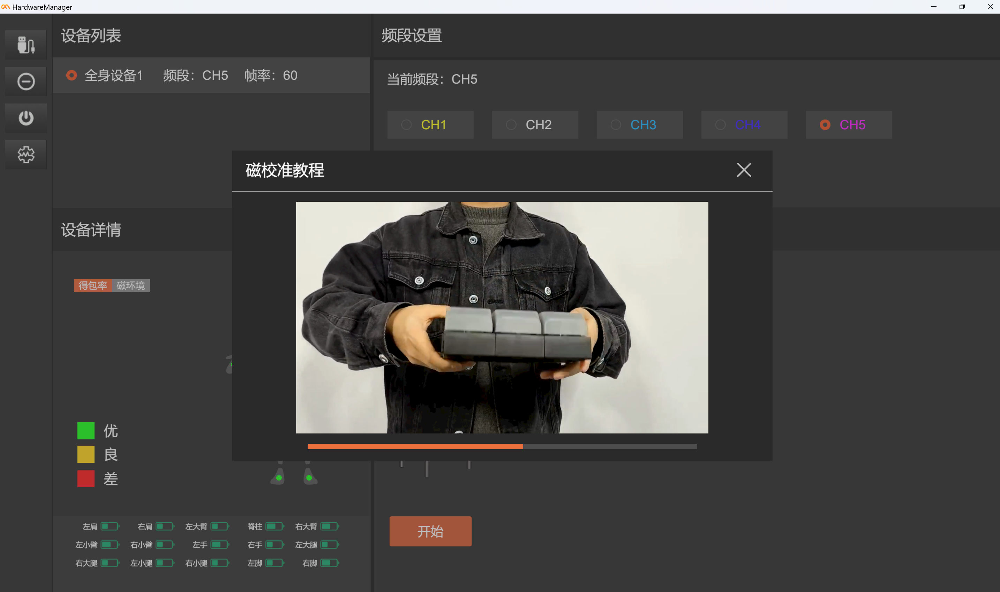

[Please view the attachment "video_20240126_143958.mp4" on DingTalk Docs](https://alidocs.dingtalk.com/i/nodes/DnRL6jAJMN4DwEzrCP0ky90N8yMoPYe1?iframeQuery=anchorId%3DX02ls1g7cq4sznfov1vimi)

1.5 Magnetic calibration operation

Perform the magnetic calibration according to the tutorial video.

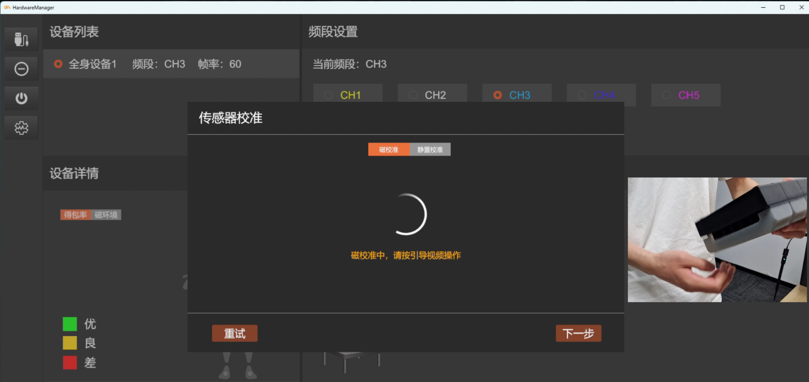

Before clicking Next, make sure the sensors are kept stationary so that the sensors can be calibrated successfully.

Calibration successful

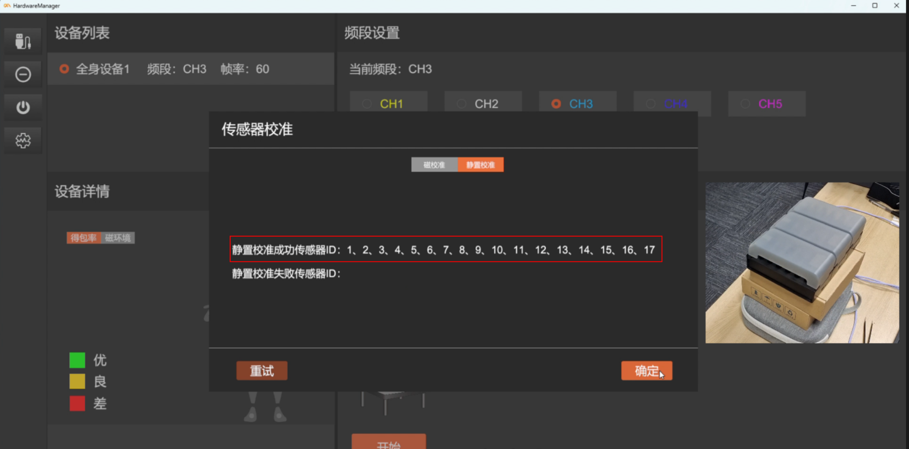

Once successful, you can close the magnetic calibration tool.

## **II. Using the Motion Studio Software and Wearing the Device**

**2.1 Open the Motion Studio software**

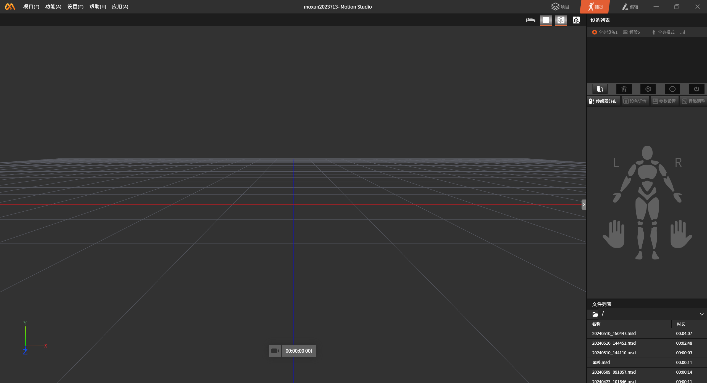

**2.2 Connect the device**

When a device appears in the device list, click the connect button to connect the device.

2.3 Wearing the device

1. Wearing the straps

Attach each strap in turn to the corresponding position shown in the figure below, following the placement instructions on each strap. Because Hengzhuo sensors measure skeletal motion, you should eliminate physical interference from muscle movement as much as possible. Choose locations with the least muscle mass for the best capture results. The pose calibration performed later will recalculate the wearing positions, so it is acceptable if your placement differs slightly from the figure.

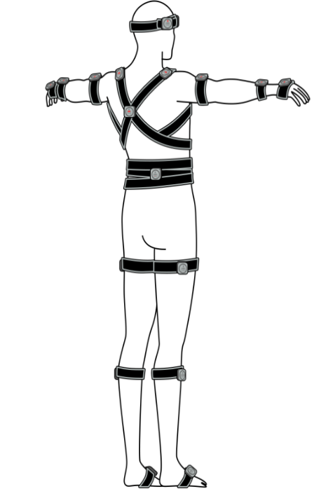

2. Attaching the sensors

Attach the sensors into the straps following the method shown in the figure.

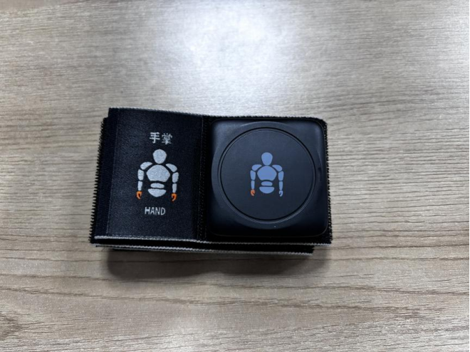

3. Sensor placement instructions

**Upper body:**

1. The head sensor is installed at the **back center of the head**.

2. The shoulder sensor is installed **directly on top of the shoulder**, as far **outward** as possible.

3. The hip sensor is installed **below the waist**, as far down as possible **near the tailbone**. When wearing this node's sensor, the **charging port should face upward**.

4. The upper arm sensor is installed at the **outer middle of the upper arm**.

5. The forearm sensor is installed at the **outer middle of the forearm**.

6. The hand sensor is installed on the **back of the hand**.

**Lower body:**

1. The thigh sensor is installed at the **outer middle of the thigh**, 2–3 cm above the knee.

2. The shin sensor is installed at the **outer middle of the shin**, 2–3 cm below the knee.

3. The foot sensor is installed on the **instep**. Wrap the strap around the arch of the foot as much as possible so that it does not accidentally detach while walking.

**Notes:**

• When installing the straps, fasten them firmly against the body to ensure that the sensor nodes do not shake violently during large movements.

• When working, the motion capture performer must ensure that they are not carrying phones, watches, or other electronic devices, or strong magnets such as keys or coins. The magnetic interference generated by these electronic devices and strong magnets will seriously affect the operation of the sensors.

• Hengzhuo sensors contain magnetometers, and magnetometer sensors are affected by strong magnetic field environments. Users must use the sensors in an environment with minimal magnetic interference.

2.4 Pose calibration

After the device is successfully connected, click pose calibration and follow the prompts to perform T-Pose and A-Pose calibration.

**T-Pose**

• Stand straight, extend both arms perpendicular to the upward position of the body, with palms facing down.

• Straighten your fingers and keep the four fingers together.

**I-Pose**

• Stand straight with your feet parallel and shoulder-width apart.

• Let your arms hang naturally with palms facing inward, fingers straight, and thumbs pointing toward the outside of your legs.

• Keep your head looking forward with your chin parallel to the ground.

• Relax your shoulders; do not shrug them.

**OK-Pose**

• Place both hands about 30 cm in front of your chest.

• Make an "OK" gesture.

**2.5 Click Data Broadcast to enter the BVH data broadcast operation**

The data broadcast feature can broadcast data from Motion Studio in real time across the network where the Motion Studio software is located. Any other software on that network can receive and parse the real-time data through the API interface.

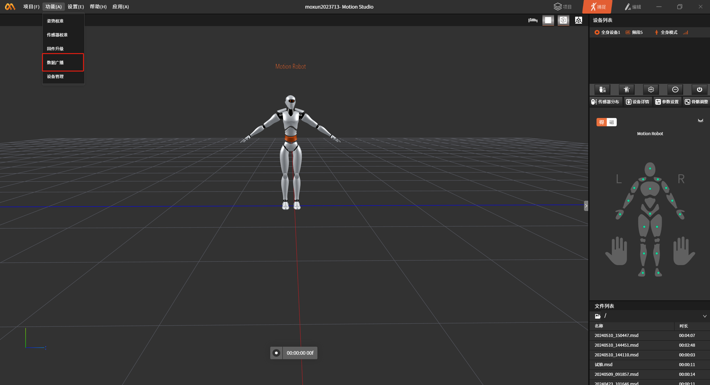

When real-time connection to the motion capture device is established, turn on the "BVH" button (the button changes from gray to orange to indicate it is enabled) and enter a custom port number to start real-time data broadcasting. This feature can be applied to virtual live streaming.

## III. Using the VirtualLive Virtual Live Streaming Software

**3.1 Open the VirtualLive package**

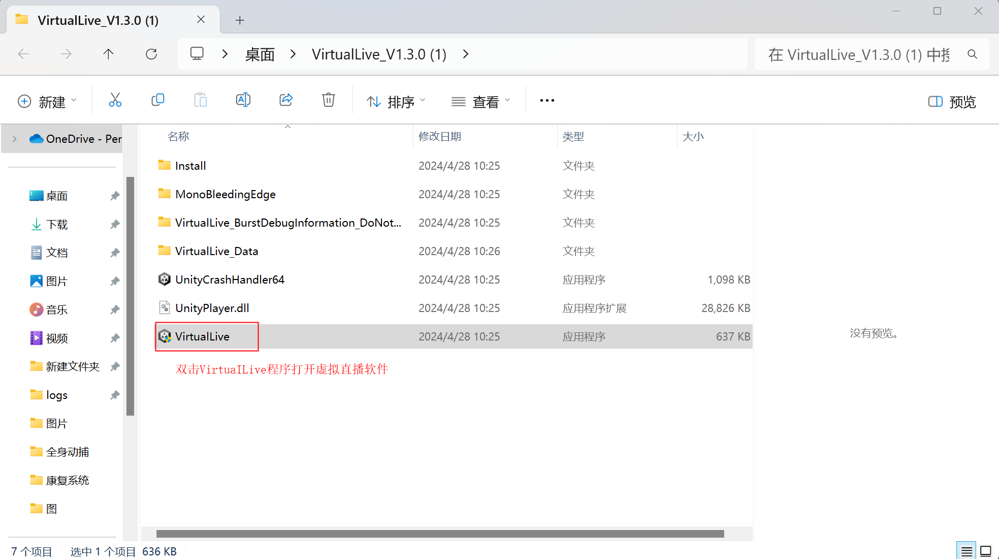

**3.2 Enter the virtual live streaming interface, enter the same port number as in the Motion Studio data broadcast, and connect to Motion Studio**

After a successful connection, the character in the virtual live streaming interface will be synchronized with the character's motion in Motion Studio.

**3.3. In the lower right corner of the interface, you can freely switch the character camera and between landscape/portrait orientation, and you can also reset the character with one click**

 The software supports motion capture settings, including arm spread, orientation adjustment, and jump tolerance.

In the software, users can also freely switch between character models and scene models, with a total of 4 different character model styles and 2 scenes.

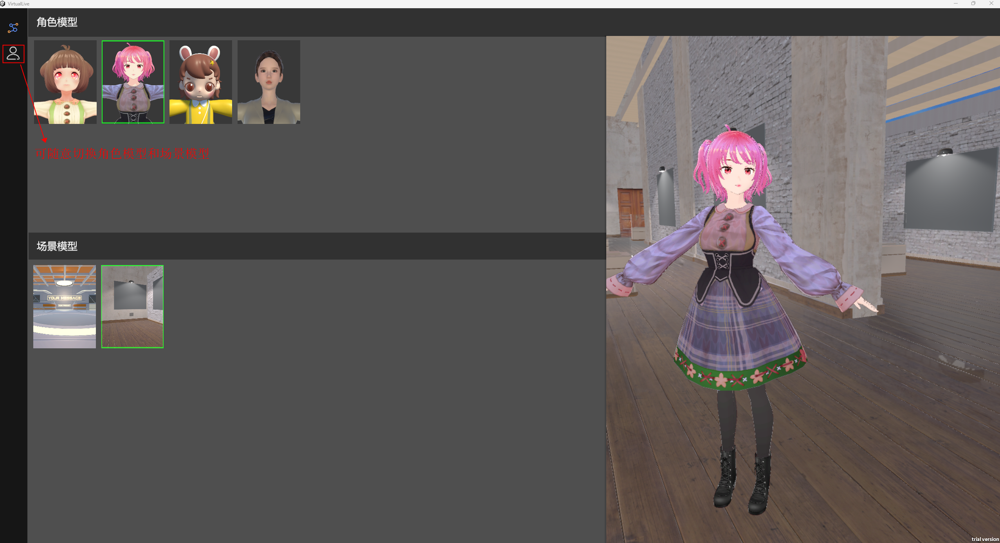

**3.4 Connect the face capture device**

Turn on the camera switch to enable the face capture feature.

Download the Face Capture software from the Apple App Store, and make sure that the phone and the computer are on the same WiFi or cellular data.

Open the Face Capture software. When a device is detected, click Connect to connect.

Once connected, mount the phone on the helmet, put on the helmet, and you can start virtual live streaming.

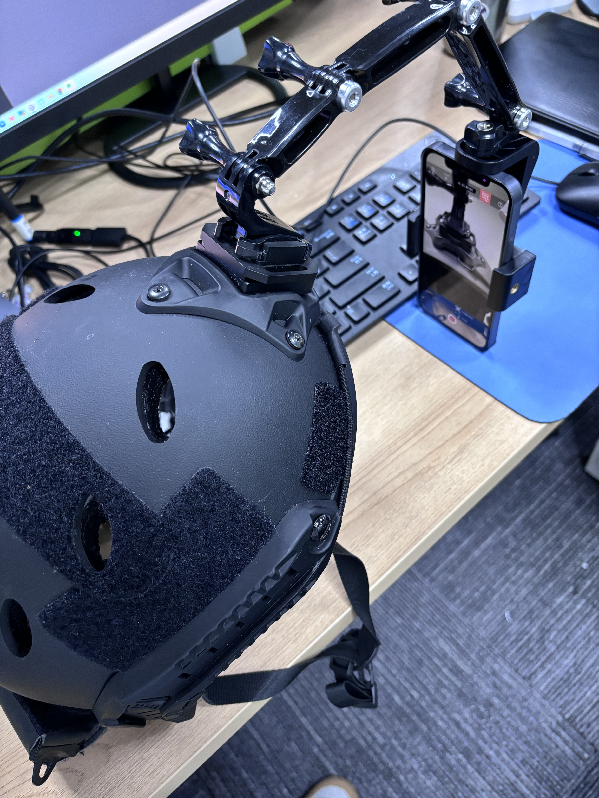

**3.5 Data recording**

Supports recording motion data and saving it to a custom file path.

**3.6 How to set up a virtual camera on mainstream platforms?**

On PC, the setup is the same regardless of which live streaming platform assistant (Video Account Live Assistant, etc.) or third-party tool (OBS, etc.) you use.

**The following uses Video Account Live Assistant as an example**

Enable the virtual camera in the virtual live streaming software.

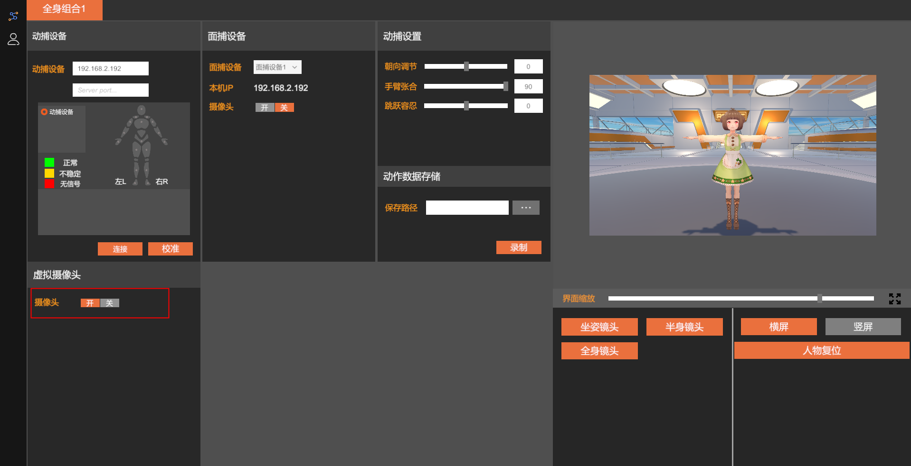

**In Video Account Live Assistant, select Add scene source, choose "Camera", select the camera named "VirtualCamera" with a resolution of 1920\*1080, then click OK.**

