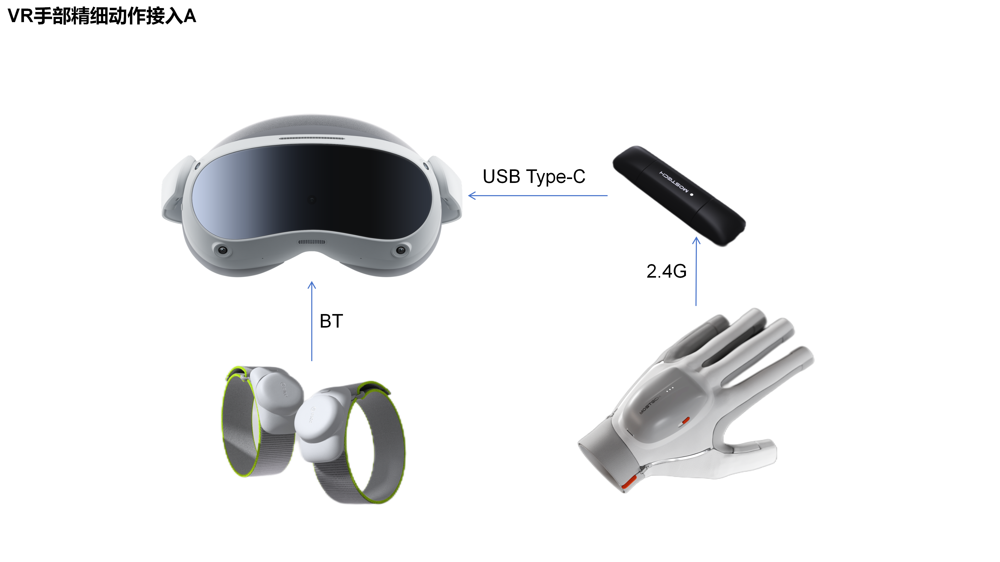
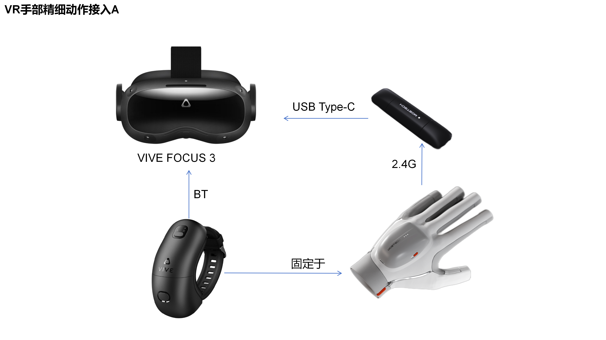
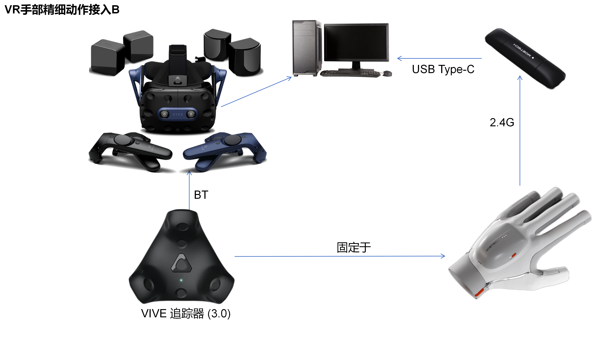

# VR Device Support Notes

## 1. G1 + PICO + Body Tracker

A body tracker is required to provide positional data for the data glove. An Android SDK is provided, allowing the VR headset to obtain data glove data directly via a receiver.

## 2. G1 + FOCUS + Wristband

It is recommended to use the HTC wristband tracker to provide positional data for the data glove. An Android SDK is provided, allowing the VR headset to obtain data glove data directly via a receiver.

## 3. G1 + VIVE Pro 2 + Tracker 3.0

The tracker should be worn on the wrist. Mounting straps for the trackers can be found by searching "tracker strap" on Taobao.

## 4. Z1 / Z1 Pro + Tracker 3.0

This can serve as a positional assistance feature, or it can be combined with VIVE Pro 2 to capture and view full-body motion in VR. The accompanying structural parts can be 3D printed on your own or purchased as a set from sales. They can be downloaded from the Z1 series hip node section under [3D Printing Parts]([Product Accessories - 3D Printing Parts](https://moretion.github.io/others_3d_printing/3d_printing/index.html)). The wrist node structure can be used for the forthcoming arm pose dynamic correction feature, which requires wearing two additional Trackers on the wrists.

## 5. Z1 + Self-Tracking Tracker

This can serve as a positional assistance feature, or it can be combined with HTC standalone headsets that support self-tracking trackers (such as FOCUS or the XR suit) to capture and view full-body motion in VR.
