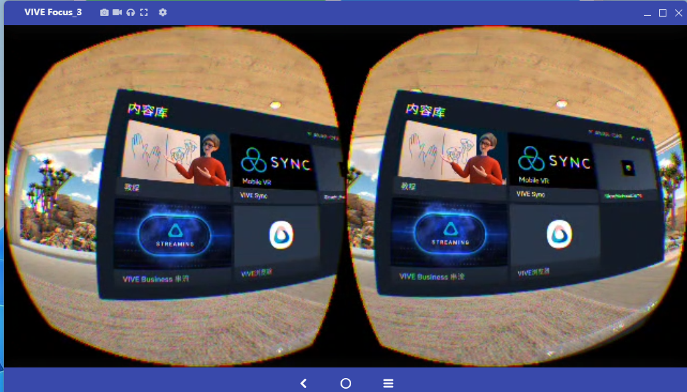
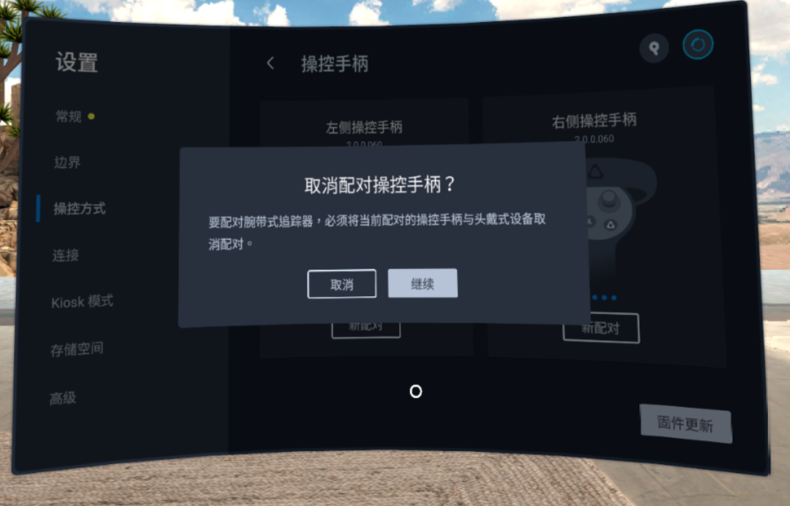
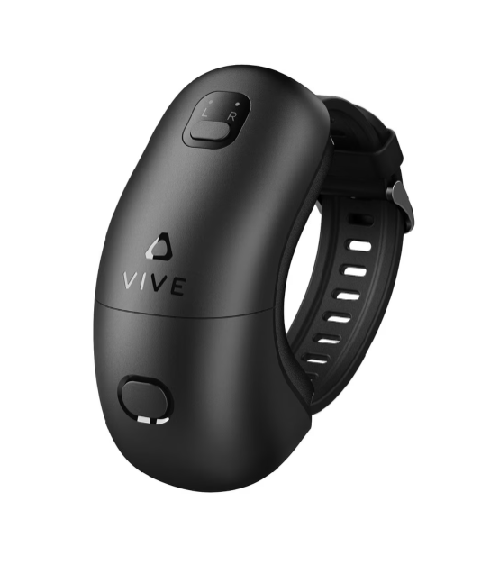
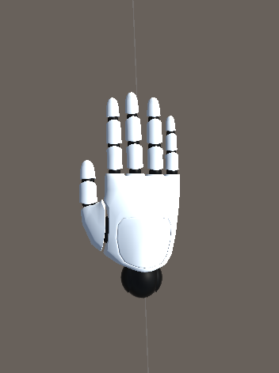

# **Using the G1 Data Glove with HTC Focus3**

## 1. Development Package

Download link: [GloveInteraction.unitypackage](https://docs.mostech.asia/ap_vr/GloveInteraction.unitypackage)

Demo scene:

## **2. Download the Data Glove Software Installation Package**

Download the file to your computer

[View the attachment "MotionCapture_Glove_Focus_1.1.0.apk" on DingTalk Docs](https://alidocs.dingtalk.com/i/nodes/np9zOoBVByPenbv3CyqKY1D0W1DK0g6l?iframeQuery=anchorId%3DX02m54p6859ykc5wg145te)

### **2.1 Download the Tool** Vysor

[View the attachment "Vysor-win-5.0.7.exe" on DingTalk Docs](https://alidocs.dingtalk.com/i/nodes/np9zOoBVByPenbv3CyqKY1D0W1DK0g6l?iframeQuery=anchorId%3DX02m1022ipiliyrzp4rys)

### **2.2 Install the Application**

Using the Vysor software, you can easily establish a connection between the Focus and your computer. Select file transfer on the Focus. Then drag the MotionCapture_Glove_Focus.apk into the screen below, and the apk will be installed automatically on the Focus.

## **3. Using the Data Glove Software**

### **3.1 Connect the Wristband Tracker**

Before using the software, make sure two wristband trackers are connected. If controllers are connected, disconnect them first.

Settings > Control Method > Select Wristband Tracker, then follow the prompts to connect.

### **3.2 Open the Software**

Open the GloveHtcFocusDemo software from the content library.

### **3.3 Workflow in the Software**

Prerequisites: the data glove receiver is plugged into the PICO, and both data glove devices are powered on.

Collect data

First click the Collect Data button and check whether the packet rate is 0. If it is 0, check whether the data glove is powered on.

If the packet rate is very low, switch the channel in the Motion Studio PC software.

Pose calibration (hands must point toward the target)

Once there are no issues above, click the Pose Calibration button. Refer to the poses below.

Arm pose

Hand pose

## **4. Stream the Display to a PC**

[https://www.vive.com/cn/support/focus3/category_howto/casting-to-pc.html:
https://www.vive.com/cn/support/focus3/category_howto/casting-to-pc.html](https://www.vive.com/cn/support/focus3/category_howto/casting-to-pc.html)

[View the attachment "VIVE_FOCUS3_UG_CHS.pdf" on DingTalk Docs](https://alidocs.dingtalk.com/i/nodes/np9zOoBVByPenbv3CyqKY1D0W1DK0g6l?iframeQuery=anchorId%3DX02m9j7l94vwy20xwwrvih)
