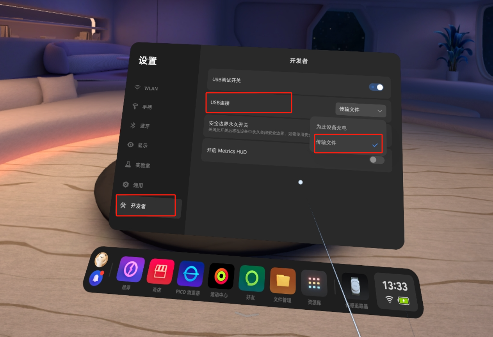
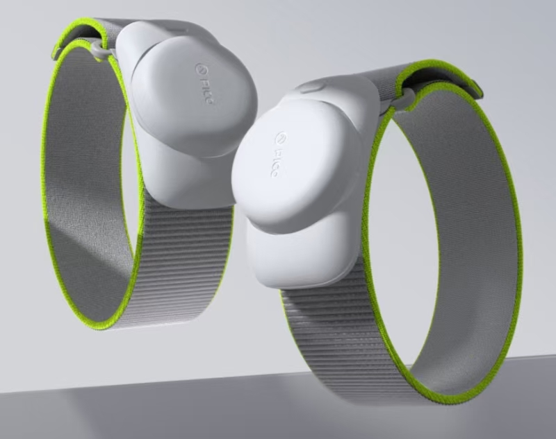
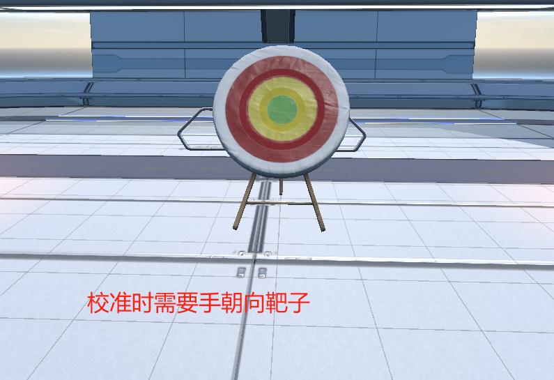

# **Using the G1 Data Glove with a PICO Standalone Headset**

---

## 1. Development Package

Download link: [GloveInteraction.unitypackage](https://docs.mostech.asia/ap_vr/GloveInteraction.unitypackage)

Demo scene:

## 2. **Function Test Installation Package**

Download the file to your computer.

[MotionCapture_Glove_Pico_InSituModel_1.0.0.apk](http://docs.mostech.asia/ap_vr/MotionCapture_Glove_Pico_InSituModel_1.0.0.apk)  V1.0.0  2025-02-27

## 3. **Function Test** Steps

### **3.1 Send the Installation Package to the PICO**

Use a USB cable to connect the PICO to your computer, select the `MotionCapture_Glove_Pico.apk` file, right-click and choose "Send to PICO4".

> If the PICO device is not found, enable "Developer Mode" on the PICO and turn on file transfer.
> 

### **3.2 Install the Application**

On the PICO, go to **File Manager → Installation Packages**, and tap `MotionCapture_Glove_Pico.apk` to install it.

## 4. **Using the Glove Software**

### **4.1 Connect the Trackers**

Before using the software, make sure two trackers are connected.
Open the body-tracking software and connect the two trackers.

### **4.2 Open the Software**

Go to **Library → Unknown Sources** and open the `MotionCapture_Glove_Pico` software.

> **Possible issues**:
>
> 1. Prompt that the PICO version is too low → Please upgrade the PICO system first.
> 2. Prompt that a network connection is required → Please connect to Wi-Fi first.

### **4.3 Software Workflow**

**Prerequisites**: The glove receiver is plugged into the PICO, and both glove devices are powered on.

- **Capture Data**
  Tap the "Capture Data" button and check whether the packet rate is 0. If it is 0, check whether the glove is powered on.
  If the packet rate is very low, switch the channel in the PC software `MotionStudio`.

- **Pose Calibration (hands must face the target)**
  If there are no issues above, tap the "Pose Calibration" button. The pose is shown in the figure below:
  
  **Arm pose**:
  
  **Hand pose**:
  
  
