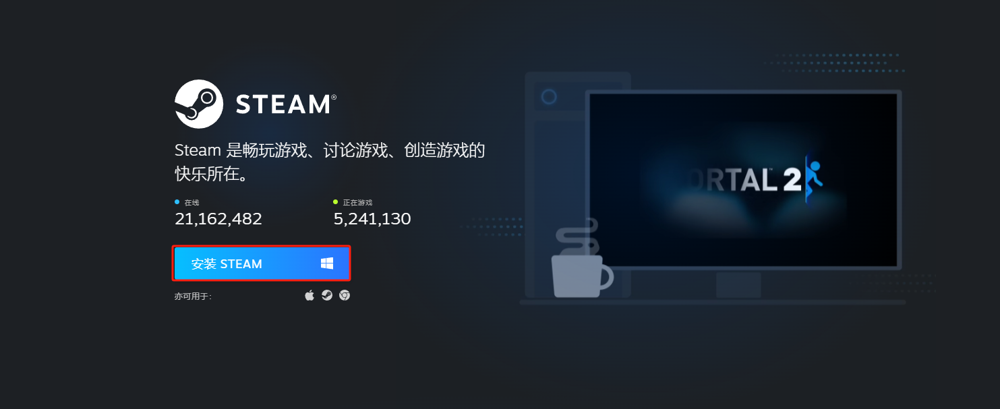
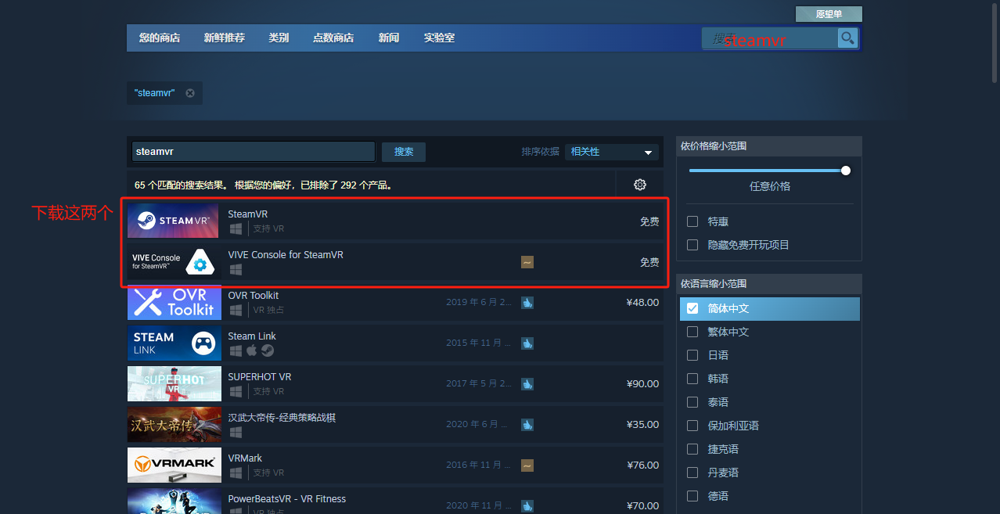
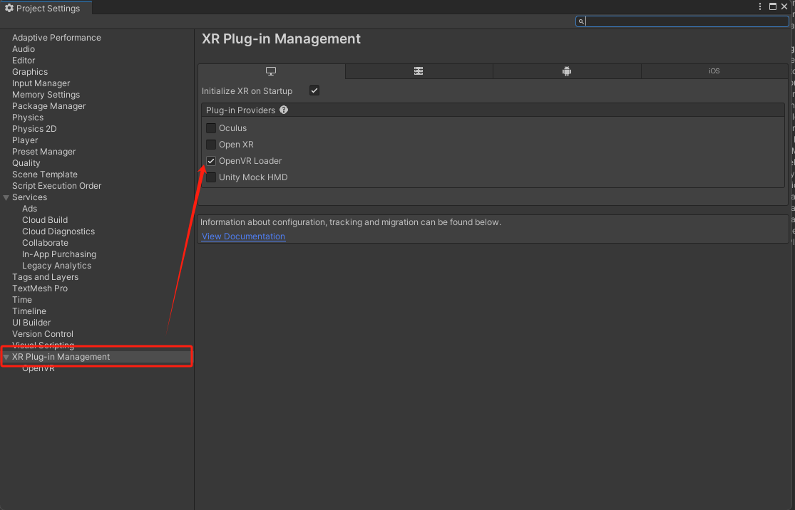
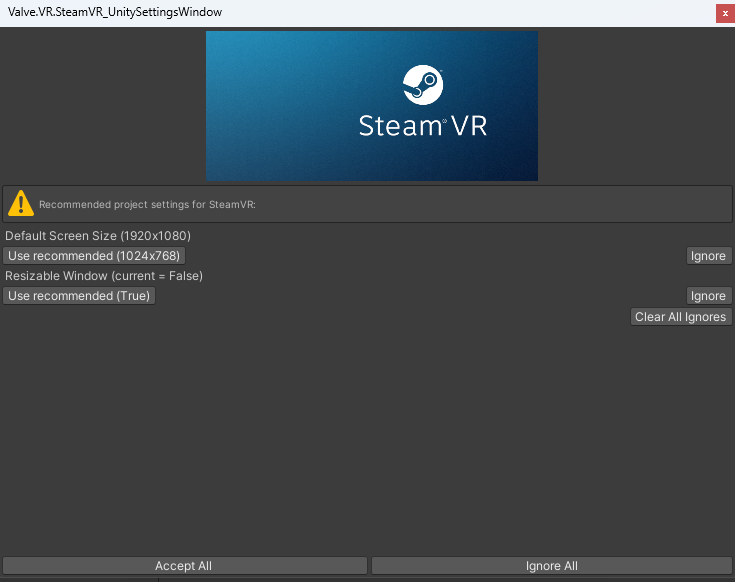
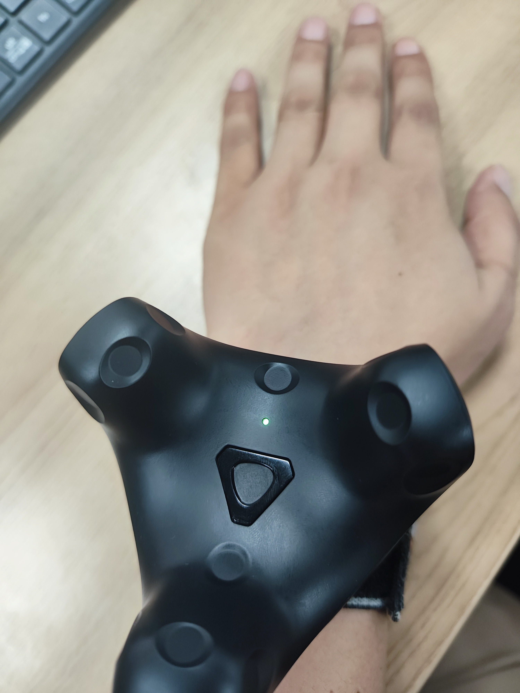

# **Data Glove with SteamVR — Usage Documentation**

Development package download: [GloveVRInteraction_V1.6.2.unitypackage](https://docs.mostech.asia/ap_vr/GloveVRInteraction_V1.6.2.unitypackage)

1.  ## **Steam Environment Configuration**

### **1.1 Download Steam and SteamVR**

Steam: <https://store.steampowered.com/about/>

Download SteamVR from within Steam.

### **1.2 Connect Hardware Devices with SteamVR**

- Base stations \*2

- Trackers \*2

- Headset \*1

2.  ## **Unity VR Environment Configuration**

### **2.1 Download Steam-related Plugins**

In Window -> Package Manager, download the latest SteamVR Plugin and Vive Input Utility plugins.

Import the plugins and follow the prompts to apply the default configuration.

### **2.2 Import the Glove Interaction Plugin**

Plugin note: This plugin is developed on top of the motion capture plugin. For how to drive the hand model and for model requirements, refer to the documentation below.

[《Unity3D Plugin Usage Documentation》](https://alidocs.dingtalk.com/i/nodes/3xRN9bGQyw4JbxqgjqE5WzXPADKnorv6?utm_scene=team_space)

Import the plugin via Assets -> Import Package -> Custom Package.

The demo scene can be found at Assets -> Motion -> Scenes -> GloveVR.

3.  ## **Script Reference**

### 3.1 Assets -> Scripts -> Glove -> ButtonBaseInteraction.cs

Button interaction script. A collider must be added to the button. Tapping the button with a finger triggers the button's OnClick event, to which you can manually bind your own implementation.

### 3.2 Assets -> Scripts -> Glove -> GrabInteraction.cs

Use this script to grab objects (requiring at least one thumb joint and one joint from another finger). The object must have a collider and a rigidbody.

Enable the IsTrigger property on the collider, and disable the UseGravity property on the rigidbody.

### 3.3 Assets -> Scripts -> Glove -> ThrowInteraction.cs

Use this script to grab objects (requiring at least one thumb joint and one joint from another finger) and to throw them. The object must have a collider and a rigidbody; do not enable the IsTrigger property on the collider, and enable the UseGravity property on the rigidbody.

### 3.4 Assets -> Scripts -> Glove -> Gesture.cs

Use this script to detect when the index and middle fingers are brought together. Based on the distance between the index fingertip and the middle fingertip (configurable via a threshold), it determines whether the fingers are joined, and when they are, it fires the syndactyliaEvent. You can subscribe to the syndactyliaEvent in the script to implement your own business logic.

3.5 Assets -> Scripts -> Glove -> ServerInteraction.cs

Use this script to send commands to Motion Studio. For example: control the vibration motors of the left and right hands.

4.  ## **Special Configuration Notes**

### **4.1 Hand Model Configuration**

Configure the left hand on the leftHand layer and the right hand on the rightHand layer. Each finger consists of three joints: fingertip, middle, and base.

Add a collider and a rigidbody (with gravity disabled) to each joint. Add the thumb tag to each thumb joint, and the otherFinger tag to the joints of the other fingers. Add the palm tag to the palm.

### **4.2 Wearing the Tracker**

The tracker light should face the back of the hand.

### **4.3 Distinguishing Left and Right Hand Trackers**

If there is only one tracker, it will be assigned to the left hand by default.

If there are two trackers, the left and right hands are distinguished by the tracker icons shown in SteamVR. Icon 1 corresponds to the left hand, and icon 2 corresponds to the right hand.

