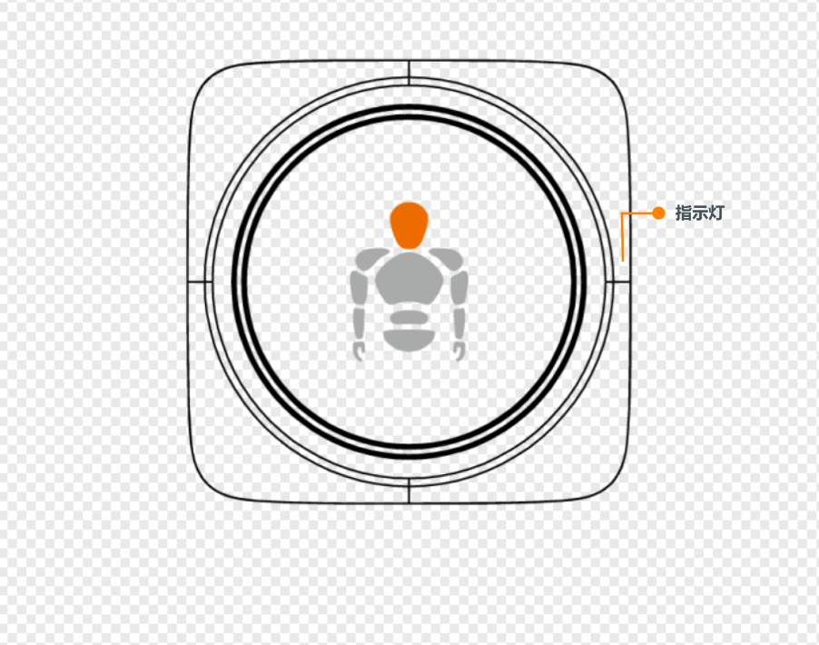
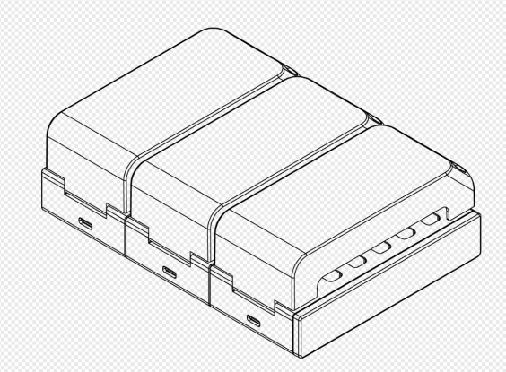
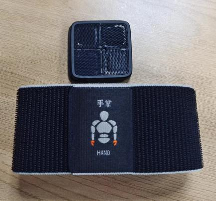
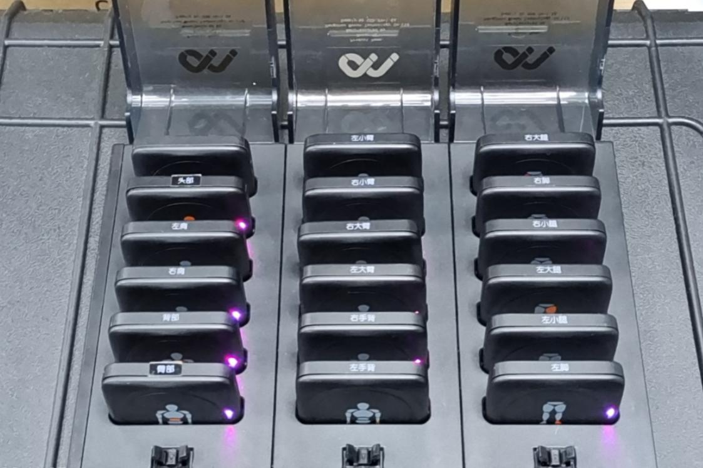
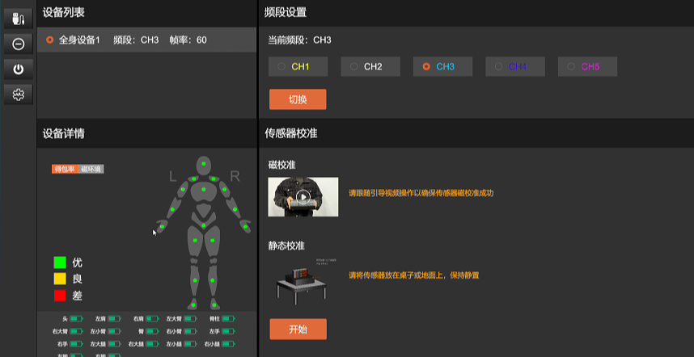
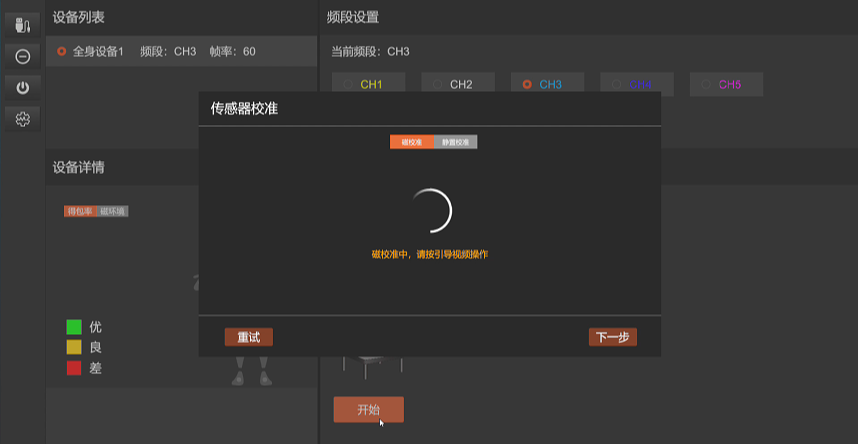
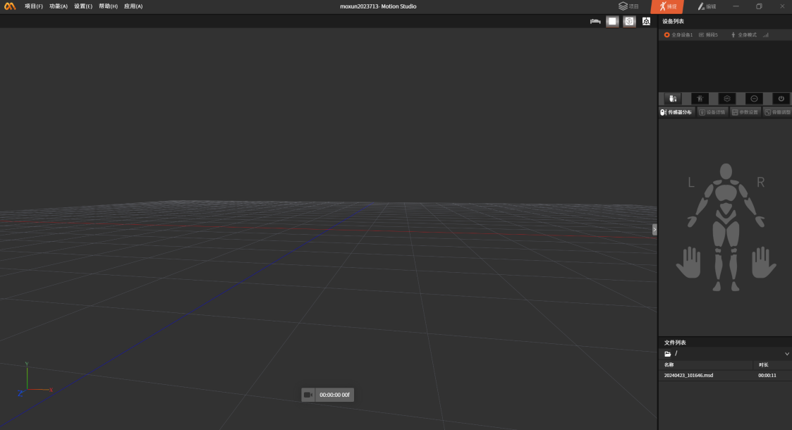
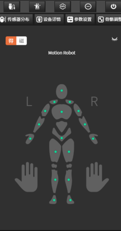

# **Z1 Pro Product User Manual**

# **I. Hardware Configuration**

## **1. Device Overview**

### **1.1 Main Hardware List**

### **1.2 Computer Configuration**

### **1.3 System Topology Diagram**

Connect the data transceiver to the computer via USB. We also provide a Type-C adapter cable for user convenience.

## **2. Device Details**

### **2.1 Hengzhuo Wireless Sensor**

A high-precision wireless sensor with an integrated gyroscope, accelerometer, and magnetometer.

**Indicator Light Description**

  ------------------- ------------------------------------------

  LED Status          Sensor Meaning

  Slow green flash    Standby, not connected

  Fast green flash    Working state, connected

  Continuous red flash Low battery

  Green flashing      Charging

  Solid green         Charging complete

  Blue flashing       Channel switching

  Red flashing        Sensor search

  ------------------- ------------------------------------------

Turning on the sensor

Plug and unplug the charging case with a Type-C cable. When the sensor indicator light inside the charging case flashes, activation is successful.

2.2 Data Transceiver

Used to receive and send sensor data signals.

2.3 Hengzhuo Glove Motion Capture Glove

2.4 Charging Case

Used to charge and store Hengzhuo wireless sensors, and also used for sensor calibration.

2.5 Shockproof Carrying Case

Provides better protection for Hengzhuo sensors.

## **3. Motion Capture Environment Preparation**

Hengzhuo sensors contain a magnetometer, which is affected by strong magnetic field environments. Users must use the sensors in an environment with minimal magnetic interference.

## **4. Wearing Instructions**

### **4.1 Motion Capture Suit Description**

\*Sensor placement on the straps: hook-and-loop fastener attachment

### **Strap-style Motion Capture Suit:**

Each strap is designed with a different length according to the thickness of the limb. Please follow the markings on the straps to attach them to the corresponding limb positions.

### **4.2 Sensor Wearing Positions**

#### **Upper Body:**

1. The head sensor is installed on the **head**.

2. The shoulder sensor is installed **directly above the shoulder**, as far **outward** as possible.

3. The hip sensor is installed **below the waist**, as low as possible, **close to the tailbone**.

4. The upper arm sensor is installed **2-3 cm above the elbow**.

5. The forearm sensor is installed at the **wrist**.

6. The palm sensor is installed on the **back of the hand**.

#### **Lower Body:**

1. The thigh sensor is installed on the **thigh**, 2-3 cm above the knee.

2. The shin sensor is installed **2-3 cm below the knee**.

3. The foot sensor is installed on the **instep**. Wrap the strap around the arch of the foot as much as possible, so that it will not accidentally detach during walking.

#### **Notes:**

- When installing the straps, secure them firmly against the body to ensure that the sensor nodes do not shake violently during large movements.

- When working, motion capture actors must ensure they are not carrying phones, watches, or other electronic devices, or keys, coins, and other strong magnets. The magnetic interference generated by these electronic devices and strong magnets will seriously affect the operation of the sensors.

- Hengzhuo sensors contain a magnetometer, which is affected by strong magnetic field environments. Users must use the sensors in an environment with minimal magnetic interference.

# II. Operating Instructions

Preparation for first use: sensors (with sufficient charge), receiver, Motion Studio software, magnetic calibration software

**2. Sensor Power-On Activation:**

Plug and unplug the charging case with a Type-C cable. When the purple light of the sensor inside the charging case flashes, activation is successful.

**3. Sensor Calibration:**

Open the magnetic calibration software, click the connect button to connect the device. After the connection is complete, watch the magnetic calibration demo video to perform the subsequent magnetic calibration operations.

### 4. Device Connection:

After calibration is complete, close the magnetic calibration software and open the Motion Studio software. For first use, create a new project. After successful creation, click the device list connect button in the upper right corner of the software. (Tip: If Motion Studio is already open, the receiver is connected to the computer, and the sensor LED is still in the slow green flash state, please perform a "Channel Switch".)

After successful connection, the indicator lights of each node in the sensor layout will light up.

### 5. **Wearing the Device (17 sensors in total)**

• The sensors have hook-and-loop fasteners and attach to the straps.

• When wearing all sensors, follow the sensor prompts and attach them to the designated positions.

### **6. Pose Calibration:**

After wearing is complete, click Pose Calibration and perform the pose calibration according to the illustrated instructions. After calibration is complete, you can start using it.

# III. Parameter Introduction

# IV. Frequently Asked Questions

**Q: How do I turn the sensor on and off?**

A: Long press the power button for 1 second. Alternatively, plugging and unplugging the charging case power cable can turn on all sensors in the charging case.

**Q: Can the sensors be turned on or off with one click?**

A: One-click power on: When 17 sensors are in the charging case and powered off, you can turn them on by plugging and unplugging the power cable.
One-click power off: In Motion Studio, select the suit device to be powered off, and select the "Power Off" option in the menu. The connected sensors can be powered off with one click.

**Q: Why can some sensors connect to the software while others cannot?**

A: First confirm whether the unconnected collector has power. If it has power, check whether the sensor's channel is on the same channel as the receiver. If they are not on the same channel, you need to switch the collector's channel.

**Q: How do I switch the collector's channel?**

A: 1. Double-click the sensor button to switch the channel. 2. After the sensor or receiver is powered off or disconnected and reconnected, it can also automatically switch to channel one.

**Q: The sensor won't charge?**

A: The charging copper contacts of the sensor may become oxidized after prolonged use. You can clean them with alcohol before charging.

**Q: The LED light on the sensor has different colors. What do these colors represent?**

A: The LED light on the sensor has three common colors (blue, green, red). Blue indicates that the sensor is switching channels; if the LED light turns red during use, it means the sensor's current battery is low; during charging, the LED light flashes green to indicate that the sensor is charging, and when charging is complete, the LED light is solid green; during operation, the LED light flashes rapidly green.

**Q: When charging, the LED light of the sensor in the charging case does not light up. What is going on?**

A: When charging, the sensor's LED light does not light up: 1. First, check whether the charging case is connected to power and whether it is properly energized; 2. Whether the metal contacts of the sensor are not in full contact with the charging contacts in the charging case. During use, the metal contacts of the charging case/sensor may cause poor contact due to oxidation. You can try cleaning the metal contacts with an eraser; 3. If you have ruled out the effects of poor contact and the charging case is not damaged, and the sensor still cannot be charged normally, please contact customer service, and we will assist you in resolving the issue as soon as possible.

**Q: I lost the power adapter. What should I do?**

A: If your power adapter is accidentally lost, please do not replace the adapter yourself to avoid damaging the device. Please contact customer service promptly, and we will assist you in resolving the issue as soon as possible.

**Q: Are the wearing positions fixed? How do I install them?**

A: After wearing the straps on each part, you need to pay attention to the body position marked on the back of each sensor node, and install the sensor in the corresponding position; please refer to the manual or connection guide when installing.

**Q: What items can cause magnetic interference?**

A: Electronic devices such as phones and watches, metals such as keys and coins, high-power substations, wireless base stations, air conditioning cabinets, or high-power motors, etc.

**Q: The sensor is broken. What should I do?**

A: During the warranty period, if damage is caused by product quality issues, users can mail the product to our company for free repair; outside the warranty period, please refer to the "After-Sales Service Manual" for specific services.

**Q: Why does it need to be calibrated frequently?**

A: Because the precision of the sensor changes with time and environment, over time the sensor will experience a "drift" phenomenon. At this point, the sensor needs to be calibrated to "zero out" the errors accumulated during use.

**Q: After deleting the software folder at the installation address, I opened the installation package and reinstalled the software. Why does it still prompt "Uninstall Software"?**

A: Manually deleting the software folder may not uninstall it completely. Please check in "Control Panel - Uninstall a Program" and uninstall Motion Studio.

# **V. Precautions**

1\. Do not use or store the sensor near heat sources (such as fire or heaters);

2. Please use the original charging cable and charging case for charging;

3\. Do not immerse the sensor in water or get it wet;

4\. Do not heat the sensor;

4\. Do not strike, throw, or subject the sensor to mechanical vibration;

5\. Do not hammer or step on the sensor;

6\. Do not disassemble the sensor in any way;

7\. Do not charge the sensor near a fire or under extreme heat conditions;

8. Please use the original adapter to power the charging case. Poor-quality adapters may cause damage to the sensor battery and charging case.

