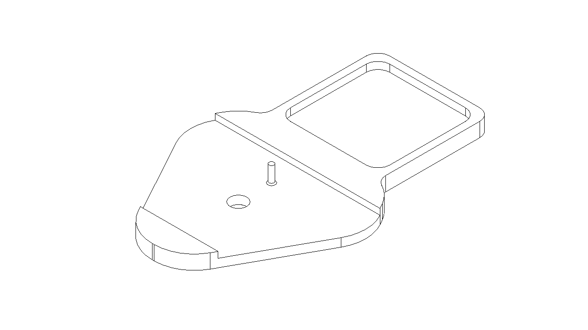
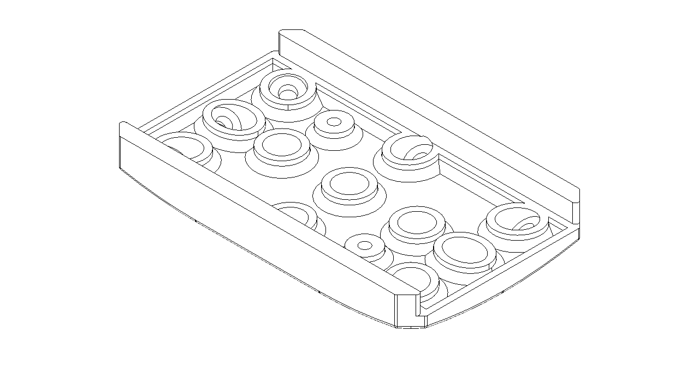
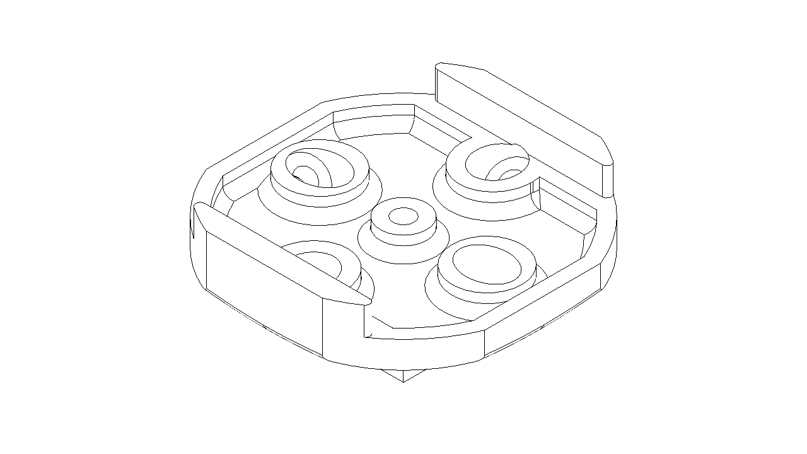

# 3D Printing Parts Download

## 1. Z1 Series

Optical-inertial fusion base, used in conjunction with the HTC VIVE Tracker. The hips are used to correct overall walking displacement, while the wrists are used to correct arm pose.

Hips node:

[z1_tracker_hips.3mf](./assets/z1_tracker_hips.3mf)

[z1_tracker_hips.STEP](./assets/z1_tracker_hips.STEP)

Wrist node:

[z1_tracker_hand](./assets/z1_tracker_hand.STEP)

## 2. MotionLens

The optical motion capture camera ML020W is used in combination with the inertial motion capture Z1/Z1 Pro.

Hips rigid body:

[ml_rigid_hips1.STEP](./assets/ml_rigid_hips1.STEP)

Wrist rigid body:

[ml_rigid_hand1.STEP](./assets/ml_rigid_hand1.STEP)

TODO: fabrication steps.
