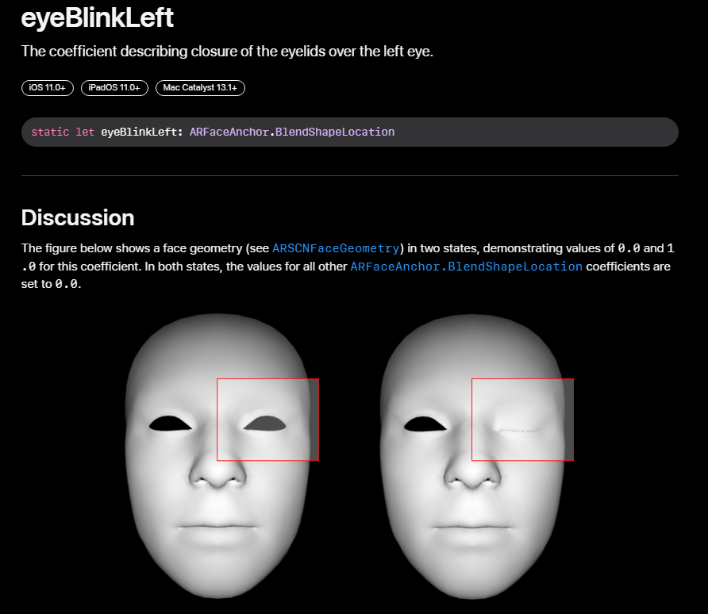
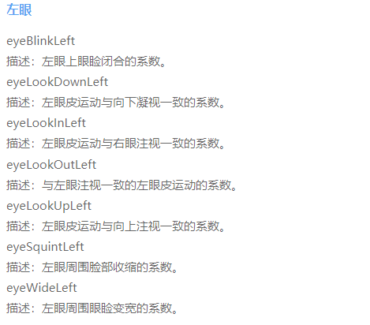
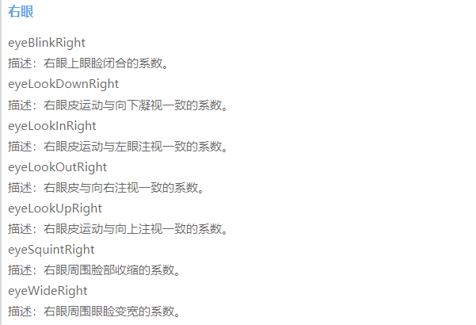
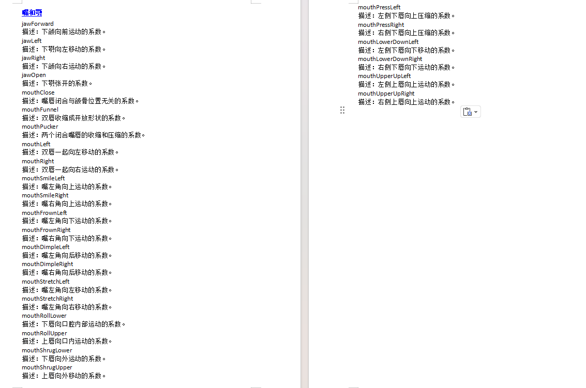
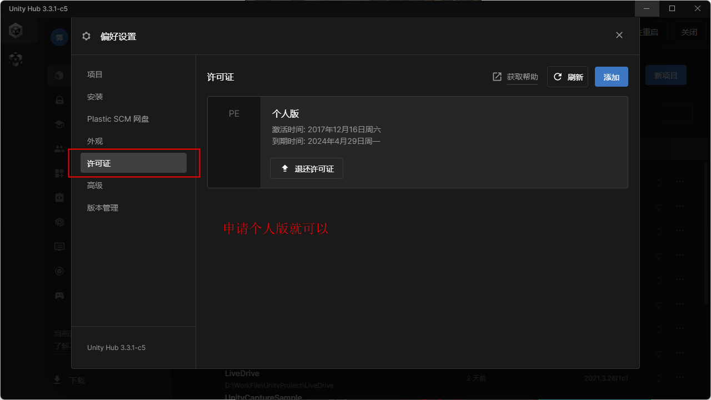
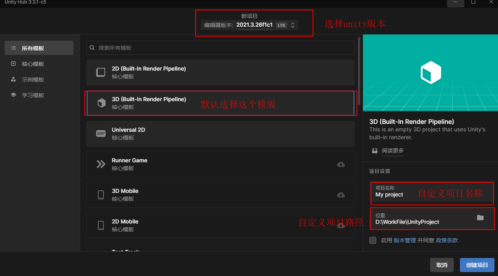
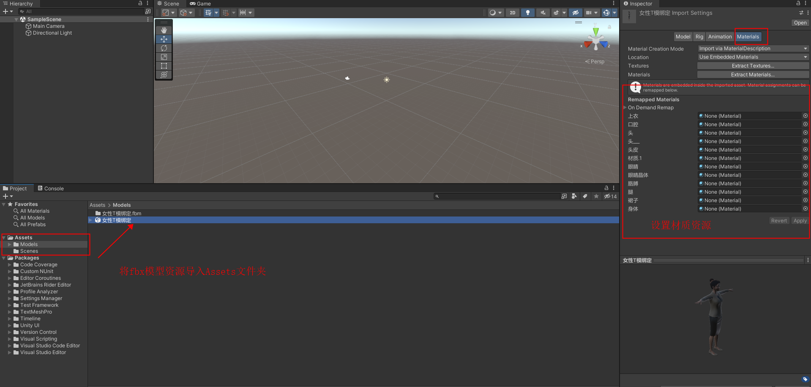
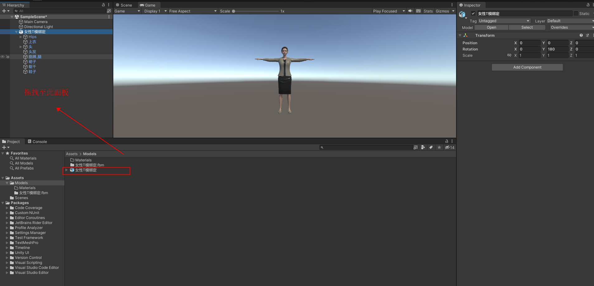
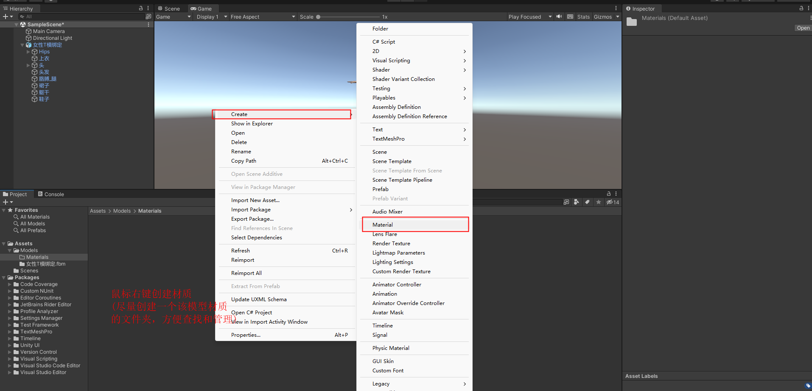

# **Model Requirements**

Full-body model requirements

- Humanoid skeleton for the model

- The model's root node rotation value must be 0

- The model's initial pose must be a T-pose

- In the T-pose state, the rotation value of every bone must be 0

- All bones must share a consistent local coordinate system: X axis pointing right, Y axis pointing up, Z axis pointing forward, using a left-handed coordinate system (Unity3D)

- At least 19 bones are required: head, left eye, right eye, left shoulder, left upper arm, left forearm, left hand, right shoulder, right upper arm, right forearm, right hand, spine, hips, left thigh, left calf, left foot, right thigh, right calf, right foot. Refer to Figure 1 for the bone naming convention.

- Refer to Figure 2 for the bone hierarchy structure

- The head, left eye, right eye, and teeth each require a separate mesh

Figure 1:

Figure 2:

Facial model requirements

- 52 Apple ARKit-standard blendshapes; the blendshape rigging must strictly follow the naming convention. See Figures 4, 5, 6, and 7

- 52 BlendShape authoring specification. Official Apple specification

- The left and right eyes require separate bones

<https://developer.apple.com/documentation/arkit/arfaceanchor/blendshapelocation>

For example: eyeBlinkLeft

Figure 4

Figure 5

Figure 6

Figure 7

Providing the model's .unitypackage resource bundle

1. **Install Unity and create a project**

**1.1 Register an account**

Register a Unity account at <https://unity.cn/>

**1.2 Download Unity Hub and Unity**

Install Unity Hub first, then install Unity

Unity Hub version: any version is fine (it is only a tool for managing different Unity versions)

Unity version: 2021.3.26f1c1 LTS (best to match this version)

Download link: <https://unity.cn/releases/lts/2021>

Apply for a Unity license in Unity Hub

**1.3 Create a Unity project**

Open Unity Hub and click the New Project button, then perform a basic configuration

**2. Import and configure model assets**

**2.1 Import model assets**

In Unity, create a Models folder in the Assets panel (the name can be anything; this is just to make it easier to find and manage assets), then drag your model assets into this folder. You can also perform some initial settings on the model at the same time.

Drag the model asset from the Assets panel into the Hierarchy panel to display the model in the scene.

**2.2 Configure model assets**

Assign materials to each mesh of the model, or set them uniformly when importing the model (this approach is more convenient; see step 2.1 above).

Create materials, assign textures to the materials, and set transparency, metalness, smoothness, etc. This mainly depends on how you configured them in the modeling engine.

Then assign the materials to the corresponding meshes; the model in the scene will display your settings in real time.

**3. Export the .unitypackage model asset bundle**

Once all the model's assets are configured, create a prefab for the model.

Select the model in the Hierarchy and drag it into the Assets panel; the prefab is created successfully.

Export the finished prefab

**Reference models**

Two models are provided in the attachments

52-blendshape model

[SampleHead.fbx](./assets/SampleHead.fbx)

Full-body skeleton model

[robot.fbx](./assets/robot.fbx)

