**Blender Plugin Tutorial**

**I. Blender**

If you haven't downloaded it yet, you can get it from [Blender download and Chinese localization -- Blender China Community](https://www.blendercn.org/downloadme).

After downloading, follow the steps shown in the image to switch the interface to Chinese.

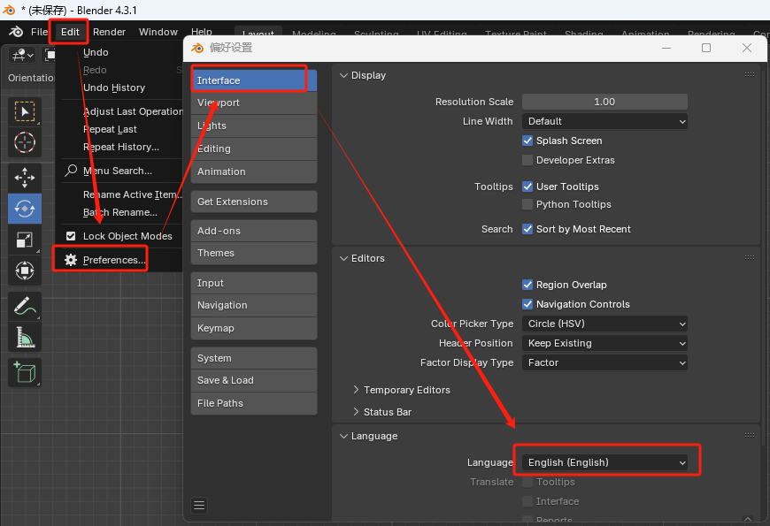

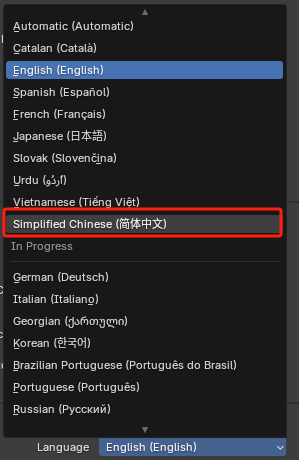

**II. Plugin Download**

[Please see the attachment "MotionStudio_Blender_4_Win64_v0.8.26.zip" on DingTalk Docs](https://alidocs.dingtalk.com/i/nodes/GZLxjv9VGGPdYEjbHOn5o9dgV6EDybno?iframeQuery=anchorId%3DX02m56dihd1wqihvsj8u)

**III. Plugin Installation**

1. After downloading the plugin, there is no need to extract it. First open Blender 4.x.

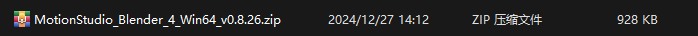

2. In the menu bar, click Edit → Preferences, or press Ctrl and , (comma) to open the Preferences panel, as shown below:

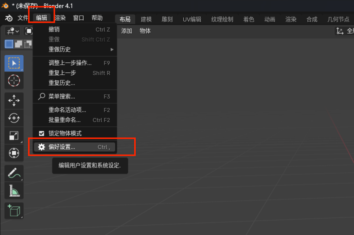

3. In the Preferences panel, click the Install button.

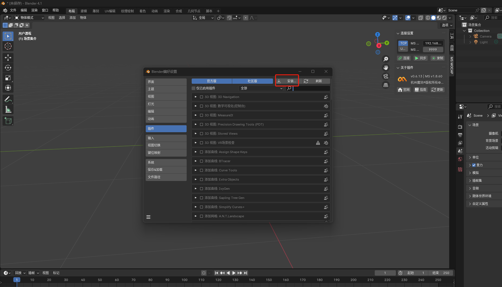

4. Navigate to the directory where the plugin was downloaded and select the plugin archive you just downloaded. Then click Install from Disk in the lower-right corner.

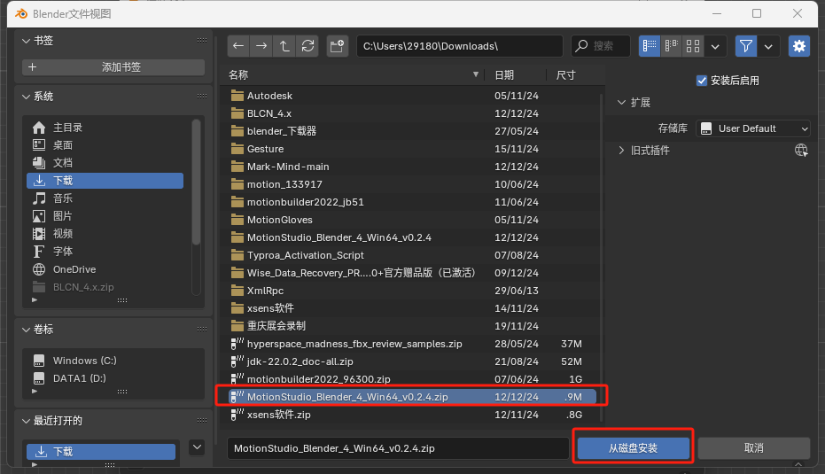

4. After a successful installation the plugin is enabled automatically. If it is not enabled, enable it manually.

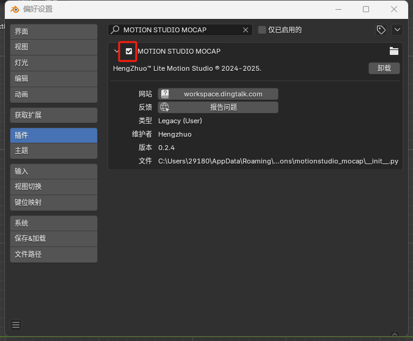

**IV. Plugin Usage**

**1. Open the MS plugin in Blender**

**1) Next to the coordinate axes in the upper-right corner of the Blender viewport, click the small left-pointing arrow to reveal the plugin panel.**

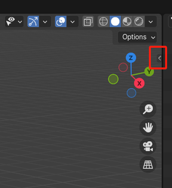

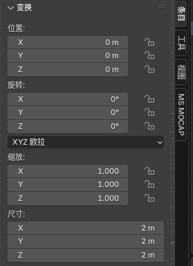

**2) Click the MS MOCAP tab on the right to open the plugin page.**

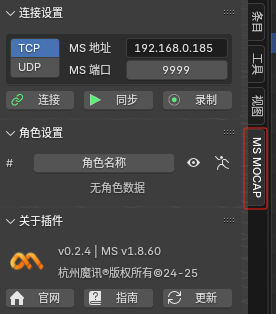

> **3) Plugin interface overview**

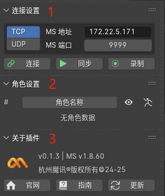

**As shown above, the plugin interface is divided into 3 areas from top to bottom:**

**3.1 Connection settings area**

Here you can switch the network connection method and configure the connection address and port.

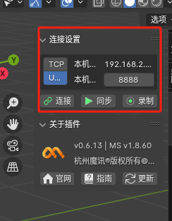

Below, from left to right, are the Connect, Sync, and Record buttons.

Connect: Used to connect to the MS server. Data broadcast must first be enabled in MS.

Sync: After clicking Show Skeleton/Model in the character list, you can enable motion sync. When disabled, the character's skeleton is no longer driven for translation and rotation.

Record: Records the received motion data.

**3.2 Character settings area (shown only after a successful MS connection)**

This area displays the received character list and lets you control each character's visibility and pose.

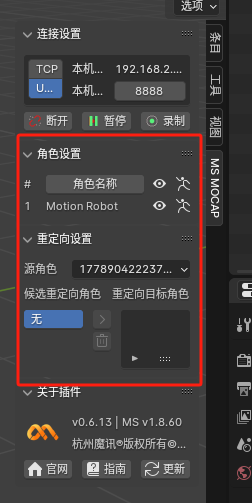

Character Name/ID: Click the Character Name / Character ID button to toggle what is displayed for each character in the list (character name or character ID).

Character Show/Hide: Click the show/hide button to the right of a character to toggle its visibility. (The show/hide button in the title bar controls the visibility of all characters at once; each character can also be set individually.)

Character Sync/T-Pose: Click the rightmost pose button to switch all or a specific character to T-Pose, or to sync the current pose from MS.

**3.3 About the plugin**

Here you can view the plugin version, open this plugin guide, update the plugin, and visit the official website.

Note: After updating the plugin, you must restart Blender or re-enable the plugin in the plugin settings.

**2. Connect to Motion Studio and drive the character model in Blender**

**1) Connect to Motion Studio**

Based on the IP address and port configured in the data broadcast settings in Motion Studio, choose a TCP or UDP connection.

**1.1 TCP connection**

When using a TCP connection, click the leftmost TCP button (highlighted when selected). Then enter the IP and corresponding port configured in Motion Studio into the Blender address field (default is 9999).

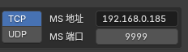

**1.2 UDP connection**

In Motion Studio, set the data broadcast to a UDP connection and configure the port. Enter the IP address of the computer where the plugin is installed as the target IP, and set the port number.

When using a UDP connection in Blender, in addition to the steps above, you must also enter the port number matching the target IP set in Motion Studio.

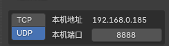

**2) Enable the connection in the Blender plugin**

After confirming the IP settings in the first step, click the **Connect** button in the upper-left corner of the plugin to connect to the Motion Studio data broadcast. When the Connect button turns red, the connection is successful (click it again to disconnect). The default character model is then automatically loaded into the scene and motion sync is enabled. The character list in the character settings area is updated at the same time, as shown below:

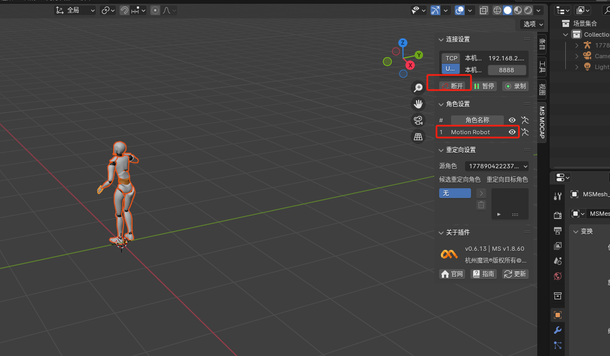

**3) Switch the data source or connection protocol**

When you need to switch the data source in Motion Studio (Live → Recording, different recorded data, TCP → UDP, etc.), first disconnect the current plugin connection by clicking the Disconnect button in the connection settings area. After switching to the new data source in Motion Studio, click the Connect button again to drive the character model.

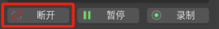

**3. Record motion and save / export the recorded motion**

**1) Record motion**

After connecting to Motion Studio and synchronizing the character, click the Record button in the connection settings area.

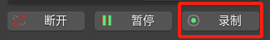

While recording, the button changes to the state shown below. Click it again to stop recording.

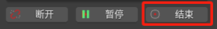

Note: After recording one clip, you must export the current file first. If you record a second clip without exporting, the first recording will be overwritten.

**2) Export the recorded motion**

When exporting the recorded animation, it is best to first disable sync driving (without disconnecting), then click Blender menu bar → File → Export and select the desired file format. Here we use FBX as an example — click the FBX format.

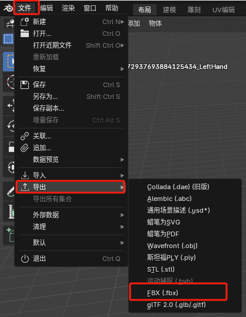

In the export options dialog, first specify the export destination in the path field at the top, then enter the file name to save at the bottom. In the export options panel on the right, make sure to select at least Armature and Mesh under Object Types (hold Shift to multi-select), and select the Animation option below. After confirming the options, click the Export FBX button in the lower-right corner to export the recorded motion file.

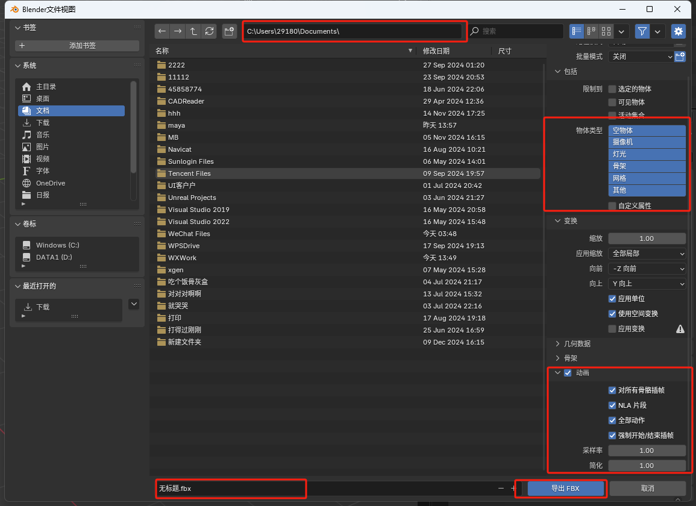

**3) Play back the recorded motion**

When the export is complete, click the Disconnect button in the connection settings to clear all character models from the scene.

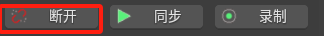

In the Blender menu bar, select File → Import → FBX.

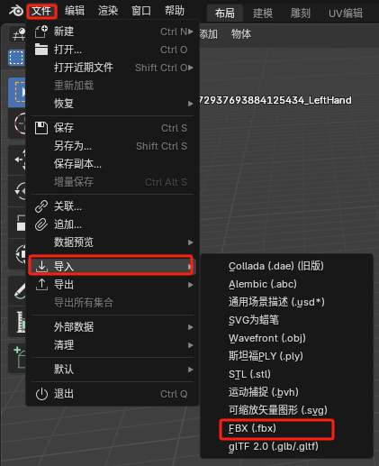

In the import options dialog, select the path where you just saved the file at the top, choose the motion file you just saved in the file list in the middle, and in the import options on the right make sure the Animation option is selected. Then click the Import FBX button in the lower-right corner.

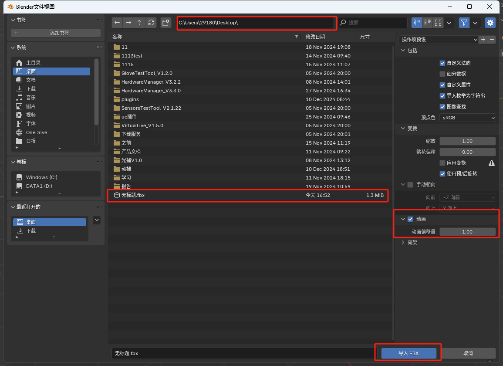

After a successful import, the character model in the scene is no longer in the default T-Pose, and the animation track below contains animation data. Adjust the End frame value in the upper-right corner of the animation track to a value greater than the actual number of animation frames (e.g., 1000), then press Space or click the Play button on the animation track to play back the recorded motion.

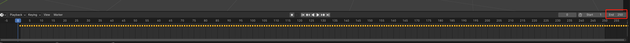

[Please see the attachment "12345432345543.mp4" on DingTalk Docs](https://alidocs.dingtalk.com/i/nodes/GZLxjv9VGGPdYEjbHOn5o9dgV6EDybno?iframeQuery=anchorId%3DX02m4l2xb13zv7oc33535d)

**4. Live retargeting or recorded animation retargeting**

**1) Add a model for live retargeting**

**①. Connect the Blender plugin to Motion Studio**

In Motion Studio, configure the corresponding IP address and port number in the data broadcast settings.

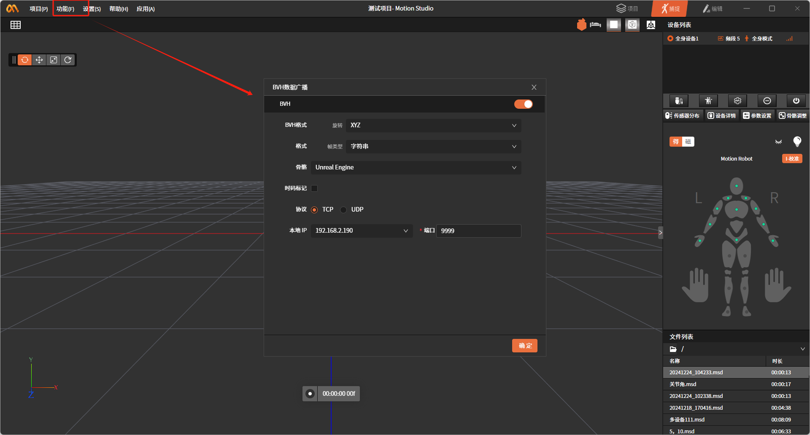

After setting the IP and port in Blender to match MS, click the Connect button to enable motion sync.

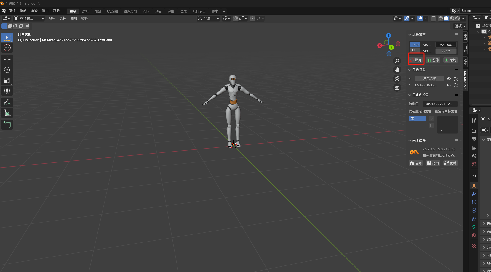

**②. Import the retarget model (using an FBX file as an example)**

After successfully connecting to MS, the retarget settings panel appears as follows. (The source character is the character used to drive the retarget target character. If MS contains multiple characters, you can switch the driving source character in the drop-down list.)

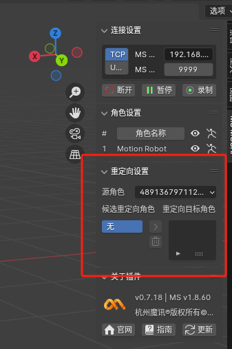

Open the FBX import options panel via the menu bar: File → Import → FBX.

In the file list, select the target character model file to be driven (using HCR as an example; this model shares the same initial T-Pose and a similar skeleton structure as the default character). After confirming the import options on the right, click the Import FBX button at the bottom to import it into the scene.

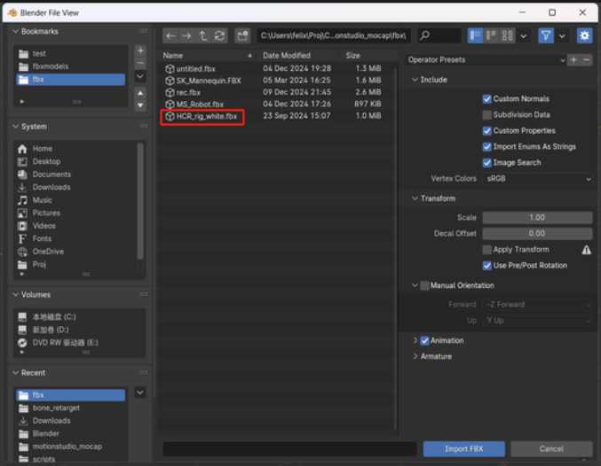

After import, the character is in the T-Pose.

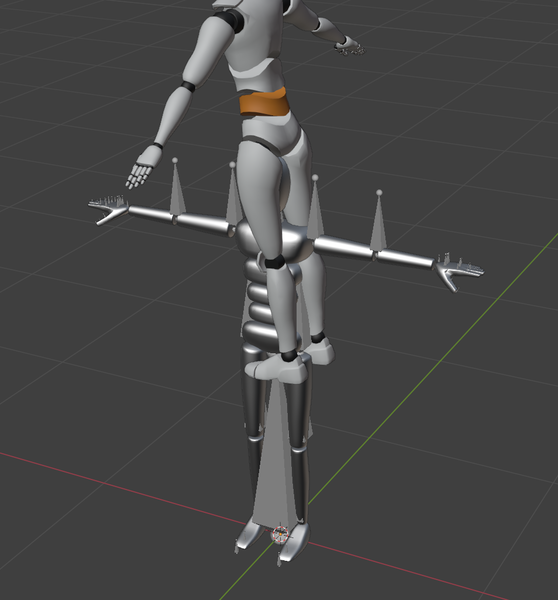

**③. Click the show button in the scene list to hide the skeleton display.**

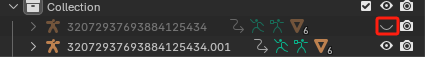

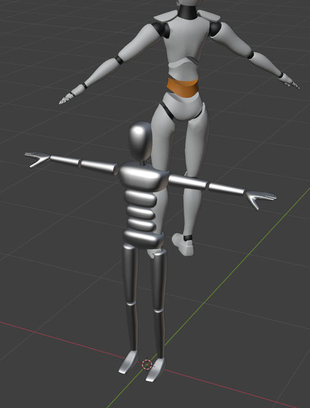

**④. Add the retarget target character**

In the retarget settings panel, the model you just imported has been added to the candidate retarget character list. Click the > button to the right of the list to add the character to the retarget target character list of the current source character.

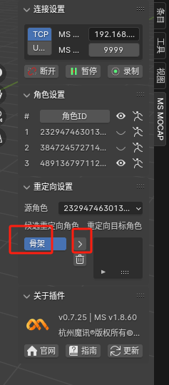

After adding, the list on the right updates and a Build Bone Mapping Table button appears below.

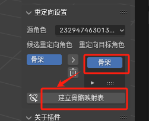

**⑤. Configure the bone mapping**

Click the Build Bone Mapping Table button to build the bone mapping table. Click the Save Bone Mapping Table button below to enable live retargeting for the target character.

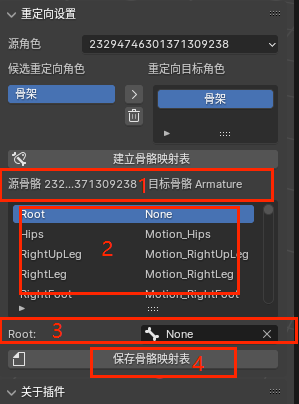

Location 1: Displays the name of the current driving source character and the name of the retarget target character.

Location 2: The list is split into columns showing the source character's bone list and the corresponding target character's bone list. If the target bones follow the source character's naming convention, the target bones are matched automatically, as shown above.

Location 3: If any bone mapping is incorrect, select the bone and then choose the corresponding target bone from the drop-down list below. (The Root bone does not need to be set; leave it as None.)

Location 4: After configuring the corresponding targets, click the Save Bone Mapping Table button below to enable live retargeting for the target character.

**⑥. Remove the retarget target character**

If you no longer need to drive a retarget target, select the character to remove in the retarget target character list and click the delete 🗑️ button in the middle of the list to remove it.

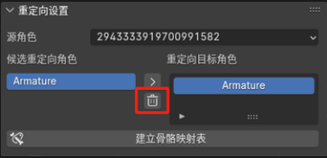

**2) Retarget a recorded animation**

**①. Using the Auto-Rig-Pro plugin**

When you need to retarget a recorded animation file onto another character, use Blender's Auto-Rig-Pro (https://blendermarket.com/products/auto-rig-pro) retargeting plugin (please note the Blender version and the Auto-Rig-Pro plugin version compatibility).

After downloading and installing Auto-Rig-Pro, you can find the ARP tab in the plugin sidebar; click it to open Auto-Rig-Pro.

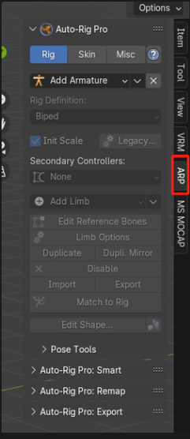

We mainly use the retargeting part of the plugin. Expand Auto-Rig Pro: Remap to show the detailed settings.

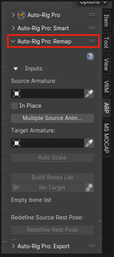

**②. Import the recorded animation and another character model to drive**

First import the recorded animation file you just saved. Remember to select Animation.

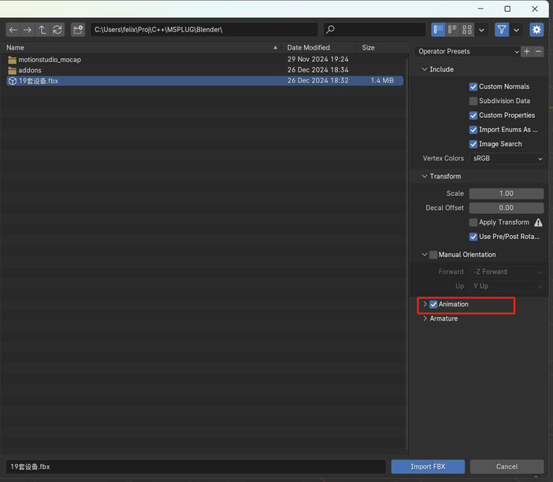

Then select the other character model to be driven. Here we use XBot from Mixamo as an example.

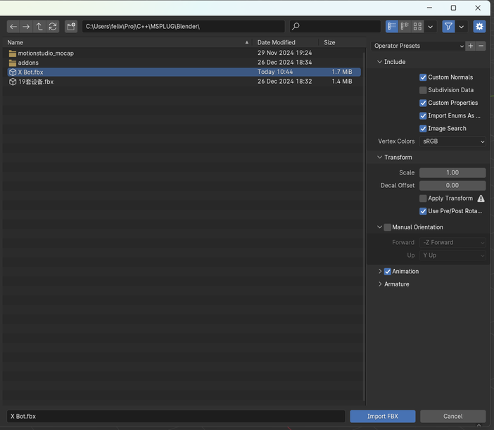

After import, the models in the scene appear as below:

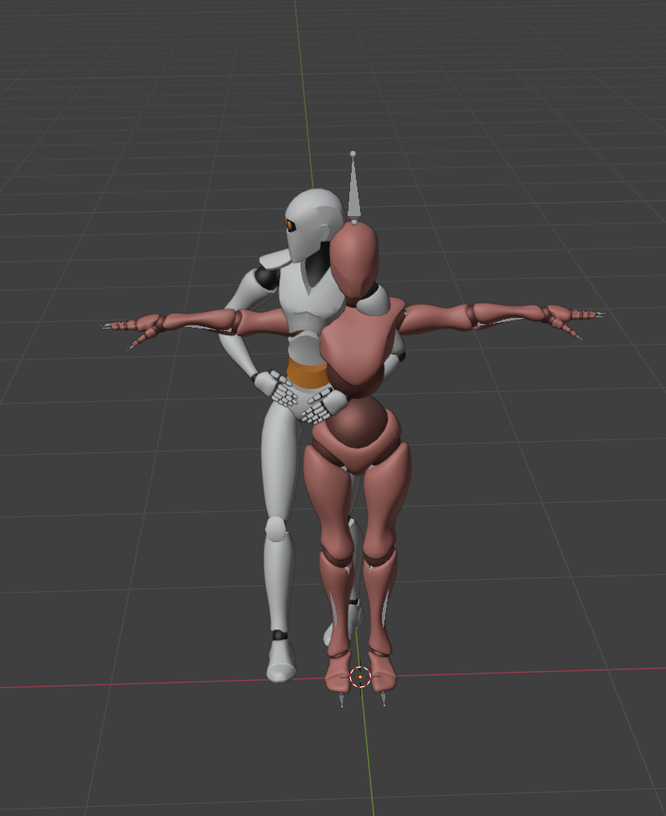

**③. Configure the bone mapping**

In the ARP plugin, set Source Armature to the recorded FBX file and Target Armature to the XBot you just imported.

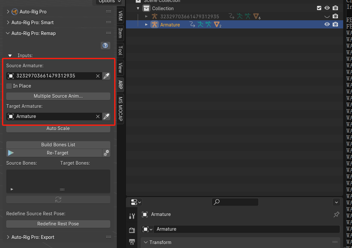

Next, click the Build Bones List button:

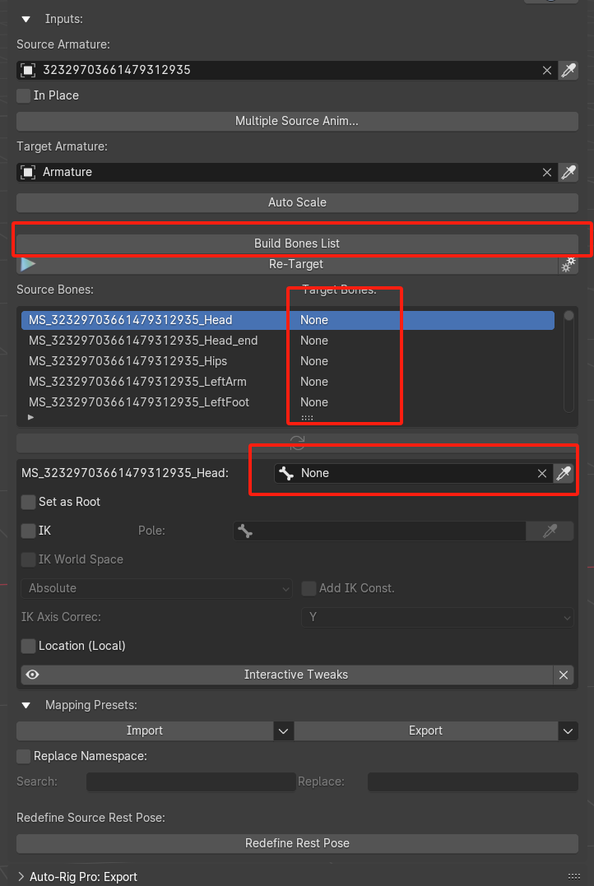

Similar to configuring the bone mapping in live retargeting, select the target bones that correspond to the source bones. Note that you must select Set as Root on the Hips bone

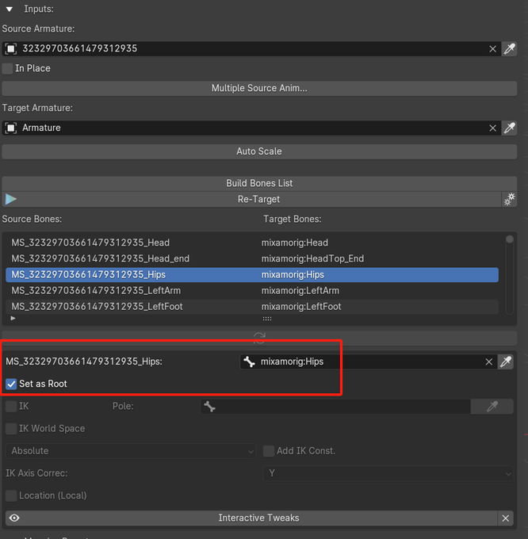

Then click the Re-Target button and click Ok in the dialog that appears.

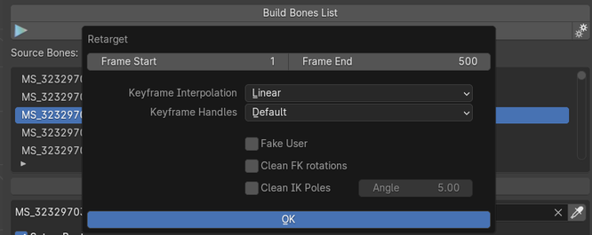

Then press Space to play and see the retargeted result.

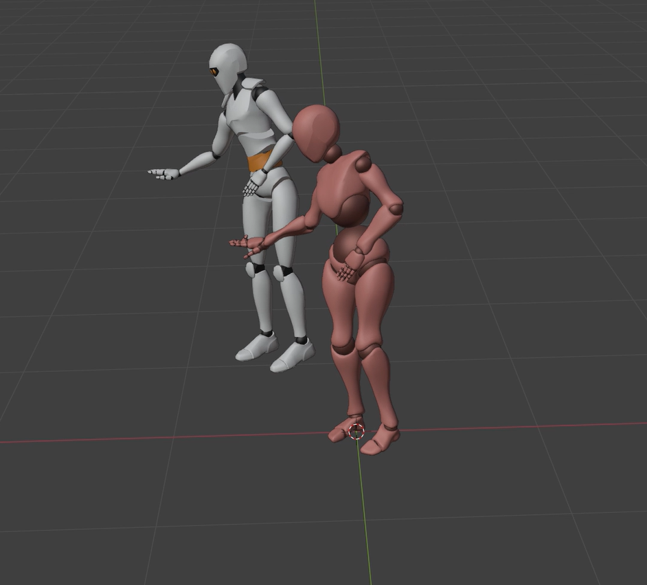
