**Cinema4D Plugin User Guide**

1.  **Download Cinema4D**

You can download it from the official Cinema4D website. Download link: <https://www.maxon.net/en/downloads/cinema-4d-2024-downloads>

2.  **Install the Cinema4D Plugin (the software must be installed first)**

**1. Download link:**

[Please refer to the DingTalk document for the attachment "MSC4DSetup24-25_v0.8.28.msi"](https://alidocs.dingtalk.com/i/nodes/1zknDm0WRzMk4ElBhZj2yNgrWBQEx5rG?iframeQuery=anchorId%3DX02mev1vo2oqefkl28951)

**2. Follow the installation steps:**

1.  Double-click to open the installer.

2.  Click Next.

3.  Select the Cinema4D version in which you want to install the plugin. Currently, Cinema4D 2024 and 2025 are supported. Then click Next. You only need to check the installed Cinema4D version. For example, if you have installed Cinema4D 2024, simply check C4D 2024.

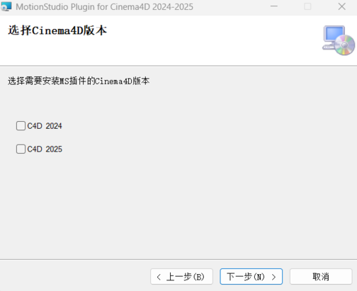

4.  Choose the plugin installation location and install it in the default directory. By default, the Maxon folder under the user's AppData\\Roaming directory is selected (i.e., C:\\Users\\\<username\>\\AppData\\Roaming\\Maxon). Then click Next.

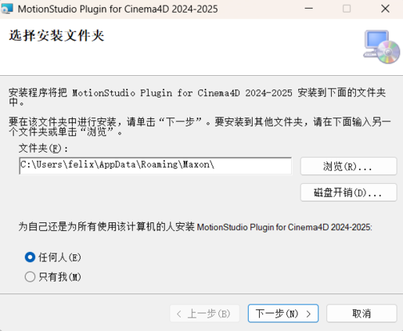

5.  Click Next to begin the installation, and select Continue in the confirmation dialog that appears.

6.  As shown below, the plugin installation is complete.

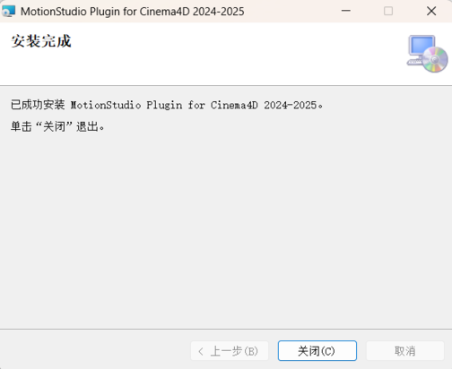

7.  Open Cinema4D, press Ctrl+E to open the Settings window, click Plugins on the right side, and check whether the search path already contains the directory where the plugin was installed, i.e., AppData\\Roaming\\Maxon\\MotionStudioPlugin.

3.  **Cinema4D Plugin Usage Instructions**

**1. Open the MS plugin in Cinema4D**

**1) Open Cinema4D (either version 2024 or 2025 is supported; the version demonstrated in this document is 2024)**

**2) Open the MS plugin**

On the C4D menu bar, choose Extensions \> Motion Studio Mocap to open the MS plugin.

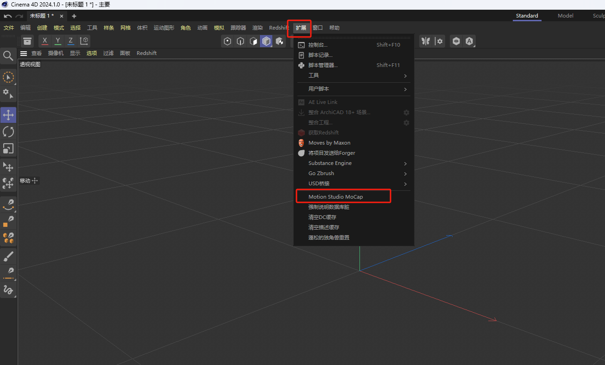

After clicking, the plugin connection settings dialog will appear.

**3) Connection interface description and feature introduction**

As shown below, the plugin interface is divided into 4 tabs: Connection Settings, Character List, and About Plugin.

1. Connection Settings: This is the main control page.

> From left to right at the bottom are: Connect, Sync, and Record buttons.

Connect: Used to connect to the MS server. Data broadcasting must be enabled in MS first.

Sync: After clicking Show Skeleton/Model in the character list, you can enable motion synchronization. When disabled, the character's skeleton will no longer be driven for movement and rotation.

Record: Records the received motion data.

> Network Settings area: You can switch between TCP/UDP network connections and configure the connection address and port.

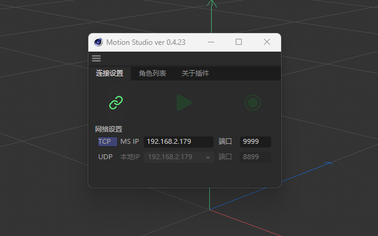

2. Character List area:

Character Name/ID: Click the Character Name/Character ID button to switch the content displayed in the character list (character name or character ID).

Show/Hide Character: Click the Show/Hide button on the right side of a character to toggle its display state (the Show/Hide button in the title bar can set the show/hide state for all characters at once, and each character can also be set individually).

Character Sync/T-Pose: Click the character pose button on the far right to switch all or a specific character's pose to T-Pose, or to sync the current MS pose.

Keep Characters: Choose whether to retain the characters in the scene after disconnecting.

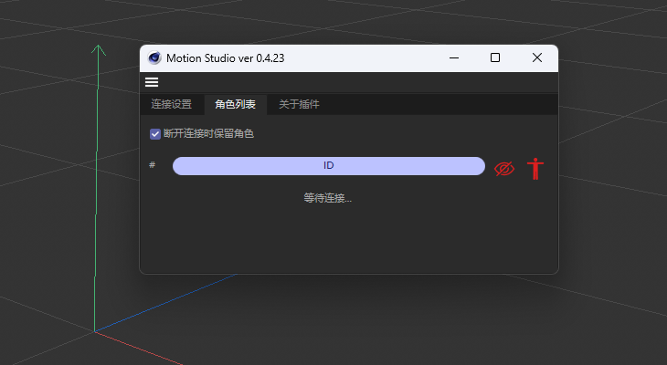

3. About Plugin: Here you can visit the official website, view the plugin version, open this plugin guide, and check for plugin updates.

**2. Connect to Motion Studio and drive the character model in Cinema4D**

**1) Connect to Motion Studio (choose either TCP or UDP)**

Select a TCP or UDP connection according to the IP address and port number configured in the corresponding data broadcasting settings in MotionStudio.

**1.1 TCP Connection**

When using a TCP connection, click the TCP button on the far left (it highlights when selected). Then enter the IP address and the corresponding port number (default is 9999) configured in MotionStudio in the Cinema4D address fields.

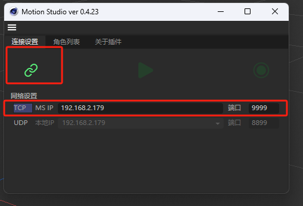

**1.2 UDP Connection**

In MotionStudio, set the data broadcasting to a UDP connection and configure the port number. In the Target IP field, enter the IP address of the computer where the plugin is installed, and set the port number.

When using a UDP connection in Cinema4D, in addition to the steps above, you also need to fill in the port number of the target IP from Motion Studio.

**2) Enable the connection in the Cinema4D plugin**

After confirming that the IP settings are correct in the first step, click the **Connect** button in the upper-left corner of the plugin to connect to the MotionStudio data broadcast.

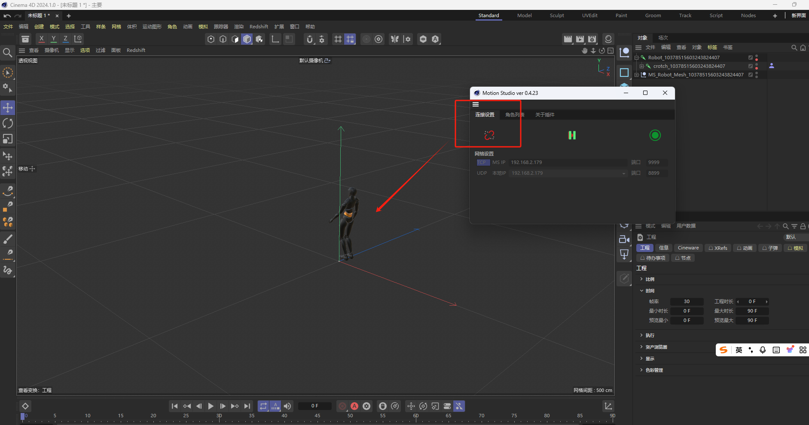

**3) Toggle the character display state**

Click the character display icon to toggle the character's display state.

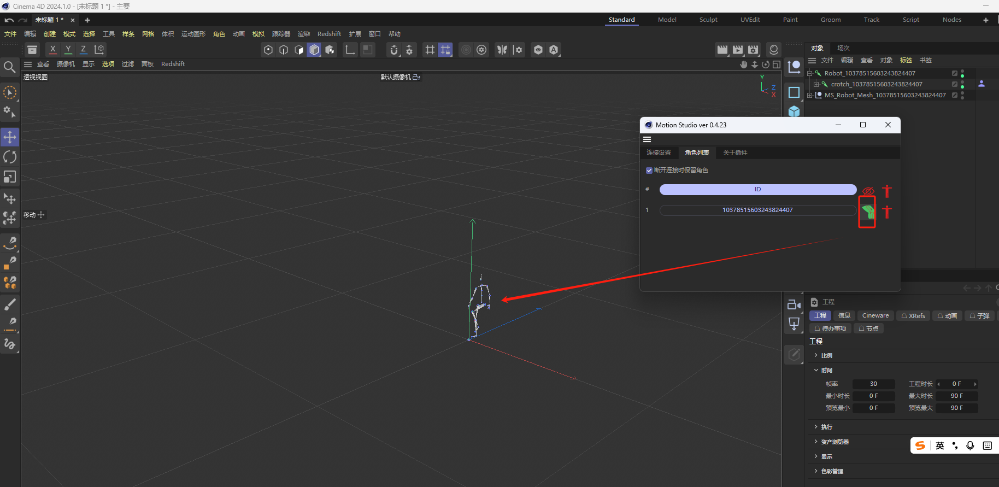

**4) Switch the data source or connection protocol**

When you need to switch the data source in MS (e.g., Live → Recording, between different recorded data, TCP → UDP, etc.), first disable the current plugin's sync state, then click the Disconnect button in the Connection Settings area. Once the new data source has been switched in Motion Studio, click the Connect button again to drive the character model.

Note: If "Keep characters on disconnect" is checked in the plugin settings, the characters will remain in the scene.

**3. Recording Motion and Saving**

**1) Record animation**

After completing the steps to connect to MotionStudio and synchronously drive the character, click the Record button in the Connection Settings area.

Click again to stop recording; this will pause motion synchronization. Click the Play button in the animation track at the bottom of C4D to play back the motion you just recorded.

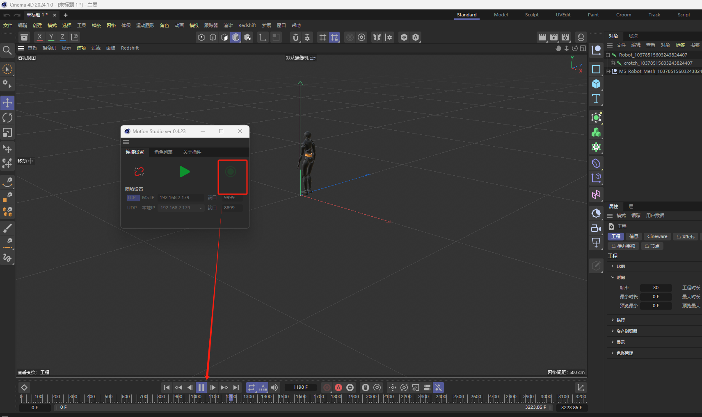

Note: After recording one take, you must export the current file. If you do not export it before recording a second take, the first recording will be overwritten.

**2) Export the recorded animation**

When exporting the recorded animation, you can save the scene and animation as a C4D file, or export to other file formats (such as FBX).

If you choose to save as C4D, you can use File \> Save Project / Save Project As... or Ctrl+S / Ctrl+Shift+S. If you need to export as an FBX file, use File \> Export \> FBX, then select the destination location in the dialog that appears.

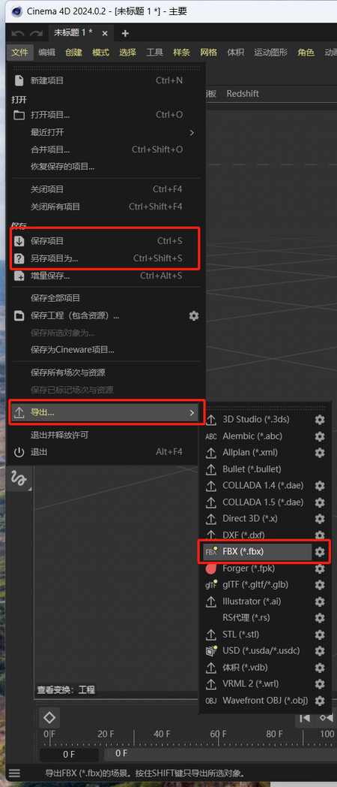

**3) Play back the recorded motion**

Once the export is complete, under the Objects window, choose File \> Merge Objects... to select the FBX or C4D file you just exported.

**4. Live Retargeted Driving or Recorded-and-Exported Retargeting**

**1) Add a model for live retargeted driving**

**①. Connect the C4D plugin to Motion Studio**

In MotionStudio - Data Broadcasting, set the corresponding IP address and port number.

After setting the IP and port in C4D to match MS, click the Connect button and the Show Model button to enable motion synchronization (when performing retargeting operations, pause data synchronization first).

**②. Import the retargeting model (using an FBX file as an example)**

Under the Objects window, choose File \> Merge Objects... to select and import the corresponding FBX file.

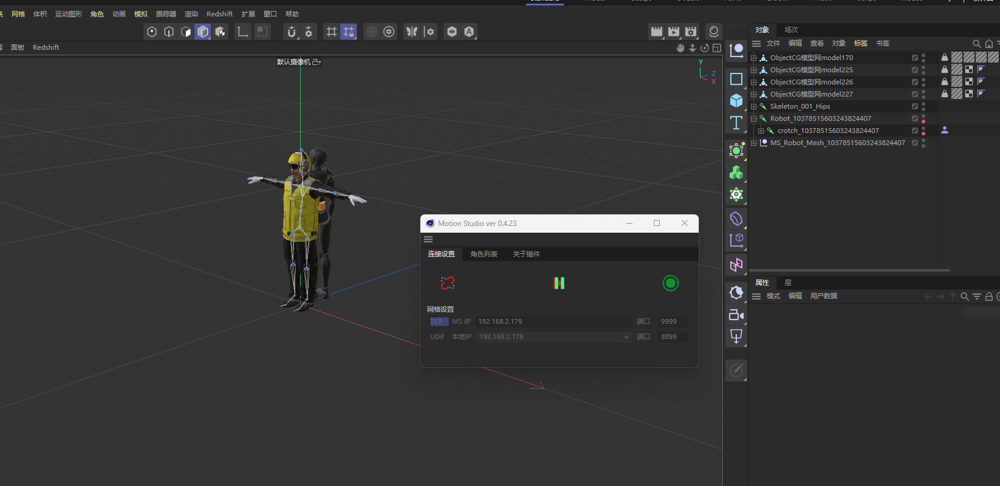

**③. Add a character definition**

In the Objects window, select the Hips bone of the imported character, right-click and choose Rig Tags \> Character Definition to create a character definition on the Hips bone.

As shown below, a Character Definition icon appears to the right of the Hips bone.

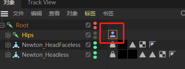

**④. Skeleton mapping**

Click the Character Definition icon. In the Attributes window below, you can view the basic properties of the character definition, then click Open Manager.

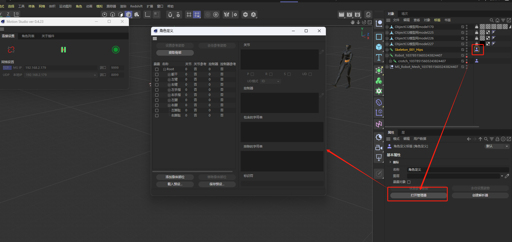

In the Character Definition window, click Extract Skeleton to automatically map the character's bones to the generic skeleton.

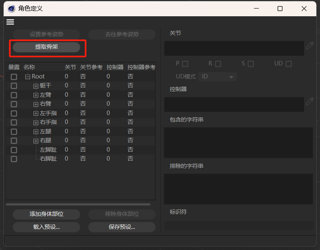

Note: Because the model's skeleton naming may not follow the standard, you need to check one by one whether any bones are missing or incorrectly mapped in the skeleton. (As shown below, the bone was not correctly obtained for the left thigh joint, because the left thigh in the character's skeleton is named LeftThigh instead of leftupleg. You can manually drag LeftThigh from the character's skeleton into the joint list; the same applies to other bone joints.)

**⑤. Set the retargeting source**

After completing the mapping of all bone joints, click the Create Solver button in the Character Definition properties.

A Solver icon is added to the right of the Hips bone.

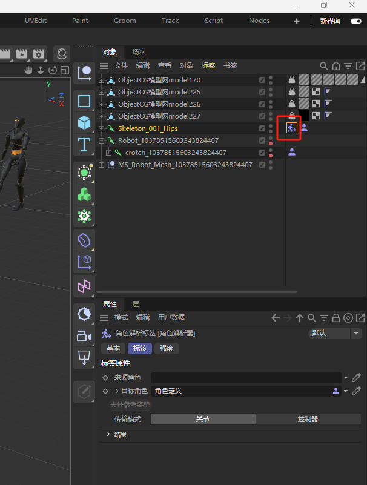

The Source Character must be the synchronously driven source character. Under the Objects window, locate the MS character you want to sync, then drag its character definition into the Source Character field of the target character's solver. (When retargeting, the source character does not need to be in T-Pose.)

**2) Record the retargeted animation driving**

**①. Record the animation**

After the model's skeleton rigging is complete, click the Record button.

Click again to stop recording; this will pause motion synchronization. Click the Play button in the animation track at the bottom of C4D to play back the motion you just recorded.

Note: After recording one take, you must export the current file. If you do not export it before recording a second take, the first recording will be overwritten.

**②. Export the recorded animation**

When exporting the recorded animation, you can save the scene and animation as a C4D file, or export to other file formats (such as FBX).

If you choose to save as C4D, you can use File \> Save Project / Save Project As... or Ctrl+S / Ctrl+Shift+S. If you need to export as an FBX file, use File \> Export \> FBX, then select the destination location in the dialog that appears.

**③. Play back the recorded motion**

Once the export is complete, under the Objects window, choose File \> Merge Objects... to select the FBX or C4D file you just exported.

