**Maya Plugin User Guide**

**1. Maya Software Download**

[Please view the attachment "Maya_2025_webinstall.exe" on the DingTalk document](https://alidocs.dingtalk.com/i/nodes/7dx2rn0Jba3NnjlwtxDAL19wVMGjLRb3?iframeQuery=anchorId%3DX02mcu6sz4hcj3gxxr6rf9)

**2. Installing the Maya Plugin**

**1. Download link:**

[Please view the attachment "MotionStudio_Maya_22-25_Win64_v0.7.27_Setup.msi" on the DingTalk document](https://alidocs.dingtalk.com/i/nodes/7dx2rn0Jba3NnjlwtxDAL19wVMGjLRb3?iframeQuery=anchorId%3DX02m8s4dfr9ku47ayzj8t)

**2. Installation steps:**

1.  Double-click to open the installer.

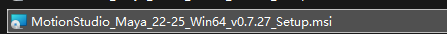

2. Click Next.

3. Select the Maya version for which you want to install the plugin. Currently Maya 2022, 2023, 2024, and 2025 are supported. Then click Next. (You only need to check the installed Maya version. For example, if Maya 2024 is installed, just check Maya 2024, as shown below.)

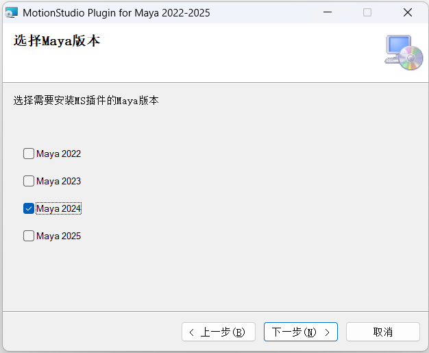

4. Select the plugin installation location. Please choose the directory where Maya is located. By default, the maya folder under the user's Documents directory is selected (i.e. C:\Users\<username>\Documents\maya\). You can use the default path. Then click Next. (The plugin and the software must be installed in the same directory.)

5. Click Next to start the installation. In the confirmation dialog that appears, select Continue.

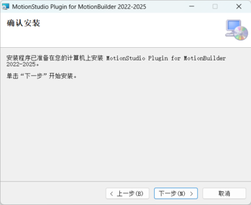

6. The plugin installation is complete. Click Close.

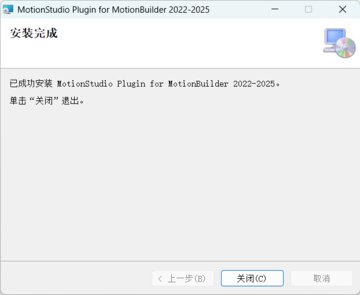

**3. Maya Plugin Usage Guide**

**1. Opening the MS plugin in Maya**

**1) Open Maya (versions 2022–2025 are supported; this document uses version 2025 for demonstration)**

**2) Open the MS plugin**

From the menu bar, go to Window > Workspaces and select Animation to switch the UI layout to the Animation layout.

In the top shelf, click the tab button at the far left of the top, and select Motionstudio from the list.

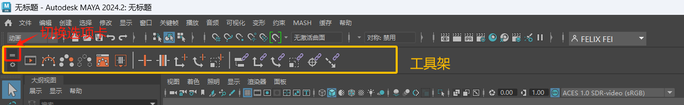

The MotionStudio Maya plugin shelf contains three shortcut buttons: Connection Settings, Joint Data, and About Plugin.

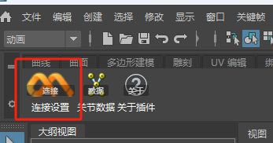

Click Connection Settings on the far left. The following dialog will appear. You can check the "Apply to all plugins at this location" option at the bottom, then click Allow.

After clicking Allow, the plugin's Connection Settings panel will appear. Initially the UI is fairly small; you can resize it by dragging the window edges.

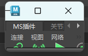

**3) Connection panel overview and feature descriptions**

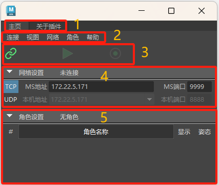

**(1) Panel overview**

> As shown above, the plugin interface is divided into 5 areas:
>
> 1. Tab bar — switch between the plugin home page and the About Plugin page
>
> 2. Menu bar
>
> 3. Connection settings area
>
> From left to right at the bottom: Connect, Sync, and Record buttons.

Connect: Used to connect to the MS server. Data broadcasting must first be enabled in MS.

Sync: After clicking Show Skeleton/Model in the character list, you can enable motion sync. When disabled, it will no longer drive the character's skeleton translation and rotation.

Record: Records the received motion data.

> 4. Network settings area
>
> You can switch between TCP/UDP network connections and set the connection address and port.
>
> 5. Character list settings area
>
> Character Name/ID: Click the Character Name/Character ID button to switch what is displayed for each character in the list (character name or character ID)

Show/Hide Character: Click the Show/Hide button to the right of a character to toggle its display state. (The Show/Hide button in the title bar controls the show/hide state of all characters at once; each character can also be set individually.)

Character Sync/TPose Pose: Click the rightmost character pose button to switch all or a single character's pose to TPose, or sync the current MS pose.

**(2) About Plugin page**

Here you can view the plugin version, open this plugin guide, update the plugin, and visit the official website. (Checking for a new plugin version in the current version will cause Maya to freeze temporarily for about 10+ seconds while it detects the version.)

**2. Connecting to Motion Studio and driving the character model in Maya**

**1) Connect to Motion Studio (choose either TCP or UDP)**

Based on the IP address and port number configured in Motion Studio's data broadcasting settings, select a TCP or UDP connection.

**1.1 TCP connection**

When using a TCP connection, click the leftmost TCP button (it will highlight when selected). Then, in the Maya address field, enter the IP and corresponding port number set in Motion Studio (default is 9999).

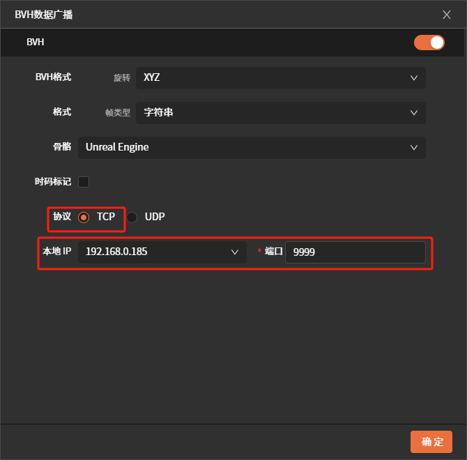

**1.2 UDP connection**

In Motion Studio, set data broadcasting to a UDP connection and configure the port number. In the target IP field, enter the IP address of the computer where the plugin is installed, and set the port number.

When using a UDP connection in Maya, in addition to the steps above, you also need to fill in the port number for the target IP used in Motion Studio.

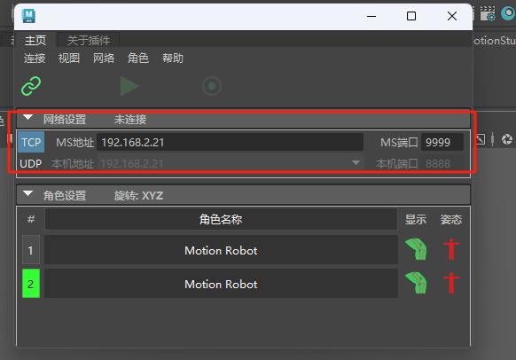

**2) Enable the connection in the Maya plugin**

After confirming the IP settings are correct in step 1, click the **Connect** button in the upper-left corner of the plugin to connect to the Motion Studio data broadcast. If the Connect button becomes unclickable and data is present, the connection is successful.

**3) Load the character model**

Click the character show icon to display the character model.

**4) Switch the data source or connection protocol**

When you need to switch the data source in MS (real-time → recording, between different recorded data, TCP → UDP, etc.), first disable the current plugin's sync state, then click the Disconnect button in the connection settings area. Once the new data source has been switched in Motion Studio, click the Connect button again to drive the character model.

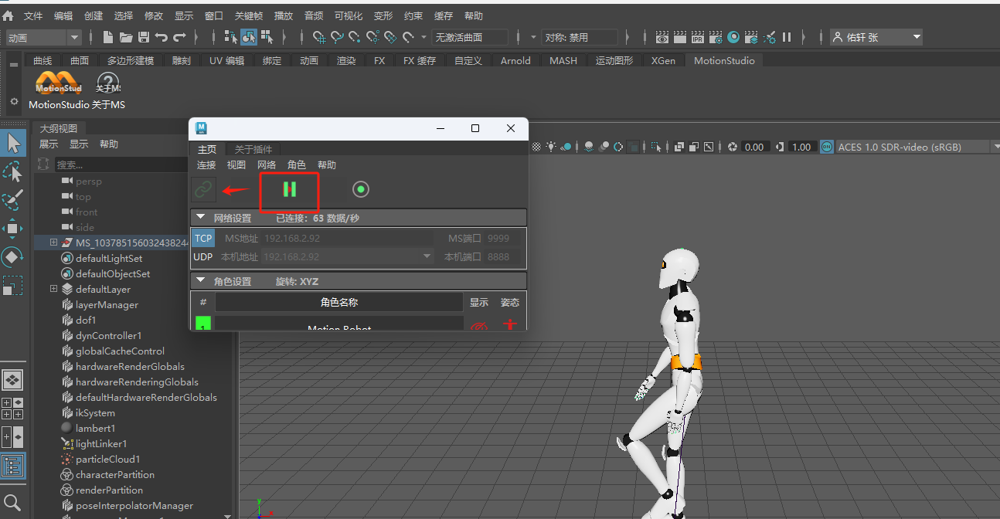

**3. Recording and Saving Motion**

**1) Recording motion**

After completing the steps to connect to Motion Studio and syncing to drive the character, you can click the Record button in the connection settings area.

While recording is in progress, the button will change to the following state. Click it again to stop recording.

Note: After recording one clip, you must export the current file first. If you record a second clip without exporting, the first recording will be overwritten.

**2) Export the recorded motion**

When exporting the recorded animation, it is best to first disable sync driving (but do not disconnect), then click Maya menu bar → File → Export All, and select the file format, path, etc. Here we use the FBX format as an example. Click the FBX format, enter the file name, and click Export All.

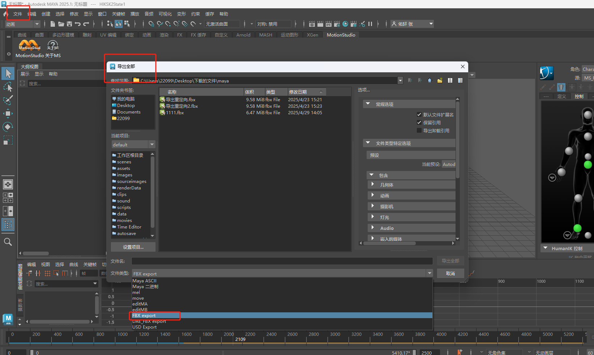

**3) Play back the exported motion**

Once export is complete, click the Disconnect button in the connection settings and clear all characters.

From the Maya menu bar, select File → Import, choose the corresponding folder and file, and the import will succeed.

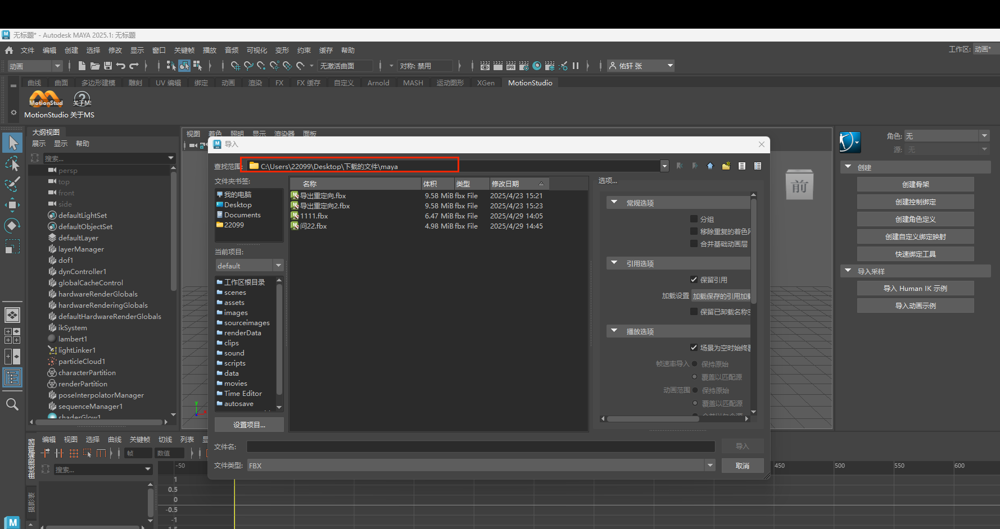

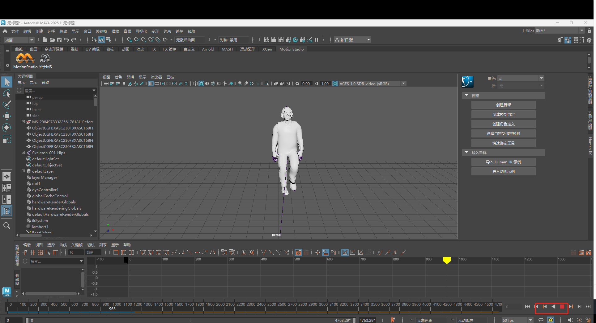

**4. Real-time Retargeting Drive or Recording and Exporting Retargeted Animation**

**1) Adding a model for real-time retargeting drive**

**①. Connect the Maya plugin to Motion Studio**

In Motion Studio's data broadcasting, set the corresponding IP address and port number.

After setting the corresponding IP and port in Maya to match MS, click the Connect button and the Show Model button to enable motion sync.

In the MS plugin, pause skeleton position sync, and click the button in the corresponding character's pose column to switch the skeleton to the TPose pose.

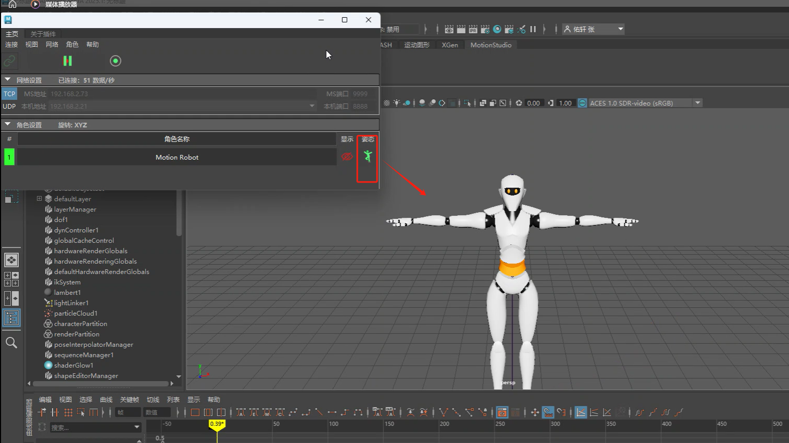

**②. Import the retargeting model (using an FBX file as an example)**

Via the menu bar, select File → Import, choose the corresponding file, and click Import.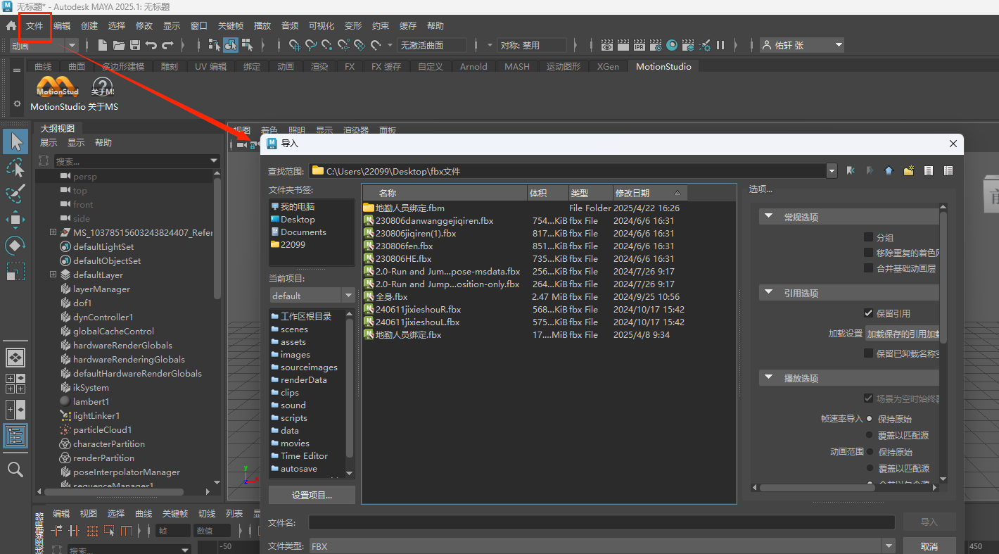

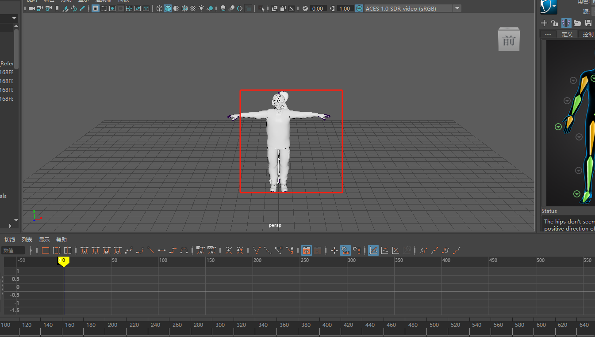

**③. Add a character definition**

After importing the FBX file, set the character drop-down to None, and click Add Character Definition.

**④. Skeleton mapping**

Select the corresponding bones and perform skeleton mapping.

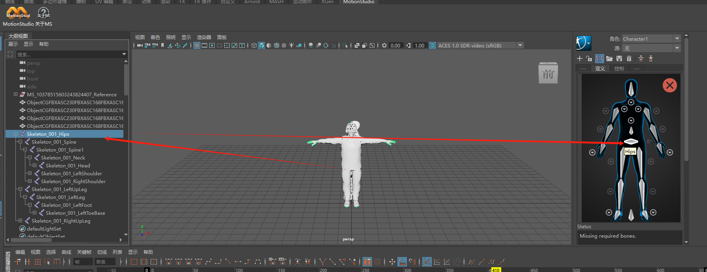

[Please view the attachment "QQ2025430-14569.mp4" on the DingTalk document](https://alidocs.dingtalk.com/i/nodes/7dx2rn0Jba3NnjlwtxDAL19wVMGjLRb3?iframeQuery=anchorId%3DX02ma3l35tari0u62hv0g)

**⑤. Set the retargeting source**

Once skeleton mapping is complete, click the Source drop-down and select MS_Robot.

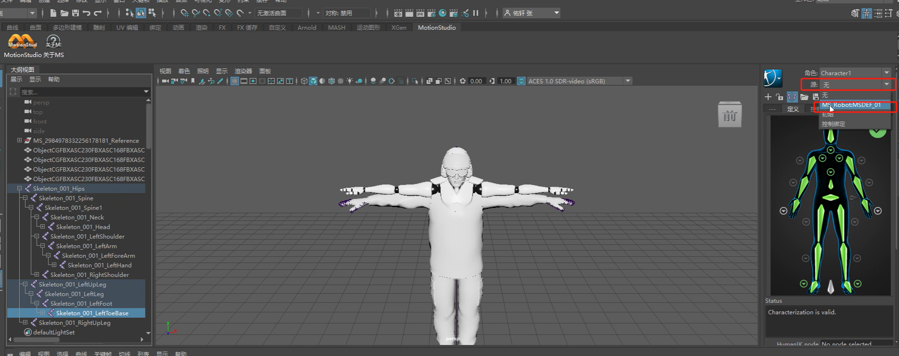

At this point, after we have mapped and bound the plugin's skeleton to the model's skeleton, disable the T-pose display. Play recorded data in MS or transmit real-time data, and the model will display the transmitted data in real time.

**2) Recording animation retargeting drive**

**①. Record the animation**

Once the model's skeleton binding is complete, click the Record button.

While recording is in progress, the button will change to the following state. Click it again to stop recording.

**②. Bake the skeleton**

After recording is complete, wait for the recorded data to finish loading for the first pass. Once loading is complete, disconnect the MS plugin.

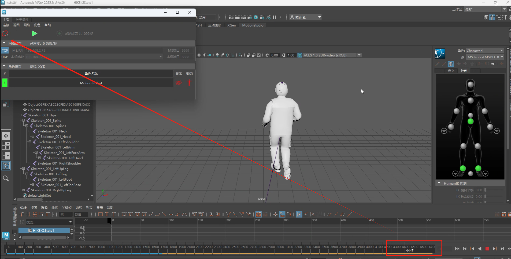

After disconnecting, right-click the character's avatar and select Bake to Skeleton.

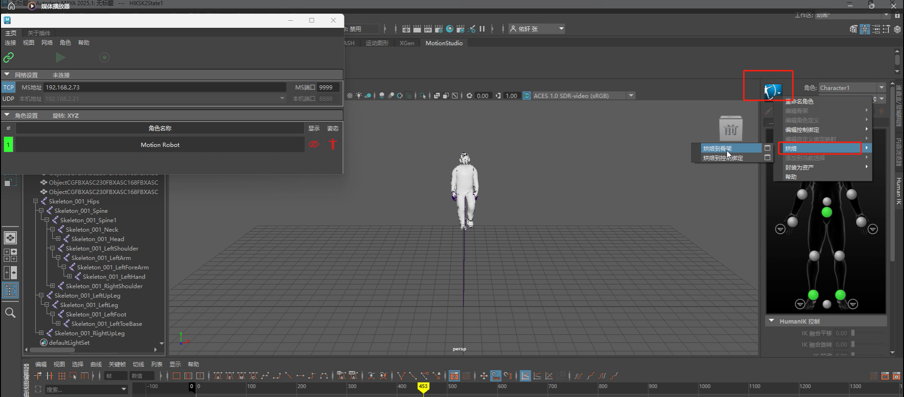

Wait for the data baking to complete, then you can export the file (this binds the model to the animation).

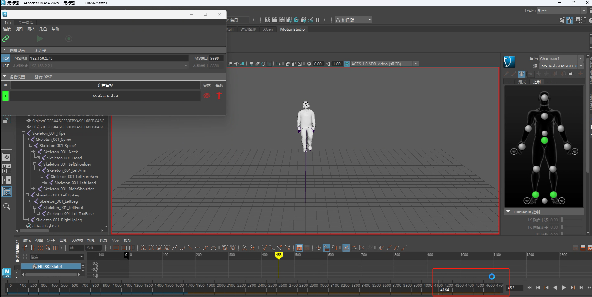

**③. Export the baked file**

Click Maya menu bar → File → Export All, and select the file format, path, etc. Here we use the FBX format as an example. Click the FBX format, enter the file name, and click Export All to export successfully.

