# **Motion Builder Plugin Tutorial**

## **1. Motion Builder Software Download**

Software installer: Win64 version

[MotionBuilder_2025_en-US_setup_webinstall.exe](./assets/MotionBuilder_2025_en-US_setup_webinstall.exe)

## **2. Installing the Motion Builder Plugin**

### **1. Download link:**

[MotionStudio_MoBu_22-25_Win64_v0.10.09_MSv1.8.59_Setup.msi](./assets/MotionStudio_MoBu_22-25_Win64_v0.10.09_MSv1.8.59_Setup.msi)

### **2. Installation steps:**

1.  After extracting, double-click to open the MotionStudio_MoBu_22-25_Win64_v0.10.09_MSv1.8.59_Setup.msi
    installer.

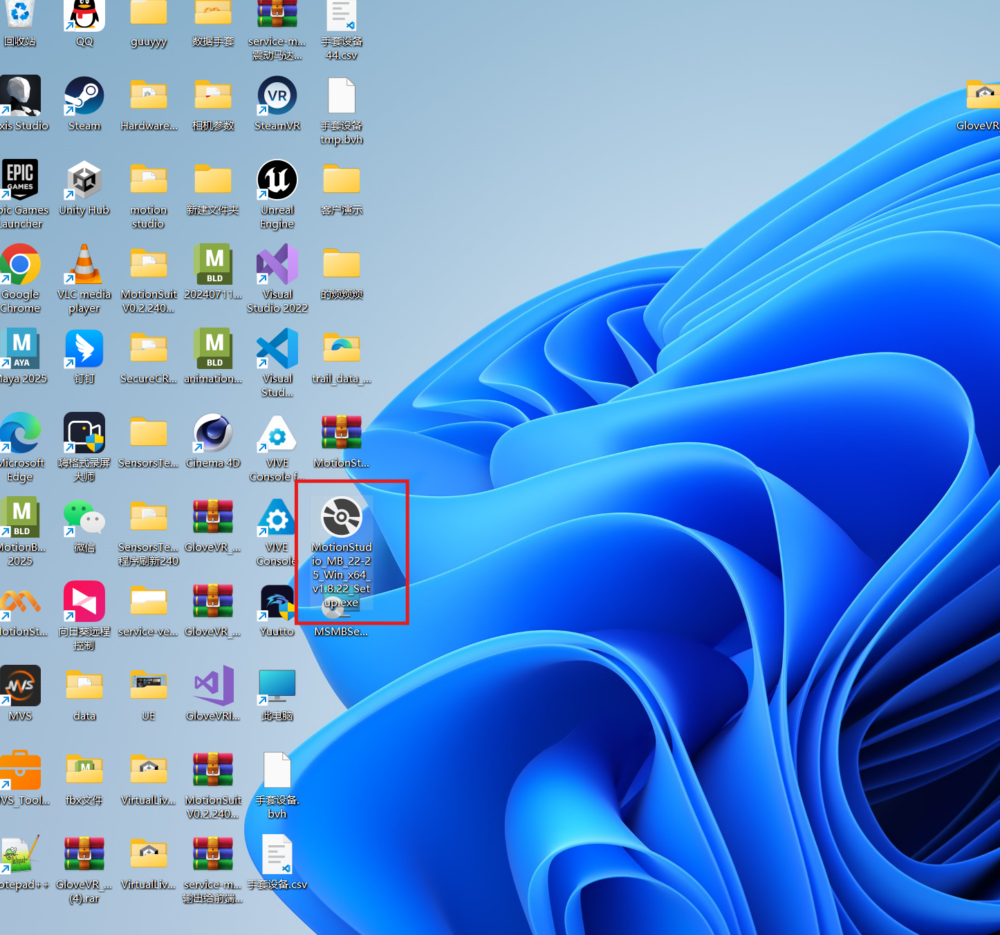

2. Click Next.

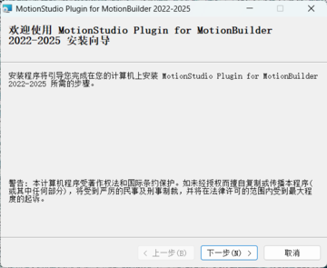

3\. Select the MotionBuilder version to install the plugin for. Currently, MotionBuilder
2022, 2023, 2024, and 2025 are supported. Then click Next.

4. Select the plugin installation location. Choose the directory where MotionBuilder is installed. The default Autodesk installation directory is selected by default. Then click Next (the plugin and the software must be installed in the same directory).

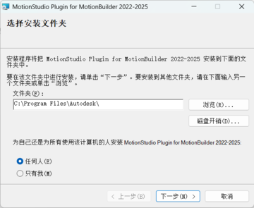

5. Click Next to start the installation, and select Continue in the confirmation dialog that appears.

6. The plugin installation is complete. Click Close.

## **3. Motion Builder Plugin Usage**

### **1. Driving Data with the Plugin's Built-in Model**

**1). Open Motion
Builder (versions 2022--2025 are all supported; this document demonstrates version 2025)**

**2). Import the MS plugin**

In the Asset Browser
tab in the lower-right corner, select Templates → Devices on the left side, and find the Motion Studio
Plug plugin in the list on the right. Drag and drop the plugin into the main scene to import it.

Drag the Motion
Studio plugin into the main scene to complete the import. Click Navigator --- Devices to see the plugin interface.

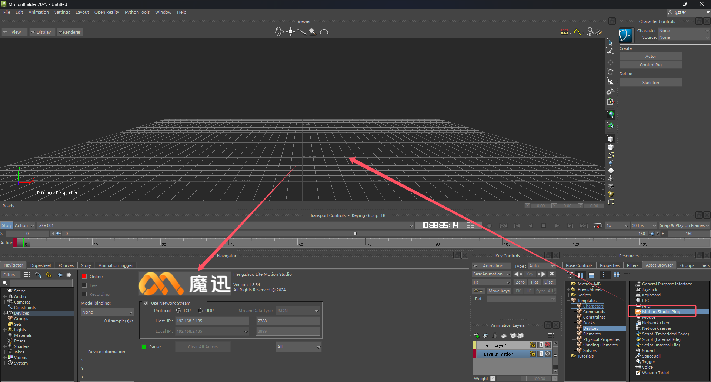

**Note**: If you cannot find the Motion Studio
Plug plugin under Devices, the installation path may have been selected incorrectly during setup. In this case, you need to locate the actual plugin installation path first.

For example, if the plugin installation path is D:\Program\MotionBuilder 2025\
then you will see the following contents in that directory. Right-click an empty area in the left sidebar of the Asset
Browser and select Add favourite
path, then select the D:\Program\MotionBuilder 2025\MotionBuilder
2025\bin\x64\plugins directory (make sure that MotionStudioPlug2025.dll exists in this directory;
the version number depends on the required version, such as 2022, 2023, 2024, etc.)

**3). Connect to Motion Studio**

Check whether Use Network
Stream is selected (if not, select it manually). According to the corresponding data broadcast settings in Motion Studio, choose a TCP or UDP connection.

**TCP connection:**

When using a TCP connection, simply enter the local IP from Motion Studio in the Host
IP field (the default is the local machine IP; if MotionBuilder and Motion Studio are not running on the same computer, modify this accordingly based on Motion Studio's local IP) and the corresponding port number.

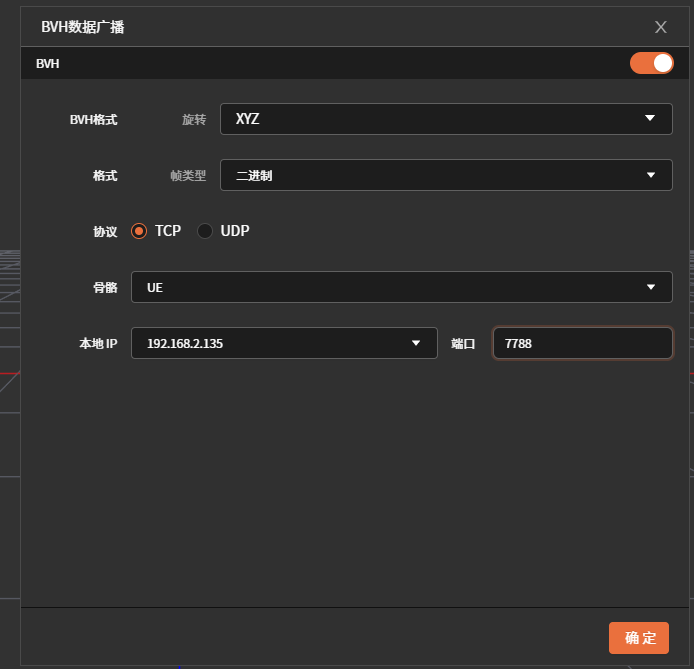

**UDP connection:**

When using a UDP connection, select UDP. In addition to the above operations, you also need to enter the IP address and port number of the computer running the plugin.

In Motion
Studio, set the data broadcast to a UDP connection, and enter the same port number as the plugin (7788). In the Target IP field, enter the IP address from the plugin, and set the port to match the plugin (default is 8899).

After **completing pose calibration** or **playing a recording file** in MS, and confirming that the IP settings in the plugin are correct, click Online in the upper-left corner of the plugin to connect to the Motion
Studio data broadcast (if Motion Builder crashes, please restart Motion Builder and try again). When the Online button turns green, the connection is successful.

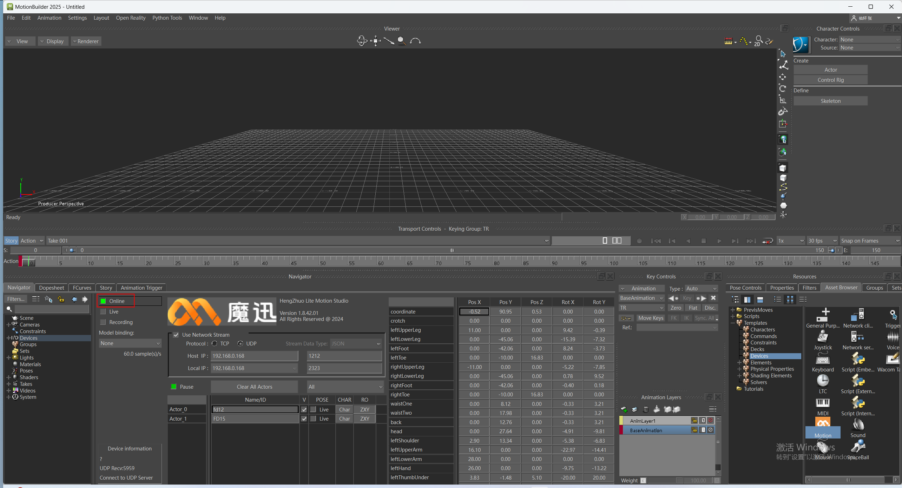

After a successful connection, click the Live button. The following interface is displayed.

**4). Bind the model skeleton and create a character definition**

Click Model binding and select Create\... from the drop-down list.

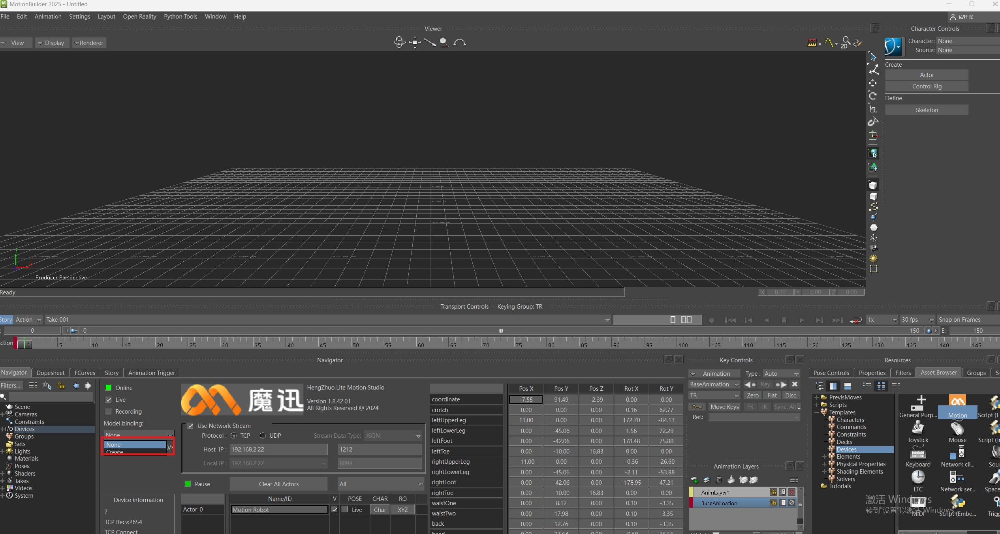

The selection box automatically displays Motion Studio
Reference, and the character skeleton is shown in the scene (multiple devices: MS displays one character skeleton for each set of connected devices).

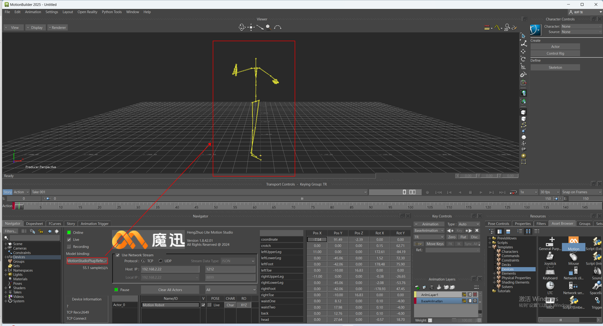

**5). Bind and directly drive the character model**

The plugin already includes one sample model. You can find the MS_Robot model in AssetBrowser → Tutorials.

Next, using these two models as examples, select the MS_Robot.fbx file and drag it into the scene. During the drag-in process, you will be prompted with the FBX
Open or FBX Merge option (selecting FBX Open creates a brand-new scene, while FBX
Merge merges the newly dragged-in model into the scene).

Therefore, after importing MS_Robot.fbx, select FBX Merge → \<All
Takes\> (if there are multiple characters in the motion capture scene, you typically need to import multiple character models).

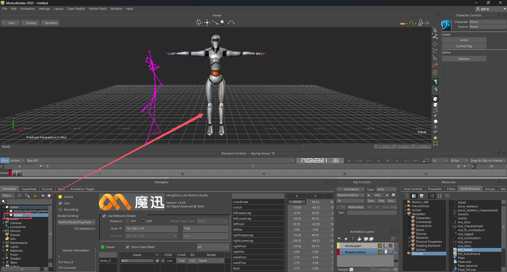

At this point, enable the plugin's network connection, select Live, and after creating the Model
Binding, you can see the list of newly imported character models in the scene under the Model column of the character list. Select the corresponding character model (note that different characters must select different models). After selection, the model and skeleton are bound together.

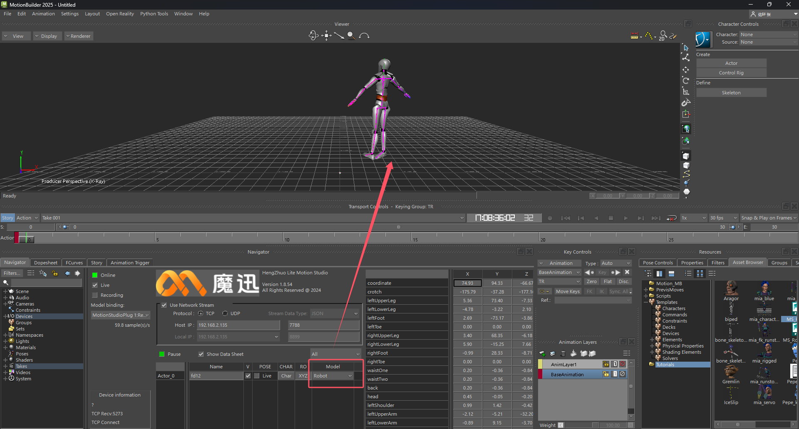

**6). Directly drive the hand model**

Motion Studio streams glove data or recorded data in real time. After filling in the correct MB IP and port, click Online, re-select Live, and click Model
binding, then select Create\... from the drop-down list to display the hand skeleton.

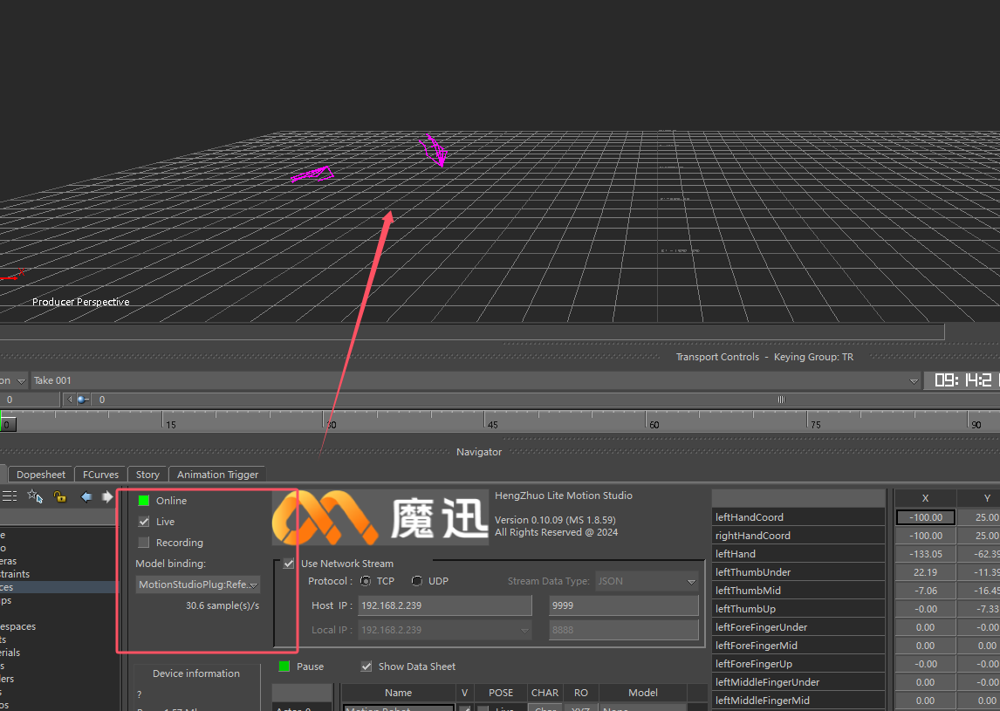

**7) Disconnect (switch data source)**

1. When you need to switch between different data sources in Motion Studio, click the Online button to disconnect from Motion Studio.

2) Switch the data source in Motion Studio (add or remove devices, or switch recording files).

3) Return to Motion Builder, click Online to enable real-time data, select the Live option, and select Create\... from the Model
binding drop-down list to switch to the new data source in Motion Builder (you need to rebind the model).

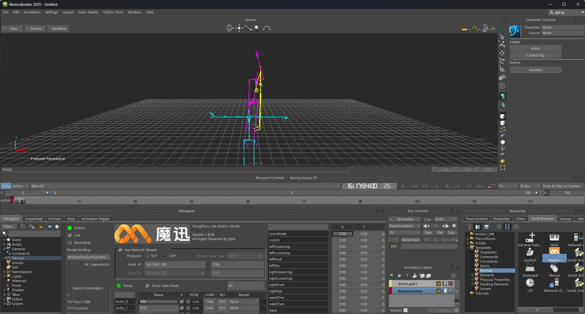

**8) Feature overview**

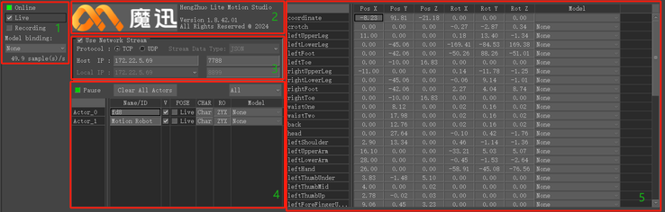

Area 1 in the interface is the connection settings, including the connect/disconnect button (Online), the real-time data button (Live), the Recording button, and the model binding drop-down list (Model
binding).

Area 2 is the plugin info. Click the Logo icon to open the official website.

Area 3 is the network settings, including whether to enable the network data stream (Use Network
Stream), the network protocol (TCP or UDP), the stream type (not configurable at this time), the Motion Studio host IP and port (required for both TCP and UDP), and the local IP address and port (required only for UDP, used to receive UDP data from Motion Studio).

Area 4 is the character settings, including the Pause/Resume button, the Clear
All Actors button, the body part display drop-down list (All/Body/Hand), and the character list below.

Area 5 is the data area, including the raw data for each joint.

### **2. Adding a Model and Retargeting**

**1) Import a character model**

Import any model with a standard humanoid skeleton. You can use the character model included with MB, for example by finding any motion in AssetBrowser → PrevisMoves (Dance is used here as an example). When importing, select FBX
Merge → \<No Animation\> to skip importing the animation.

Select any motion from the PrevisMoves preset motion file list in MB, using Dance as an example.

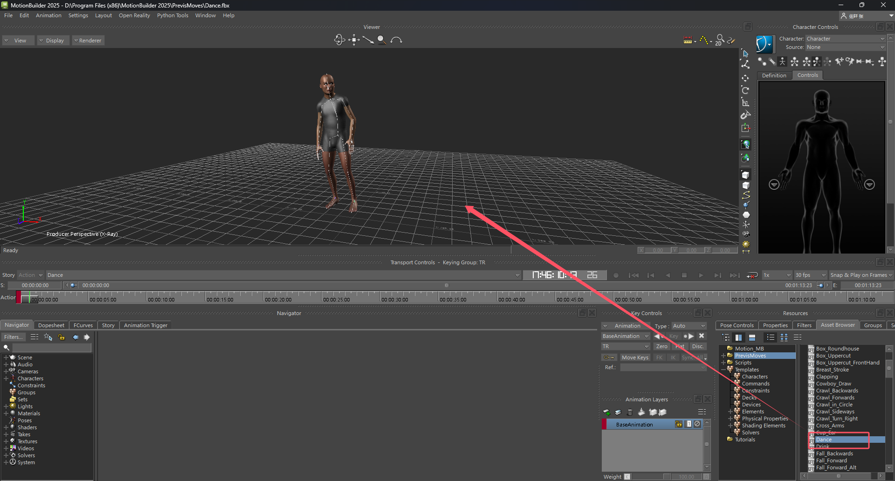

**2) Set the character model to T-Pose**

In the scene, press Ctrl+W to display the skeleton outline view, then box-select all bones under the Hips root bone. Then right-click on Hips and select Zero → Rotation to reset the model to the T-Pose pose. (This only applies to models whose initial skeleton pose is T-Pose.)

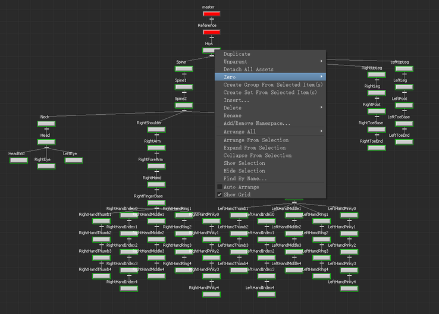

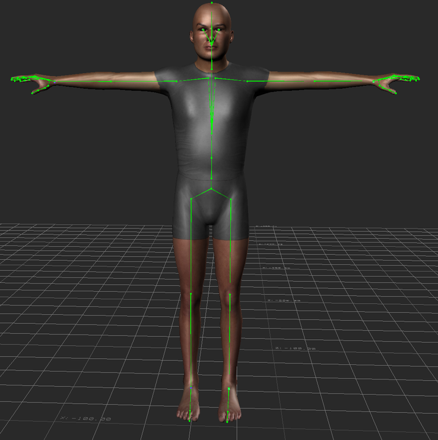

> Press Ctrl+W again to return to the scene view. You can see that the character model is now in the T-pose.

**3) Add a character definition (Characterize) to the character model**

In most cases, the character you just imported already contains the corresponding character definition. You can check whether a character definition already exists under Characters in the left list of Navigator. If it does, the creation was successful. You can also verify in Character
Controls whether the correct corresponding character definition has been created.

**Creating a character definition for an externally imported model, or fixing an incorrect character definition**

You can follow these steps to create a new character definition and map it to the character model.

1. Import any FBX model with a standard humanoid skeleton. Drag the external file in, and select FBX Open → \<No
Animation\> to skip importing the animation.

2. In the Asset
Browser panel, select Templates → Characters on the left side, and select Character on the right.

3. In the scene, press Ctrl+W to switch to the skeleton outline view. Use the left mouse button to drag the Character selected in the previous step onto the Hips root bone of the character model.

4. After releasing the left mouse button, a Characterize button appears. Click that button, and then click the Biped button in the dialog that pops up.

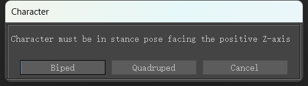

**4) Import the plugin and connect to Motion Studio**

In the Asset Browser
tab in the lower-right corner, select Templates → Devices on the left side, and find the Motion Studio
Plug plugin in the list on the right. Drag and drop the plugin into the main scene to import it.

Drag the Motion
Studio plugin into the main scene to complete the import. Click Navigator --- Devices to see the plugin interface.

Check whether Use Network
Stream is selected (if not, select it manually). According to the corresponding data broadcast settings in Motion Studio, choose a TCP or UDP connection.

**TCP connection:**

When using a TCP connection, simply enter the local IP from Motion Studio in the Host
IP field (the default is the local machine IP; if MotionBuilder and Motion Studio are not running on the same computer, modify this accordingly based on Motion Studio's local IP) and the corresponding port number.

**UDP connection:**

When using a UDP connection, select UDP. In addition to the above operations, you also need to enter the IP address and port number of the computer running the plugin.

In Motion
Studio, set the data broadcast to a UDP connection, and enter the same port number as the plugin (7788). In the Target IP field, enter the IP address from the plugin, and set the port to match the plugin (default is 8899).

After **completing pose calibration** or **playing a recording file** in MS, and confirming that the IP settings in the plugin are correct, click Online in the upper-left corner of the plugin to connect to the Motion
Studio data broadcast (if MotionBuilder crashes, please restart MotionBuilder and try again). When the Online button turns green, the connection is successful.

After a successful connection, click the Live button.

**5). Bind the model skeleton and create a character definition**

Click Model binding and select Create\... from the drop-down list.

The selection box automatically displays Motion Studio Reference, and the character skeleton is shown in the scene.

**6) Set the characterization definition for the character skeleton**

1.  In Area 4, click the Pause button in the upper-left corner to pause skeleton position updates, and click the button in the Pose column of the corresponding character to switch the skeleton to the TPose pose.

2. In the character list of Area 4, you can click the character's CHAR button to create a characterization definition instance (MSCharacter).

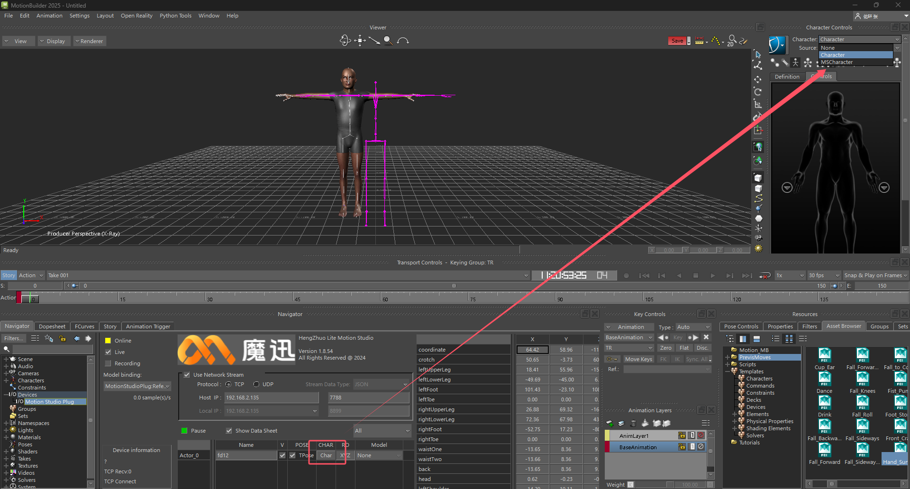

3. Reset the characterization. In the Character
Control panel, select the newly created character definition MSCharacter in turn, click the lock button below to unlock it, then click that button again, and select Biped in the dialog that pops up. Do the same for the imported character model (Character). Check whether all the bone mappings under each character definition are displayed in green. If any are not green, you need to reset the bone rotation to zero again (Zero → Rotation).

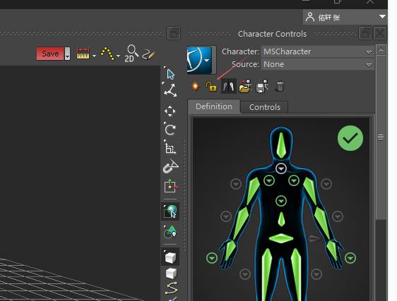

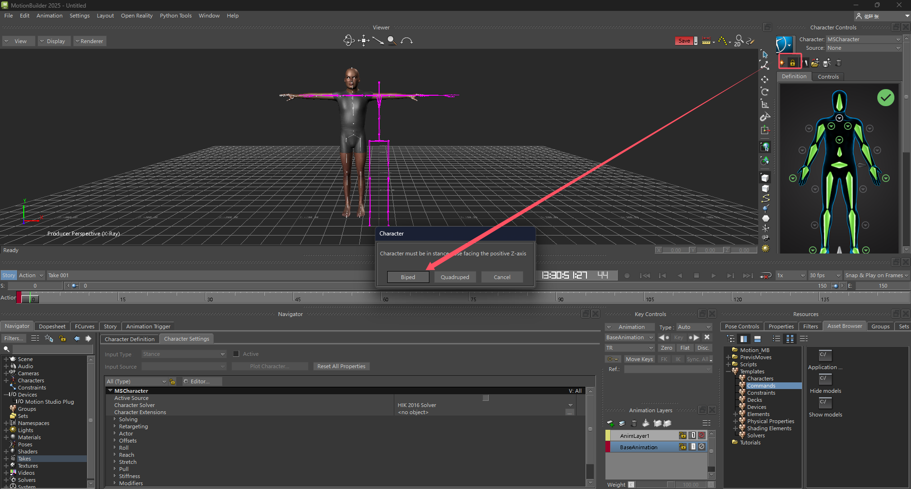

**7) Set the retargeting source**

At this point, in the Character
Control panel, click the character drop-down list, select the Character character definition, then click the Source drop-down list, and select MSCharacter.

Now that we have completed the mapping and binding between the plugin-bound skeleton and the model's skeleton, cancel the T-pose display and click the Pause button. When you play recording data or stream real-time data in MS, the model will display the streamed data in real time.

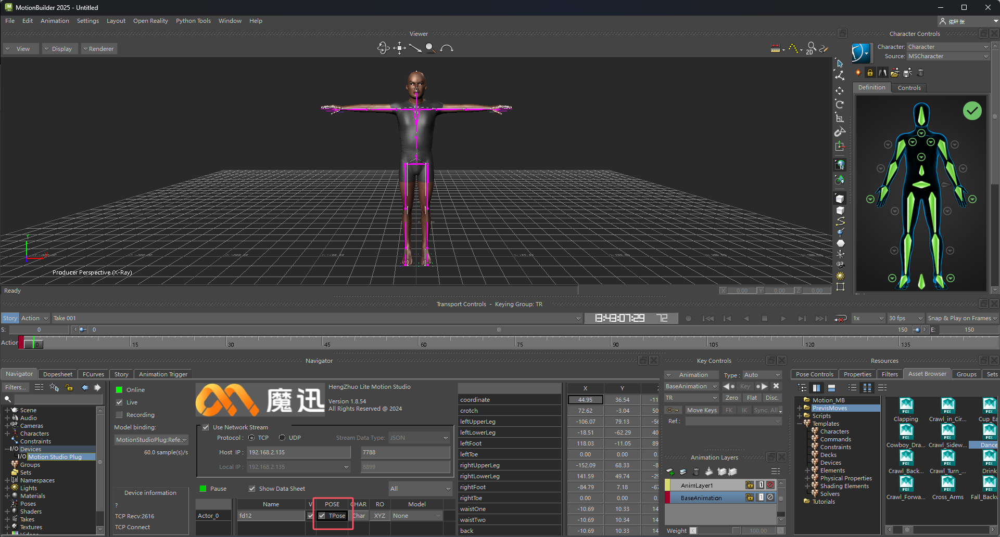

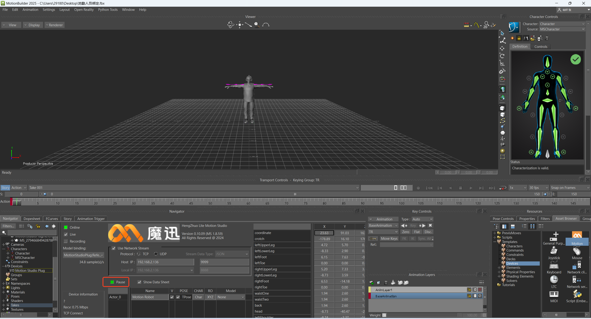

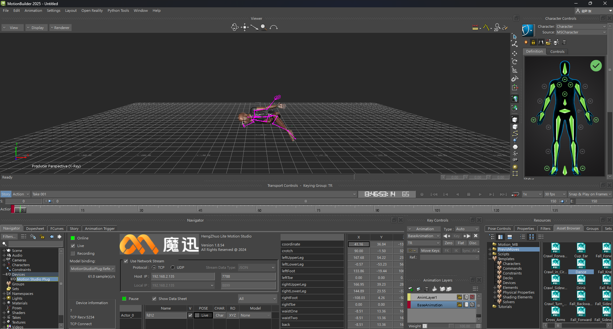

### **3. Recording and Saving Animation**

**1) Record animation**

While Online and connected to the data broadcast, select the Recording button to prepare for recording animation.

Click the record button on the left. As needed, you can overwrite the current animation sequence or create a new animation sequence.

Then click the play button in the middle to start recording the animation. Click the play button again to end the animation recording.

**2) Play back the recorded animation**

Disconnect the Online connection and click the play button to play back the data you just recorded. (After disconnecting, the model will be unbound from the skeleton, and you will need to repeat the above operations.)

**3) Save the animation**

In the MotionBuilder menu bar, select File → Motion File
Export\..., then select the target directory and file name, and click the Save button.

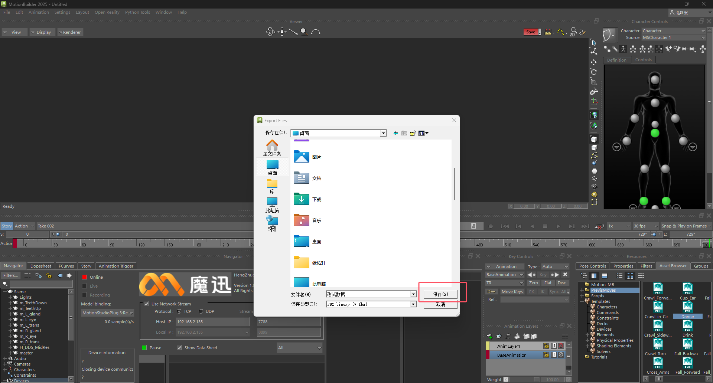

In the export options that appear, set the animation frame rate (FrameRate) as needed, and select the animation Takes you want to save. Then click the Export button to save the recorded animation to the specified file. After saving is complete, you can import the file back into MotionBuilder to review it.

