**UE Plugin User Guide**

**I. Unreal Engine**

Open Unreal Engine (if you have not downloaded it, you can get it from the official website at <https://www.unrealengine.com/zh-CN/download>).

**II. Plugin**

The plugin is written for UE 5.3 and uses Example as its demo scene (the Unreal version is used here as an example; higher versions work in essentially the same way).

**UE 5.1 version:**

[MotionSuit V0.4.2512111527.7z](https://docs.mostech.asia/plugin_ue/MotionSuit%20V0.4.2512111527.7z)

**UE 5.2 version:**

[MotionSuit V0.4.2601032108.7z](https://docs.mostech.asia/plugin_ue/MotionSuit%20V0.4.2601032108.7z)

**UE 5.3 version:**

[MotionSuitV0.2.2407121121.7z](https://docs.mostech.asia/plugin_ue/MotionSuit%20V0.2.2407121121.7z)

**UE 5.4 version:**

[MotionSuitV0.2.2407301455.7z](https://docs.mostech.asia/plugin_ue/MotionSuit%20V0.2.2407301455.7z)

**III. Plugin Installation Guide**

1. First download Epic Games Unreal Engine. Find the UE engine download in Epic, and when installing the engine, make sure not to check the engine source code option.

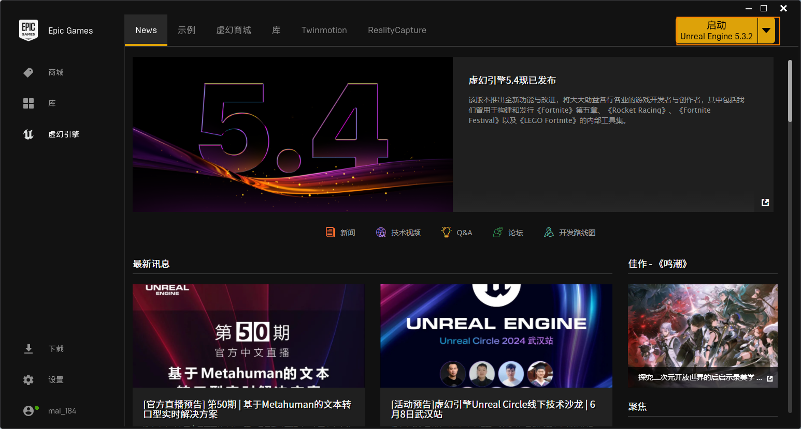

2. Once the engine is installed, first extract the MotionSuit V0.2.2407121121.7z archive.

3. Open UE and create a new blank project.

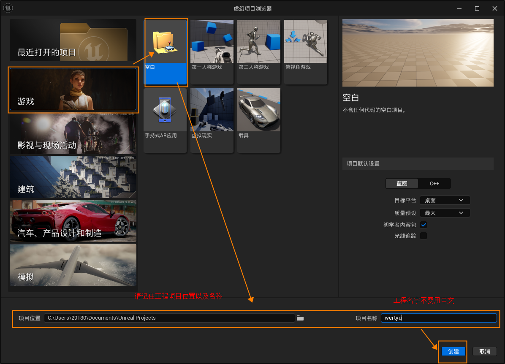

4. After creating the project, locate the project folder. Inside the project folder, create a new Plugins folder, and drag the extracted motion folder into the Plugins folder (the new folder must be named "plugins").

5. Restart the UE engine. In Edit — Plugins, you can verify whether the plugin has been enabled. If it is not enabled, check the box to enable it.

6. In the Content drawer at the bottom of the engine, you can see the plugin content (make sure not to close the Outliner panel on the right).

If the Content drawer does not show the plugin content, open the settings in the Content drawer and click "Show Plugin Content".

**IV. Motion Studio Data Broadcast Configuration**

**1. Streaming on the same computer (be sure to remember the IP and port numbers; you will use them to set the streaming parameters in the UE plugin's Connector)**

Enable data broadcast in the Motion Studio software, and set and record the streaming port, transport protocol, and rotation data type.

TCP:

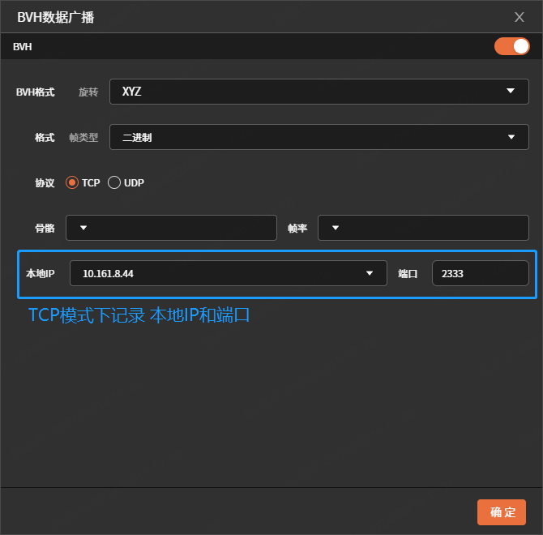

UDP:

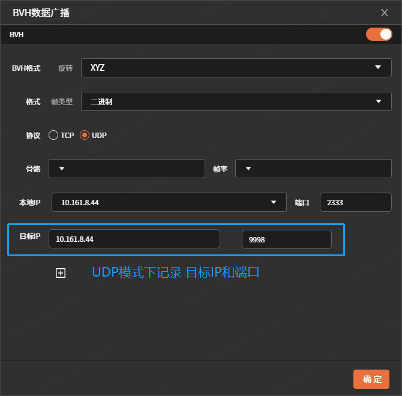

**2. Cross-computer streaming**

Let the computer running Motion Studio be **M**, and the computer running UE5 be **U**.

**Note: Cross-device streaming requires both devices to be on the same local area network. If they are not on the same LAN, obtain a public IP on your own or use an intranet penetration tool.**

How to look up the IP: Press **WIN + R** to open the Run dialog, type **cmd**, and click **OK**. In the CMD window, type **ipconfig** and press **Enter**. Find the IPv4 address — this is the computer's local network address.

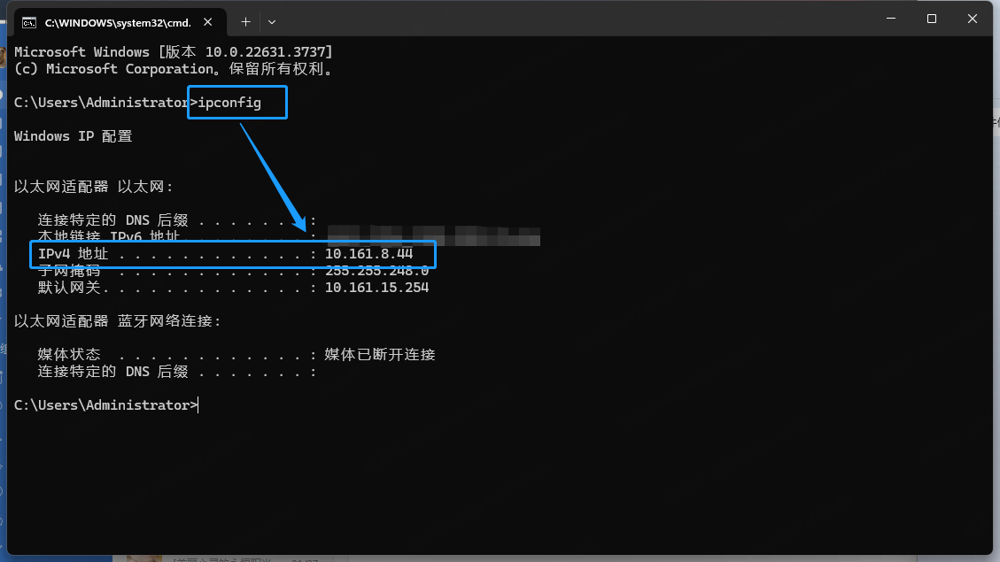

TCP: Identical to the single-computer setup. Just enter M's streaming settings in U.

UDP: Record U's **IP address**, and in M's **Streaming Settings**, enter U's **IP address** and a port (the port is user-defined).

**V. Driving Data with Your Own Imported Model**

**1. In MotionSuit's Content — Blueprints, double-click to open Connector and set the streaming parameters.**

Fill in the IP and Port configured in Motion Studio into the blueprint node, and decide whether to check "Use Udp" based on the MS streaming settings (when checked, UDP transport is used). Once configured, click Compile and Save.

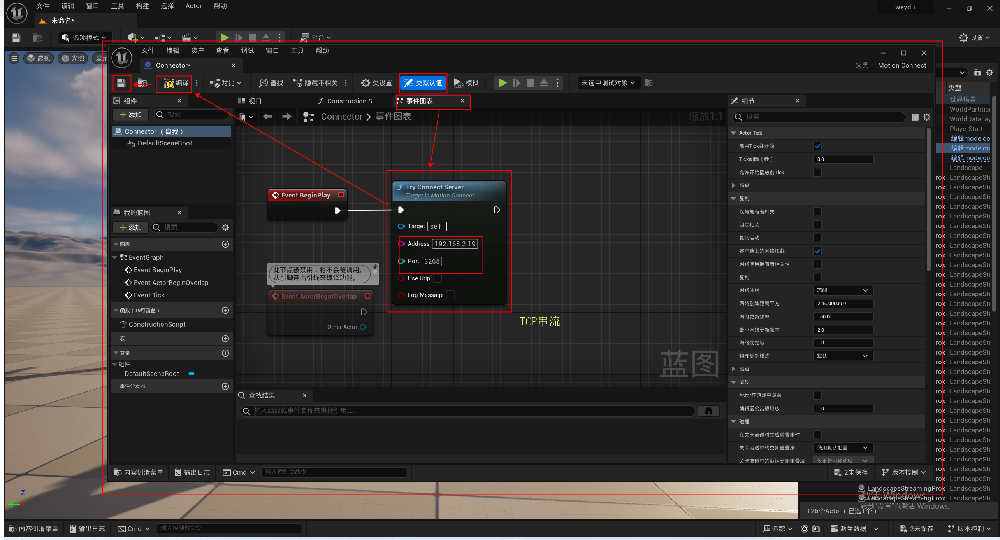

Address: the IP set in MS

Port: the port set in MS

Use Udp: whether to use UDP streaming (checked = enabled)

Log Message: whether to print the received data to the console (checked = enabled)

**Before dragging it in, it is best to click Run and then Stop first (otherwise the model will not be visible later). After configuration, drag the Connector into the scene (make sure this Actor exists in the scene).**

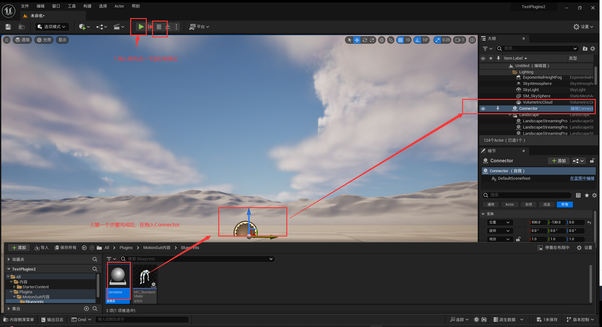

**2. Import your own model into the engine**

Click the **Import** button in the upper-right corner of the **Content drawer**, locate and select your model file (.FBX), click Open, and finally click **Import All**.

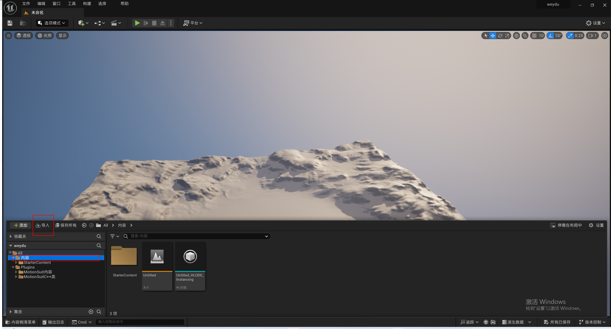

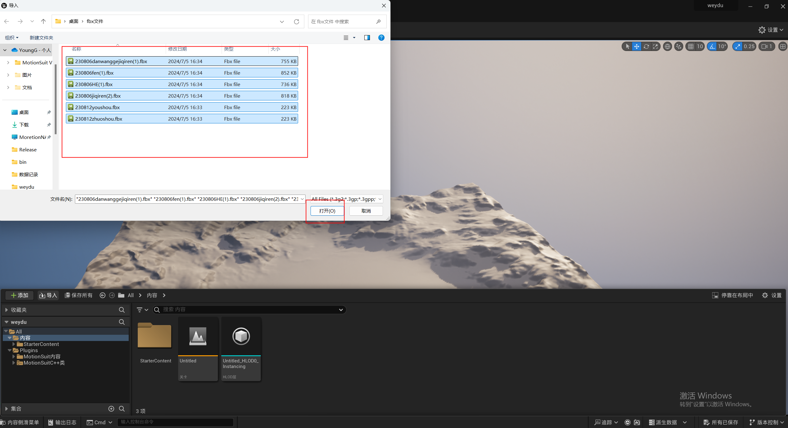

After a successful import, the imported model appears in the Content Browser (it is best to import it into the Content folder), then click **Save All**.

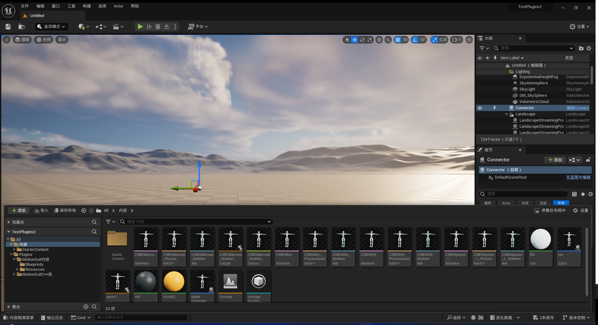

**3. Select the skeletal model, right-click, and choose Create — Animation Blueprint.**

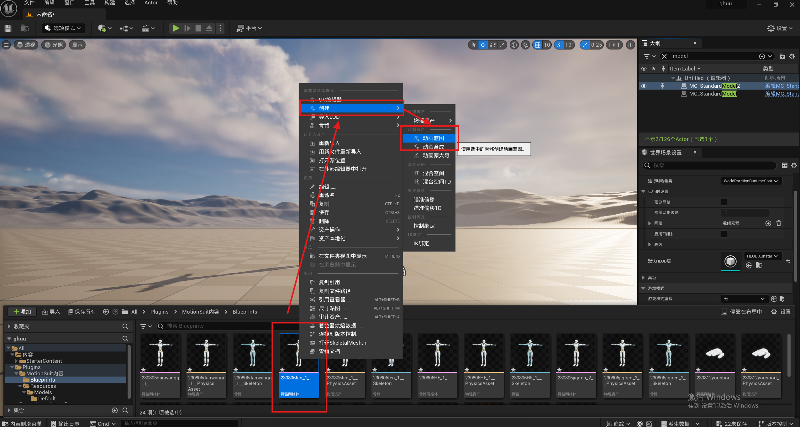

After creating it, double-click to open the animation blueprint, drag out from the Result pin, and type in MotionPoseNod.

After connecting the MotionPoseNod node to the Result node, click the MotionPoseNod node to configure the skeleton mapping in the Details panel on the right.

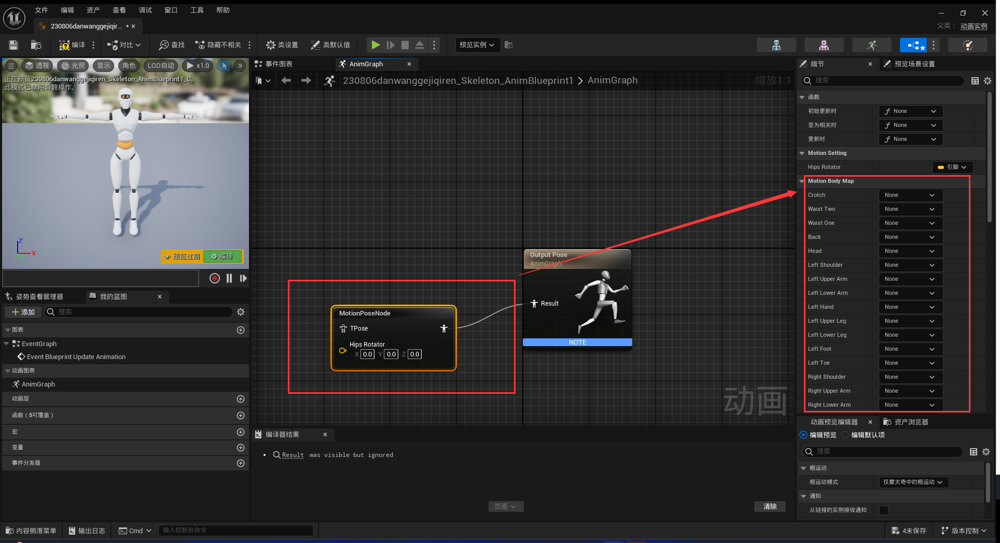

The corresponding skeleton mapping can be found in Plugins — MotionSuit Content — Resources — Models — Default, in StandardModel. 

Open the animation blueprint, select the MotionPoseNod node, and copy the Motion Body Map, Left Fingers MAP, and Right Fingers MAP data.

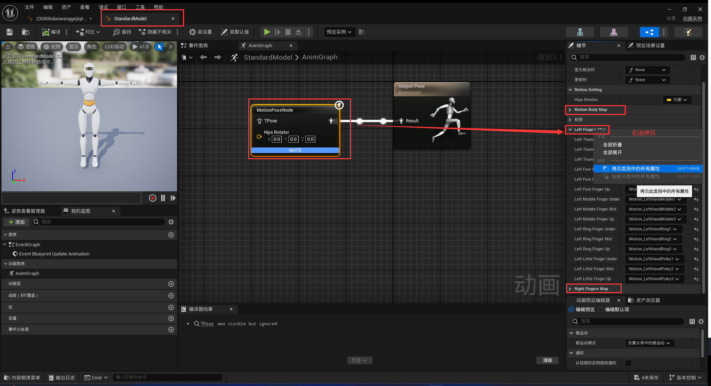

Once the skeleton mapping is configured in the Details panel on the right, finally click Compile and Save in the upper-left corner.

There is no shortcut for configuring the corresponding joints — you must map them manually or copy the information directly from the example animation blueprint (note that after copying, check whether all joints have been configured).

**4. For models whose initial pose is not T-Pose, you need to create a T-Pose animation (if it is already a T-Pose, skip this step).**

Take the standard Unreal mannequin as an example — its initial pose is A-Pose.

First, create an Animation Composite for this model.

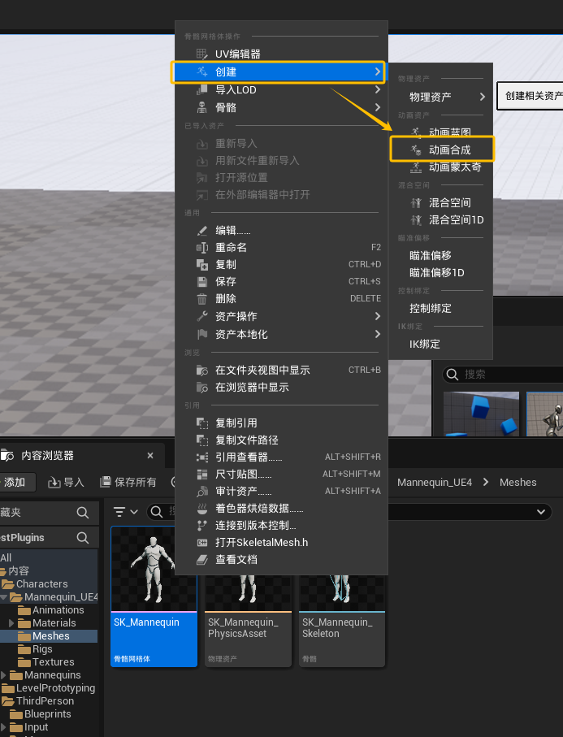

Open the Animation Composite. In the **Skeleton Tree** window, click to select a bone (using the upper left arm as an example), and adjust the angle in the middle viewport until the model's pose becomes T-Pose.

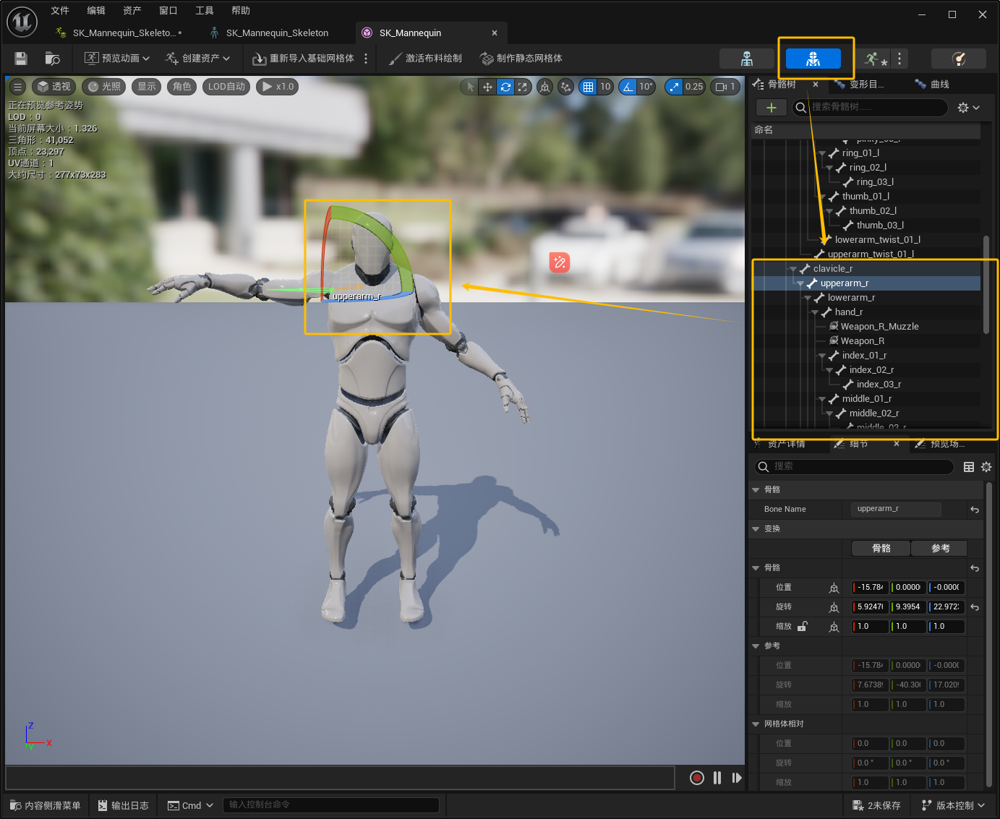

In the toolbar above, click **Create Asset** -> **Create Animation** -> **Current Pose** to save the T-Pose as an animation.

Drag the newly created T-Pose animation into the animation blueprint, connect its output pin to the **TPose** pin of **MotionPoseNode**, and click **Compile** and **Save**.

**5. Create a new ModelController blueprint, and in the blueprint set the model's skinned mesh and animation blueprint (the one created in step 3) in SkeletalMesh. Then drag this ModelController into the scene.**

Right-click in an empty area of the Content Browser to create a new blueprint.

In the All Classes favorites search box, type **ModelController** and click Open.

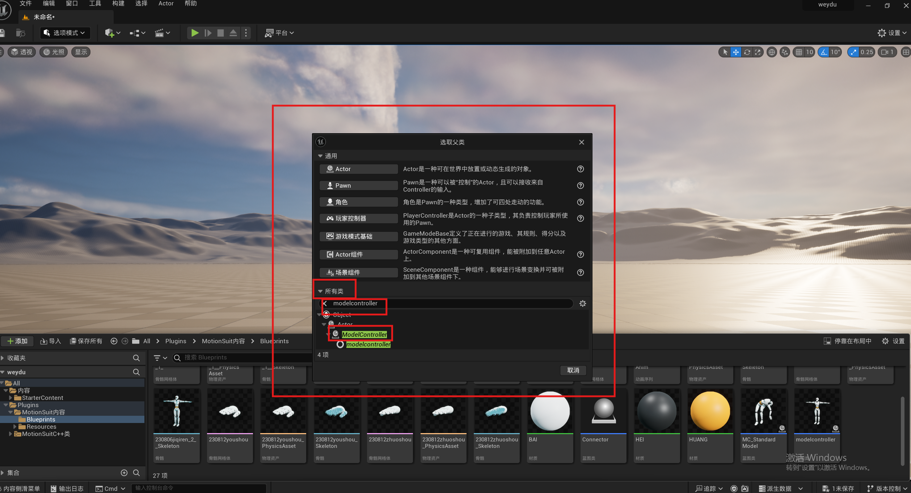

After creating it, double-click to open the blueprint. Under Mesh — Skeletal Mesh Asset, set the **skinned mesh** (the skinned mesh of your imported model), and under Animation — Anim Class, select the **animation blueprint** created in step 3. Then click Compile and Save.

Drag this ModelController into the scene (if it appears as a sphere when dragged in, click the Start Recording button, then click Stop Recording, and then drag the ModelController in again).

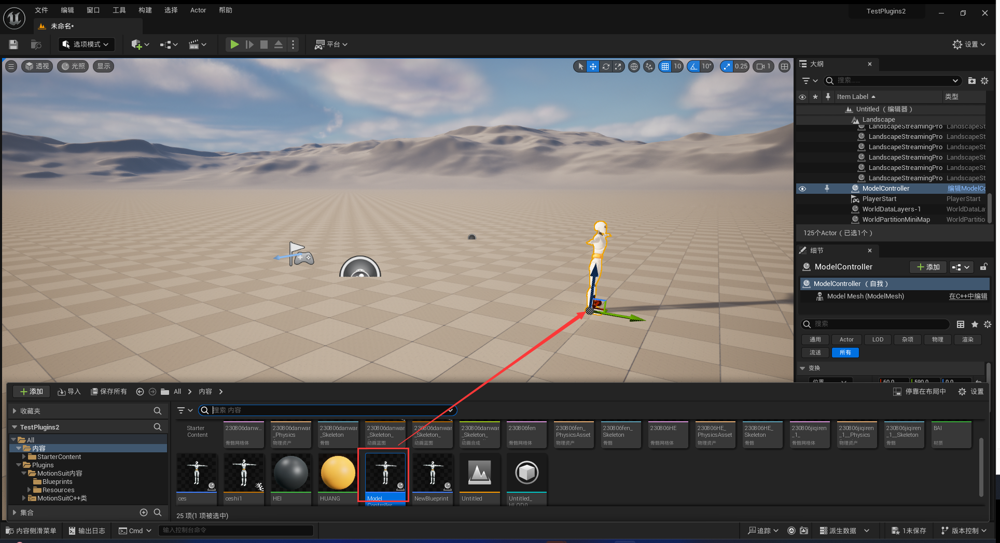

**6. Multi-device data usage notes (skip this step if you only use one model)**

When there are multiple characters (multiple sets of motion capture equipment) in MS, add the corresponding number of **ModelController** instances to the scene (drag in the ModelController created in step 5 once for each model you need).

**7. Set the character name: in the Details panel, search for and modify the ActorName property, and enter the character name shown above the character's head in MS. At runtime, ModelController will retrieve the corresponding device's motion data based on ActorName.**

**Note: ActorName can be left empty** (an empty value means no device in motion is bound, and motion can be performed based on any device).

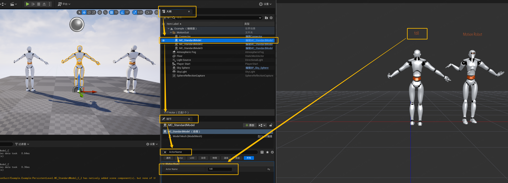

**8. After data broadcast is enabled, offline data can be transmitted when no device is connected.**

Open the file list, and double-click to select a data file to play.

Click the Run button to transmit offline data.

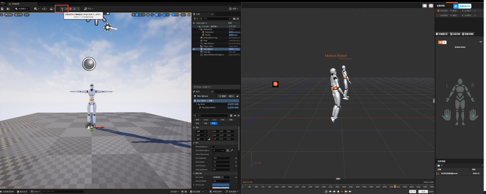

**9. After data broadcast is enabled, real-time data can be transmitted when a device is connected.**

After connecting a device, perform pose calibration.

Click the Run button to transmit real-time data.

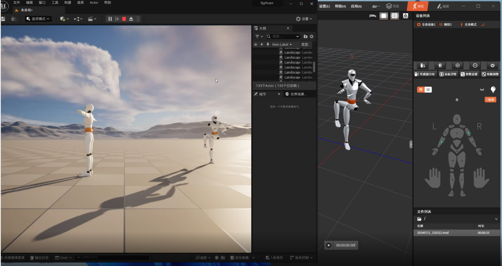

**VI. Driving Data with the Plugin's Built-in Model**

**1. Click the Content drawer, find Plugins — MotionSuit Content, and double-click to open Example.**

If you have modified data before, when you **double-click** Example, you will be prompted whether to save the previous data. If you want to save it, click Save.

**2. In the Outliner on the right side of the interface, click Edit Connector.**

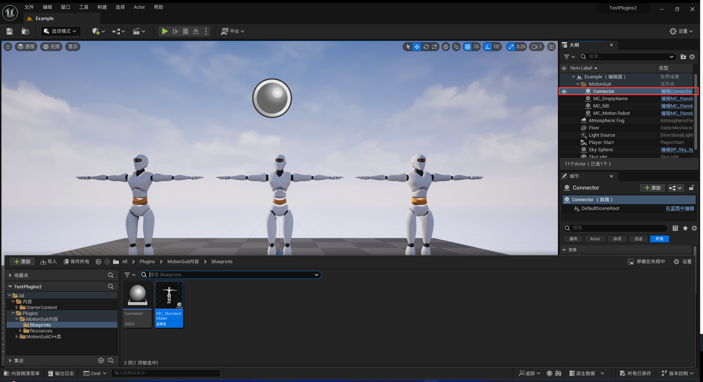

Fill in the IP and Port configured in Motion Studio into the blueprint node, and decide whether to check "Use Udp" based on the MS streaming settings (when checked, UDP transport is used). Once configured, click Compile and Save.

Address: the IP set in MS

Port: the port set in MS

Use Udp: whether to use UDP streaming (checked = enabled)

Log Message: whether to print the received data to the console (checked = enabled)

**3. Set the character name: in the Details panel, search for and modify the ActorName property, and enter the character name shown above the character's head in MS. At runtime, ModelController will retrieve the corresponding device's motion data based on ActorName.**

**Note: ActorName can be left empty** (an empty value means no device in motion is bound, and motion can be performed based on any device).

**4. After data broadcast is enabled, offline data can be transmitted when no device is connected.**

Open the file list, and double-click to select a data file to play.

Click the Run button to transmit offline data.

**5. After data broadcast is enabled, real-time data can be transmitted when a device is connected.**

After connecting a device, perform pose calibration.

Click the Run button to transmit real-time data.

**VII. Other Issues**

**1. If the Outliner or Details panel on the right is closed, click Window, find the Outliner button, and select Outliner View 1. For the Details panel, see the image below.**

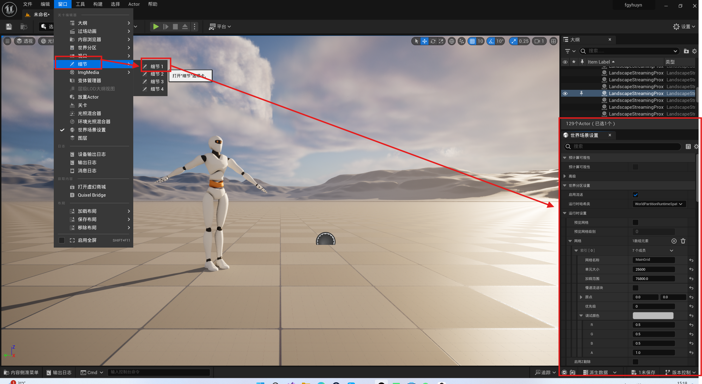

**2. If you need to delete a created model, select the model to be deleted in the Outliner and press the DELETE key to remove it.**

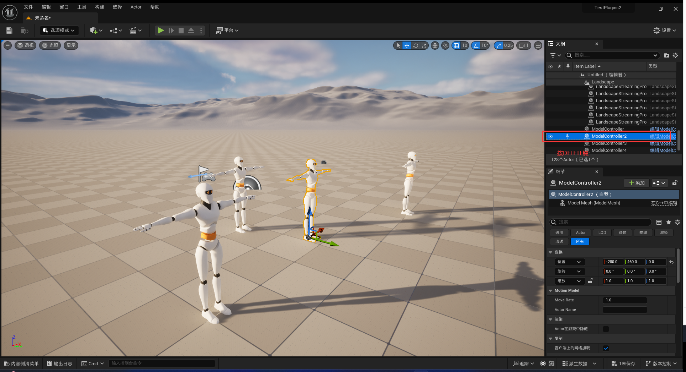
