**Unity Plugin User Guide**

**I. Using Unity Software**

**1. Open Unity Hub (if not installed, download it from the official website:** <https://unity.cn/releases>**)**

**2. Check whether the editor is installed (**minimum supported version: 2019.1.0**)**

If it is not installed, click the Install Unity Editor button, and install the editor through Unity Hub or download it from the official website (URL: <https://unity.cn/releases/full/2019>)

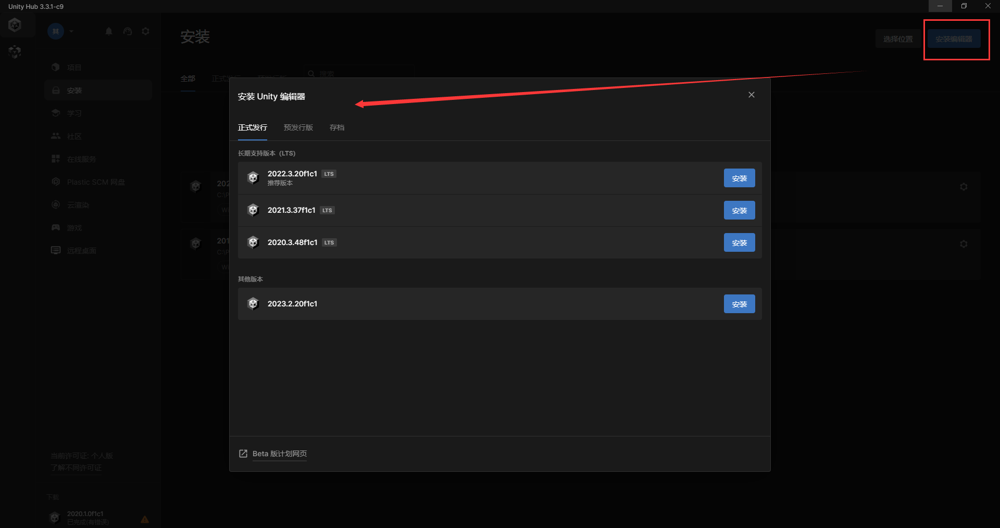

**3. Create a new project or open an existing project**
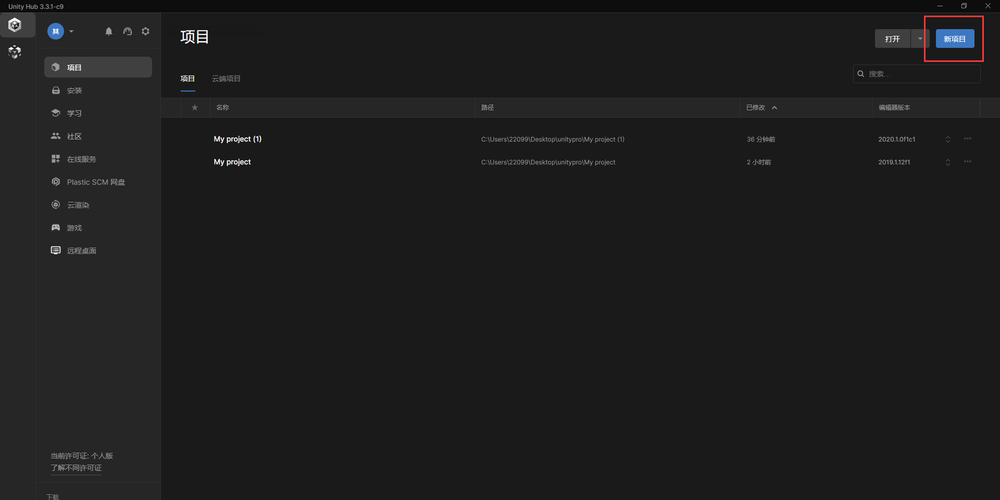

Create a new project

After creating the project, the new project opens automatically
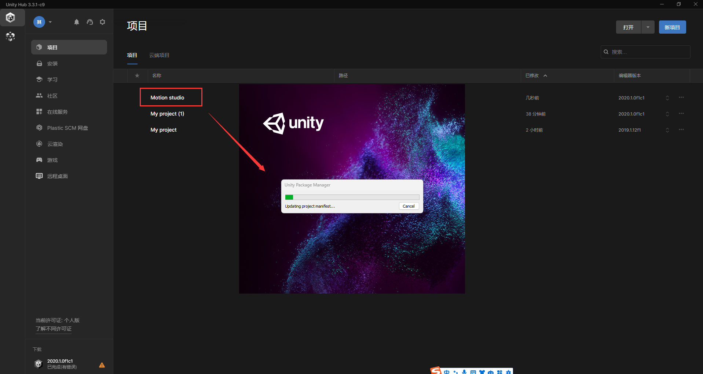

**4. If warnings appear after opening, address them (skip this step if there are no warnings)**

Click Window > Package Manager

Click Visual Studio Editor > Update to 2.0.22
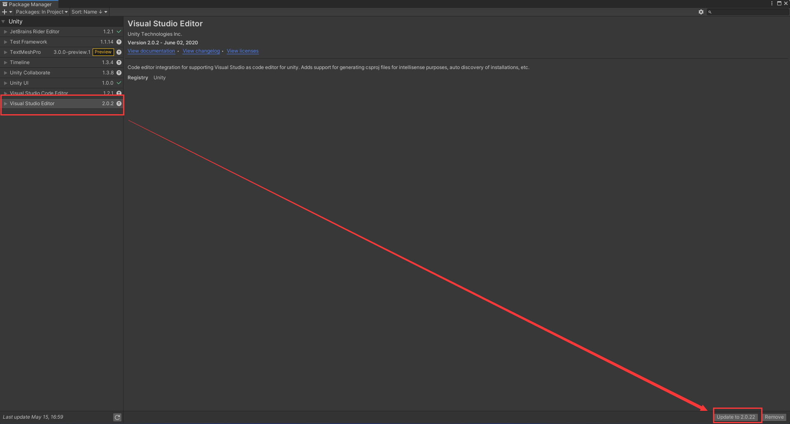

After the update completes, close the dialog

**5. Import the Unity plugin**

Download Unity plugin version 2.3.0

[mostechPlugin2.3.0.unitypackage](./assets/mostechPlugin2.3.0.unitypackage)

Drag the motionPlugin2.1.0 plugin file into Project > Assets

Click the Import button

**6. Drive the full-body device**

Click Assets > mostech > scenes
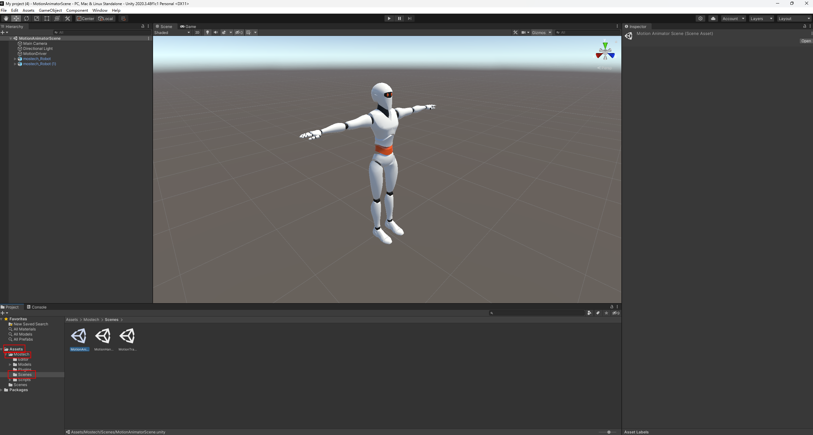

Click Motion Animator Scene or Motion Transforms Scene

In the Hierarchy, click MotionDriver

In Inspector > Motion Source Manager (script), enter the IP and port corresponding to those in Motion
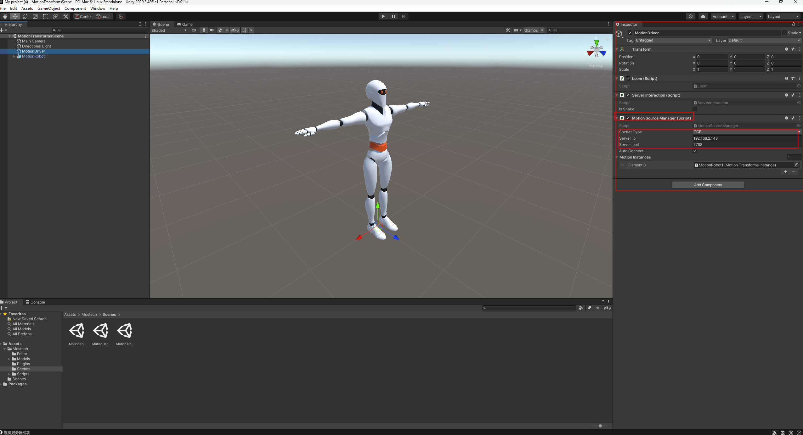

Connect the device, then perform pose calibration

Click Run to stream real-time data

**7. Drive the data glove device**

Click Assets > mostech > scenes

Click Motion Hand Scene
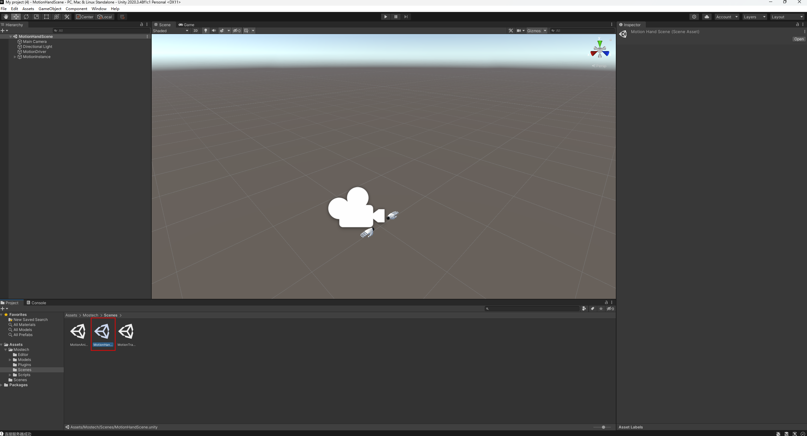

In Inspector > Motion Source Manager (script), enter the IP and port corresponding to those in Motion
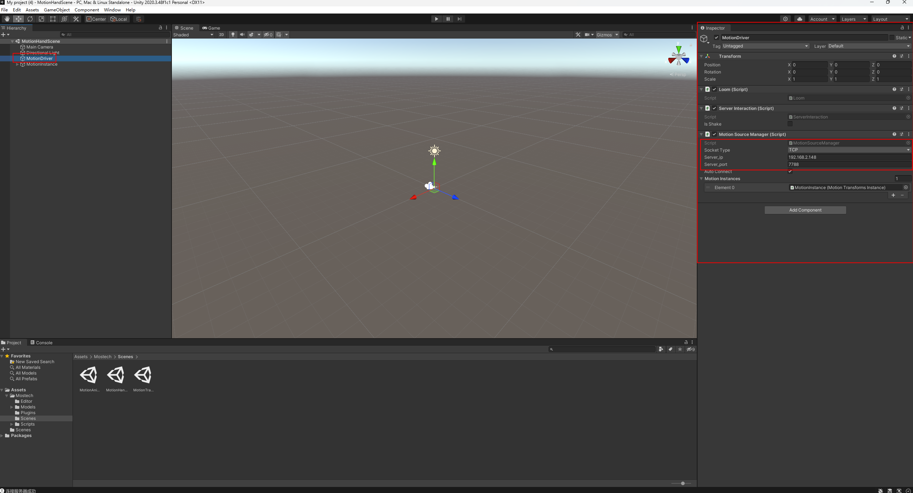

Connect the device, then perform pose calibration

Click Run to stream real-time data

**8. Drive combined devices**

Select the same model as for the full-body device
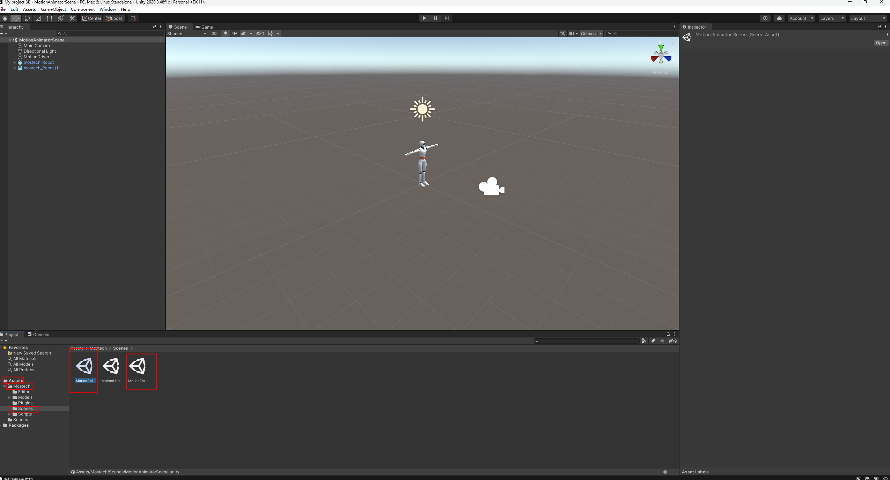

In Inspector > Motion Source Manager (script), enter the IP and port corresponding to those in Motion
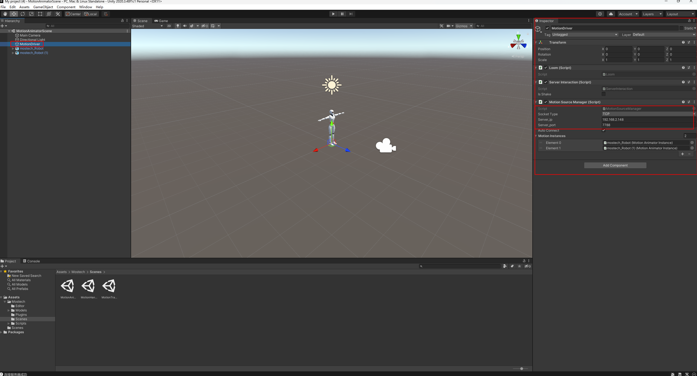

Combine the devices in Motion, then perform pose calibration

Click Run to stream real-time data

**9. Drive multiple devices**

In the Hierarchy, select Mostech-Robot and copy it

In Inspector > Motion Instances, enter the corresponding number of models

Click MotionDriver, then in Inspector > Motion Instances > Element0, Element1, select the corresponding Mostech-Robot

Click Mostech-Robot, then in Inspector > Actor ID, enter different numbers

Click Mostech-Robot, then in Inspector, adjust the model position by modifying x, y, z
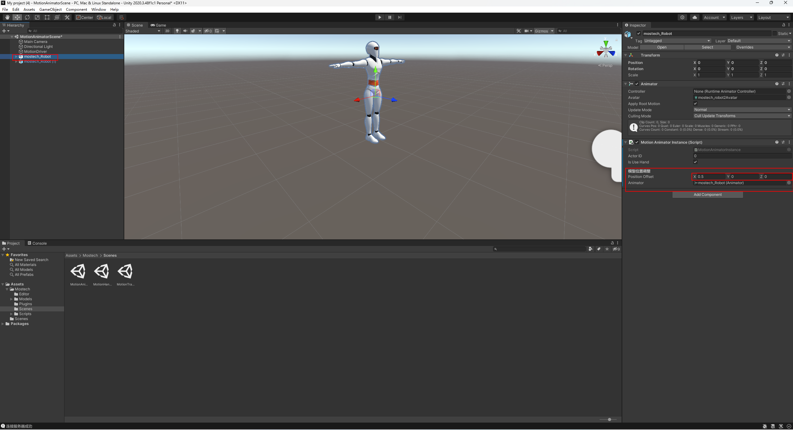

After performing pose calibration in Motion, click Run in Unity
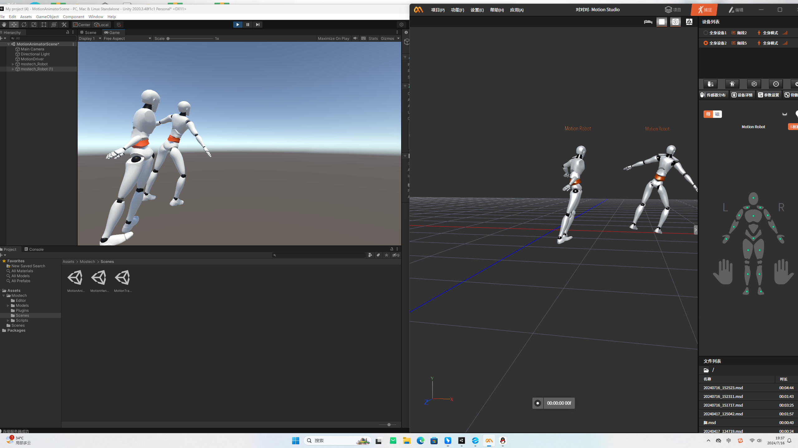

**10. Drive multiple models with a single device set**

In the Hierarchy, select Mostech-Robot and copy it

In Inspector > Motion Instances, enter the corresponding number of models

Click MotionDriver, then in Inspector > Motion Instances > Element0, Element1, select the corresponding Mostech-Robot

Click Mostech-Robot, then in Inspector > Actor ID, enter the same number

Click Mostech-Robot, then in Inspector, adjust the model position by modifying x, y, z

After performing pose calibration in Motion, click Run in Unity

**II. Using Data Broadcast in Motion Studio**

**1. Open Motion Studio**
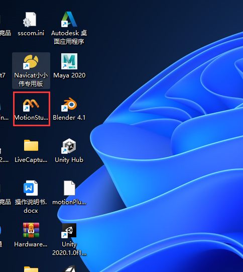

2. On the home page, you can create a new project or open an existing one

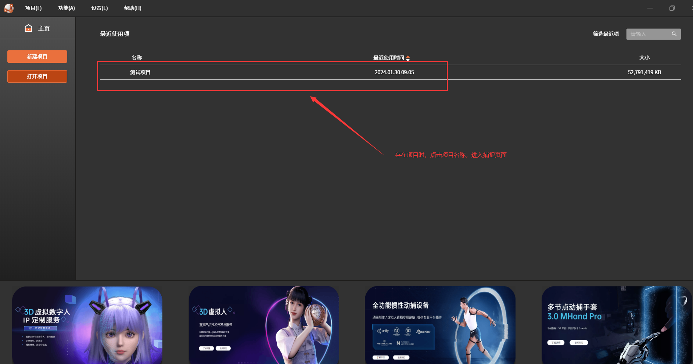

**3. After selecting a project, enter the capture page**

**4. Enable data broadcast**

Click the function button in the upper-left corner > Data Broadcast
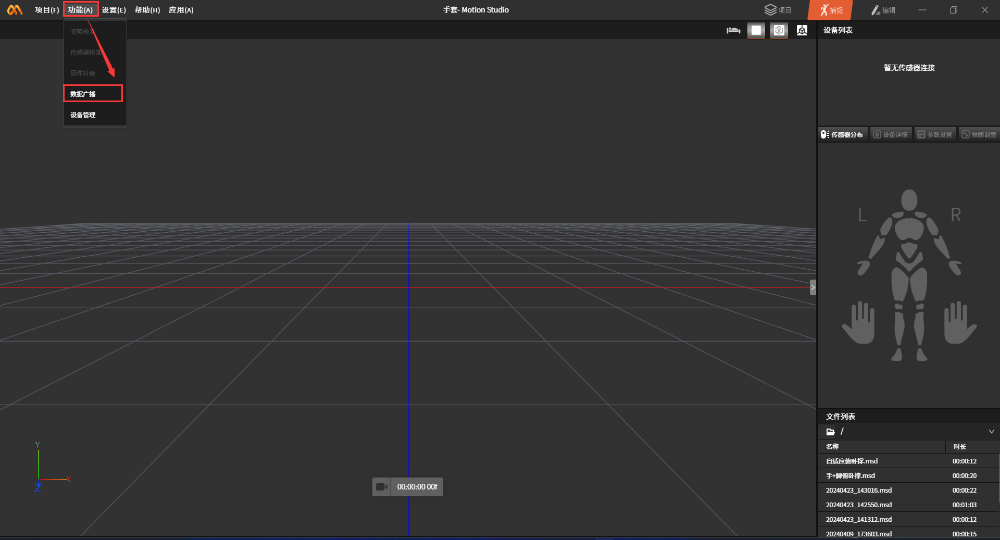

Enable BVH broadcast (the port number can be any value)
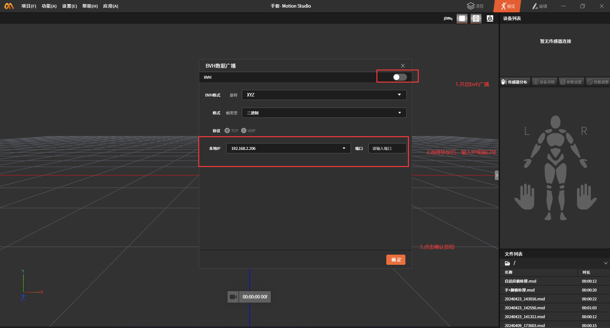

**5. After data broadcast is enabled, offline data can be played back without a device connected**

View the file list, then double-click a data file to play it
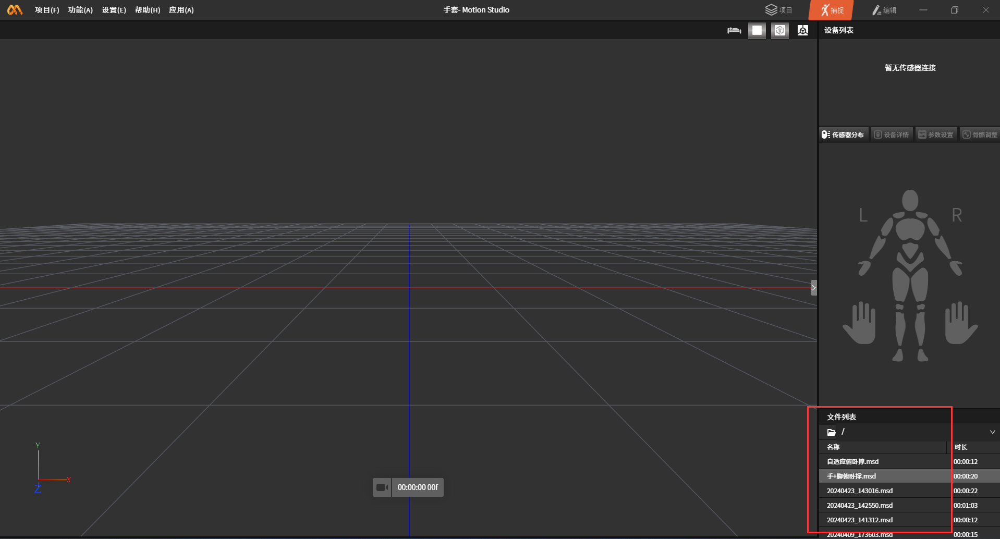

Play the file
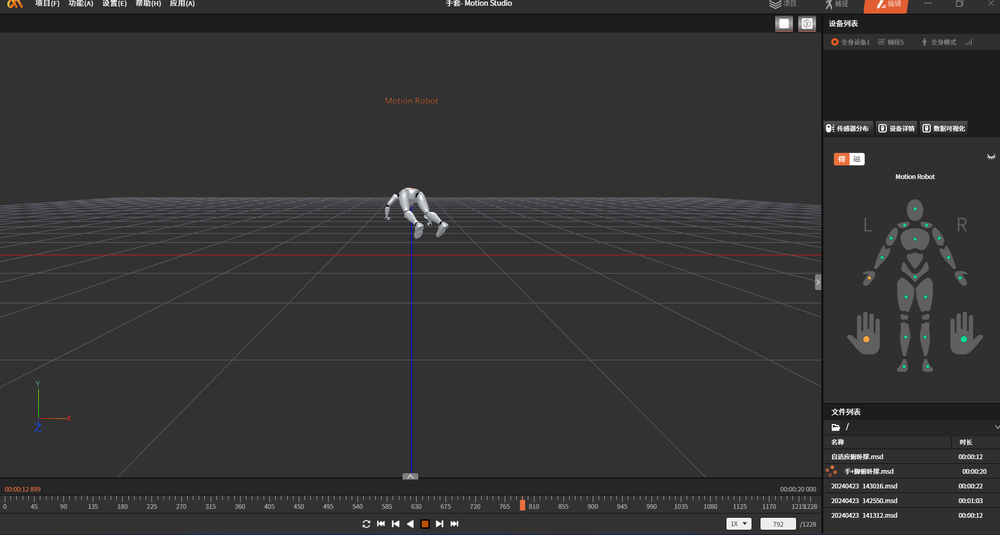

After configuring the Unity IP and port, click the Play button to play back offline data

**6. After data broadcast is enabled, real-time data can be played back with a device connected**

Connect the receiver to the computer. When the device appears in the device list, click the Connect button to connect the device

After a successful connection, put on the straps and devices in sequence according to the prompts

Once worn, click Pose Calibration and follow the prompts to perform T-Pose, A-Pose, and OK-Pose (when a data glove device combination is used) calibration

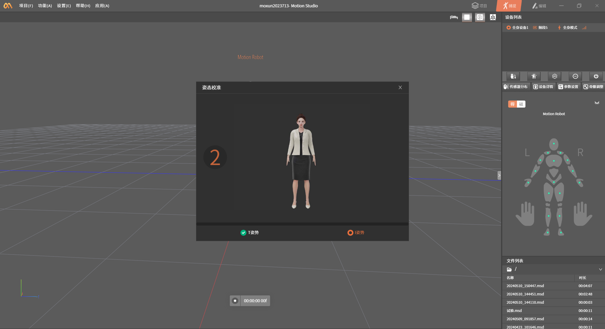

After configuring the Unity IP and port, click the Play button to play back real-time data

