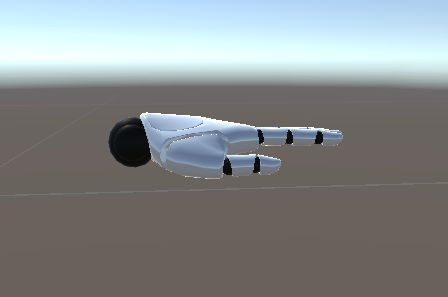
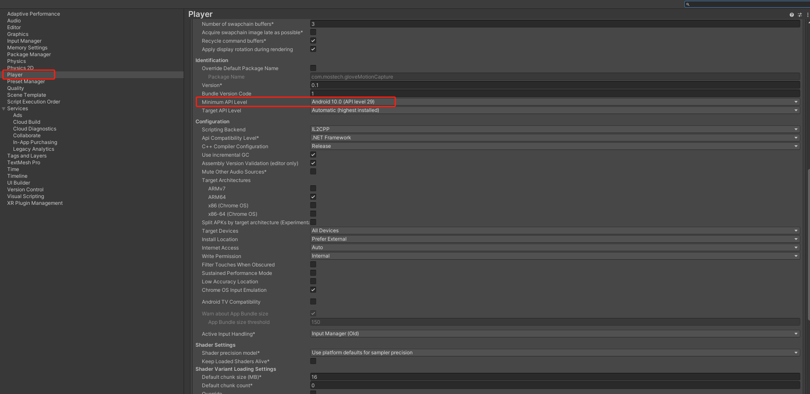
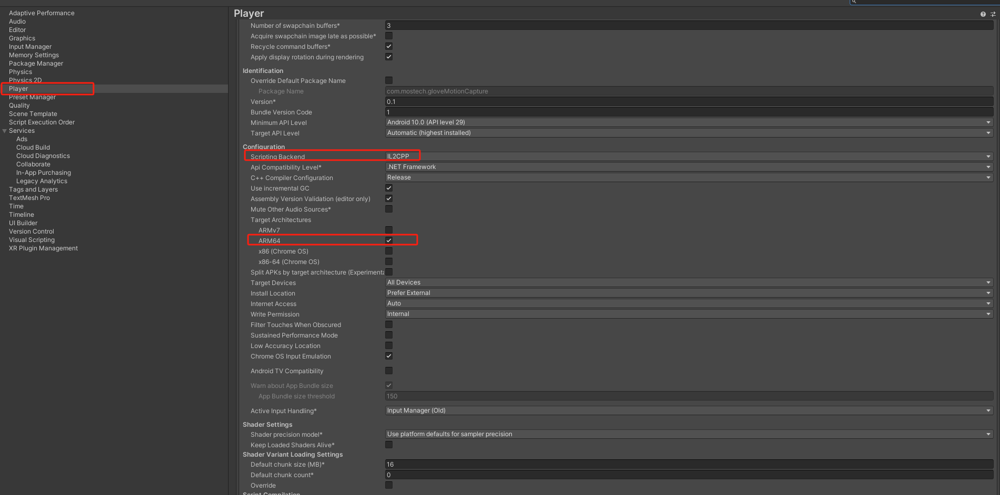

# Unity Motion Capture Plugin (Data Glove + Android) Documentation

# Introduction

This document will help you use the game engine Unity 3D to obtain data glove data through this SDK and correctly drive the hand model.

# Importing the Unity Motion Capture Plugin Package into the Project

Motion capture glove plugin package

| **Plugin File** | **Version** | Date | **Update Log** |
| --- | --- | --- | --- |
| [mostechPlugin\_Android\_V1.1.0.unitypackage](./assets/mostechPlugin_Android_V1.1.0.unitypackage) | V1.1.0 | 2024-11-04 | [New] 1. Supports self-developed glove devices |
| [mostechPlugin\_Android\_V1.0.0.unitypackage](./assets/mostechPlugin_Android_V1.0.0.unitypackage) | V1.0.0 | 2024-10-17 | [New] 1. Collector glove real-time data 2. Pose calibration 3. Device details |

After opening the Unity project, click Asset > Import Package > Custom Package > mostechPlugin\_Android.unitypackage to add it to the Unity project.

# Plugin Package Overview

**API Call Flow**

**Notes:**

*   During data collection, after calling an interface such as querying the battery level to obtain a result, you need to call the data collection interface again.
    
*   It must be packaged into an Android device for running and debugging.
    

### 2.1 Scene Overview

In Assets > Mostech > MotionCapture\_Android > Scenes you can find the example scene.

1.  GloveMotionCaptureDemo, obtains glove data to drive the hand model.
    

Installation package

[GloveMotionCapture.apk](./assets/GloveMotionCapture.apk)

### 2.2 Script Overview

1.  In Assets > Mostech > MotionCapture\_Android > Scripts > Mostech\_AndroidSerialPort.cs
    
    Everything related to the serial port, for example: glove data, battery level, etc.
    
2.  In Assets > Mostech > MotionCapture\_Android > Scripts > Mostech\_MotionDriver.cs
    
    Everything related to driving the hand model.
    
3.  In Assets > Mostech > MotionCapture\_Android > Scripts > Mostech\_UIManager.cs
    
    Everything related to the UI.
    
4.  In Assets > Mostech > MotionCapture\_Android > Scripts > Loom.cs
    

    Adds events from a child thread to the main thread, avoiding errors caused by a child thread directly calling methods in the Unity main thread. Each scene must have the Loom.cs script added.

### 2.3 Script Mostech\_AndroidSerialPort.cs Detailed Description

This script interacts with the Android serial port communication SDK. The workflow within the Android SDK is: obtain an instance > initialize resources > destroy the instance.

The connection of the glove device is controlled by the Android SDK.

### 2.4 Script Mostech\_MotionDriver.cs Detailed Description

This script drives the hand model and requires binding 16 bones for each of the left and right hands. Currently, only hand models with a fixed skeleton are supported (arbitrary skeletons will be supported in future versions).

# Model Requirements

1.  The local coordinate system of all model bones is a left-handed coordinate system, with the x-axis pointing right, the y-axis pointing up, and the z-axis pointing forward.
    
2.  Each finger of the left and right hands consists of three parts: the proximal, middle, and distal segments.
    
3.  The initial pose Euler angle of each finger bone is (0, 0, 0).
    

Top view

Side view

# Special Configuration When Packaging for Android

### 4.1 Set the Minimum API Level

Under Edit > Player > Other Settings, set the Minimum API Level to a version >= level 29.

### 4.2 Build as ARM64

Under Edit > Player > Other Settings, first set Scripting Backend to IL2CPP, and then check ARM64.

