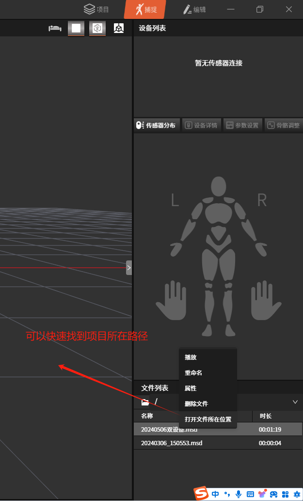
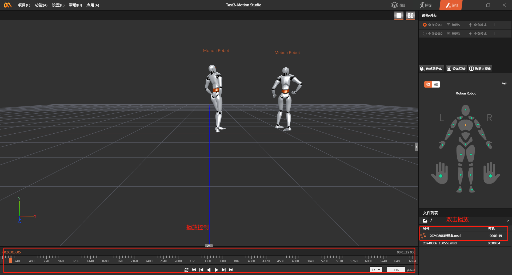

**Importing Motion Capture Files and Broadcasting Data in MotionStudio**

1.  **Log in to MotionStudio**

    Download the motion capture software from the official website and log in with your phone number (contact sales to register an account).

2.  **Create a new project in MotionStudio**

    Create a project. It is recommended that you place the project in a directory that is easy for you to find (this path will be used later).

    

3.  **Import motion capture data files and configuration**

    **3.1 Import the motion capture data description file**

    Motion capture data description file

    [Please view the attachment "20240506双设备.msd" on DingTalk Docs](https://alidocs.dingtalk.com/i/nodes/gpG2NdyVXQ2ajLlesZL3P2kGJMwvDqPk?iframeQuery=anchorId%3DX02lvuq70k6p3aiqw47y5o)

    Place the file in the DataFile directory under the project path. For example: C:\\xxx\\xxx\\Desktop\\temp\\MS\\Test2\\DataFile

    

    **3.2 Import the motion capture data file**

    Motion capture data file

    [Please view the attachment ".vihchzpt03tjute65dln8x9apry72h4w_9000_1_msdf" on DingTalk Docs](https://alidocs.dingtalk.com/i/nodes/gpG2NdyVXQ2ajLlesZL3P2kGJMwvDqPk?iframeQuery=anchorId%3DX02lvuqdbh4a8yzjrgalk)

    Place the motion capture data file in the DataFile\\.dfs folder. For example: C:\\xxx\\xxx\\Desktop\\temp\\MS\\Test2\\DataFile\\.dfs

    **3.3 Modify the motion capture data description file**

    Open the description file with a text editor or other tool.

    Use Ctrl+F to search for the keyword "DataFile" and replace the original file path (C:\\Users\\16637\\Desktop\\temp\\MS\\Test2\\DataFile) with your own project path. There are three places that need to be modified.

    **3.4 Play the motion capture data**

    If the configuration above is correct, you will see the "20240506双设备.msd" file in the file list. Double-click the file to play the recorded motion capture data.

    

4.  **Enable data broadcasting**

    

    
