# **Software Operation Guide**

### Software Installation
The official release of Motion Studio can be downloaded from: https://www.moretion.net/

Motion Studio is supported on Windows. macOS is not currently supported.

Run the installer and follow the prompts to install. If there is sufficient space on the C drive, installing to the default path is recommended.

### Open a Project

After launching Motion Studio, you first need to create a new project or open an existing one.

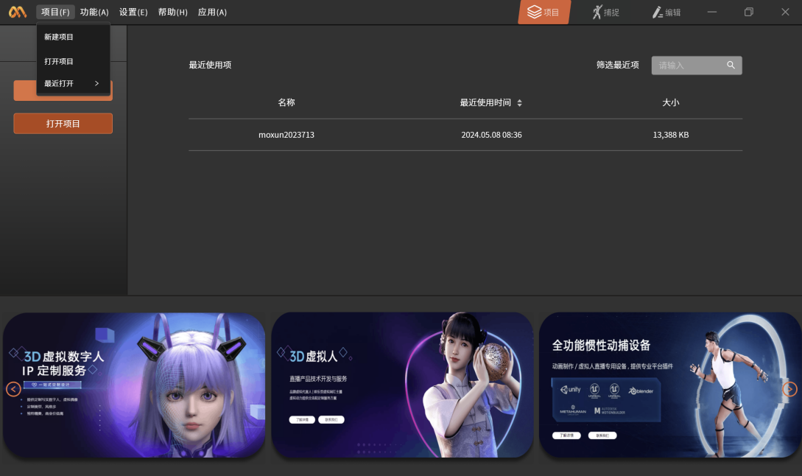

### **Connect the Data Transceiver**

After plugging the glove or sensor data transceiver into the computer, the device name will appear in the device list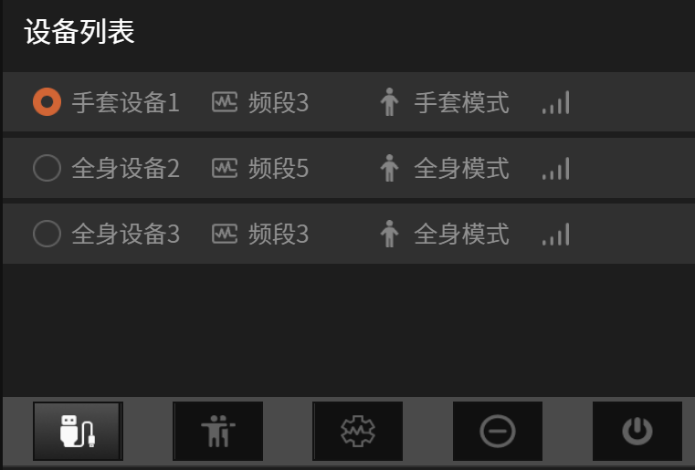

### Sensor Connection

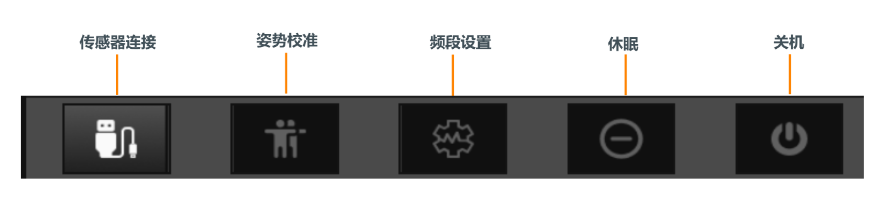

Plug and unplug the charging case using a Type-C cable. When the sensor indicators inside the charging case blink, activation is successful. Click the connect button to connect the sensors. During connection, please ensure the sensors remain stationary and are not moved.

Observe the "Sensor Distribution" diagram. When each node indicator in the diagram below lights up, all sensors have been confirmed as connected successfully (when both full-body and glove devices are connected, the hand node indicators on the character model will turn off and the glove node indicators will light up).

## Pose Calibration

After putting on the sensors, click the "Pose Calibration" button and follow the software prompts to perform pose calibration. The specific requirements for each pose are as follows:

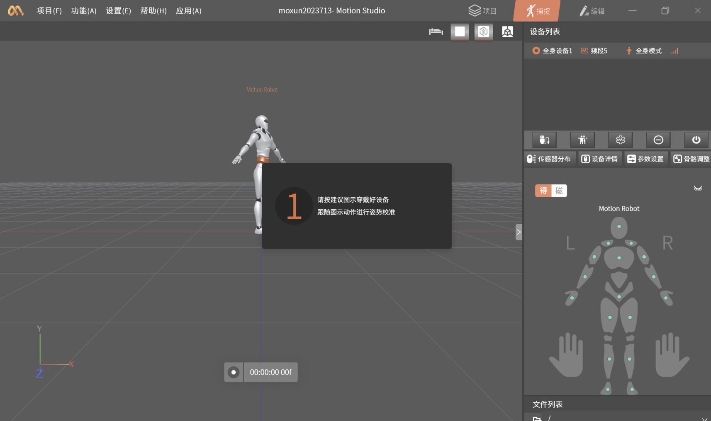

### **T-Pose**

• Stand upright, extend both arms so they are perpendicular to the upward direction of the body, with palms facing down.

• Keep the fingers straight and the four fingers together.

### **I-Pose**

• Stand upright with feet parallel, shoulder-width apart.

• Arms hanging naturally at the sides, palms facing inward, fingers straight, and thumbs pointing toward the outside of the legs.

• Head looking straight ahead, with the chin parallel to the ground.

• Shoulders relaxed, not raised.

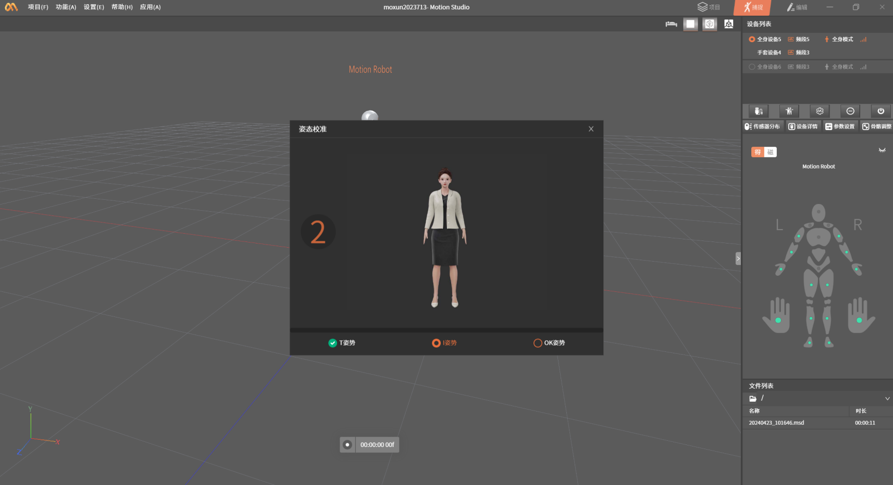

### **OK-Pose**

• Place both hands about 30 cm in front of the chest.

• Make the "OK" gesture.

### Calibration Movements

An inertial-sensor-based motion capture system uses calibration movements to compute the wearing relationship between the sensors and the human body. Standard calibration movements are the foundation of obtaining good motion capture data. Please read the text and image descriptions of each calibration movement carefully, and perform each movement as standardly as possible. The accuracy of the calibration movements directly affects the performance of motion capture.

Typical pose issues caused by incorrect calibration movements include:

- Feet pointing inward during normal standing, caused by feet splaying outward (outward-facing stance) during A-Pose

- Legs splaying too far outward or tucking too far inward during normal standing, caused by feet being too close together and legs pressed too tightly together during A-Pose, failing to achieve a parallel stance

<!-- -->

- Arms unable to extend straight when hanging down, caused by overly relaxed arms during A-Pose. When relaxed, there will be a certain angle between the upper arm and forearm, failing to point straight down

- Arms positioned too far forward or backward, caused by overly relaxed arms during A-Pose, failing to point straight down; or by arms spreading too far backward during T-Pose

### **Device Combinations**

When multiple sets of glove devices and full-body devices are connected, users can click "Device Management" under the functions to freely combine glove devices with full-body devices.

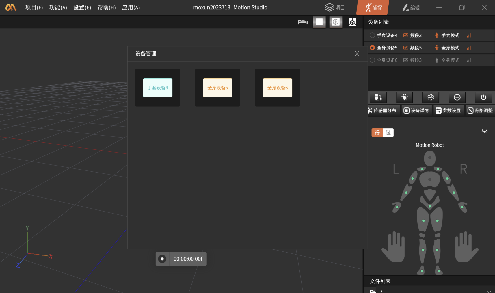

After combining, the device management interface will be displayed as follows

## Button Function Reference

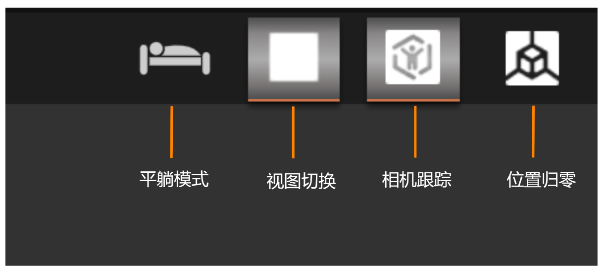

### **Device List**

The device list displays the currently connected devices, their associated channels, and signal strength.

### 

### **Sensor Distribution**

Displays the packet reception rate and magnetic environment for each sensor node.

• A green indicator means the sensor packet reception rate is normal.

• An orange indicator means the sensor packet reception rate is good.

• A red indicator means the sensor packet reception rate is poor.

• A gray indicator means the sensor is not connected successfully. Please check the connection between the sensor and the charging case.

### Device Details

Displays detailed information for each sensor, including packet reception rate, magnetic environment, and battery level.

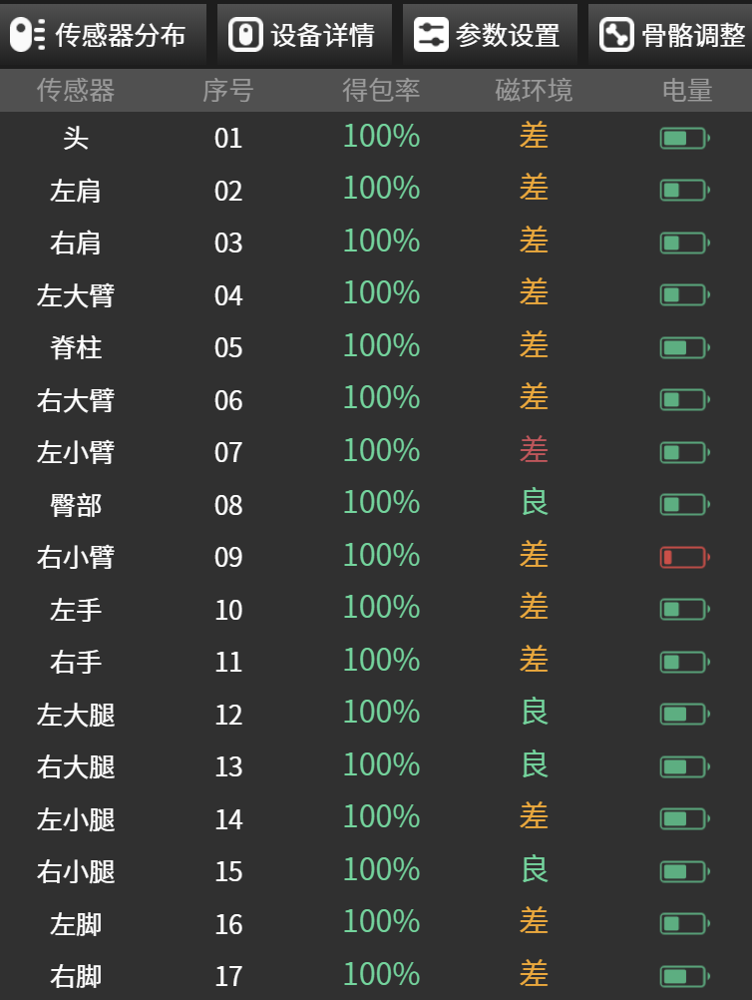

### **Parameter Settings**

Users can select different application scenarios.

**Application Scenarios**

- Flat Ground: If your motion capture scene involves capturing data on flat ground, use Flat Ground mode.

- Stair Climbing: If you are moving up and down stairs or on a non-fixed surface, use Stair Climbing mode.

- Hip Lock: Hip Lock means locking the waist of your virtual character model at a specific position.

- In-Place (Beta): Use this mode when doing live streaming or data recording within a small area. The algorithm eliminates the inherent positional drift problem of inertial motion capture.

**Contact Parts**

- When preparing for motion capture, based on the movement you want to capture, you can pre-select whether the hands, feet, or hips will make contact with the floor or a fixed surface.

- In most cases, foot contact is selected by default.

**Heading Angle**

- Adjusts the yaw direction of the virtual human model.

- It can be used directly in third-party software to control the orientation of the virtual character.

**Pitch Angle**

- Adjusts the pitch angle of the virtual human model.

- If you find the virtual human model leaning too far forward, increase the pitch angle value.

- Or if you find the virtual human model leaning too far backward, decrease the pitch angle value.

### **Skeleton Adjustment**

You can customize the skeleton size template here.

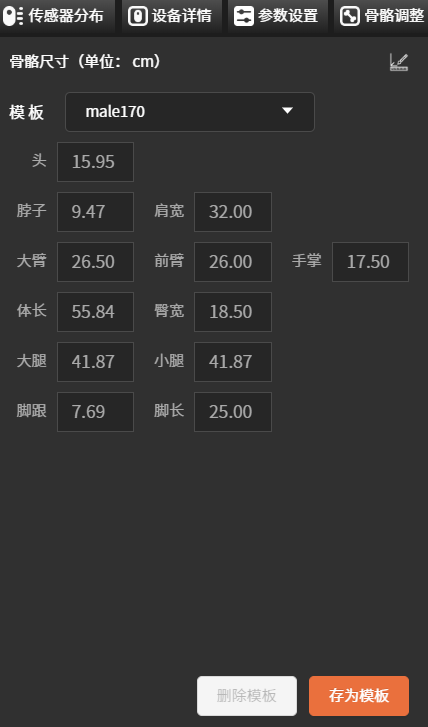

## Data Recording and Playback

### **Motion Capture**

Click the record button to capture motion capture data. After recording is complete, the file will appear in the file list.

### **File List**

The file list displays all recorded file information under the project directory. Double-click a file on the capture screen or use the right-click menu "Play" to jump to the playback screen.

### **File Playback**

On the editing page, after selecting a file, the dynamic sensor distribution / device details captured during recording will be displayed synchronously. You can also use the playback bar to process file data. The playback bar buttons function as follows:

### **File Data Export Options**

The data file export button is located at the file list on the editing interface. Right-click a file to reveal the export button.

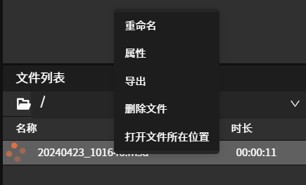

For data file export, the main option that needs to be selected is the file type.

### File Types

File types are mainly divided into .fbx files, .bvh files, and .csv files.

#### .fbx Files

The .fbx file is one of the most widely used formats in 3D animation and needs little introduction. Axis Studio supports exporting standard fbx files, and you can select the frame range, binary/ASCII type, and fbx format version.

#### .bvh Files

The .bvh file is a compact data format defined by Biovision that describes hierarchical motion relationships, and it is now widely used in various software in the motion capture field.

#### .CSV Files

The .csv file is named "Calculation Data". It is a tabular file that digitally outputs the basic data of the sensors and human body joints, such as angles, angular velocities, accelerations, and displacements. This data can be exported to files or broadcast in real time.

## BVH Data Broadcast

In addition to exporting file data, there is another method to transmit data from Motion Studio to third-party software, namely the data broadcast function.

The data broadcast function can broadcast data from Motion Studio in real time to the network where the Motion Studio software is located. Any other software on the network can receive and parse the real-time data through the API interface.

When a motion capture device is connected in real time, turn on the "BVH" button (the button changing from gray to orange indicates it is enabled) to perform real-time data broadcast.

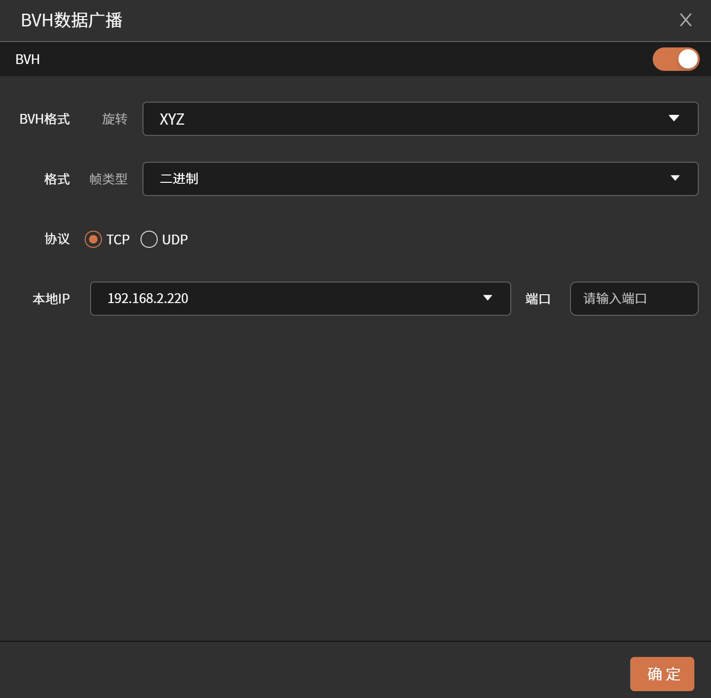

## **Offline Data Broadcast**

When no device is connected, users can use offline data broadcast to connect a video recorded in Motion Studio software to virtual live streaming software for video playback via the same local IP and port number. Users can also customize the character style and scene according to their preferences.

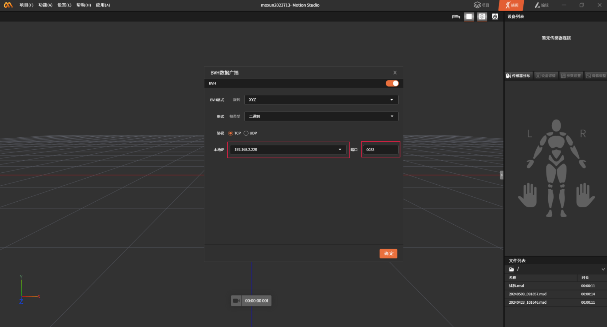

## **Channel Settings**

When the current sensor packet reception rate is low, it may be due to poor signal on the current channel. You can switch channels through the channel settings.

## **Working Modes**

If users only need data from some nodes, they can enter the working mode settings and select the desired capture mode to obtain the desired capture results.

**Tips:**

1. During use, when a red breathing light appears on the collector hardware, it indicates that the remaining battery is low.

2. Please ensure the straps are installed firmly and fit closely against the body. Loose straps will lead to inaccurate motion capture.

3. When the straps are not in use (stored away), it is recommended to fasten the hook side of the strap to the loop side to prevent the hook from damaging other fabric items.
